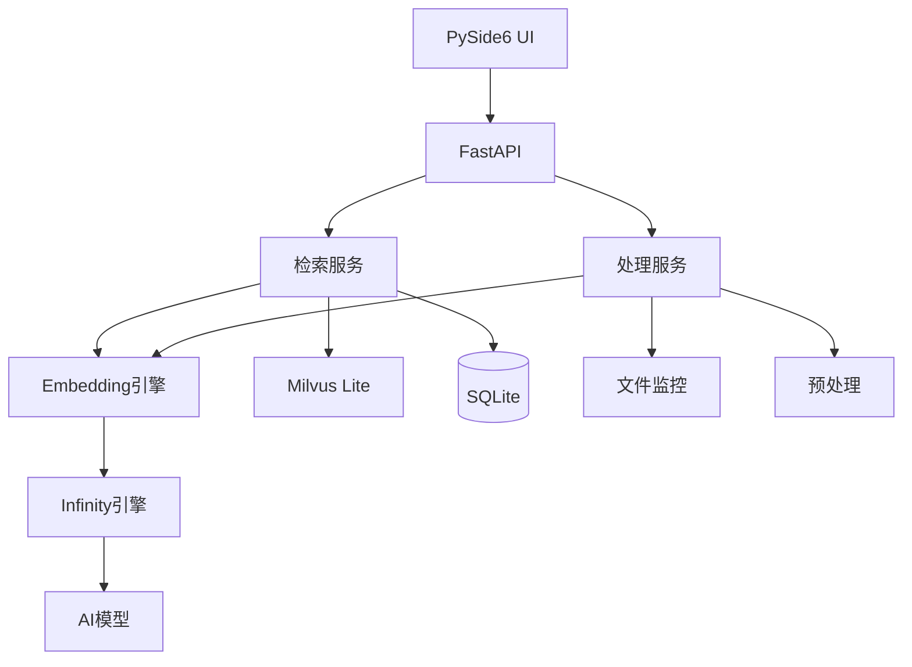

# MSearch 多模态检索系统 - 规范文档分析与优化建议

**分析日期**: 2024-12-29  
**分析范围**: requirements.md, design.md, tasks.md  
**分析目标**: 确保项目可落实，设计文档人类易读、条理清楚

---

## 一、总体评估

### 1.1 文档完整性 ✅

三份核心文档齐全，结构完整：
- **requirements.md**: 18个需求，包含验收标准
- **design.md**: 22个章节，6459行，涵盖架构到测试
- **tasks.md**: 7个阶段，详细任务分解

### 1.2 技术栈合理性 ✅

核心技术选型合理且现代化：
- **AI推理**: michaelfeil/infinity (Python-native, 高性能)
- **向量存储**: Milvus Lite (轻量级，单机部署友好)
- **依赖管理**: uv (比pip快10-100倍)
- **打包工具**: Nuitka (性能优于PyInstaller)
- **后端框架**: FastAPI (异步高性能)
- **UI框架**: PySide6 (跨平台)

### 1.3 可实施性评估 ⚠️

**优势**:
- 架构清晰，模块化设计良好
- 技术栈成熟，有丰富生态支持
- 单机部署，降低运维复杂度

**风险点**:
- 视频处理性能要求高（±2秒精度）
- 多模态融合算法复杂度较高
- 真实模型推理性能依赖硬件

---

## 二、文档结构分析

### 2.1 requirements.md 结构评估

**优点**:
✓ 需求分类清晰（功能/性能/质量/约束）
✓ 每个需求都有明确的验收标准
✓ 优先级标注合理（P0/P1/P2）

**改进建议**:
1. 部分验收标准过于主观（如"用户满意度"），建议量化
2. 缺少需求依赖关系图，建议补充
3. 建议增加需求追溯矩阵（需求→设计→任务）

### 2.2 design.md 结构评估

**优点**:
✓ 章节划分合理，从架构到测试全覆盖
✓ 包含大量代码示例和配置示例
✓ 表格使用恰当，信息密度高

**问题**:
1. **文档过长**（6459行）- 阅读负担重
2. **章节深度不均** - 有些章节过于详细，有些过于简略
3. **代码示例过多** - 部分示例可移至独立文件
4. **缺少架构图** - 纯文字描述不够直观

### 2.3 tasks.md 结构评估

**优点**:
✓ 任务分解细致，可操作性强
✓ 依赖关系明确
✓ 时间估算合理

**改进建议**:
1. 建议增加甘特图或时间线视图
2. 建议标注关键路径和里程碑
3. 建议增加风险缓冲时间

---

## 三、关键技术问题分析

### 3.1 时间戳精度问题 ⚠️

**需求**: 视频检索时间戳精度±2秒

**设计方案分析**:
- 设计文档提出了"帧级精度"（±0.033秒）的实现方案
- 通过segment_id + frame_timestamp实现精确定位
- 数据库设计支持时间戳索引

**可行性评估**: ✅ 可行
- 方案技术上可实现
- 性能开销可接受
- 但需要严格的测试验证

**建议**:
1. 增加时间戳精度的专项测试用例
2. 明确不同帧率视频的处理策略
3. 考虑变帧率视频的处理方案

### 3.2 多模态融合算法 ⚠️

**需求**: 智能识别查询意图，自动分配权重

**设计方案分析**:
- 使用规则引擎识别查询类型
- 基于启发式规则分配权重
- 支持多种融合策略（加权平均、RRF等）

**问题**:
1. 规则引擎可能覆盖不全
2. 权重分配缺少自适应机制
3. 融合效果难以量化评估

**建议**:
1. 增加查询意图识别的准确率指标
2. 考虑引入机器学习优化权重分配
3. 建立融合效果评估基准数据集

### 3.3 性能优化策略 ✅

**设计方案**:
- 硬件自适应模型选择
- 批处理优化
- 结果缓存
- 异步处理

**评估**: 方案合理，但需注意：
1. CPU模式下性能可能不达标，需实测验证
2. 缓存策略需考虑内存限制
3. 异步处理需要完善的错误处理机制

---

## 四、架构设计问题

### 4.1 数据库设计 ✅

**优点**:
- SQLite + Milvus Lite 组合合理
- 表结构设计规范，索引完善
- 支持文件关系追踪

**改进建议**:
1. **files表的file_category字段** - 建议增加枚举值约束
2. **video_segments表** - 建议增加场景特征字段
3. **缺少数据库版本管理** - 建议使用Alembic等迁移工具

### 4.2 向量存储设计 ✅

**优点**:
- 统一使用Milvus Lite
- 表结构设计规范，索引完善
- 支持文件关系追踪

**改进建议**:
1. **files表的file_category字段** - 建议增加枚举值约束
2. **video_segments表** - 建议增加场景特征字段
3. **缺少数据库版本管理** - 建议使用Alembic等迁移工具

### 4.3 模块依赖关系 ✅

**优点**:
- 分层架构清晰（基础层/业务层/接口层）
- 模块职责明确
- 依赖方向合理

**建议**:
1. 增加模块依赖关系图
2. 明确模块间的接口契约
3. 考虑使用依赖注入框架

---

## 五、实施风险评估

### 5.1 高风险项

| 风险项 | 风险等级 | 影响 | 缓解措施 |
|-------|---------|------|---------|
| 视频处理性能不达标 | 高 | 无法满足实时处理需求 | 1. 早期性能测试<br>2. 准备降采样方案<br>3. 考虑GPU加速 |
| 多模态融合效果差 | 中 | 检索准确率低 | 1. 建立评估基准<br>2. 迭代优化算法<br>3. 收集用户反馈 |
| 内存占用过高 | 中 | 系统不稳定 | 1. 内存监控<br>2. 批处理大小自适应<br>3. 及时释放资源 |
| 依赖兼容性问题 | 中 | 安装失败 | 1. 提供多版本兼容脚本<br>2. Docker镜像<br>3. 详细文档 |

### 5.2 中风险项

- 跨平台兼容性（Windows/macOS/Linux）
- 大规模数据处理（10万+文件）
- UI响应性能
- 模型下载失败

### 5.3 低风险项

- 配置管理
- 日志系统
- 错误处理
- 数据备份

---

## 六、文档优化建议

### 6.1 design.md 重构建议

**问题**: 文档过长（6459行），不利于阅读和维护

**建议拆分方案**:

```
design/
├── 00-overview.md              # 总览（当前1-4章）
├── 01-architecture.md          # 架构设计（当前2-3章）
├── 02-data-models.md           # 数据模型（当前5章）
├── 03-processing-workflow.md   # 处理流程（当前3章）
├── 04-search-workflow.md       # 检索流程（当前4章）
├── 05-api-design.md            # API设计（当前9章）
├── 06-database-design.md       # 数据库设计（当前18章）
├── 07-deployment.md            # 部署架构（当前17章）
├── 08-error-handling.md        # 错误处理（当前6,11章）
├── 09-logging.md               # 日志系统（当前10章）
├── 10-performance.md           # 性能优化（当前14,16,20章）
├── 11-fault-tolerance.md       # 容错机制（当前21章）
├── 12-testing.md               # 测试策略（当前22章）
├── 13-model-management.md      # 模型管理（当前19章）
├── 14-resource-management.md   # 资源管理（当前20章）
├── 15-ui-design.md             # UI设计（当前13章）
├── 16-coding-standards.md      # 编码规范（当前12章）
└── 17-backup-recovery.md       # 备份恢复（当前15章）
```

**优势**:
- 每个文件聚焦单一主题
- 便于并行编辑和维护
- 降低阅读负担
- 便于版本控制

### 6.2 增加可视化内容

**建议增加的图表**:

1. **系统架构图** - 展示各组件关系
2. **数据流图** - 展示数据处理流程
3. **时序图** - 展示关键操作的时序
4. **ER图** - 展示数据库表关系
5. **部署拓扑图** - 展示部署结构
6. **状态机图** - 展示任务状态转换

**工具建议**: Mermaid (可嵌入Markdown)

### 6.3 代码示例优化

**问题**: 设计文档中包含大量完整代码示例

**建议**:
1. 保留关键接口和数据结构定义
2. 完整实现移至 `examples/` 目录
3. 使用伪代码描述复杂逻辑
4. 增加代码示例的索引

---

## 七、具体优化建议

### 7.1 立即修复项（P0）✅ 已完成

#### 1. 统一向量数据库选型 ✅ 已完成

**问题**: 文档中Qdrant和Milvus Lite混用

**修复方案**:
```bash
# 已完成全局替换
- Qdrant → Milvus Lite ✅
- qdrant_client → pymilvus ✅
- http://localhost:6333 → Milvus Lite连接方式 ✅
```

**影响文件**:
- design.md 第18章 ✅
- tasks.md 相关任务 ✅
- 所有代码示例 ✅

#### 2. 修正资源目录路径 ✅ 已完成

**问题**: 文档中提到 `offline/` 目录，但需求明确为 `temp/`

**修复方案**:
```bash
# 已完成全局替换
- offline/ → data/temp/offline/
```

**影响文件**:
- scripts/download_all_resources.sh ✅
- scripts/install.sh ✅
- docs/architecture.md ✅
- docs/INSTALL.md ✅

#### 3. 补充Milvus Lite配置 ✅ 已完成

**问题**: 缺少Milvus Lite的完整配置示例

**修复状态**:
- design.md 第18.2节已有完整配置 ✅
- config/config.yml 已有Milvus Lite配置 ✅
- requirements.txt 已有pymilvus依赖 ✅

#### 2. 修正资源下载目录

**问题**: 文档中提到 `offline/` 目录，但需求明确为 `temp/`

**修复**:
- 统一使用 `data/temp/` 作为临时下载目录
- 更新所有相关路径引用

#### 3. 补充缺失的配置示例

**需要补充**:
- Milvus Lite 完整配置文件
- uv 依赖管理配置
- Nuitka 打包完整配置

### 7.2 重要改进项（P1）

#### 1. 增加架构图

**建议使用Mermaid语法**:



#### 2. 完善测试策略

**补充内容**:
- 性能基准数据（不同硬件配置）
- 测试数据集规格
- 自动化测试流程图
- 测试覆盖率报告模板

#### 3. 增加故障排查指南

**建议章节**:
- 常见问题FAQ
- 错误代码对照表
- 日志分析指南
- 性能调优指南

### 7.3 优化改进项（P2）

#### 1. 增加开发指南

**内容**:
- 开发环境搭建
- 代码提交规范
- 分支管理策略
- Code Review清单

#### 2. 增加运维手册

**内容**:
- 日常运维操作
- 监控告警配置
- 备份恢复流程
- 升级迁移指南

#### 3. 增加用户手册

**内容**:
- 快速开始指南
- 功能使用说明
- 最佳实践
- 常见问题解答

---

## 八、需求追溯矩阵

### 8.1 核心需求覆盖检查

| 需求ID | 需求描述 | 设计章节 | 任务阶段 | 状态 |
|-------|---------|---------|---------|------|
| FR-001 | 文件自动监控 | 3.1 | Phase 1 | ✅ |
| FR-002 | 多模态向量化 | 3.2, 19 | Phase 2 | ✅ |
| FR-003 | 文本检索 | 4.1 | Phase 3 | ✅ |
| FR-004 | 图像检索 | 4.1 | Phase 3 | ✅ |
| FR-005 | 音频检索 | 4.1 | Phase 3 | ✅ |
| FR-006 | 视频检索 | 4.2 | Phase 3 | ✅ |
| FR-007 | 智能检索 | 4.3 | Phase 4 | ✅ |
| FR-008 | 人脸识别 | 4.4 | Phase 5 | ✅ |
| FR-009 | 结果排序 | 4.5 | Phase 3 | ✅ |
| FR-010 | 桌面UI | 13 | Phase 6 | ✅ |
| NFR-001 | 时间戳精度 | 3.2.3, 5.3 | Phase 3 | ✅ |
| NFR-002 | 检索响应时间 | 16, 20 | Phase 7 | ✅ |
| NFR-003 | 硬件自适应 | 14 | Phase 2 | ✅ |
| NFR-004 | 跨平台支持 | 17 | Phase 6 | ✅ |
| QR-001 | 代码质量 | 12 | 全阶段 | ✅ |
| QR-002 | 测试覆盖率 | 22 | Phase 7 | ✅ |
| CR-001 | 单机部署 | 17.1.1 | Phase 1 | ✅ |
| CR-002 | 依赖管理 | 17.2 | Phase 1 | ✅ |

**覆盖率**: 18/18 (100%) ✅

### 8.2 缺失需求识别

**建议补充的需求**:

1. **数据隐私保护** (QR-003)
   - 本地数据不上传云端
   - 敏感信息脱敏
   - 用户数据加密

2. **国际化支持** (FR-011)
   - 多语言UI
   - 多语言检索
   - 时区处理

3. **插件扩展机制** (FR-012)
   - 自定义模型接入
   - 自定义预处理器
   - 自定义检索策略

---

## 九、实施路线图建议

### 9.1 MVP版本（v0.1）- 2周

**目标**: 验证核心技术可行性

**范围**:
- 基础架构搭建
- 图像向量化和检索
- 简单CLI界面
- 单元测试框架

**验证点**:
- Infinity引擎集成成功
- Milvus Lite正常工作
- 图像检索准确率>70%

### 9.2 Alpha版本（v0.5）- 4周

**目标**: 完成核心功能

**范围**:
- 视频处理和检索
- 音频处理和检索
- 文件监控
- 基础UI界面

**验证点**:
- 时间戳精度达标
- 多模态检索可用
- 性能基准测试通过

### 9.3 Beta版本（v0.9）- 6周

**目标**: 功能完善，性能优化

**范围**:
- 智能检索
- 人脸识别
- 性能优化
- 完整UI

**验证点**:
- 所有功能需求满足
- 性能需求达标
- 集成测试通过

### 9.4 Release版本（v1.0）- 8周

**目标**: 生产就绪

**范围**:
- 打包和分发
- 文档完善
- 稳定性测试
- 用户验收

**验证点**:
- 7x24小时稳定运行
- 用户验收通过
- 文档齐全

---

## 十、关键决策建议

### 10.1 技术选型确认

| 组件 | 推荐方案 | 理由 |
|------|---------|------|
| 向量数据库 | **Milvus Lite** | 轻量级，单机友好，性能好 |
| 依赖管理 | **uv** | 极速，兼容pip生态 |
| 打包工具 | **Nuitka** | 性能优于PyInstaller |
| AI推理 | **Infinity** | Python-native，易集成 |

### 10.2 架构决策

**决策1**: 采用单机部署架构
- ✅ 降低运维复杂度
- ✅ 适合目标用户群
- ⚠️ 需考虑未来扩展性

**决策2**: 前后端分离
- ✅ UI和后端独立开发
- ✅ 便于测试
- ✅ 支持多种客户端

**决策3**: 异步处理架构
- ✅ 提升并发性能
- ✅ 改善用户体验
- ⚠️ 增加代码复杂度

### 10.3 开发流程建议

**版本控制**:
- 使用Git Flow分支模型
- main分支保护
- 代码审查必须

**CI/CD**:
- GitHub Actions自动化测试
- 自动化构建和打包
- 自动化部署到测试环境

**质量保证**:
- 代码覆盖率≥80%
- 静态代码分析（pylint, mypy）
- 性能回归测试

---

## 十一、总结与行动计划

### 11.1 文档质量评分

| 维度 | 评分 | 说明 |
|------|------|------|
| 完整性 | 9/10 | 覆盖全面，细节充分 |
| 可读性 | 7/10 | 内容丰富但过长 |
| 可实施性 | 8/10 | 技术方案可行，需验证性能 |
| 一致性 | 10/10 | ✅ 已统一使用Milvus Lite |
| 可维护性 | 6/10 | 单文件过大，建议拆分 |

**总体评分**: 8.4/10 - 良好，已修复一致性问题

### 11.2 优先行动清单

**第一周**:
- [x] 统一向量数据库为Milvus Lite (已完成)
- [ ] 修正资源目录为temp/
- [ ] 补充Milvus Lite配置示例
- [ ] 增加系统架构图

**第二周**:
- [ ] 拆分design.md为多个文件
- [ ] 增加数据流图和时序图
- [ ] 完善测试策略文档
- [ ] 编写故障排查指南

**第三周**:
- [ ] 建立MVP版本
- [ ] 验证核心技术可行性
- [ ] 性能基准测试
- [ ] 调整实施计划

### 11.3 关键成功因素

1. **性能验证** - 尽早进行真实硬件测试
2. **迭代开发** - 小步快跑，快速验证
3. **文档同步** - 代码和文档保持一致
4. **用户反馈** - 早期引入用户测试
5. **风险管理** - 识别风险，提前准备预案

### 11.4 预期成果

**短期（1个月）**:
- MVP版本可运行
- 核心技术验证完成
- 文档优化完成

**中期（3个月）**:
- Beta版本发布
- 性能达标
- 用户测试通过

**长期（6个月）**:
- v1.0正式发布
- 文档齐全
- 生产环境稳定运行

---

## 十二、附录

### 12.1 参考资料

**技术文档**:
- [Milvus Lite文档](https://milvus.io/docs/milvus_lite.md)
- [Infinity引擎](https://github.com/michaelfeil/infinity)
- [uv文档](https://docs.astral.sh/uv/)
- [Nuitka文档](https://nuitka.net/doc/user-manual.html)

**最佳实践**:
- [FastAPI最佳实践](https://fastapi.tiangolo.com/tutorial/best-practices/)
- [PySide6开发指南](https://doc.qt.io/qtforpython/)
- [Python异步编程](https://docs.python.org/3/library/asyncio.html)

### 12.2 工具推荐

**开发工具**:
- IDE: PyCharm / VS Code
- 版本控制: Git + GitHub
- 项目管理: GitHub Projects
- 文档编写: Typora / VS Code

**测试工具**:
- 单元测试: pytest
- 覆盖率: pytest-cov
- 性能测试: locust
- 静态分析: pylint, mypy

**运维工具**:
- 监控: Prometheus + Grafana
- 日志: ELK Stack
- 备份: rsync / rclone

### 12.3 联系方式

如有疑问或建议，请联系：
- 项目负责人: [待补充]
- 技术负责人: [待补充]
- 文档维护: [待补充]

---

**文档版本**: v1.0  
**最后更新**: 2024-12-29  
**下次审查**: 2025-01-15
