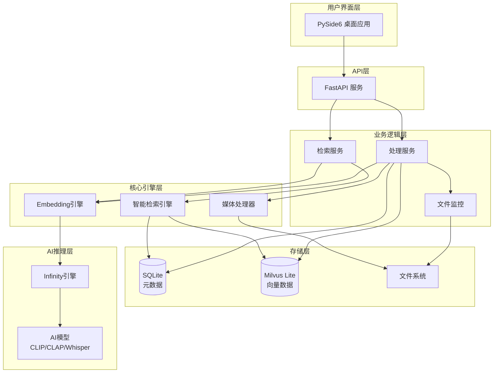
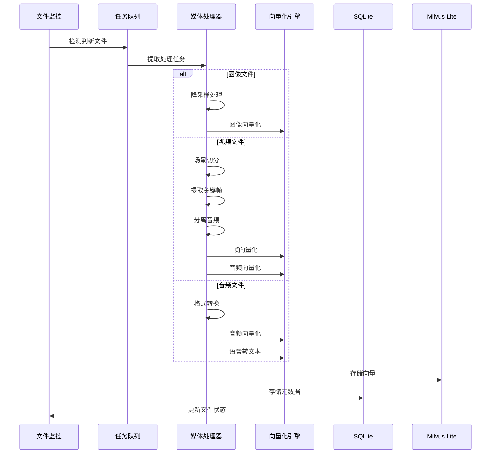
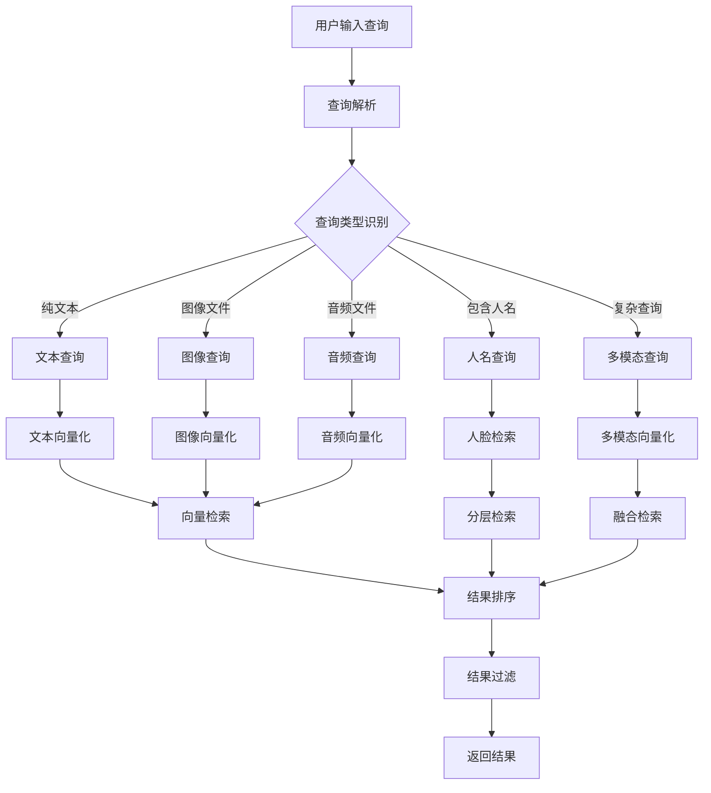
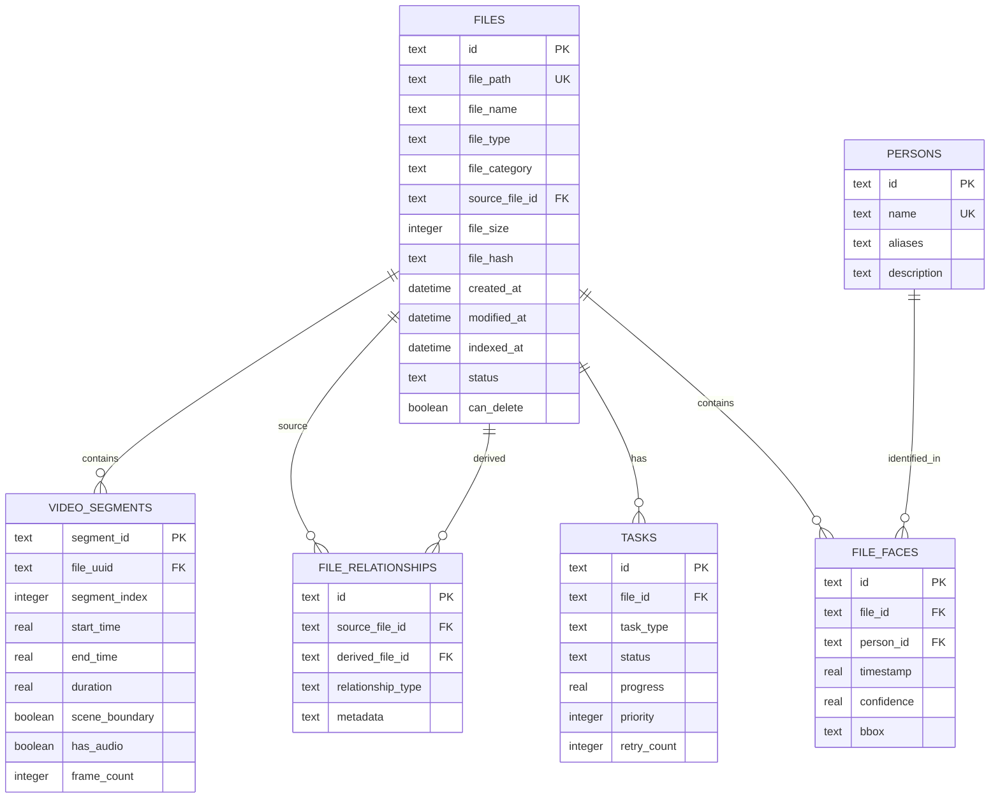
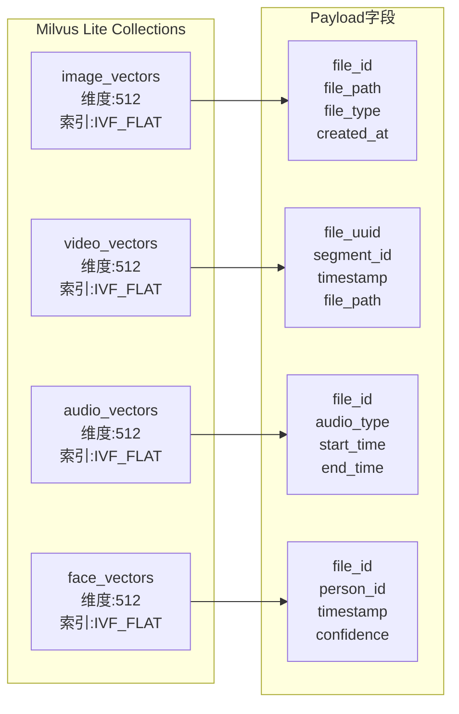
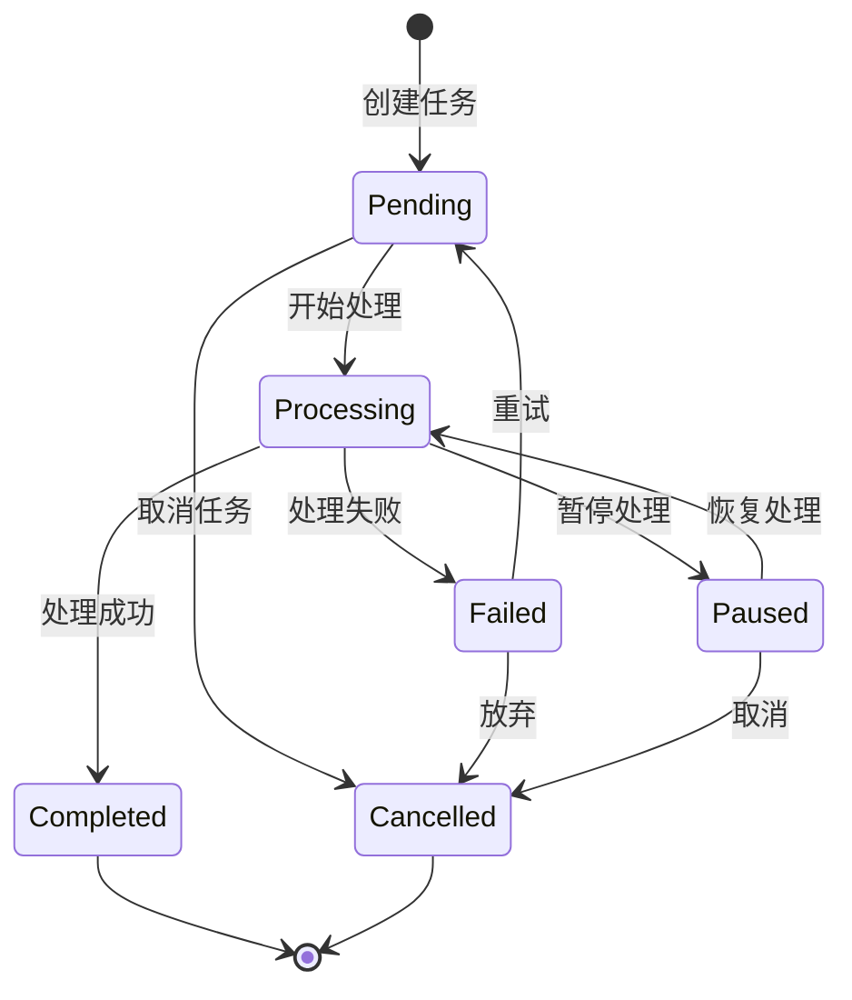
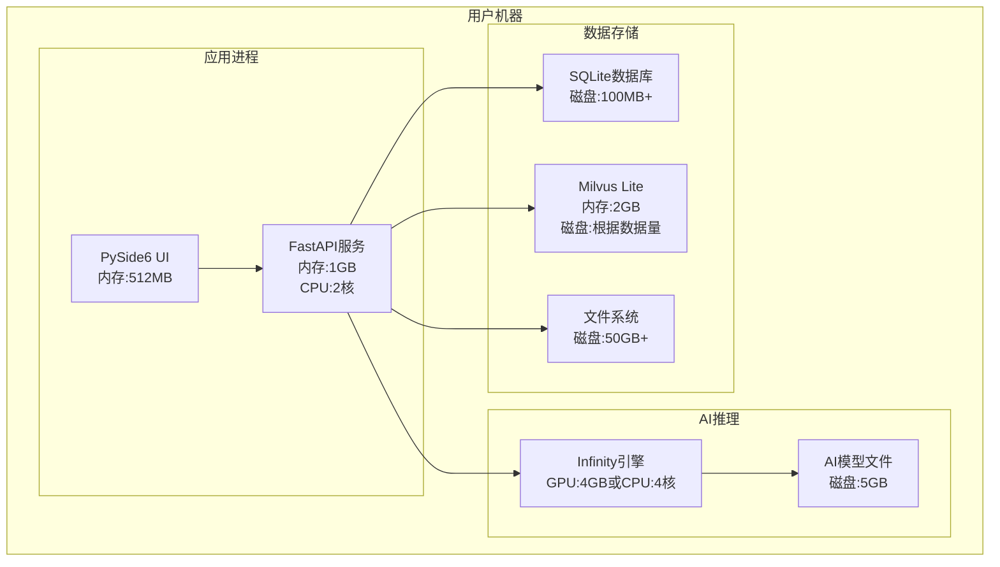
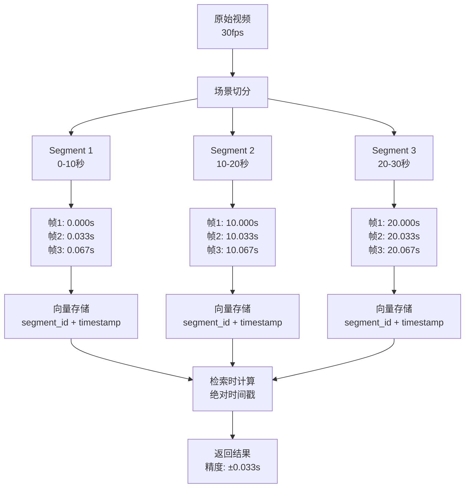
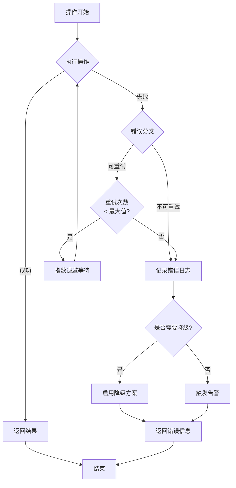

# MSearch 系统架构图

本文档使用Mermaid图表展示系统架构，便于理解系统设计。

---

## 1. 系统总体架构



---

## 2. 文件处理流程



---

## 3. 多模态检索流程



---

## 4. 数据库ER图



---

## 5. 向量存储结构



---

## 6. 任务状态机



---

## 7. 部署架构（单机模式）



---

## 8. 时间戳精度设计



---

## 9. 智能检索权重分配

```mermaid
graph LR
    Query[用户查询:<br/>"张三在会议上讲话"] --> Parse[查询解析]
    
    Parse --> Detect{检测查询特征}
    
    Detect --> Person[人名:张三]
    Detect --> Scene[场景:会议]
    Detect --> Action[动作:讲话]
    
    Person --> Weight1[人脸检索<br/>权重:0.5]
    Scene --> Weight2[图像检索<br/>权重:0.3]
    Action --> Weight3[音频检索<br/>权重:0.2]
    
    Weight1 --> Fusion[结果融合<br/>加权平均]
    Weight2 --> Fusion
    Weight3 --> Fusion
    
    Fusion --> Final[最终结果]
```

---

## 10. 错误处理流程



---

## 使用说明

这些图表可以：
1. 直接在支持Mermaid的Markdown查看器中渲染
2. 使用Mermaid Live Editor编辑：https://mermaid.live/
3. 导出为PNG/SVG图片用于文档
4. 集成到文档网站（如GitBook、Docusaurus）

**建议**: 将这些图表嵌入到design.md的相应章节中，提升可读性。
