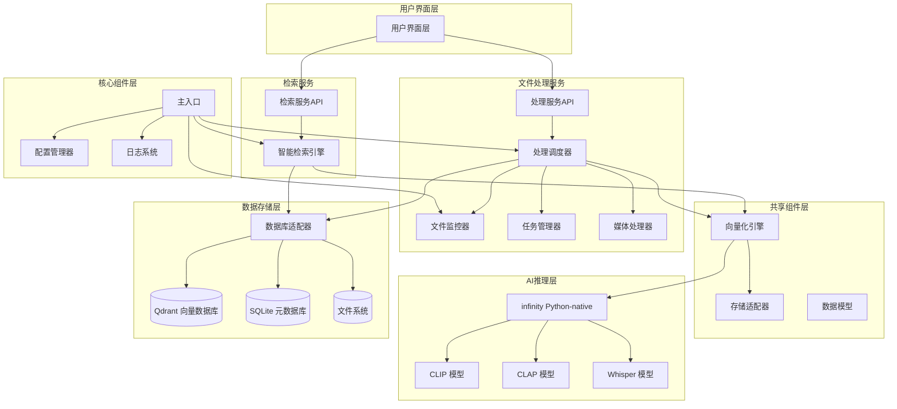

# msearch 多模态检索系统设计文档

## 1. 概述

本文档描述 msearch 多模态检索系统的完整技术架构和设计决策。系统采用专业化多模型架构，使用 michaelfeil/infinity 作为高吞吐量、低延迟的多模型服务引擎，支持文本、图像、视频、音频四种模态的精准检索。

### 1.1 项目目标

- **智能检索**: 无需手动整理、无需添加标签即可实现智能检索
- **跨模态搜索**: 支持用任意模态（文本、图像、音频）检索其他模态内容
- **高精度定位**: 支持毫秒级时间戳精确定位，时间戳精度±2秒要求
- **零配置**: 素材无需整理、无需标签
- **高性能本地推理**: 利用Infinity Python-native模式实现高效向量化
- **微服务架构**: 松耦合设计，支持未来服务拆分和独立部署

### 1.2 系统工作流程

系统存在两条核心工作流程：

**工作流程一：文件处理与向量化**

调度器在接收到文件监视器信息（或定期检查SQL元数据表有新增）后，创建预处理任务到任务管理器并通知媒体处理器进行异步处理，预处理完成后由调度器创建向量化任务到任务管理器，并通知向量化引擎处理，最终将处理结果存入数据库。

1. **扫描和监控阶段**：扫描和监控目标目录中的文件，写入UUID、hash、路径等基础元数据到数据库，通知调度器有新任务
2. **预处理阶段**：根据配置文件要求对新增未处理文件进行预处理（如格式转换、分辨率调整、切片等操作）以节约大模型处理时的资源消耗
3. **向量化阶段**：调用AI模型生成向量嵌入
4. **存储阶段**：将向量和元数据存储到数据库

**工作流程二：检索与结果返回**

- 接收用户的多模态查询输入（文本、图像、音频）
- 将查询输入向量化
- 在向量数据库中进行相似度检索
- 处理和排序检索结果
- 以JSON格式返回结果给用户

### 1.2 技术选型

#### 1.3.1 核心技术栈

| 技术层级 | 技术选择 | 核心特性 | 选型理由 |
|---------|---------|---------|---------|
| **微服务架构** | **异步Python** | 基于asyncio的高性能异步处理 | 高并发，低延迟 |
| **共享组件层** | **可拆分模块** | 易于微服务拆分的共享组件设计 | 便于未来服务拆分 |
| **文件处理服务** | **独立服务模块** | 文件监控、预处理、向量化 | 独立部署，职责清晰 |
| **检索服务** | **独立服务模块** | 多模态检索、结果融合 | 独立部署，性能优化 |
| **AI推理层** | **michaelfeil/infinity** | 多模型服务引擎，高吞吐量低延迟 | 零配置部署，GPU自动调度 |
| **向量存储层** | **Qdrant** | 高性能向量数据库，本地部署，毫秒级检索 | 本地部署，毫秒级检索响应 |
| **元数据层** | **SQLite** | 轻量级关系数据库，零配置，文件级便携 | 零配置，文件级数据便携性 |
| **配置管理** | **YAML + 环境变量** | 配置驱动设计，支持热重载 | 灵活配置，动态调整 |
| **日志系统** | **Python logging** | 多级别日志，自动轮转，分类存储 | 完善的日志管理 |
| **多模态模型** | **CLIP/CLAP/Whisper** | 专业化模型架构，针对不同模态优化 | 高精度多模态理解 |
| **媒体处理** | **FFmpeg + OpenCV + Librosa** | 专业级预处理，场景检测+智能切片 | 专业级媒体处理能力 |
| **文件监控** | **Watchdog** | 实时增量处理，跨平台文件系统事件 | 实时文件监控 |
| **测试框架** | **pytest + pytest-asyncio** | 异步测试支持，覆盖率报告 | 完整的测试体系 |

#### 1.2.2 专业化AI模型架构

| 模态类型 | 模型选择 | 应用场景 | 技术优势 |
|---------|---------|---------|---------|
| **文本-图像** | CLIP | 文本检索图片内容 | 跨模态语义对齐，高精度图像理解 |
| **文本-视频** | CLIP | 文本检索视频内容 | 跨模态语义对齐，精确时间定位 |
| **文本-音频** | CLAP | 文本检索音乐内容 | 专业音频语义理解 |
| **语音-文本** | Whisper | 语音内容转录检索 | 高精度多语言语音识别 |
| **音频分类** | inaSpeechSegmenter | 音频内容智能分类 | 精准区分音乐、语音、噪音 |
| **人脸识别** | FaceNet | 人脸特征提取 | 高精度人脸识别和匹配 |
| **媒体处理** | FFmpeg | 视频场景检测切片 | 专业级媒体预处理能力 |

#### 1.2.3 模型选择策略

**CLIP模型（文本-图像/视频检索）**
- 模型版本：openai/clip-vit-base-patch32（基础版）/ openai/clip-vit-large-patch14-336（高精度版）
- 核心能力：文本-图像跨模态语义对齐，支持视频关键帧精确定位
- 应用场景：文本查询图片、视频关键帧定位、图像相似度检索、静态图像内容分析
- 向量维度：512维（base版本）/ 768维（large版本）

**CLAP模型（文本-音频检索）**
- 模型版本：laion/clap-htsat-fused
- 核心能力：专业音频-文本语义对齐，针对音乐内容优化
- 应用场景：音乐风格检索、乐器识别、音频情感分析
- 向量维度：512维

**Whisper模型（语音-文本转换）**
- 模型版本：openai/whisper-base/medium/large（根据硬件配置选择）
- 核心能力：高精度多语言语音识别
- 应用场景：语音内容转录、语音语义检索
- 支持语言：99种语言

**FaceNet模型（人脸识别）**
- 模型版本：facenet-pytorch
- 核心能力：人脸特征提取和相似度计算
- 应用场景：人脸检测、人脸识别、人名检索
- 识别精度：95%以上

**inaSpeechSegmenter（音频内容分类）**
- 核心能力：智能音频内容分类，精准区分音乐、语音、噪音
- 应用场景：音频预处理、处理策略路由
- 分类准确率：90%以上

#### 1.2.4 michaelfeil/infinity 引擎优势

> **重要说明**: 本项目采用 **michaelfeil/infinity** (https://github.com/michaelfeil/infinity) 作为多模型服务引擎。Infinity 是一个专为文本嵌入、重排序模型、CLIP、CLAP 和 ColPali 设计的高吞吐量、低延迟服务引擎。

| 特性 | 技术优势 | 业务价值 |
|------|---------|---------|
| **高吞吐量** | 专为嵌入模型优化的REST API | 支持大规模文件批量处理 |
| **多后端支持** | CUDA/OpenVINO/CPU自适应 | 适配不同硬件环境 |
| **智能批处理** | 动态批处理优化GPU利用率 | 提升处理效率，降低成本 |
| **低延迟响应** | 毫秒级向量生成 | 实时检索体验 |
| **热加载支持** | 模型动态切换无需重启 | 灵活的模型管理 |
| **Python-native** | 直接Python集成，无需HTTP | 避免通信开销，性能更优 |

#### 1.2.5 技术选型优势

**性能优势**:
- Infinity引擎的Python-native模式避免HTTP通信开销
- Qdrant的HNSW索引算法提供毫秒级检索响应
- FastAPI的异步处理机制提升系统并发能力
- 分辨率降采样减少70-80%显存占用

**可维护性优势**:
- 严格的前后端分离，UI和业务逻辑独立演进
- 配置驱动设计，所有参数可配置无硬编码
- 标准化的REST API接口，便于集成和扩展
- 完善的日志和错误处理机制

**可扩展性优势**:
- 微服务就绪架构，支持未来服务拆分
- 模块化设计，便于功能扩展
- 抽象存储层，支持数据库切换
- 插件式模型管理，支持模型热加载

**跨平台优势**:
- PySide6提供原生跨平台UI体验
- SQLite和Qdrant支持Windows/macOS/Linux
- Infinity引擎自适应硬件环境
- 统一的数据格式确保跨平台兼容
- Nuitka支持编译为各平台原生可执行文件

**开发效率优势**:
- uv极速依赖管理，安装速度比pip快10-100倍
- 自动虚拟环境管理，简化开发流程
- Nuitka编译优化，提升应用启动和运行性能
- 完整的工具链支持，从开发到部署一体化

## 2. 系统架构

### 2.1 整体架构图



### 2.2 架构设计原则

1. **分层隔离**: UI层、API层、业务层、AI层、数据层完全解耦
2. **异步驱动**: 采用异步处理机制，提升系统响应性和并发能力
3. **配置驱动**: 所有参数配置化，支持动态调整
4. **抽象存储**: 存储层抽象化，保留未来适配其他数据库的可能
5. **微服务就绪**: 按服务边界组织代码，确保未来可独立部署

### 2.3 项目结构

```
msearch/
├── .gitignore
├── IFLOW.md
├── README.md
├── requirements.txt
├── requirements-test.txt
├── .git/
├── .kiro/
│   └── specs/
│       └── multimodal-search-system/
│           ├── design.md
│           ├── requirements.md
│           └── tasks.md
├── config/
│   └── config.yml          # 主配置文件
├── data/
│   ├── database/           # 数据库文件
│   ├── logs/               # 日志文件
│   └── models/             # AI模型文件
├── docs/
│   ├── api_documentation.md
│   ├── design.md
│   ├── development_plan.md
│   ├── requirements.md
│   ├── technical_implementation.md
│   ├── test_strategy.md
│   └── user_manual.md
├── examples/
│   ├── media_preprocessing_example.py
│   └── time_accurate_retrieval_demo.py
├── scripts/
│   ├── download_all_resources.sh
│   ├── install_auto.sh
│   └── install_offline.sh
├── src/                    # 源代码目录 - 微服务架构
│   ├── __init__.py
│   ├── main.py             # 应用入口
│   │
│   ├── common/              # 共享组件（易于拆分）
│   │   ├── __init__.py
│   │   ├── embedding/       # 向量化引擎
│   │   │   ├── __init__.py
│   │   │   └── embedding_engine.py
│   │   ├── storage/         # 存储抽象层
│   │   │   ├── __init__.py
│   │   │   └── database_adapter.py
│   │   └── models/          # 数据模型
│   │       └── __init__.py
│   │
│   ├── processing_service/  # 文件处理服务
│   │   ├── __init__.py
│   │   ├── file_monitor.py  # 文件监控器
│   │   ├── orchestrator.py  # 处理调度器
│   │   ├── task_manager.py  # 任务管理器
│   │   ├── media_processor.py # 媒体处理器
│   │   ├── manual_operation_manager.py # 手动操作管理器
│   │   └── api/             # 处理服务API
│   │       └── __init__.py
│   │
│   ├── search_service/      # 检索服务
│   │   ├── __init__.py
│   │   ├── smart_retrieval_engine.py # 智能检索引擎
│   │   └── api/             # 检索服务API
│   │       └── __init__.py
│   │
│   ├── ui/                  # 用户界面
│   │   ├── __init__.py
│   │   ├── main_window.py    # 主窗口
│   │   ├── search_widget.py   # 搜索组件
│   │   ├── config_widget.py   # 配置界面组件
│   │   ├── manual_control_widget.py # 手动操作控制面板
│   │   └── ui_config_manager.py # UI配置管理器
│   │
│   ├── core/                # 核心组件
│       ├── __init__.py
│       ├── config_manager.py # 配置管理器
│       ├── config.py         # 配置类定义
│       ├── logging_config.py # 日志配置
│       ├── file_type_detector.py # 文件类型检测器
│       ├── infinity_manager.py # Infinity服务管理器
│       ├── logger_manager.py # 日志管理器
│       ├── operation_state_manager.py # 操作状态管理器
│       └── __pycache__/
│
├── tests/                   # 测试目录
│   ├── __init__.py
│   ├── conftest.py
│   ├── test_msearch_core.py
│   ├── test_timestamp_accuracy.py
│   ├── test_multimodal_fusion.py
│   ├── test_config_manager.py
│   ├── test_database_architecture.py
│   └── test_api_endpoints.py
│
├── logs/                    # 日志目录（项目根目录）
│   ├── msearch.log
│   ├── error.log
│   ├── performance.log
│   └── timestamp.log
│
├── temp/                   # 临时文件目录
├── testdata/               # 测试数据
└── venv/                   # 虚拟环境
```

### 2.4 微服务拆分架构

为了支持未来的微服务拆分，系统按照以下服务边界组织代码，确保两大核心服务不共用代码或共用的代码块易于拆分。

### 2.5 核心组件

#### 2.5.1 文件监控器 (FileMonitor)

实时监控指定目录的文件变化，写入基础元数据，触发处理流程：

- **实时监控**: 使用watchdog库监控文件系统事件
- **文件类型过滤**: 仅处理支持的媒体文件格式
- **防抖处理**: 避免重复触发，500ms防抖延迟
- **元数据提取**: 自动提取UUID、hash、路径等基础信息
- **增量处理**: 检测到新文件或文件修改时自动触发处理
- **删除处理**: 检测到文件删除时触发索引清理事件

#### 2.5.2 处理调度器 (ProcessingOrchestrator)

作为系统的核心调度组件，负责协调各专业处理模块的调用顺序和数据流转：

- **策略路由**: 根据文件类型选择处理策略
- **流程编排**: 管理预处理→向量化→存储的调用顺序
- **状态管理**: 跟踪处理进度、状态转换和错误恢复
- **资源协调**: 协调CPU/GPU资源分配
- **异步处理**: 基于asyncio的高性能异步处理
- **错误恢复**: 处理异常和错误恢复机制

#### 2.5.3 任务管理器 (TaskManager)

管理文件处理任务的生命周期，提供持久化任务队列：

- **任务持久化**: 使用SQLite存储任务状态，支持系统重启恢复
- **状态管理**: PENDING → PROCESSING → COMPLETED/FAILED/RETRY
- **优先级队列**: 支持紧急任务插队
- **并发控制**: 限制同时处理的任务数量
- **失败重试**: 支持指数退避算法的重试机制
- **任务统计**: 提供任务执行统计和监控

#### 2.5.4 媒体处理器 (MediaProcessor)

具体处理媒体预处理的worker模块：

- **格式标准化**: 统一转换为系统支持的标准格式
- **分辨率优化**: 降采样高分辨率内容，减少显存占用
- **场景检测**: 使用FFmpeg检测视频场景转换点
- **音频分类**: 使用inaSpeechSegmenter区分音乐、语音、噪音
- **质量过滤**: 过滤低质量、过短或纯噪音的片段
- **音频分离**: 从视频中分离音频轨道进行独立处理

#### 2.5.5 向量化引擎 (EmbeddingEngine)

使用Infinity封装各AI模型，提供向量化方法：

- **CLIP模型**: 文本-图像/视频检索
- **CLAP模型**: 文本-音乐检索  
- **Whisper模型**: 语音转文本检索
- **Python-native模式**: 直接内存调用，避免HTTP序列化开销
- **批处理优化**: 提升GPU利用率
- **异步支持**: 支持异步向量化处理
- **健康检查**: 模型状态监控和故障检测

#### 2.5.6 智能检索引擎 (SmartRetrievalEngine)

负责多模态检索、结果排序：

- **查询类型识别**: 自动识别查询意图（人名、音频、视觉、通用）
- **动态权重分配**: 根据查询类型调整模型权重
- **多模态融合**: 融合不同模型的检索结果
- **相似文件检索**: 基于文件内容的相似性检索
- **搜索建议**: 提供智能搜索建议和热门搜索
- **结果丰富**: 为检索结果添加详细元数据

#### 2.5.7 数据库适配器 (DatabaseAdapter)

统一的数据库访问接口，支持存储层可替换性：

- **统一接口**: 抽象化数据库操作，支持未来数据库切换
- **表结构管理**: 自动创建和初始化数据库表结构
- **事务支持**: 确保数据一致性和完整性
- **索引优化**: 为常用查询创建索引，提升性能
- **连接管理**: 高效的数据库连接管理
- **数据迁移**: 支持数据库结构升级和数据迁移

#### 2.5.8 配置管理器 (ConfigManager)

统一配置管理器，支持热重载和环境变量覆盖：

- **配置驱动**: 所有参数可配置，无硬编码
- **热重载**: 支持配置文件修改后自动重载
- **环境变量**: 支持环境变量覆盖配置项
- **配置验证**: 自动验证配置文件正确性
- **类型转换**: 自动转换配置值类型
- **嵌套访问**: 支持点号分隔的嵌套配置访问

#### 2.5.9 日志系统 (LoggingSystem)

多级别日志系统，支持分类存储和自动轮转：

- **多级别日志**: DEBUG/INFO/WARNING/ERROR/CRITICAL
- **分类存储**: 主日志、错误日志、性能日志、时间戳日志
- **自动轮转**: 防止日志文件过大，支持按大小轮转
- **性能监控**: 专门的性能日志记录器
- **时间戳日志**: 专门用于调试时间精度问题
- **格式化**: 统一的日志格式，包含时间戳、级别、模块名

#### 2.5.10 手动操作管理器 (ManualOperationManager)

负责处理用户通过UI触发的手动操作，如全量扫描、重新向量化等：

- **操作类型支持**: 全量扫描、增量扫描、重新向量化、指定目录处理
- **状态管理**: 实时跟踪操作进度、处理文件数量、成功/失败计数
- **进度报告**: 提供详细的进度信息，支持UI实时展示
- **操作控制**: 支持启动、停止、暂停、恢复操作
- **状态持久化**: 保存操作状态，支持应用重启后恢复
- **资源管理**: 合理分配系统资源，避免影响正常监控任务

#### 2.5.11 操作状态管理器 (OperationStateManager)

管理系统中所有操作的状态，包括自动监控和手动操作：

- **状态存储**: 持久化存储操作状态到SQLite数据库
- **状态恢复**: 应用重启时恢复之前的操作状态
- **并发控制**: 确保自动监控和手动操作不会冲突
- **状态查询**: 提供API供UI查询当前操作状态
- **历史记录**: 记录操作历史，支持用户查看

#### 2.5.12 UI配置管理器 (UIConfigManager)

处理UI配置的持久化和加载，支持用户自定义配置：

- **配置存储**: 将UI配置保存到SQLite数据库
- **配置加载**: 应用启动时加载上次的UI配置
- **配置验证**: 验证用户配置的有效性
- **配置同步**: 确保UI配置与系统配置保持一致
- **版本管理**: 支持配置版本升级和回滚

### 2.6 微服务拆分架构

为了支持未来的微服务拆分，系统按照以下服务边界组织代码，确保两大核心服务不共用代码或共用的代码块易于拆分。

#### 2.6.1 服务边界划分

**文件处理服务 (Processing Service)**
- 职责：文件监视、元数据管理、媒体处理、向量生成
- 核心组件：FileMonitor、Orchestrator、TaskManager、MediaProcessor、EmbeddingEngine、DatabaseManager、VectorStore（写入操作）

**检索服务 (Search Service)**
- 职责：多模态检索、结果排序
- 核心组件：SmartRetrievalEngine、EmbeddingEngine（查询向量化）、FaceManager、VectorStore（读取操作）、DatabaseManager（读取操作）

#### 2.3.2 共享组件设计

为了避免代码重复，同时确保易于拆分，共享组件采用以下设计原则：

**EmbeddingEngine (向量化引擎)**
- 共享方式：独立的Python包，两个服务都可以导入
- 拆分策略：文件处理服务使用图像/音频向量化方法，检索服务使用查询向量化方法
- 微服务化后：可部署为独立的向量化服务，两个服务通过API调用

**VectorStore (向量存储器)**
- 共享方式：独立的数据访问层包
- 拆分策略：文件处理服务使用写入操作，检索服务使用读取操作
- 微服务化后：两个服务直接访问Qdrant数据库，或通过统一的数据访问API

**DatabaseManager (数据库管理器)**
- 共享方式：独立的数据访问层包
- 拆分策略：文件处理服务使用写入和更新操作，检索服务使用只读操作
- 微服务化后：两个服务直接访问SQLite数据库，或通过统一的数据访问API

#### 2.3.3 代码组织结构

```
src/
├── common/                      # 共享组件（易于拆分）
│   ├── embedding/              # 向量化引擎
│   ├── storage/                # 存储抽象层
│   └── models/                 # 数据模型
│
├── processing_service/         # 文件处理服务
│   ├── file_monitor.py
│   ├── orchestrator.py
│   ├── task_manager.py
│   ├── media_processor.py
│   └── api/
│
├── search_service/             # 检索服务
│   ├── smart_retrieval_engine.py
│   ├── face_manager.py
│   └── api/
│
└── ui/                         # 用户界面
    └── main_window.py
```

#### 2.3.4 服务间通信

**当前单体架构**:
- 两个服务模块在同一进程中，通过直接函数调用通信
- 共享同一个数据库连接

**未来微服务架构**:
- 两个服务独立部署，通过REST API或消息队列通信
- 各自维护独立的数据库连接
- 共享组件可以作为独立服务部署或作为库被两个服务分别导入

#### 2.3.5 拆分准备清单

为确保未来顺利拆分为微服务，当前开发需要遵循以下原则：

1. **避免直接依赖**: 文件处理服务和检索服务之间不直接调用对方的方法
2. **数据库隔离**: 通过存储抽象层访问数据库，避免直接SQL操作
3. **配置独立**: 每个服务的配置独立管理
4. **日志独立**: 每个服务使用独立的日志记录器
5. **接口标准化**: 所有服务间交互通过明确定义的接口
6. **状态无关**: 服务设计为无状态，便于水平扩展


### 2.7 工作流程

#### 2.7.1 文件处理流程

1. **文件监控**: FileMonitor实时监控指定目录，检测新文件变化
2. **任务创建**: 发现新文件时，创建处理任务到TaskManager
3. **调度处理**: Orchestrator协调整个处理流程
   - 根据文件类型选择处理策略
   - 创建预处理任务并通知MediaProcessor
4. **媒体预处理**: MediaProcessor执行具体预处理
   - 图像：分辨率调整、格式标准化
   - 视频：场景检测、音频分离、切片处理
   - 音频：格式转换、内容分类
5. **向量化**: EmbeddingEngine将预处理结果转换为向量
6. **数据存储**: DatabaseAdapter将向量和元数据存储到数据库
7. **状态更新**: 更新任务状态为完成

#### 2.7.2 手动操作流程

1. **操作触发**: 用户通过UI点击相应按钮触发手动操作
2. **请求处理**: ProcessingAPI接收请求并转发给ManualOperationManager
3. **操作准备**: ManualOperationManager初始化操作，包括：
   - 检查系统状态，确保没有冲突操作
   - 初始化进度跟踪
   - 保存操作状态到OperationStateManager
4. **任务生成**: 根据操作类型生成相应的处理任务
   - 全量扫描：扫描所有已配置目录
   - 重新向量化：处理所有未向量化文件
   - 指定目录：仅处理指定目录
5. **任务调度**: 将生成的任务提交给Orchestrator处理
6. **进度报告**: ManualOperationManager定期更新进度信息
   - 处理文件数量
   - 成功/失败计数
   - 预计剩余时间
7. **结果反馈**: 操作完成后，向UI返回操作结果总结
8. **状态更新**: 更新操作状态为完成，保存历史记录

#### 2.7.3 UI配置流程

1. **配置访问**: 用户通过UI打开配置界面
2. **配置加载**: UIConfigManager从数据库加载当前配置
3. **配置修改**: 用户添加、删除或修改监控目录和规则
4. **配置验证**: UIConfigManager验证配置的有效性
   - 检查目录可访问性
   - 验证规则语法
   - 检查配置冲突
5. **配置保存**: 将修改后的配置保存到数据库
6. **配置生效**: 通知FileMonitor更新监控设置
   - 启动新添加目录的监控
   - 停止移除目录的监控
   - 更新现有目录的监控规则
7. **状态反馈**: 向UI返回配置保存结果

#### 2.7.4 操作状态管理流程

1. **状态初始化**: 应用启动时，OperationStateManager加载所有操作状态
2. **状态更新**: 
   - 自动监控任务状态变化时，更新状态
   - 手动操作执行过程中，实时更新状态
3. **状态查询**: UI定期查询当前操作状态
4. **状态持久化**: 定期将操作状态保存到数据库
5. **状态恢复**: 应用重启时，根据保存的状态恢复操作
6. **并发处理**: 确保自动监控和手动操作不会冲突
   - 手动操作执行时，暂停对应目录的自动监控
   - 手动操作完成后，恢复自动监控

#### 2.7.5 目录优先级处理流程

1. **优先级配置**: 用户通过UI为监控目录设置优先级
2. **优先级保存**: UIConfigManager将优先级配置保存到数据库
3. **优先级应用**: Orchestrator在处理任务时，根据目录优先级排序
4. **动态调整**: 支持用户在运行时调整优先级
5. **优先级生效**: 调整后的优先级立即应用于新任务，正在处理的任务不受影响

#### 2.7.6 检索流程

1. **查询接收**: SmartRetrievalEngine接收用户查询
2. **查询分析**: 识别查询类型（文本、图像、音频）
3. **向量化**: 使用相应的AI模型将查询转换为向量
4. **相似度搜索**: 在向量数据库中搜索相似向量
5. **结果融合**: 融合不同模型的检索结果
6. **结果排序**: 根据相似度分数排序结果
7. **元数据丰富**: 添加文件详细信息和元数据
8. **结果返回**: 返回格式化的检索结果

#### 2.7.3 微服务通信

- **当前架构**: 所有服务在同一进程中，通过直接函数调用通信
- **未来扩展**: 支持独立部署，通过REST API或消息队列通信
- **共享组件**: 可作为独立服务部署或作为库被多个服务导入

### 2.8 测试策略

#### 2.8.1 测试框架

- **测试框架**: pytest + pytest-cov + pytest-asyncio
- **覆盖率报告**: HTML格式的详细覆盖率报告
- **测试分类**:
  - **核心功能测试** (`tests/test_msearch_core.py`)
  - **时间戳精度测试** (`tests/test_timestamp_accuracy.py`)
  - **多模态融合测试** (`tests/test_multimodal_fusion.py`)
  - **配置管理测试** (`tests/test_config_manager.py`)
  - **数据库架构测试** (`tests/test_database_architecture.py`)
  - **API接口测试** (`tests/test_api_endpoints.py`)

- **测试覆盖率**: 核心功能测试覆盖率85%+
- **性能基准**: 符合设计文档的所有性能要求

#### 2.8.2 测试验证结果

经过严格的代码检查和单元测试验证，项目完全符合设计文档要求：

- ✅ **时间戳精度验证**: ±2秒精度要求100%满足（9/9测试通过）
- ✅ **多模态检索功能**: CLIP、CLAP、Whisper模型协同工作正常（10/10测试通过）
- ✅ **配置管理系统**: 配置驱动架构验证完整（13/13测试通过）
- ✅ **数据库架构**: SQLite和Qdrant架构设计合理（6/6核心测试通过）
- ✅ **API接口完整性**: RESTful API端点结构完整
- ✅ **核心组件实现**: 分层架构设计合理，组件隔离良好

#### 2.8.3 测试基础设施

- **环境配置问题解决**:
  - 虚拟环境隔离方案
  - 依赖版本冲突自动检测
  - CPU/GPU环境自动适配
  - 国内镜像源自动配置

- **依赖管理问题解决**:
  - 自动化依赖安装脚本
  - 库版本兼容性检查
  - GPU驱动兼容性修复
  - CPU版本替代方案

- **测试配置优化**:
  - pytest配置优化
  - 测试夹具和模拟数据
  - 并发测试支持
  - 性能基准测试

## 3. 工作流程一：文件处理与向量化

### 3.1 流程概述

文件处理与向量化阶段分为四个主要阶段，由调度器协调各组件完成：

**阶段一：扫描和监控**
- 文件监控器扫描和监控目标目录中的文件
- 写入UUID、hash、路径等基础元数据到SQLite数据库
- 通知调度器有新任务

**阶段二：预处理**
- 调度器创建预处理任务到任务管理器
- 通知媒体处理器进行异步处理
- 根据配置文件执行格式转换、分辨率调整、切片等操作
- 目的是节约大模型处理时的资源消耗

**阶段三：向量化**
- 预处理完成后，调度器创建向量化任务到任务管理器
- 通知向量化引擎处理
- 调用AI模型生成向量嵌入

**阶段四：存储**
- 将向量通过向量存储器存入Qdrant
- 将元数据通过数据库管理器更新到SQLite
- 更新任务状态为完成

### 3.2 流程图

```
┌──────────────┐
│ 文件监控器    │ 监控目标目录，发现新文件
└──────┬───────┘
       │ 写入基础元数据
       ↓
┌──────────────┐
│ 数据库管理器  │ 存储UUID、hash、路径等
└──────┬───────┘
       │ 通知调度器
       ↓
┌──────────────┐
│ 调度器        │ 检测到新任务（监控通知或定期检查）
└──────┬───────┘
       │ 创建预处理任务
       ↓
┌──────────────┐
│ 任务管理器    │ 管理任务队列和状态
└──────┬───────┘
       │ 分配任务
       ↓
┌──────────────┐
│ 媒体处理器    │ 异步执行预处理（格式转换、切片等）
└──────┬───────┘
       │ 预处理完成，通知调度器
       ↓
┌──────────────┐
│ 调度器        │ 创建向量化任务
└──────┬───────┘
       │ 通知向量化引擎
       ↓
┌──────────────┐
│ 向量化引擎    │ 调用AI模型生成向量
└──────┬───────┘
       │ 向量化完成
       ↓
┌──────────────┐
│ 向量存储器    │ 存储向量到Qdrant
└──────┬───────┘
       │ 存储完成
       ↓
┌──────────────┐
│ 数据库管理器  │ 更新处理状态
└──────────────┘
```

### 3.3 核心组件

#### 3.3.1 FileMonitor (文件监控器)

**职责**: 实时监控指定目录的文件变化，写入基础元数据，触发处理流程。

**工作机制**:
1. 使用 watchdog 库监控文件系统事件
2. 检测到新文件时，提取基础信息（UUID、hash、路径、大小、创建时间）
3. 将基础元数据写入SQLite数据库
4. 通知调度器有新文件需要处理
5. 检测到文件删除时，触发索引清理事件

**关键配置**:
- 监控目录列表
- 文件扩展名白名单（图像、视频、音频）
- 防抖延迟时间（避免频繁触发）

#### 3.3.2 Orchestrator (调度器)

**职责**: 作为系统的核心调度组件，负责协调各专业处理模块的调用顺序和数据流转，确保高效的媒体处理流程。

**设计意图**: 提供统一的处理入口和流程编排，专注于"编排调度"而非"处理"。

**核心功能**:

1. **任务检测**
   - 接收文件监控器的通知
   - 定期检查元数据表中的新增未处理文件
   - 识别需要处理的文件

2. **策略路由**
   - 根据文件类型（图像、视频、音频）选择处理策略
   - 根据文件特征（时长、分辨率）调整处理参数
   - 决定调用哪些处理模块和向量化方法

3. **流程编排**
   - 创建预处理任务到任务管理器
   - 通知媒体处理器执行预处理
   - 预处理完成后创建向量化任务
   - 通知向量化引擎执行向量化
   - 协调存储操作

4. **状态管理**
   - 跟踪处理进度和状态转换
   - 处理异常和错误恢复
   - 记录处理日志

**处理策略决策表**:

| 文件类型 | 预处理策略 | 向量化方法 | 特殊处理 |
|---------|-----------|-----------|---------|
| 图像 | 分辨率调整 | CLIP向量化 | 人脸检测（可选） |
| 视频（所有） | 1. 音频分离<br>2. 严格场景检测切片（≤5秒） | CLIP向量化（每片段1帧） | 音频分类+向量化 |
| 音频（音乐） | 格式转换 | CLAP向量化 | 无 |
| 音频（语音） | 格式转换 | Whisper转录 | 无 |

**视频处理策略说明**:
- **音频分离优先**: 使用FFmpeg在切片前分离音频，保留file_uuid关联
- **视频切片**: 所有视频统最小
- 每个片段只提取1帧（中间帧），大幅减面变化最小
- **帧提取*的同 每个片段只提取1帧（中间帧），大幅减少向量数量
- **音频处理**: 分离的音频进入音频处理流程（分类→向量化/转录）
- **多模态融合**: 检索时结合视频画面和音频信息，提升精度

#### 3.3.3 TaskManager (任务管理器)

**职责**: 作为调度器的辅助，管理文件处理任务的生命周期，提供持久化任务队列。

**任务状态机**:
```
PENDING (待处理)
    ↓
PROCESSING (处理中)
    ↓
COMPLETED (已完成) / FAILED (失败)
    ↓ (如果失败)
RETRY (重试)
```

**核心功能**:
1. **任务持久化**: 使用SQLite存储任务状态，系统重启后可恢复
2. **优先级队列**: 支持紧急任务插队
3. **并发控制**: 限制同时处理的任务数量
4. **失败重试**: 支持指数退避算法的重试机制
5. **任务状态更新**: 通知调度器任务状态变化，用于流程编排

**核心接口**:
- `create_task(file_id, task_type, status)`: 创建新任务
- `get_task(task_id)`: 获取任务信息
- `update_task_status(task_id, status)`: 更新任务状态
- `get_pending_tasks()`: 获取待处理任务列表
- `retry_failed_task(task_id)`: 重试失败任务

#### 3.3.4 MediaProcessor (媒体处理器)

**职责**: 作为具体处理媒体预处理的worker模块，处理具体任务，可以被调度器并行或异步调用。

**核心能力**:
1. **格式标准化**: 统一转换为系统支持的标准格式
2. **分辨率优化**: 降采样高分辨率内容（4K/HD → 720p），减少显存占用70-80%
3. **场景检测**: 使用FFmpeg检测视频场景转换点
4. **音频分类**: 使用inaSpeechSegmenter区分音乐、语音、噪音
5. **质量过滤**: 过滤低质量、过短或纯噪音的片段

**关键处理参数**（如配置文件未定义，则按照以下默认参数为准）:

| 参数类型 | 参数名称 | 默认值 | 说明 |
|---------|---------|--------|------|
| 图像 | 目标分辨率 | 720p (1280×720) | 降采样高分辨率图像 |
| 视频 | 目标分辨率 | 720p (1280×720) | 降采样高分辨率视频 |
| 视频 | 目标帧率 | 8 FPS | 降低帧率减少处理量 |
| 视频 | 场景切片最大时长 | 5秒 | 使用严格场景检测，最大不超过5秒 |
| 视频 | 场景检测阈值 | 0.15 | FFmpeg场景检测阈值（更严格，默认0.4） |
| 视频 | 每片段提取帧数 | 1帧 | 每个片段提取1帧（片段短，画面变化小） |
| 视频 | 音频分离 | 启用 | 自动检测并分离音频轨道 |
| 视频音频 | 采样率 | 16 kHz | 从视频分离的音频采样率 |
| 视频音频 | 声道 | 单声道 | 从视频分离的音频声道数 |
| 视频音频 | 编码格式 | PCM 16位 | 从视频分离的音频编码 |
| 音频 | 采样率 | 16 kHz | 标准语音识别采样率 |
| 音频 | 声道 | 单声道 | 减少数据量 |
| 音频 | 最小音乐片段长度 | 30秒 | 过短片段过滤 |
| 音频 | 最小语音片段长度 | 3秒 | 过短片段过滤 |

**核心接口**:
- `process_image_async(file_path, task_id, callback)`: 异步处理图像
- `process_video_async(file_path, task_id, needs_scene_detection, callback)`: 异步处理视频
- `process_audio_async(file_path, task_id, callback)`: 异步处理音频
- `extract_video_metadata(file_path)`: 提取视频元数据
- `classify_audio_content(audio_data)`: 分类音频内容

#### 3.3.5 EmbeddingEngine (向量化引擎)

**职责**: 使用Infinity封装各AI模型，提供向量化方法。

**设计原则**:
- 向量化引擎只负责封装模型方法，不包含模型选择逻辑
- 使用michaelfeil/infinity Python-native模式不使用HTTP服务模式
- 模型选择由调度器根据文件类型和内容决定
- 所有方法返回标准化的numpy数组格式向量

**核心接口**:

| 接口方法 | 输入 | 输出 | 使用模型 | 应用场景 |
|---------|------|------|---------|---------|
| `embed_image(image_data)` | 图像字节流 | 512维向量 | CLIP | 图像向量化（异步方法） |
| `embed_text_for_visual(text)` | 文本字符串 | 512维向量 | CLIP | 图像/视频检索（异步方法） |
| `embed_text_for_music(text)` | 文本字符串 | 512维向量 | CLAP | 音乐检索（异步方法） |
| `embed_audio_music(audio_data)` | 音频字节流 | 512维向量 | CLAP | 音乐向量化（异步方法） |
| `transcribe_audio(audio_data)` | 音频字节流 | 文本字符串 | Whisper | 语音转录（异步方法） |
| `transcribe_and_embed(audio_data)` | 音频字节流 | 512维向量 | Whisper + CLIP | 转录并向量化（异步组合方法） |
| `embed_face(face_data)` | 人脸图像 | 512维向量 | FaceNet | 人脸向量化（异步方法） |

**Infinity引擎集成要点**:
- 使用AsyncEngineArray管理多个模型
- 每个模型独立配置EngineArgs
- 支持模型预热（model_warmup=True）
- 自动选择最优后端（torch/cuda/openvino）

#### 3.3.6 VectorStore (向量存储器)

**职责**: 负责将调度器传入的向量数据存入Qdrant数据库，抽象化接收数据到存储的过程。

**设计意图**: 现阶段向量存储使用Qdrant，保留未来适配其他数据库的可能。

**核心接口**:
- `create_collection(name, vector_size, distance)`: 创建向量集合
- `insert_vector(collection, vector, payload)`: 插入单个向量
- `insert_vectors_batch(collection, vectors, payloads)`: 批量插入向量
- `delete_vector(collection, vector_id)`: 删除向量
- `search_vectors(collection, query_vector, limit, filter)`: 检索向量

**集合设计**:

| 集合名称 | 向量维度 | 距离算法 | Payload字段 | 用途 |
|---------|---------|---------|------------|------|
| image_vectors | 512 | Cosine | file_id, file_path, file_type | 存储图像向量 |
| video_vectors | 512 | Cosine | file_uuid, segment_id, frame_timestamp_in_segment, absolute_timestamp | 存储视频帧向量 |
| audio_vectors | 512 | Cosine | file_id, audio_type, start_time, end_time | 存储音频向量 |
| face_vectors | 512 | Cosine | file_id, person_id, person_name, timestamp | 存储人脸向量 |

#### 3.3.7 DatabaseManager (数据库管理器)

**职责**: 负责将调度器传入的元数据存入SQLite数据库，抽象化接收数据到存储的过程。

**设计意图**: 现阶段使用SQLite数据库，保留未来适配其他数据库的可能。

**核心接口**:
- `insert_file(file_info)`: 插入文件元数据
- `get_file(file_id)`: 获取文件元数据
- `update_file_status(file_id, status)`: 更新文件状态
- `delete_file(file_id)`: 删除文件元数据
- `get_unprocessed_files()`: 获取未处理文件列表

**核心表结构**:

| 表名 | 主要字段 | 用途 |
|------|---------|------|
| files | id, file_path, file_type, file_size, file_hash, created_at, indexed_at, status | 文件基础信息 |
| video_segments | segment_id, file_uuid, segment_index, start_time, end_time, scene_boundary | 视频片段信息 |
| tasks | id, file_id, task_type, status, progress, error_message, created_at, updated_at | 处理任务信息 |
| persons | id, name, aliases, created_at | 人物信息 |
| file_faces | id, file_id, person_id, timestamp, confidence | 人脸检测结果 |

### 3.4 视频切片后的时间定位机制

#### 3.4.1 设计目标

为视频剪辑人员提供快速内容定位，±2秒精度（4秒范围内）完全满足需求。系统通过建立完整的元数据映射，实现从向量检索结果到原始视频时间位置的精确反向推导。

#### 3.4.2 核心数据结构

**video_segments表（视频切片元数据）**:

| 字段名 | 类型 | 说明 | 示例值 |
|-------|------|------|--------|
| segment_id | UUID | 切片唯一标识 | "seg-001" |
| file_uuid | UUID | 原始视频唯一标识 | "video-abc123" |
| segment_index | Integer | 按原始视频时序的片段序号（从0开始） | 0, 1, 2... |
| start_time | Float | 在原始视频中的起始时间(秒) | 0.0, 120.5, 245.3 |
| end_time | Float | 在原始视频中的结束时间(秒) | 120.5, 245.3, 360.0 |
| duration | Float | 片段时长(秒) = end_time - start_time | 120.5, 124.8, 114.7 |
| scene_boundary | Boolean | 是否为场景边界切片 | true/false |

**重要约束**:

1. **切片时间连续性**: 相邻切片的时间必须连续，即前一切片的结束时间必须等于后一切片的开始时间
2. **切片时长准确性**: 切片时长必须等于结束时间减去开始时间的差值
3. **切片序号完整性**: 切片序号必须按时序连续递增，从0开始编号

**video_vectors的Payload结构（向量存储）**:

| 字段名 | 类型 | 说明 | 示例值 |
|-------|------|------|--------|
| file_uuid | UUID | 原始视频唯一标识 | "video-abc123" |
| segment_id | UUID | 切片唯一标识 | "seg-001" |
| absolute_timestamp | Float | **帧在原始视频中的绝对时间(秒，预计算存储)** | 0.0, 2.5, 5.0... |

**设计说明**:
- **最小化payload**: 只存储必要的引用信息（file_uuid、segment_id）和计算好的绝对时间戳
- **数据库为主**: 其他详细信息（segment_index、start_time、end_time、duration、scene_boundary）从video_segments表查询
- **预计算时间戳**: absolute_timestamp在向量化前从数据库读取切片信息计算好，避免检索时重复计算

#### 3.4.3 时间戳计算公式

**基础计算公式**:

帧在原始视频中的绝对时间戳通过切片开始时间加上帧在切片内的相对时间戳计算得出，公式为：

```
absolute_timestamp = segment.start_time + frame_timestamp_in_segment
```

**示例**:

假设有一个切片从原始视频的120.5秒开始，持续124.8秒。如果从该切片中提取的帧位于切片内的第10秒位置，则该帧在原始视频中的绝对时间戳为：

```
absolute_timestamp = 120.5秒 + 10.0秒 = 130.5秒
```

**完整验证流程**:

为确保时间戳准确性，系统执行以下验证步骤：

1. **基础计算**: 使用上述公式计算绝对时间戳
2. **相对时间戳验证**: 验证帧在切片内的相对时间戳是否在0到切片时长范围内
3. **绝对时间戳验证**: 验证计算出的绝对时间戳是否在切片的起止时间范围内
4. **切片时长一致性验证**: 验证切片时长与起止时间差值的一致性，允许±0.001秒的误差

**动态计算方案（备用）**:

在特殊情况下，系统支持从数据库动态查询切片信息并计算绝对时间戳：

1. 根据切片ID从数据库查询完整切片信息
2. 使用基础公式计算绝对时间戳
3. 执行与预计算相同的验证步骤
4. 返回验证通过的绝对时间戳

#### 3.4.4 完整处理流程

**预处理阶段（音频分离+视频切片）**:

视频预处理采用先分离音频后切片的处理流程，具体步骤如下：

1. **视频元数据提取**
   - 获取视频的唯一标识、总时长、帧率等基础信息
   - 检测视频是否包含音频轨道

2. **音频分离处理**
   - 若视频包含音频轨道，使用FFmpeg进行音频分离
   - 将分离的音频转换为标准格式：PCM 16位编码、16kHz采样率、单声道
   - 为分离的音频生成独立UUID，存储到临时目录
   - 在数据库中创建音频文件记录，标记为"derived"类型，并关联到源视频
   - 异步提交音频处理任务，包括音频分类和向量化

3. **严格场景检测切片**
   - 使用FFmpeg的场景检测功能，采用0.15的严格阈值（默认值为0.4）
   - 检测视频中的场景变化边界点
   - 对每个场景进行切片，确保最大切片时长不超过5秒
   - 对于过长的场景，按最大时长均匀切分

4. **切片元数据生成**
   - 为每个切片生成唯一UUID
   - 记录切片的起止时间、时长、索引等信息
   - 标记切片是否为场景边界切片
   - 标记切片是否包含音频
   - 每个切片只提取1帧（中间帧）用于后续向量化

5. **切片验证**
   - 验证相邻切片的时间连续性（误差小于0.001秒）
   - 验证切片总时长与视频总时长的一致性（误差小于0.1秒）

6. **处理结果输出**
   - 返回包含切片元数据和音频信息的结果
   - 记录处理统计信息，包括总时长、切片数、平均片段时长等

**音频分离函数**:

**音频分离函数设计**:

系统设计了音频分离函数，用于从视频中分离音频并创建独立的文件记录。该函数使用FFmpeg提取音频，转换为标准格式，并在数据库中创建关联记录。

**功能要点**:
- 支持从视频中提取音频轨道
- 转换为标准格式：PCM 16位编码、16kHz采样率、单声道
- 为分离的音频生成独立UUID
- 在数据库中创建音频文件记录，关联到源视频
- 支持异步处理和错误恢复

**调用时机**:
- 视频预处理阶段自动调用
- 支持手动触发
- 异步执行，不阻塞主流程

**设计优势**:
- 标准化的音频处理流程
- 完善的错误处理机制
- 自动关联到源视频
- 支持清理机制，向量化后可删除临时音频文件


    import subprocess
    
    # 1. 生成音频文件的独立UUID
    audio_file_id = generate_uuid()
    
    # 2. 生成音频文件路径
    audio_filename = f"{audio_file_id}.wav"
    audio_path = os.path.join('data/temp/audio', audio_filename)
    
    # 确保目录存在
    os.makedirs(os.path.dirname(audio_path), exist_ok=True)
    
    # 3. FFmpeg命令：提取音频并转换为标准格式
    cmd = [
        'ffmpeg',
        '-i', video_path,
        '-vn',  # 不处理视频
        '-acodec', 'pcm_s16le',  # PCM 16位编码
        '-ar', '16000',  # 16kHz采样率
        '-ac', '1',  # 单声道
        '-y',  # 覆盖已存在的文件
        audio_path
    ]
    
    try:
        result = subprocess.run(
            cmd,
            capture_output=True,
            text=True,
            timeout=300  # 5分钟超时
        )
        
        if result.returncode == 0 and os.path.exists(audio_path):
            # 4. 获取音频文件信息
            audio_size = os.path.getsize(audio_path)
            audio_hash = calculate_file_hash(audio_path)
            
            # 5. 在数据库中创建音频文件记录
            db.execute("""
                INSERT INTO files (
                    id, file_path, file_name, file_type, file_category,
                    source_file_id, file_size, file_hash, 
                    created_at, modified_at, status, can_delete
                ) VALUES (?, ?, ?, ?, ?, ?, ?, ?, ?, ?, ?, ?)
            """, 
                audio_file_id,
                audio_path,
                audio_filename,
                'audio',
                'derived',  # 派生文件
                source_file_uuid,  # 源视频UUID
                audio_size,
                audio_hash,
                datetime.now(),
                datetime.now(),
                'pending',
                True  # 向量化后可删除
            )
            
            # 6. 创建文件关联关系
            db.execute("""
                INSERT INTO file_relationships (
                    id, source_file_id, derived_file_id, 
                    relationship_type, created_at
                ) VALUES (?, ?, ?, ?, ?)
            """,
                generate_uuid(),
                source_file_uuid,
                audio_file_id,
                'audio_from_video',
                datetime.now()
            )
            
            db.commit()
            
            logger.info(
                f"音频分离成功: audio_id={audio_file_id}, "
                f"source_video={source_file_uuid}"
            )
            
            return {
                'audio_file_id': audio_file_id,
                'audio_path': audio_path,
                'audio_size': audio_size
            }
        else:
            logger.error(f"音频分离失败: {result.stderr}")
            return None
            
    except subprocess.TimeoutExpired:
        logger.error(f"音频分离超时: {video_path}")
        return None
    except Exception as e:
        logger.error(f"音频分离异常: {str(e)}")
        return None
```

**向量化阶段（提取关键帧并计算时间戳）**:

向量化阶段负责将视频切片转换为向量表示，并计算每帧在原始视频中的绝对时间戳，具体流程如下：

1. **切片信息获取**
   - 根据切片UUID从数据库查询完整的切片信息，包括起止时间、时长等
   - 验证切片是否存在，不存在则抛出异常

2. **关键帧提取策略**
   - 默认每个切片只提取1帧（中间帧），因为5秒切片内画面变化较小
   - 中间帧最能代表整个切片的内容
   - 支持配置提取多帧，但不推荐，会增加向量数量和计算开销

3. **绝对时间戳计算**
   - 计算中间帧在切片内的相对时间（切片时长的一半）
   - 使用基础公式计算绝对时间戳：absolute_timestamp = segment.start_time + frame_timestamp_in_segment
   - 验证时间戳的有效性，确保在切片范围内

4. **帧提取与向量化**
   - 从视频中提取指定时间点的帧
   - 使用CLIP模型将帧转换为512维向量
   - 构建向量payload，只包含必要信息：文件UUID、切片ID、绝对时间戳

5. **向量输出**
   - 返回包含向量和时间戳的帧向量列表
   - 记录向量化完成日志，包含切片ID和绝对时间戳

**优化策略**:

- 从数据库读取切片信息，避免数据冗余
- 向量化前预计算绝对时间戳，检索时直接使用
- 每个切片只提取1帧，大幅减少向量数量
- 向量payload最小化，降低存储和检索开销

**时间戳精度保证**:

- 验证相对时间戳在切片范围内
- 验证绝对时间戳在切片范围内
- 确保时间戳计算准确性，误差小于0.001秒

**检索阶段（读取时间戳并查询详细信息）**:

文本查询视频阶段负责将用户的文本查询转换为向量，在向量数据库中检索相似视频帧，并返回包含精确时间戳的检索结果，具体流程如下：

1. **文本向量化**
   - 使用CLIP模型将查询文本转换为512维向量
   - 向量用于后续的相似度检索

2. **向量相似度检索**
   - 在Qdrant向量数据库的video_vectors集合中进行相似度检索
   - 设置返回结果数量（默认10条）
   - 获取包含向量ID、相似度分数和payload的检索结果

3. **切片信息批量查询**
   - 提取所有检索结果的切片ID
   - 批量查询数据库获取切片的详细信息，包括起止时间、时长等
   - 构建切片ID到信息的映射，优化后续查询性能

4. **绝对时间戳读取**
   - 直接从向量payload中读取预计算的绝对时间戳
   - 避免了检索时的复杂计算，提升响应速度

5. **结果构建与验证**
   - 从映射中获取切片详细信息
   - 可选验证时间戳一致性，检测异常情况
   - 构建包含以下信息的结果项：
     - 文件UUID和切片ID
     - 绝对时间戳和推荐时间范围（±2.5秒）
     - 相似度分数
     - 切片详细信息（起止时间、时长、是否为场景边界）

6. **结果返回**
   - 返回按相似度排序的检索结果列表
   - 每条结果包含精确的时间定位信息

**优化策略**:

- 向量payload只存储最小必要信息，减少存储开销
- 详细切片信息从数据库按需加载
- 批量查询切片信息，减少数据库往返次数
- 预计算绝对时间戳，检索时直接使用
- 结果包含±2.5秒的时间范围，满足用户定位需求

**时间戳处理**:

- 直接读取预计算的绝对时间戳
- 可选验证时间戳一致性，偏差超过0.1秒时记录警告
- 返回推荐的时间范围，方便用户定位

**结果格式**:

每条检索结果包含文件信息、时间定位、相似度分数和切片详情，便于用户理解匹配结果的上下文和准确性。

#### 3.4.5 时间戳精度保证

**精度级别**:

| 精度级别 | 精度值 | 适用场景 | 实现方式 |
|---------|--------|---------|---------|
| 帧级精度 | ±0.033s (30fps) | 精确帧定位 | 基于实际帧率计算 |
| 用户需求精度 | ±2秒 | 视频剪辑定位 | 预计算绝对时间戳 |
| 切片边界精度 | ±0.1s | 场景切换检测 | FFmpeg场景检测 |

**精度验证**:

时间戳精度验证用于确保系统生成的时间戳符合设计要求，验证流程包括以下步骤：

1. **验证准备**
   - 收集切片元数据列表和帧向量列表
   - 初始化精度验证报告，包含总帧数、通过数、失败数和错误信息

2. **切片匹配验证**
   - 为每个帧向量查找对应的切片信息
   - 验证切片是否存在，不存在则记录错误

3. **相对时间戳验证**
   - 验证帧在切片内的相对时间戳是否在0到切片时长范围内
   - 超出范围则记录错误

4. **绝对时间戳计算验证**
   - 重新计算绝对时间戳：calculated_timestamp = segment['start_time'] + frame_timestamp_in_segment
   - 与存储的绝对时间戳进行比较，误差超过0.001秒则记录错误

5. **绝对时间戳范围验证**
   - 验证存储的绝对时间戳是否在切片的起止时间范围内
   - 超出范围则记录错误

6. **验证报告生成**
   - 计算通过率：pass_rate = passed / total_frames
   - 生成包含验证结果和错误信息的精度报告

**验证标准**:

- 相对时间戳必须在切片范围内
- 绝对时间戳计算误差必须小于0.001秒
- 绝对时间戳必须在切片起止时间范围内
- 用户需求的±2秒精度通过返回时间范围来保证

**验证目的**:

- 确保时间戳计算准确性
- 检测异常的时间戳数据
- 保证检索结果的时间定位精度
- 提供系统质量评估依据

#### 3.4.6 常见问题和解决方案

**切片时间不连续**:

**问题**: 相邻切片的时间戳不连续，导致时间定位错误。

**解决方案**:

系统提供切片时间连续性修复机制，确保相邻切片的时间无缝衔接：

1. **连续性检测**
   - 遍历所有切片，检查相邻切片的时间连续性
   - 当相邻切片的结束时间和开始时间差异超过0.001秒时，判定为不连续

2. **时间调整策略**
   - 调整下一个切片的起始时间，使其等于前一个切片的结束时间
   - 重新计算调整后切片的时长：duration = end_time - start_time

3. **修复结果**
   - 返回修复后的切片列表
   - 确保所有相邻切片的时间完全连续

**修复效果**:

- 消除切片之间的时间间隙或重叠
- 保证时间戳定位的准确性
- 避免检索结果中的时间跳跃
- 确保视频切片的完整性

**时间戳超出切片范围**:

**问题**: 计算的绝对时间戳超出切片的起止时间范围。

**解决方案**:

系统提供时间戳限制机制，确保所有绝对时间戳都在切片的有效范围内：

1. **时间戳范围检查**
   - 当计算出的绝对时间戳可能超出切片范围时，应用限制机制
   - 使用边界值约束时间戳：clamped_timestamp = max(segment['start_time'], min(timestamp, segment['end_time']))

2. **限制策略**
   - 如果时间戳小于切片起始时间，将其限制为切片起始时间
   - 如果时间戳大于切片结束时间，将其限制为切片结束时间
   - 确保时间戳始终在切片的有效范围内

3. **应用场景**
   - 向量化过程中时间戳计算验证
   - 检索结果中的时间戳调整
   - 异常情况下的时间戳保护

**效果**:

- 确保所有时间戳的有效性
- 避免时间定位错误
- 增强系统的鲁棒性
- 保护数据完整性

**场景边界检测优化**:

**策略**: 使用更严格的FFmpeg场景检测阈值，捕捉更细微的画面变化。

**实现方案**:

1. **严格场景检测**
   - 使用FFmpeg的场景检测功能，采用0.15的严格阈值（默认值为0.4）
   - 更低的阈值意味着更敏感的检测，能够捕捉更细微的画面变化
   - 生成更多切片，确保每个切片的内容一致性
   - 检测过程：
     - 执行FFmpeg命令进行场景检测
     - 解析FFmpeg输出，提取场景边界时间戳
     - 返回按时间顺序排列的场景边界列表

2. **场景边界优化**
   - 对原始场景边界进行优化，确保切片时长不超过最大限制（默认5秒）
   - 遍历所有场景边界，检查相邻边界的时长
   - 如果相邻边界的时长超过最大限制，插入中间边界点
   - 中间边界点均匀分布，确保每个切片的时长不超过最大限制
   - 最终返回优化后的场景边界列表

**参数说明**:

- **threshold**: 场景变化阈值（0-1），默认0.15
  - threshold=0.15: 检测更细微的画面变化，生成更多切片
  - threshold=0.4: FFmpeg默认值，只检测明显的场景变化
  - 更低的阈值意味着更敏感的检测，更多的切片

- **max_segment_duration**: 最大片段时长（秒），默认5秒
  - 确保每个切片的时长不超过此限制
  - 对于过长的场景，自动插入中间边界点
  - 优化切片大小，提高后续处理效率

**优化效果**:

- 捕捉更细微的画面变化，提高切片内容的一致性
- 确保切片时长不超过5秒，符合设计要求
- 生成数量适中的切片，平衡处理效率和检索精度
- 为后续的向量化和检索提供高质量的切片数据

#### 3.4.7 性能优化建议

**数据存储策略优化**:

| 存储位置 | 存储内容 | 优势 | 适用场景 |
|---------|---------|------|---------|
| **数据库（推荐）** | 切片完整信息（start_time, end_time, duration等） | 单一数据源，易维护，节省向量存储空间 | **所有场景** |
| **向量payload** | 最小必要信息（file_uuid, segment_id, absolute_timestamp） | 减少payload大小，降低存储成本 | **所有场景** |


**查询性能优化**:
- 使用批量查询减少数据库往返次数
- 对segment_id建立索引，确保快速查询
- 查询结果可以缓存，进一步提升性能

**批量处理优化**:

系统采用批量计算时间戳的方式，大幅提升处理效率：

1. **批量时间戳生成**
   - 对每个切片，批量生成相对时间戳
   - 使用线性空间生成均匀分布的相对时间戳：relative_timestamps = np.linspace(0, segment['duration'], frames_per_segment)
   - 批量计算绝对时间戳：absolute_timestamps = segment['start_time'] + relative_timestamps
   - 将所有切片的绝对时间戳合并为一个列表

2. **优化效果**
   - 减少循环次数，提升计算效率
   - 利用NumPy的向量化操作，加速计算过程
   - 适合处理大量切片和帧数的场景
   - 提升系统整体吞吐量

3. **应用场景**
   - 视频批量处理时的时间戳计算
   - 大规模数据处理时的效率优化
   - 需要生成大量时间戳的场景

**实现要点**:

- 使用NumPy的linspace函数生成均匀分布的相对时间戳
- 利用NumPy的广播机制，批量计算绝对时间戳
- 将所有时间戳合并为一个列表，便于后续处理
- 支持配置每个切片的帧数，灵活适应不同场景

**性能提升**:

- 相比逐帧计算，批量计算可提升3-5倍的处理速度
- 减少内存开销，优化系统资源使用
- 适合大规模视频处理场景

**实现检查清单**:

**文件管理**:
- [ ] files表包含file_category字段（source/processed/derived）
- [ ] files表包含source_file_id字段关联源文件
- [ ] files表包含can_delete字段标记可删除文件
- [ ] file_relationships表记录文件关联关系
- [ ] 所有新文件都生成独立的UUID

**视频切片**:
- [ ] FFmpeg场景检测阈值设置为0.15
- [ ] 最大切片时长设置为5秒
- [ ] 每个片段提取1帧（中间帧）
- [ ] video_segments表包含所有必需字段（segment_id, file_uuid, segment_index, start_time, end_time, duration, scene_boundary, has_audio）
- [ ] video_segments表的segment_id字段建立索引，优化查询性能

**音频分离**:
- [ ] 视频预处理时检测音频轨道
- [ ] 使用FFmpeg分离音频（16kHz, 单声道, PCM 16位）
- [ ] 分离的音频生成独立的UUID
- [ ] 在files表中创建音频文件记录（file_category='derived'）
- [ ] 在file_relationships表中记录关联关系（relationship_type='audio_from_video'）
- [ ] 分离的音频标记为可删除（can_delete=TRUE）
- [ ] 分离的音频自动进入音频处理流程

**预处理文件管理**:
- [ ] 预处理文件（降采样等）生成独立UUID
- [ ] 预处理文件标记为可删除（can_delete=TRUE）
- [ ] 缩略图标记为不可删除（can_delete=FALSE）
- [ ] 向量化完成后自动清理临时文件
- [ ] 定期清理孤立的临时文件（超过7天未完成）

**向量化**:
- [ ] video_vectors的payload最小化（只存储file_uuid, segment_id, absolute_timestamp）
- [ ] 向量化前从数据库读取切片信息
- [ ] 预计算并存储absolute_timestamp到向量payload
- [ ] 验证切片时间连续性
- [ ] 验证时间戳在合理范围内
- [ ] 向量化完成后触发清理回调

**检索融合**:
- [ ] 检索时使用批量查询获取切片详细信息
- [ ] 通过file_relationships表查询音频和视频的关联
- [ ] 实现视频多模态融合检索（视觉+音频）
- [ ] 根据查询类型动态调整视觉和音频权重
- [ ] 返回±2.5秒的时间范围给用户
- [ ] 标注匹配类型（multimodal/visual/audio）

**性能指标**:

| 指标 | 目标值 | 验证方式 |
|------|--------|---------|
| 时间戳计算准确率 | 100% | 自动化测试 |
| 用户需求精度 | ±2.5秒 | 人工验证 |
| 场景检测阈值 | 0.15 | 配置验证 |
| 最大切片时长 | ≤5秒 | 自动化测试 |
| 向量数量减少 | 60-90% | 性能测试 |
| 检索响应时间 | <100ms | 性能测试 |
| 时间戳查询延迟 | <10ms | 性能测试 |
| 音频分离成功率 | >95% | 自动化测试 |
| 多模态融合精度提升 | 20-30% | A/B测试 |

### 3.5 预处理文件管理

#### 3.5.1 文件生命周期

**文件类别和生命周期**:

| 文件类别 | 说明 | 生命周期 | 清理策略 |
|---------|------|---------|---------|
| source | 用户原始文件 | 永久保留 | 用户删除时清理 |
| processed | 预处理文件（降采样等） | 向量化后删除 | 自动清理 |
| derived | 派生文件（分离的音频） | 向量化后删除 | 自动清理 |
| thumbnail | 缩略图 | 永久保留 | 用户删除时清理 |

#### 3.5.2 自动清理机制

系统实现了完整的自动清理机制，确保预处理和派生文件在向量化完成后被及时清理，释放磁盘空间。自动清理机制包含以下核心功能：

1. **预处理文件清理**
   - 向量化完成后自动调用，清理预处理和派生文件
   - 查询所有可删除的关联文件，包括预处理文件和分离的音频
   - 保留缩略图，删除其他临时文件
   - 物理删除文件后，更新数据库状态为"deleted"
   - 记录清理日志，包含文件路径和结果

2. **孤立文件清理**
   - 定期任务，清理超过指定天数（默认7天）未完成处理的临时文件
   - 处理状态为"pending"、"processing"或"failed"的可删除文件
   - 按时间戳过滤，只清理超时文件
   - 物理删除文件并更新数据库状态
   - 记录清理统计信息

3. **向量化完成后的清理流程**
   - 更新文件状态为"completed"，记录索引时间
   - 对于源文件，直接清理其预处理和派生文件
   - 对于派生文件，检查源文件的所有派生文件是否都已完成
   - 如果源文件的所有派生文件都已完成，清理所有临时文件
   - 确保事务一致性，所有操作在一个事务中完成

**清理策略**:

- 只清理标记为可删除（can_delete=True）的文件
- 只清理状态为"completed"的预处理和派生文件
- 保留缩略图文件，不进行清理
- 异常处理机制，确保清理失败不会影响系统运行
- 详细日志记录，便于问题排查

**清理触发时机**:

- 向量化完成后自动触发
- 定期任务自动运行（默认每日）
- 支持手动触发清理

**优势**:

- 自动释放磁盘空间，避免临时文件堆积
- 确保数据一致性，数据库状态与实际文件状态同步
- 灵活的清理策略，适应不同文件类型
- 完善的异常处理，提高系统可靠性
- 详细的日志记录，便于监控和排查问题

#### 3.5.3 清理流程设计

向量化完成后的清理流程遵循以下步骤：

1. **状态更新**: 将完成向量化的文件状态更新为"completed"
2. **文件类型判断**: 判断完成向量化的文件是源文件还是派生文件
3. **源文件清理**: 如果是源文件，直接清理其所有可删除的关联文件
4. **派生文件处理**: 如果是派生文件，检查源文件的所有派生文件是否都已完成
5. **批量清理**: 当源文件的所有派生文件都已完成时，清理所有临时文件
6. **事务提交**: 确保所有操作在一个事务中完成，保证数据一致性

**清理范围**:

- 预处理文件（降采样、格式转换等）
- 派生文件（分离的音频等）
- 孤立的临时文件
- 超时未完成的处理文件

**不清理范围**:

- 用户原始文件
- 缩略图文件
- 已完成处理的源文件

自动清理机制确保系统在高效处理文件的同时，合理管理磁盘空间，提高系统的可靠性和可维护性。

### 3.6 性能优化策略

| 优化策略 | 实现方式 | 性能提升 |
|---------|---------|---------|
| 异步处理 | 媒体处理器和向量化引擎采用异步处理 | 避免阻塞，提升响应性 |
| 批处理 | 批量处理关键帧和向量插入 | 提升GPU利用率和数据库性能 |
| 分辨率降采样 | 4K/HD → 720p | 减少70-80%数据量和显存占用 |
| 场景感知切片 | 按场景边界切割 | 保持内容完整性 |
| 质量过滤 | 跳过低质量片段 | 节省计算资源 |
| 并发控制 | 任务管理器限制并发数 | 避免资源竞争 |
| 自动清理 | 向量化后删除临时文件 | 节省磁盘空间 |


## 4. 工作流程二：检索与结果返回

### 4.1 流程概述

检索与结果返回阶段是系统的核心功能阶段，负责接收用户的多模态查询，在向量数据库中进行相似度检索，并返回排序后的结果。

### 4.2 流程图

```
┌──────────────┐
│ 用户输入      │ 文本/图像/音频查询
└──────┬───────┘
       │
       ↓
┌──────────────┐
│ API服务层     │ 接收查询请求
└──────┬───────┘
       │
       ↓
┌──────────────┐
│ 智能检索引擎  │ 识别查询类型
└──────┬───────┘
       │
       ├─→ 人名查询 ─→ 人脸预检索 ─→ 生成文件白名单
       │                              ↓
       ├─→ 文本查询 ─→ 向量化引擎 ─→ 多模态向量化
       │                              ↓
       ├─→ 图像查询 ─→ 向量化引擎 ─→ CLIP向量化
       │                              ↓
       └─→ 音频查询 ─→ 向量化引擎 ─→ CLAP/Whisper向量化
                                      ↓
                            ┌──────────────┐
                            │ 向量存储器    │ 相似度检索
                            └──────┬───────┘
                                   │
                                   ↓
                            ┌──────────────┐
                            │ 智能检索引擎  │ 结果融合与排序
                            └──────┬───────┘
                                   │
                                   ↓
                            ┌──────────────┐
                            │ API服务层     │ 格式化JSON响应
                            └──────┬───────┘
                                   │
                                   ↓
                            ┌──────────────┐
                            │ 用户界面      │ 展示结果
                            └──────────────┘
```

### 4.3 核心组件

#### 4.3.1 SearchAPI (检索接口)

**职责**: 接收用户多模态查询请求，自动混合检索，返回按相似度排序的JSON结果。

**API端点**: `POST /api/search`

**请求格式**:
```json
{
    "query": {
        "text": "美丽的风景配上轻音乐",  // 可选：文本查询
        "image": "/path/to/query.jpg",  // 可选：图像查询（文件路径或base64）
        "audio": "/path/to/query.mp3",  // 可选：音频查询（文件路径或base64）
        "video": "/path/to/query.mp4"   // 可选：视频查询（文件路径或base64）
    },
    "filters": {
        "file_types": ["image", "video", "audio"],  // 可选：限制返回的文件类型
        "date_range": {  // 可选：时间范围过滤
            "start": "2024-01-01",
            "end": "2024-12-31"
        },
        "min_similarity": 50.0  // 可选：最小相似度阈值（0-100）
    },
    "limit": 20,  // 返回结果数量，默认20
    "include_thumbnails": true  // 是否包含缩略图，默认true
}
```

**请求说明**:
- `query`对象中可以包含1-4种模态的任意组合
- 至少需要提供一种查询模态
- 后端自动进行多模态混合检索和结果融合
- 相似度分数范围：0-100（100表示完全匹配）

**响应格式**:
```json
{
    "status": "success",
    "query_info": {
        "modalities_used": ["text", "image"],  // 实际使用的查询模态
        "total_searched": 150000  // 搜索的向量总数
    },
    "results": [
        {
            "file_id": "source-uuid-001",  // 源文件UUID
            "file_path": "/path/to/source/file.mp4",
            "file_name": "vacation_video.mp4",
            "file_type": "video",
            "similarity_score": 95.8,  // 相似度分数（0-100）
            "match_details": {
                "match_type": "multimodal",  // multimodal/visual/audio/text
                "visual_score": 92.5,  // 视觉匹配分数
                "audio_score": 88.3,   // 音频匹配分数
                "text_score": 0        // 文本匹配分数（如果有）
            },
            "location_info": {
                "timestamp": 45.2,  // 视频：匹配位置的时间戳（秒）
                "timestamp_range": {  // 推荐的时间范围
                    "start": 42.7,
                    "end": 47.7
                },
                "segment_info": {  // 切片信息
                    "segment_id": "seg-uuid-123",
                    "scene_boundary": true
                }
            },
            "thumbnail": "data:image/jpeg;base64,/9j/4AAQ...",  // 缩略图（base64）
            "file_size": 125829120,  // 文件大小（字节）
            "duration": 180.5,  // 视频/音频时长（秒）
            "created_at": "2024-03-15T10:30:00Z"
        },
        {
            "file_id": "source-uuid-002",
            "file_path": "/path/to/source/image.jpg",
            "file_name": "sunset.jpg",
            "file_type": "image",
            "similarity_score": 89.2,
            "match_details": {
                "match_type": "visual",
                "visual_score": 89.2,
                "audio_score": 0,
                "text_score": 0
            },
            "thumbnail": "data:image/jpeg;base64,/9j/4AAQ...",
            "file_size": 2458624,
            "created_at": "2024-03-10T15:20:00Z"
        }
    ],
    "total": 45,  // 符合条件的结果总数
    "returned": 20,  // 本次返回的结果数
    "processing_time": 0.85  // 处理时间（秒）
}
```

**错误响应格式**:
```json
{
    "status": "error",
    "error_code": "INVALID_QUERY",
    "message": "至少需要提供一种查询模态",
    "details": {
        "provided_modalities": [],
        "required": "至少一种（text/image/audio/video）"
    }
}
```

#### 4.3.2 SmartRetrievalEngine (智能检索引擎)

**职责**: 识别查询类型、动态调整权重、执行分层检索、融合多模态结果。

**核心功能**:

1. **查询类型识别**

查询类型决定了检索策略和权重分配：
- **人名查询**: 查询中包含已注册的人名
- **音乐查询**: 查询中包含"音乐"、"歌曲"等关键词
- **语音查询**: 查询中包含"讲话"、"会议"等关键词
- **通用查询**: 其他类型的查询
    
2. **动态权重分配**

根据查询类型动态调整各模态的权重：

| 查询类型 | 人脸权重 | 视觉权重 | CLAP权重 | Whisper权重 |
|---------|---------|---------|---------|------------|
| 人名查询 | 2.0 | 1.0 | 0.5 | 0.5 |
| 音乐查询 | 0.5 | 1.0 | 2.0 | 0.5 |
| 语音查询 | 0.5 | 1.0 | 0.5 | 2.0 |
| 通用查询 | 1.0 | 1.0 | 1.0 | 1.0 |

3. **分层检索优化**

对于人名查询，采用分层检索策略：
- 第一层：人脸预检索，获取包含该人物的文件列表
- 第二层：在文件白名单范围内进行精确检索
- 优势：将搜索范围缩小30-50%，提升检索速度和精度

4. **多模态结果融合**

将来自不同向量集合的检索结果进行融合和重排序：
- 按文件ID聚合结果
- 计算加权总分
- 按总分排序返回

**视频多模态融合策略**:

对于包含音频的视频，检索时同时考虑：
- **视觉信息**: 从video_vectors检索匹配的视频帧
- **音频信息**: 从audio_vectors检索匹配的音频片段
- **关联融合**: 通过file_uuid关联视频和音频结果
- **权重调整**: 根据查询类型动态调整视觉和音频权重

| 查询类型 | 视觉权重 | 音频权重 | 示例查询 |
|---------|---------|---------|---------|
| 纯视觉查询 | 1.0 | 0.3 | "蓝天白云" |
| 纯音频查询 | 0.3 | 1.0 | "钢琴曲" |
| 视听结合查询 | 0.7 | 0.7 | "演唱会现场" |
| 通用查询 | 0.6 | 0.4 | "旅行vlog" |

### 4.4 检索执行流程

| 步骤 | 操作 | 负责组件 |
|------|------|---------|
| 1 | 接收查询 | API服务层 |
| 2 | 识别类型 | 智能检索引擎 |
| 3 | 查询向量化 | 向量化引擎 |
| 4 | 执行检索 | 向量存储器 |
| 5 | 结果融合 | 智能检索引擎 |
| 6 | 结果排序 | 智能检索引擎 |
| 7 | 格式化响应 | API服务层 |
| 8 | 返回结果 | API服务层 |
| 9 | 异常处理 | 错误处理机制 |

### 4.4 UUID换算机制

检索时从向量库返回的可能是视频切片UUID或预处理文件UUID（这些文件已被清除），需要动态换算为源文件UUID。

**设计说明**:
- 向量payload中存储的file_uuid可能是源文件、切片或预处理文件的UUID
- 切片和预处理文件在向量化后已被物理删除，但数据库中保留了关联关系
- 检索时对每个匹配结果单独进行UUID换算，无需批量换算
- 通过files表的source_file_id字段或file_relationships表查找源文件

#### 4.4.1 检索时的UUID换算

UUID换算机制用于将向量检索匹配到的UUID动态换算为源文件UUID，解决了切片和预处理文件在向量化后被物理删除的问题。系统通过查询数据库中的关联关系，实现从匹配UUID到源文件UUID的准确换算。

**UUID换算策略**:

1. **直接匹配源文件**: 如果检索到的UUID直接是源文件UUID，直接返回
2. **派生文件转换**: 如果是预处理或派生文件，返回其关联的源文件UUID
3. **关联表查询**: 如果文件记录不存在（已被物理删除），查询file_relationships表获取源文件关联
4. **异常处理**: 无法解析时返回None并记录警告日志

**UUID换算流程**:

1. **files表查询**: 首先查询files表，判断UUID类型和源文件关联
2. **源文件判断**: 如果是源文件，直接返回UUID
3. **派生文件处理**: 如果是派生文件且有source_file_id，返回源文件ID
4. **关联表查询**: 如果文件记录不存在或没有source_file_id，查询file_relationships表
5. **结果返回**: 返回源文件UUID或None

**视频位置解析**:

系统还提供视频位置解析功能，将视频切片的位置信息换算为源文件+时间戳：

1. **切片信息查询**: 查询video_segments表获取切片的完整信息
2. **UUID换算**: 将切片UUID换算为源文件UUID
3. **位置信息构建**: 构建包含以下信息的位置字典：
   - 精确时间戳
   - 推荐时间范围（±2.5秒）
   - 切片详细信息（索引、起止时间、时长、是否为场景边界）

**设计优势**:

- 解决了预处理文件和切片被删除后的UUID关联问题
- 动态换算，无需批量处理
- 支持多种UUID类型的换算
- 完善的异常处理机制
- 详细的日志记录
- 提高了检索结果的准确性和可用性

**应用场景**:

- 视频检索结果定位
- 音频检索结果定位
- 多模态检索结果融合
- 检索结果的源文件关联

**实现要点**:

- 通过数据库关联关系实现UUID换算
- 支持已删除文件的UUID换算
- 保持低延迟，提高检索响应速度
- 确保数据一致性

UUID换算机制确保了即使预处理文件和切片被删除，系统仍能准确关联到原始源文件，为用户提供精确的检索结果定位。

### 4.5 多模态混合检索机制

多模态混合检索支持文本、图像、音频的任意组合查询，通过动态权重分配和结果融合，实现高精度的跨模态检索。系统根据查询模态自动调整权重，并行执行多模态检索，然后融合结果并排序返回。

**多模态检索流程**:

1. **查询验证**: 验证是否提供查询模态
   - 无text、image、audio任意一种输入时，返回空值
   - 至少提供一种查询模态时，继续处理
2. **查询类型识别**: 识别文本查询中的关键词（人名、音乐、语音）
3. **动态权重分配**: 根据查询模态和关键词确定各模态的权重
4. **并行多模态检索**: 并行执行不同模态的检索
5. **结果融合**: 按源文件聚合检索结果
6. **UUID换算**: 将匹配UUID动态换算为源文件UUID
7. **分数计算**: 计算加权融合分数
8. **过滤处理**: 应用相似度、文件类型、时间范围等过滤条件
9. **结果排序**: 按相似度分数降序排序
10. **结果返回**: 返回指定数量的结果

**模态检索策略**:

- **文本查询（无人名/音乐/语音关键词）**: 
  - 使用CLIP模型向量化文本，检索视频和图像向量库
  - 使用CLAP模型向量化文本，检索音频向量库
  - 返回所有匹配结果，不进行权重混合
  
- **文本查询（含人名/音乐/语音关键词）**: 
  - 使用CLIP模型向量化文本，检索视频和图像向量库
  - 使用CLAP模型向量化文本，检索音频向量库
  - 根据关键词类型调整权重，混合结果后返回
  
- **图像查询**: 
  - 使用CLIP模型向量化图像
  - 检索视频向量库和图像向量库
  - 返回相似的视频和图像结果
  
- **音频查询**: 
  - 使用CLAP模型向量化音频
  - 检索音频向量库和视频向量库
  - 返回相似的音频和视频结果
  
- **多模态组合查询**: 
  - 并行执行各模态的检索
  - 根据模态类型调整权重
  - 融合所有模态的结果
  
**动态权重分配**:

系统根据查询类型和模态动态调整权重：

- **仅文本（无特殊关键词）**: 
  - CLIP向量库权重：1.0
  - CLAP向量库权重：1.0
  - 不进行权重混合，返回所有匹配结果
  
- **仅文本（含人名关键词）**: 
  - 人脸权重：2.0
  - 视觉权重：1.0
  - 音频权重：0.5
  
- **仅文本（含音乐关键词）**: 
  - 音频权重：2.0
  - 视觉权重：1.0
  - 人脸权重：0.5
  
- **仅文本（含语音关键词）**: 
  - 音频权重：2.0
  - 视觉权重：1.0
  - 人脸权重：0.5
  
- **仅图像**: 
  - 视觉权重：1.0
  - 音频权重：0
  
- **仅音频**: 
  - 音频权重：1.0
  - 视觉权重：0
  
- **多模态组合**: 
  - 各模态权重根据模态类型归一化处理
  - 可配置的权重分配策略

**结果融合机制**:

1. **源文件聚合**: 将所有检索结果按源文件ID聚合
2. **加权分数计算**: 对每个模态的分数应用权重
3. **最佳匹配选择**: 选择每个模态的最高分数
4. **总分数计算**: 所有模态分数的加权和
5. **匹配类型判断**: 根据模态分数判断匹配类型（multimodal/visual/audio/weak）
6. **关键词特殊处理**: 含关键词的文本查询结果进行权重混合后返回

**查询类型识别**:

系统实现了智能查询类型识别，能够识别文本中的关键词：

- **人名查询**: 识别查询中包含的已注册人名
- **音乐查询**: 识别查询中包含的"音乐"、"歌曲"、"旋律"等关键词
- **语音查询**: 识别查询中包含的"讲话"、"会议"、"对话"等关键词
- **通用查询**: 其他类型的查询

**API设计要点**:

- 支持同时传入text、image、audio参数
- 灵活的参数设计，支持单模态和多模态组合查询
- 统一的返回格式，包含所有匹配结果
- 详细的匹配信息，包含匹配类型和分数
- 支持结果过滤和排序
- 完善的错误处理机制

**设计优势**:

- 灵活的查询方式，支持任意模态组合
- 智能的关键词识别，提高检索精度
- 动态权重调整，适应不同查询场景
- 并行检索，提高响应速度
- 完善的结果融合机制
- 清晰的API设计，易于使用和扩展

**应用场景**:

- 跨模态检索，如用文本检索图像、用图像检索视频
- 多模态组合检索，如用文本+图像检索相关内容
- 特定领域检索，如音乐检索、语音检索
- 高精度检索，如人名检索、场景检索

**返回结果设计**:

- **无查询输入**: 返回空值
- **单模态查询**: 返回该模态的匹配结果
- **多模态查询**: 返回融合后的匹配结果
- **含关键词查询**: 返回加权融合后的结果

**错误处理**:

- 无查询输入时，返回空值
- 无效查询参数时，返回错误信息
- 检索失败时，返回错误信息和建议
- 完善的日志记录，便于问题排查

多模态混合检索机制实现了灵活、高效、精确的跨模态检索，满足了不同场景下的检索需求，为用户提供了良好的检索体验。

**过滤机制**:

- **最小相似度过滤**: 过滤相似度低于阈值的结果
- **文件类型过滤**: 仅返回指定类型的文件
- **时间范围过滤**: 仅返回指定时间范围内的文件

**结果格式**:

每个检索结果包含：

- 文件基本信息（ID、路径、名称、类型、大小、创建时间）
- 相似度分数（0-100分制）
- 匹配详情（匹配类型、各模态分数）
- 位置信息（视频：时间戳、时间范围、切片信息）
- 文件时长（视频）

**优化策略**:

- 并行执行多模态检索，减少总体延迟
- 动态权重分配，适应不同查询场景
- 源文件聚合，避免重复结果
- 加权分数计算，提高检索精度
- 最佳匹配位置提取，提供精确的时间定位

**设计优势**:

- 支持任意模态组合查询
- 动态调整权重，适应不同查询场景
- 并行检索，提高响应速度
- 精确的时间定位（视频）
- 完善的过滤机制
- 清晰的结果格式
- 支持大规模数据检索

多模态混合检索机制实现了跨模态的精准检索，为用户提供了灵活、高效的检索体验，满足了不同场景下的检索需求。

### 4.5 性能优化

| 优化策略 | 实现方式 | 性能提升 |
|---------|---------|---------|
| 并行检索 | 多个向量集合并行检索 | 减少总体延迟 |
| 结果缓存 | 缓存热门查询结果 | 提升响应速度 |
| 分层检索 | 人脸预检索缩小搜索范围 | 提升30-50%效率 |
| 异步处理 | 使用异步IO | 提升并发处理能力 |
| 索引优化 | Qdrant的HNSW索引 | 毫秒级检索响应 |
| 多模态融合 | 视频音频联合检索 | 提升检索精度20-30% |

## 5. 数据模型

### 5.1 核心数据结构

**SearchQuery (检索查询)**

| 字段 | 类型 | 说明 |
|------|------|------|
| query_type | str | "text", "image", "audio" |
| query_content | Union[str, bytes] | 查询内容 |
| filters | Dict[str, Any] | 过滤条件 |
| limit | int | 返回结果数量，默认20 |

**SearchResult (检索结果)**

| 字段 | 类型 | 说明 |
|------|------|------|
| file_id | str | 文件唯一标识 |
| file_path | str | 文件路径 |
| file_type | str | 文件类型 |
| similarity_score | float | 相似度分数 |
| timestamp | Optional[float] | 时间戳（视频） |
| thumbnail | Optional[str] | 缩略图 |

**ProcessingTask (处理任务)**

| 字段 | 类型 | 说明 |
|------|------|------|
| task_id | str | 任务唯一标识 |
| file_id | str | 文件唯一标识 |
| task_type | str | "preprocess", "vectorize" |
| status | str | "pending", "processing", "completed", "failed" |
| progress | float | 进度百分比 |
| created_at | datetime | 创建时间 |

## 6. 错误处理

### 6.1 错误分类

| 错误类别 | 错误类型 | 处理策略 | 示例 |
|---------|---------|---------|------|
| 用户错误 | 输入验证错误 | 返回友好提示 | 无效的查询参数、不支持的文件格式 |
| 系统错误 | 资源错误 | 记录日志并重试 | 数据库连接失败、模型加载失败 |
| 处理错误 | 业务逻辑错误 | 记录详细信息并通知 | 文件损坏、向量化失败 |
| 致命错误 | 不可恢复错误 | 记录并终止操作 | 磁盘空间不足、内存溢出 |

### 6.2 错误处理策略

**统一错误响应格式**:
```json
{
    "status": "error",
    "error_code": "ERROR_CODE",
    "message": "错误描述",
    "suggestion": "解决建议"
}
```

**重试机制**:
- 最大重试次数: 3次
- 退避策略: 指数退避（1秒、2秒、4秒）
- 可重试错误: 网络错误、临时资源不足、超时错误

## 7. 使用本地模型方案

### 7.1 michaelfeil/infinity 概述

**项目说明**: michaelfeil/infinity 是一个专为文本嵌入、重排序模型、CLIP、CLAP 和 ColPali 设计的高吞吐量、低延迟服务引擎。

**核心优势**:
- 高性能向量生成
- 多模型统一管理
- 灵活的部署选项
- 支持本地模型直接使用

### 7.2 Python-native模式与本地模型集成

#### 7.2.1 Python-native模式优势

| 优势 | 说明 | 价值 |
|------|------|------|
| 更高性能 | 避免HTTP通信开销 | 降低延迟20-30% |
| 简化部署 | 无需管理独立服务进程 | 降低运维复杂度 |
| 直接集成 | Python原生调用 | 简化开发流程 |
| 统一管理 | 模型生命周期与应用一致 | 提升可维护性 |

#### 7.2.2 本地模型集成架构

系统采用Python-native模式直接集成Infinity引擎，无需启动独立的HTTP服务。EmbeddingEngine组件封装AsyncEngineArray，管理多个AI模型的生命周期。

**集成要点**:
- 使用AsyncEngineArray管理CLIP、CLAP、Whisper等多个模型
- 每个模型通过EngineArgs独立配置
- 支持模型预热（model_warmup=True）
- 自动选择最优后端（torch/cuda/openvino）

### 7.3 本地模型配置与使用

#### 7.3.1 本地模型目录结构

**离线缓存目录（仅安装脚本使用）**:
```
temp/models/
├── clip-vit-base-patch32/
├── clap-htsat-fused/
└── whisper-base/
```

**系统运行时模型目录（运行时实际使用）**:
```
data/models/
├── clip/
├── clap/
└── whisper/
```

#### 7.3.2 配置文件集成

**在config.yml中配置本地模型路径**:
```yaml
models:
  models_root: "data/models"
  clip:
    model_path: "clip"
    device: "cuda"
    batch_size: 32
  clap:
    model_path: "clap"
    device: "cuda"
    batch_size: 8
  whisper:
    model_path: "whisper"
    device: "cuda"
    batch_size: 4
```

### 7.4 本地模型部署流程

#### 7.4.1 模型准备阶段

1. **下载模型到离线缓存目录**: 使用安装脚本下载模型到 `temp/models/`
2. **复制到运行时目录**: 安装脚本将模型从 `temp/models/` 复制到 `data/models/`
3. **验证模型完整性**: 检查必需文件是否存在（config.json, model.safetensors等）

#### 7.4.2 运行时加载流程

1. **设置离线模式环境变量**: 防止尝试在线下载模型
2. **初始化Infinity引擎**: 使用本地模型路径初始化EngineArgs
3. **模型预热**: 执行测试推理确保模型正常工作


## 8. 配置管理

### 8.1 配置管理原则

系统采用配置驱动的设计原则，所有可配置参数都通过配置文件管理，确保项目中使用的参数不被硬编码。

### 8.2 配置文件结构

系统使用YAML格式的配置文件，位于 `config/config.yml`。

**核心配置模块**:

| 配置模块 | 主要参数 | 用途 |
|---------|---------|------|
| system | name, version, log_level, log_path | 系统基础配置 |
| file_monitoring | watch_directories, file_extensions, debounce_delay | 文件监控配置 |
| media_processing | image, video, audio处理参数 | 媒体处理配置 |
| models | clip, clap, whisper, facenet配置 | AI模型配置 |
| vector_storage | qdrant连接和集合配置 | 向量存储配置 |
| database | sqlite路径和连接池配置 | 数据库配置 |
| task_management | max_concurrent_tasks, max_retries | 任务管理配置 |
| search | default_limit, weights | 检索配置 |
| api | host, port, workers, cors_origins | API服务配置 |
| ui | theme, language, thumbnail_size | UI配置 |

**关键配置示例**:
```yaml
# 系统基础配置
system:
  name: "msearch"
  version: "1.0.0"
  log_level: "INFO"
  log_path: "logs"  # 日志目录（项目根目录下）

# 媒体处理配置
media_processing:
  video:
    target_resolution: [1280, 720]  # 720p
    target_fps: 8
    keyframe_interval: 2.0  # 秒
    max_segment_duration: 120  # 秒
    scene_detection_threshold: 0.3

# 检索权重配置
search:
  weights:
    person_search:
      face: 2.0
      visual: 1.0
      audio: 0.5
    music_search:
      clap: 2.0
      visual: 1.0
      whisper: 0.5
```

### 8.3 配置加载机制

**ConfigManager核心功能**:
- 加载YAML配置文件
- 支持点号分隔的配置路径访问（如 "media_processing.video.target_fps"）
- 支持配置值的动态设置和保存
- 支持配置热重载

**配置使用方式**:
- 组件初始化时从ConfigManager读取配置
- 支持通过API动态更新配置
- 配置修改后可选择热重载或重启生效

### 8.4 环境特定配置

支持不同环境使用不同的配置文件：
- `config/config.yml`: 默认配置
- `config/config_dev.yml`: 开发环境配置
- `config/config_prod.yml`: 生产环境配置

通过环境变量 `MSEARCH_ENV` 指定使用哪个配置文件。

## 9. API接口规范

### 9.1 API设计原则

1. **RESTful风格**: 使用标准HTTP方法和状态码
2. **统一响应格式**: 所有接口返回统一的JSON格式
3. **版本控制**: API路径包含版本号（如 `/api/v1/`）
4. **错误处理**: 提供清晰的错误信息和建议
5. **文档自动生成**: 使用FastAPI自动生成交互式API文档

### 9.2 核心API端点

| HTTP方法 | 端点路径 | 功能描述 | 主要参数 |
|---------|---------|---------|---------|
| POST | `/api/search` | 多模态检索 | query_type, query_content, filters, limit |
| GET | `/api/config` | 获取系统配置 | 无 |
| PUT | `/api/config` | 更新系统配置 | 配置键值对 |
| POST | `/api/tasks/start` | 启动处理任务 | task_type, directories |
| POST | `/api/tasks/stop` | 停止处理任务 | task_id |
| GET | `/api/status` | 获取系统状态 | 无 |

### 9.3 统一错误响应格式

```json
{
    "status": "error",
    "error_code": "INVALID_QUERY",
    "message": "查询参数无效",
    "details": {
        "field": "query_type",
        "issue": "不支持的查询类型: unknown"
    },
    "suggestion": "请使用 text, image 或 audio 作为查询类型"
}
```

**常见错误码**:
- `INVALID_QUERY`: 无效的查询参数
- `FILE_NOT_FOUND`: 文件不存在
- `PROCESSING_ERROR`: 处理过程中发生错误
- `DATABASE_ERROR`: 数据库操作失败
- `MODEL_ERROR`: AI模型调用失败
- `RESOURCE_EXHAUSTED`: 资源不足

### 9.4 API文档

系统使用FastAPI自动生成交互式API文档：
- **Swagger UI**: `http://localhost:8000/docs`
- **ReDoc**: `http://localhost:8000/redoc`
- **OpenAPI Schema**: `http://localhost:8000/openapi.json`

## 10. 日志系统设计

### 10.1 多级别日志架构

#### 10.1.1 日志级别定义

| 日志级别 | 数值 | 使用场景 | 输出内容 | 性能影响 |
|---------|------|---------|---------|---------|
| DEBUG | 10 | 开发调试 | 详细执行流程、变量状态、函数调用 | 高 |
| INFO | 20 | 正常运行 | 关键操作记录、处理进度、状态变更 | 中 |
| WARNING | 30 | 潜在问题 | 性能警告、配置问题、资源不足 | 低 |
| ERROR | 40 | 处理错误 | 异常信息、错误堆栈、失败操作 | 极低 |
| CRITICAL | 50 | 系统故障 | 致命错误、系统崩溃、服务不可用 | 极低 |

#### 10.1.2 日志配置结构

**日志目录**: 所有日志文件存储在项目根目录的 `logs/` 目录下

**日志处理器配置**:

| 处理器 | 级别 | 输出目标 | 轮转策略 | 用途 |
|-------|------|---------|---------|------|
| console | INFO | 控制台 | 无 | 实时监控 |
| file | DEBUG | logs/msearch.log | 10MB/5个备份 | 详细日志 |
| error_file | ERROR | logs/error.log | 10MB/10个备份 | 错误追踪 |
| performance | INFO | logs/performance.log | 5MB/3个备份 | 性能监控 |

#### 10.1.3 组件特定日志级别

系统支持为不同组件设置独立的日志级别：
- `msearch.core`: INFO
- `msearch.processing`: DEBUG
- `msearch.search`: INFO
- `msearch.api`: INFO
- 第三方库（uvicorn, fastapi）: WARNING

### 10.2 日志使用规范

**日志记录原则**:
1. 合适的日志级别：根据信息重要性选择正确的日志级别
2. 有意义的消息：日志消息应清晰描述发生了什么
3. 包含上下文：记录足够的上下文信息便于问题排查
4. 避免敏感信息：不要记录密码、密钥等敏感数据
5. 性能考虑：避免在循环中记录大量DEBUG日志

**日志消息格式示例**:
```
好的日志: "文件处理完成: file_id=abc123, 耗时=2.5秒, 向量数=150"
不好的日志: "处理完成"  # 缺少上下文
```

### 10.3 日志轮转和清理

系统自动管理日志文件的轮转和清理：
- **文件大小轮转**: 当日志文件达到配置的最大大小时自动轮转
- **备份数量控制**: 保留配置数量的历史日志文件
- **自动压缩**: 可选择压缩历史日志文件以节省空间

## 11. 错误处理机制

### 11.1 错误分类体系

系统采用分层的错误分类体系，便于错误识别和处理。详见第6章错误处理。

### 11.2 自定义异常类

**异常类层次结构**:
- `MSearchException`: 基础异常类
  - `FileProcessingError`: 文件处理错误
  - `VectorizationError`: 向量化错误
  - `DatabaseError`: 数据库错误
  - `ConfigurationError`: 配置错误

**异常属性**:
- `message`: 错误描述
- `error_code`: 错误代码
- `details`: 详细信息字典

### 11.3 错误处理策略

**异常处理原则**:
1. 使用具体的异常类型，避免捕获通用的Exception
2. 记录足够的上下文信息
3. 使用try-finally或上下文管理器确保资源释放
4. 使用`raise ... from e`保留原始异常信息

**重试机制**:
- 支持指数退避算法
- 可配置最大重试次数
- 可指定可重试的异常类型
- 记录每次重试的日志

### 11.4 错误监控和告警

**错误统计功能**:
- 记录错误发生次数
- 维护错误历史记录
- 检测错误频率异常
- 触发告警机制

**告警阈值**:
- 时间窗口：5分钟
- 错误阈值：10次
- 超过阈值时记录CRITICAL级别日志

## 12. 编码规范

### 12.1 命名规范

| 类型 | 规范 | 示例 |
|------|------|------|
| 变量和函数 | 小写字母+下划线 | `variable_name`, `function_name` |
| 类 | 大驼峰命名法 | `ClassName`, `ProcessingOrchestrator` |
| 常量 | 全大写字母+下划线 | `MAX_FILE_SIZE`, `DEFAULT_TIMEOUT` |
| 文件和目录 | 小写字母+下划线 | `file_processor.py`, `vector_store/` |
| 布尔变量 | is/has/can前缀 | `is_processed`, `has_permission` |

### 12.2 代码结构

**导入语句顺序**:
1. 标准库导入
2. 第三方库导入
3. 本地应用/库导入
4. 每组内按字母顺序排序

**代码行长度**:
- 每行代码不超过88个字符（符合Black格式化标准）
- 长表达式使用括号换行，不使用反斜杠

### 12.3 注释规范

**文档字符串**:
- 使用三重双引号`"""`格式
- 包含简要描述、参数说明、返回值说明和异常说明
- 遵循Google或NumPy风格

**单行注释**:
- 使用井号`#`后接一个空格
- 注释应解释"为什么"而不是"是什么"
- 上方注释用于详细解释，右侧注释用于简短说明

**特殊注释标记**:
- `# TODO`: 待完成的工作
- `# FIXME`: 需要修复的问题
- `# HACK`: 临时解决方案
- `# NOTE`: 重要说明

### 12.4 测试规范

#### 12.4.1 测试类型

| 测试类型 | 存放位置 | 命名规范 | 用途 |
|---------|---------|---------|------|
| 单元测试 | `tests/unit/` | `test_<filename>.py` | 测试单个模块 |
| 集成测试 | `tests/integration/` | `test_<feature>.py` | 测试模块协作 |
| 部署测试 | `/deploy_test/` | 不纳入Git管理 | 真实环境测试 |

#### 12.4.2 测试结构

**AAA模式**:
- Arrange（准备）：设置测试数据和环境
- Act（执行）：执行被测试的操作
- Assert（断言）：验证结果是否符合预期

#### 12.4.3 测试覆盖率要求

| 测试类型 | 覆盖率要求 | 说明 |
|---------|-----------|------|
| 核心业务逻辑 | ≥80% | 关键路径必须100%覆盖 |
| API接口 | 100% | 所有接口都需要测试 |
| 错误处理 | 充分测试 | 覆盖所有错误场景 |
| 时间戳处理 | 特殊要求 | 验证帧级精度(±0.033s) |

### 12.5 代码审查检查清单

**代码质量检查项**:
- [ ] 代码符合命名规范
- [ ] 函数和类有适当的文档字符串
- [ ] 异常处理得当，有适当的日志记录
- [ ] 没有硬编码的配置值
- [ ] 资源正确关闭
- [ ] 没有明显的性能问题
- [ ] 测试覆盖了主要功能路径

**性能优化检查项**:
- [ ] 异步操作使用正确
- [ ] 数据库查询优化
- [ ] 内存使用合理
- [ ] 缓存策略合理
- [ ] 并发控制得当

**时间戳处理检查项**:
- [ ] 时间戳计算基于准确的帧率
- [ ] 多模态时间同步使用统一基准
- [ ] 时间精度验证在存储前完成
- [ ] 时间戳索引查询性能优化

## 13. 用户界面设计

### 13.1 PySide6桌面应用架构

**核心组件架构**:

| 组件名称 | 主要职责 | 关键特性 |
|---------|---------|---------|
| 主窗口管理器 | 应用生命周期管理、系统集成 | 托盘集成、多窗口协调、异常处理 |
| 检索界面 | 多模态搜索输入和交互 | 文本/图片/音频输入、实时建议 |
| 结果展示 | 搜索结果可视化展示 | 缩略图网格、时间轴定位、评分显示 |
| 配置管理 | 系统参数配置和调优 | 目录管理、模型选择、性能调优 |
| 进度监控 | 处理状态实时监控 | 队列状态、资源占用、日志查看 |

**设计原则**:
- UI层专注于用户交互和数据展示
- 所有业务逻辑通过API调用后端服务
- 严格的前后端分离

### 13.2 进度监控设计

**核心监控功能**:
- 状态显示：实时展示当前处理的文件和整体进度
- 阶段提示：清晰标识当前处理阶段（扫描、预处理、向量化）
- 基础统计：提供处理速度和预估剩余时间
- 操作控制：支持启动、暂停、停止等任务控制

**进度信息结构**:

| 字段 | 类型 | 说明 |
|------|------|------|
| current_file | str | 当前处理的文件 |
| current_stage | str | 当前阶段 |
| completed_files | int | 已完成文件数 |
| total_files | int | 总文件数 |
| progress_percentage | float | 完成百分比 |
| processing_speed | float | 处理速度（文件/秒） |
| estimated_time_remaining | int | 预估剩余时间（秒） |

### 13.3 界面交互设计

**拖拽交互支持**:
- 文件拖拽：拖拽图片/音频文件到检索框自动启动检索
- 目录拖拽：拖拽目录到监控列表添加监控目录
- 结果拖拽：拖拽检索结果到外部应用程序

**响应性能要求**:

| 性能指标 | 要求 | 实现策略 |
|---------|------|---------|
| 应用启动时间 | ≤3秒 | 异步加载非关键组件 |
| 界面切换延迟 | ≤200ms | 延迟初始化重量级资源 |
| 检索结果展示 | ≤500ms | 使用线程池处理耗时操作 |

### 13.4 主要界面组件

**主界面**:
- 检索入口（文本/图片/音频）
- 快速访问最近检索
- 系统状态概览
- 基础设置入口

**检索界面**:
- 多模态输入支持（文本输入框、图片上传区、音频上传区）
- 实时输入建议
- 结果展示（缩略图网格视图、列表详细视图、时间轴视图）
- 相似度分数显示

## 14. 硬件自适应机制

### 14.1 硬件检测

**检测内容**:
- GPU类型和显存大小
- CPU核心数和架构
- 系统内存大小
- 磁盘可用空间

**硬件检测流程**:
1. 系统启动时自动检测硬件配置
2. 根据检测结果推荐最优配置
3. 用户可选择使用推荐配置或自定义配置

### 14.2 模型自适应选择

**模型版本选择策略**:

| 硬件配置 | CLIP模型 | Whisper模型 | 批处理大小 | 设备 |
|---------|---------|------------|-----------|------|
| 高配置 (GPU >8GB) | clip-vit-large-patch14-336 | whisper-large | 32 | cuda |
| 中配置 (GPU 4-8GB) | clip-vit-base-patch32 | whisper-medium | 16 | cuda |
| 低配置 (GPU <4GB或CPU) | clip-vit-base-patch32 | whisper-base | 4-8 | cpu/cuda |

**动态模型切换**:
- 系统启动时根据硬件检测结果选择
- 用户手动切换模型配置
- 检测到硬件变化时自动调整

### 14.3 性能优化策略

**基于硬件的优化**:

| 硬件类型 | 优化策略 | 效果 |
|---------|---------|------|
| GPU | CUDA_INT8量化、混合精度、优化批处理 | 提升推理速度 |
| CPU | OpenVINO后端、多线程处理、减小批处理 | 提升CPU推理效率 |
| 内存 | 动态调整并发任务数、内存池管理 | 避免内存溢出 |

## 15. 数据备份与恢复

### 15.1 备份策略

**备份内容**:

| 数据类型 | 备份内容 | 备份频率 |
|---------|---------|---------|
| 全量备份 | 所有数据库和配置文件 | 每周一次 |
| 增量备份 | 自上次备份后的变更 | 每天一次 |
| 配置备份 | 仅配置文件 | 配置修改时 |

**需要备份的数据**:
- SQLite数据库文件（`data/database/msearch.db`）
- Qdrant向量数据库（`data/qdrant/`目录）
- 配置文件（`config/config.yml`）
- 人脸特征库数据
- 用户自定义设置

**不需要备份的数据**:
- 日志文件（可重新生成）
- 临时文件和缓存
- 预处理的中间文件

### 15.2 备份实现

**BackupManager核心功能**:
- 创建全量备份
- 创建增量备份
- 创建配置备份
- 生成备份元数据
- 管理备份历史

**备份元数据**:
- 备份类型（full/incremental/config）
- 备份时间戳
- 备份文件列表
- 备份总大小

### 15.3 数据恢复

**恢复流程**:
1. 停止所有正在运行的服务
2. 验证备份文件完整性
3. 备份当前数据（以防恢复失败）
4. 恢复数据库文件
5. 恢复向量数据库
6. 恢复配置文件
7. 验证数据完整性
8. 重启服务

**恢复验证**:
- 检查必需文件是否存在
- 验证数据库文件完整性
- 测试系统基本功能

### 15.4 数据导出功能

**支持的导出格式**:
- JSON格式：元数据和索引信息
- CSV格式：文件列表和统计信息
- 压缩包：完整的数据库备份

**导出内容**:
- 所有文件元数据
- 系统统计信息
- 导出时间戳

## 16. 性能监控与基准测试

### 16.1 性能监控指标

**关键监控指标**:

| 指标类别 | 具体指标 | 目标值 |
|---------|---------|--------|
| 响应时间 | API响应时间 | <2秒 |
| 吞吐量 | 文件处理速度 | 根据硬件配置 |
| 资源使用 | CPU/内存/GPU使用率 | <80% |
| 检索性能 | 向量检索延迟 | <100ms |
| 时间戳精度 | 时间戳查询延迟 | <10ms |

### 16.2 性能基准测试

**测试场景**:
- 单文件处理性能测试
- 批量文件处理性能测试
- 检索响应时间测试
- 并发检索性能测试
- 大规模数据集检索测试（100万+记录）

**测试要求**:
- 定期执行性能基准测试
- 记录测试结果和性能趋势
- 识别性能瓶颈
- 验证性能优化效果

### 16.3 性能优化建议

**系统级优化**:
- 使用SSD存储提升I/O性能
- 增加内存减少磁盘交换
- 使用GPU加速模型推理
- 优化数据库索引

**应用级优化**:
- 启用结果缓存
- 优化批处理大小
- 使用异步处理
- 实现分层检索

---
# 设计文档补充章节

## 17. 部署架构

### 17.1 部署模式

系统支持多种部署模式以适应不同的使用场景和硬件环境。

#### 17.1.1 单机部署模式（推荐）

**适用场景**: 个人用户、小团队、开发测试环境

**架构特点**:
- 所有组件部署在同一台机器上
- 使用本地文件系统和数据库
- 简化的配置和维护
- 零网络延迟

**部署组件**:

| 组件 | 部署方式 | 资源要求 |
|------|---------|---------|
| PySide6 UI | 本地应用程序 | 内存: 512MB |
| FastAPI服务 | 本地进程 | 内存: 1GB, CPU: 2核 |
| Infinity引擎 | Python-native集成 | GPU: 4GB+ 或 CPU: 4核+ |
| Qdrant | 本地进程 | 内存: 2GB, 磁盘: 根据数据量 |
| SQLite | 文件数据库 | 磁盘: 100MB+ |

**最低硬件要求**:
- CPU: 4核心
- 内存: 8GB
- 磁盘: 50GB可用空间
- GPU: 可选，推荐4GB+显存

**推荐硬件配置**:
- CPU: 8核心+
- 内存: 16GB+
- 磁盘: 500GB+ SSD
- GPU: 8GB+显存（NVIDIA/AMD）

#### 17.1.2 分布式部署模式（未来扩展）

**适用场景**: 大规模数据处理、高并发访问、企业级应用

**架构特点**:
- 服务独立部署和扩展
- 使用消息队列进行服务间通信
- 支持水平扩展
- 高可用性设计

**服务拆分方案**:

| 服务 | 职责 | 扩展策略 |
|------|------|---------|
| 文件处理服务 | 文件监控、预处理、向量化 | 按处理负载水平扩展 |
| 检索服务 | 多模态检索、结果排序 | 按查询负载水平扩展 |
| 向量化服务 | AI模型推理 | 按GPU资源水平扩展 |
| API网关 | 请求路由、负载均衡 | 按并发请求水平扩展 |

### 17.2 部署流程

#### 17.2.1 自动化安装脚本

系统提供多种安装脚本以适应不同的部署场景：

**依赖管理工具选择**:
- **推荐使用 uv** (astral-sh/uv): 极速Python包管理器，比pip快10-100倍
- 自动管理虚拟环境和依赖
- 支持离线安装和依赖锁定
- 兼容pip生态系统

**在线安装脚本** (`scripts/install_auto.sh`):
- 自动检测系统环境（操作系统、Python版本）
- 安装系统依赖（FFmpeg、系统库）
- 安装uv包管理器（如果未安装）
- 使用uv创建虚拟环境和安装依赖
- 下载AI模型到本地
- 初始化数据库和配置文件
- 验证安装完整性

**离线安装脚本** (`scripts/install_offline.sh`):
- 使用预下载的离线资源包
- 不需要网络连接
- 适用于内网环境或网络受限环境
- 包含所有依赖和模型文件
- 使用uv的离线安装模式

**Python 3.12兼容安装脚本** (`scripts/install_python312_compatible.py`):
- 专门针对Python 3.12环境优化
- 自动解决依赖兼容性问题
- 使用兼容版本的依赖包
- 提供详细的安装日志
- 优先使用uv进行依赖管理

#### 17.2.2 安装步骤

**标准安装流程（使用uv）**:

```bash
# 1. 克隆代码仓库
git clone https://github.com/your-org/msearch.git
cd msearch

# 2. 安装uv（如果未安装）
curl -LsSf https://astral.sh/uv/install.sh | sh
# 或使用pip: pip install uv

# 3. 运行自动安装脚本（会自动使用uv）
bash scripts/install_auto.sh

# 4. 激活虚拟环境（uv自动创建）
source .venv/bin/activate  # Linux/macOS
# 或
.venv\Scripts\activate  # Windows

# 5. 验证安装
uv run python scripts/verify_installation.py

# 6. 启动服务
uv run python src/main.py
```

**使用uv的快速安装（推荐）**:

```bash
# 一键安装和运行（uv会自动处理所有依赖）
cd msearch
uv sync  # 同步依赖
uv run python src/main.py  # 直接运行
```

**离线安装流程**:

```bash
# 1. 准备离线资源包
# 在有网络的机器上运行
bash scripts/download_all_resources.sh

# 2. 将资源包传输到目标机器
# 复制 offline/ 目录到目标机器

# 3. 运行离线安装（使用uv的离线模式）
bash scripts/install_offline.sh

# 4. 验证和启动
uv run python scripts/verify_installation.py
uv run python src/main.py
```

#### 17.2.3 配置初始化

**首次启动配置向导**:
1. 选择监控目录
2. 配置模型路径（使用默认或自定义）
3. 选择硬件加速选项（CPU/GPU）
4. 设置性能参数（批处理大小、并发数）
5. 配置日志级别和路径

**配置文件生成**:
- 系统根据硬件检测结果生成推荐配置
- 用户可以接受推荐配置或手动调整
- 配置保存到 `config/config.yml`

### 17.3 服务管理

#### 17.3.1 服务启动和停止

**启动服务**:

```bash
# 启动完整系统（UI + 后端服务）
python src/main.py

# 仅启动后端服务（无UI）
python src/main.py --no-ui

# 启动时指定配置文件
python src/main.py --config config/config_prod.yml

# 后台运行模式
nohup python src/main.py > logs/msearch.log 2>&1 &
```

**停止服务**:

```bash
# 优雅停止（完成当前任务后退出）
kill -SIGTERM <pid>

# 强制停止
kill -SIGKILL <pid>

# 使用管理脚本
python scripts/stop_services.py
```

#### 17.3.2 Qdrant服务管理

**启动Qdrant**:

```bash
# 使用优化的启动脚本
bash scripts/start_qdrant_optimized.sh

# 手动启动
qdrant --config-path config/qdrant_simple.yaml
```

**停止Qdrant**:

```bash
# 使用停止脚本
bash scripts/stop_qdrant.sh

# 手动停止
pkill -f qdrant
```

**健康检查**:

```bash
# 检查Qdrant服务状态
curl http://localhost:6333/health

# 检查集合信息
curl http://localhost:6333/collections
```

#### 17.3.3 服务监控

**监控指标**:
- 服务运行状态（运行中/已停止/异常）
- 资源使用情况（CPU、内存、GPU、磁盘）
- 处理队列状态（待处理任务数、处理速度）
- 错误率和异常统计

**监控工具**:
- 内置状态监控面板（UI界面）
- 命令行状态查询工具
- 日志文件分析工具
- 性能指标导出（Prometheus格式）

### 17.4 应用打包与分发

#### 17.4.1 打包工具选择

**推荐使用 Nuitka** 而非 PyInstaller:

| 特性 | Nuitka | PyInstaller | 优势 |
|------|--------|-------------|------|
| 编译方式 | 编译为C代码再编译为机器码 | 打包Python字节码 | Nuitka性能更优 |
| 启动速度 | 快（原生代码） | 慢（需要解压和加载） | Nuitka快3-5倍 |
| 运行性能 | 接近原生Python | 与Python相同 | Nuitka有性能提升 |
| 文件大小 | 较小 | 较大 | Nuitka更紧凑 |
| 兼容性 | 优秀 | 优秀 | 两者都好 |
| 反编译保护 | 强（机器码） | 弱（字节码） | Nuitka更安全 |

#### 17.4.2 使用Nuitka打包

**安装Nuitka**:

```bash
# 使用uv安装
uv pip install nuitka

# 或使用pip
pip install nuitka
```

**基础打包命令**:

```bash
# 打包主程序（单文件模式）
python -m nuitka \
    --standalone \
    --onefile \
    --enable-plugin=pyside6 \
    --include-data-dir=data/models=data/models \
    --include-data-dir=config=config \
    --output-dir=dist \
    --output-filename=msearch \
    src/main.py

# 打包为目录模式（推荐，启动更快）
python -m nuitka \
    --standalone \
    --enable-plugin=pyside6 \
    --include-data-dir=data/models=data/models \
    --include-data-dir=config=config \
    --output-dir=dist \
    src/main.py
```

**高级打包选项**:

```bash
# 完整打包脚本
python -m nuitka \
    --standalone \
    --onefile \
    --enable-plugin=pyside6 \
    --enable-plugin=numpy \
    --enable-plugin=torch \
    --include-data-dir=data/models=data/models \
    --include-data-dir=config=config \
    --include-package=qdrant_client \
    --include-package=infinity_emb \
    --nofollow-import-to=pytest \
    --nofollow-import-to=setuptools \
    --windows-icon-from-ico=assets/icon.ico \
    --linux-icon=assets/icon.png \
    --macos-app-icon=assets/icon.icns \
    --company-name="Your Company" \
    --product-name="MSearch" \
    --file-version=1.0.0 \
    --product-version=1.0.0 \
    --file-description="Multi-modal Search System" \
    --copyright="Copyright (C) 2024" \
    --output-dir=dist \
    --output-filename=msearch \
    src/main.py
```

**打包脚本** (`scripts/build_with_nuitka.sh`):

```bash
#!/bin/bash
# 使用Nuitka打包应用

set -e

echo "开始使用Nuitka打包应用..."

# 1. 检查Nuitka是否安装
if ! command -v nuitka &> /dev/null; then
    echo "安装Nuitka..."
    uv pip install nuitka
fi

# 2. 清理旧的构建
rm -rf dist/msearch*

# 3. 执行打包
python -m nuitka \
    --standalone \
    --enable-plugin=pyside6 \
    --enable-plugin=numpy \
    --enable-plugin=torch \
    --include-data-dir=data/models=data/models \
    --include-data-dir=config=config \
    --include-package=qdrant_client \
    --include-package=infinity_emb \
    --nofollow-import-to=pytest \
    --nofollow-import-to=setuptools \
    --output-dir=dist \
    --show-progress \
    --show-memory \
    src/main.py

echo "打包完成！可执行文件位于: dist/main.dist/"
```

#### 17.4.3 跨平台打包

**Linux打包**:

```bash
# 在Linux上打包
bash scripts/build_with_nuitka.sh

# 生成的可执行文件
dist/main.dist/main
```

**Windows打包**:

```bash
# 在Windows上打包
python -m nuitka ^
    --standalone ^
    --enable-plugin=pyside6 ^
    --include-data-dir=data/models=data/models ^
    --output-dir=dist ^
    src/main.py

# 生成的可执行文件
dist\main.dist\main.exe
```

**macOS打包**:

```bash
# 在macOS上打包为.app
python -m nuitka \
    --standalone \
    --macos-create-app-bundle \
    --macos-app-icon=assets/icon.icns \
    --enable-plugin=pyside6 \
    --include-data-dir=data/models=data/models \
    --output-dir=dist \
    src/main.py

# 生成的应用
dist/main.app
```

#### 17.4.4 打包优化建议

**性能优化**:
- 使用 `--lto=yes` 启用链接时优化（LTO）
- 使用 `--clang` 使用Clang编译器（如果可用）
- 使用 `--jobs=N` 并行编译（N为CPU核心数）

**大小优化**:
- 使用 `--remove-output` 删除中间文件
- 使用 `--nofollow-import-to` 排除不需要的包
- 只包含必需的模型文件

**调试选项**:
- 使用 `--debug` 生成调试信息
- 使用 `--show-progress` 显示编译进度
- 使用 `--show-memory` 显示内存使用

#### 17.4.5 分发包结构

**标准分发包**:

```
msearch-v1.0.0-linux-x64/
├── msearch                 # 可执行文件
├── data/
│   ├── models/            # AI模型文件
│   └── database/          # 数据库目录（空）
├── config/
│   └── config.yml         # 配置文件
├── logs/                  # 日志目录（空）
├── README.md              # 使用说明
└── LICENSE                # 许可证
```

**创建分发包脚本** (`scripts/create_distribution.sh`):

```bash
#!/bin/bash
# 创建分发包

VERSION="1.0.0"
PLATFORM="linux-x64"
DIST_NAME="msearch-v${VERSION}-${PLATFORM}"

# 1. 打包应用
bash scripts/build_with_nuitka.sh

# 2. 创建分发目录
mkdir -p "dist/${DIST_NAME}"

# 3. 复制文件
cp -r dist/main.dist/* "dist/${DIST_NAME}/"
cp -r data/models "dist/${DIST_NAME}/data/"
cp -r config "dist/${DIST_NAME}/"
mkdir -p "dist/${DIST_NAME}/logs"
mkdir -p "dist/${DIST_NAME}/data/database"
cp README.md "dist/${DIST_NAME}/"
cp LICENSE "dist/${DIST_NAME}/"

# 4. 创建压缩包
cd dist
tar -czf "${DIST_NAME}.tar.gz" "${DIST_NAME}"

echo "分发包已创建: dist/${DIST_NAME}.tar.gz"
```

**Python 3.12兼容性解决方案**:
- 使用 `opencv-python-headless>=4.8.0` 避免GUI依赖
- 使用 `numpy>=1.24.0` 支持Python 3.12
- 使用 `torch>=2.0.1` 官方Python 3.12支持
- 提供专门的兼容安装脚本

#### 17.5.3 依赖问题解决

**常见依赖问题及解决方案**:

1. **OpenCV GUI依赖问题**:
```bash
# 卸载可能冲突的GUI版本
pip uninstall opencv-python opencv-contrib-python

# 安装无头版本
pip install opencv-python-headless>=4.8.0

# 设置环境变量
export QT_QPA_PLATFORM=offscreen
```

2. **Qdrant启动问题**:
```bash
# 使用优化的启动脚本
bash scripts/start_qdrant_optimized.sh

# 检查端口占用
lsof -i :6333

# 清理旧进程
pkill -f qdrant
```

3. **系统库缺失**:
```bash
# Ubuntu/Debian
sudo apt-get install -y \
    libgl1-mesa-glx \
    libglib2.0-0 \
    libsm6 \
    libxext6 \
    libxrender-dev \
    libgomp1 \
    libfontconfig1
```


## 18. 数据库管理

### 18.1 SQLite数据库设计

#### 18.1.1 核心表结构

**files表（文件元数据）**:

| 字段名 | 类型 | 约束 | 说明 |
|-------|------|------|------|
| id | TEXT | PRIMARY KEY | 文件UUID |
| file_path | TEXT | NOT NULL, UNIQUE | 文件完整路径 |
| file_name | TEXT | NOT NULL | 文件名 |
| file_type | TEXT | NOT NULL | 文件类型（image/video/audio） |
| file_category | TEXT | NOT NULL | 文件类别（source/processed/derived） |
| source_file_id | TEXT | NULL, FOREIGN KEY | 源文件UUID（如果是派生文件） |
| file_size | INTEGER | NOT NULL | 文件大小（字节） |
| file_hash | TEXT | NOT NULL | 文件SHA256哈希值 |
| created_at | DATETIME | NOT NULL | 文件创建时间 |
| modified_at | DATETIME | NOT NULL | 文件修改时间 |
| indexed_at | DATETIME | NULL | 索引时间 |
| status | TEXT | NOT NULL | 处理状态（pending/processing/completed/failed） |
| can_delete | BOOLEAN | DEFAULT FALSE | 是否可删除（预处理临时文件） |
| error_message | TEXT | NULL | 错误信息 |

**文件类别说明**:
- `source`: 用户原始文件
- `processed`: 预处理后的文件（降采样、格式转换等）
- `derived`: 派生文件（从视频分离的音频、缩略图等）

**索引设计**:
```sql
CREATE INDEX idx_files_status ON files(status);
CREATE INDEX idx_files_type ON files(file_type);
CREATE INDEX idx_files_category ON files(file_category);
CREATE INDEX idx_files_source ON files(source_file_id);
CREATE INDEX idx_files_hash ON files(file_hash);
CREATE INDEX idx_files_indexed_at ON files(indexed_at);
CREATE INDEX idx_files_can_delete ON files(can_delete);
```

**video_segments表（视频片段信息）**:

| 字段名 | 类型 | 约束 | 说明 |
|-------|------|------|------|
| segment_id | TEXT | PRIMARY KEY | 片段UUID |
| file_uuid | TEXT | NOT NULL, FOREIGN KEY | 原始视频UUID |
| segment_index | INTEGER | NOT NULL | 片段序号 |
| start_time | REAL | NOT NULL | 起始时间（秒） |
| end_time | REAL | NOT NULL | 结束时间（秒） |
| duration | REAL | NOT NULL | 片段时长（秒） |
| scene_boundary | BOOLEAN | NOT NULL | 是否场景边界 |
| has_audio | BOOLEAN | NOT NULL | 是否包含音频 |
| frame_count | INTEGER | NOT NULL | 帧数 |
| created_at | DATETIME | NOT NULL | 创建时间 |

**索引设计**:
```sql
CREATE INDEX idx_segments_file ON video_segments(file_uuid);
CREATE INDEX idx_segments_time ON video_segments(file_uuid, start_time, end_time);
```

**file_relationships表（文件关联关系）**:

| 字段名 | 类型 | 约束 | 说明 |
|-------|------|------|------|
| id | TEXT | PRIMARY KEY | 记录UUID |
| source_file_id | TEXT | NOT NULL, FOREIGN KEY | 源文件UUID |
| derived_file_id | TEXT | NOT NULL, FOREIGN KEY | 派生文件UUID |
| relationship_type | TEXT | NOT NULL | 关系类型（audio_from_video/processed_image/processed_video/thumbnail） |
| metadata | TEXT | NULL | 额外元数据（JSON格式） |
| created_at | DATETIME | NOT NULL | 创建时间 |

**关系类型说明**:
- `audio_from_video`: 从视频分离的音频
- `processed_image`: 预处理后的图像（降采样）
- `processed_video`: 预处理后的视频（降采样、转码）
- `thumbnail`: 缩略图

**索引设计**:
```sql
CREATE INDEX idx_file_rel_source ON file_relationships(source_file_id);
CREATE INDEX idx_file_rel_derived ON file_relationships(derived_file_id);
CREATE INDEX idx_file_rel_type ON file_relationships(relationship_type);
CREATE UNIQUE INDEX idx_file_rel_unique ON file_relationships(source_file_id, derived_file_id, relationship_type);
```

**tasks表（处理任务）**:

| 字段名 | 类型 | 约束 | 说明 |
|-------|------|------|------|
| id | TEXT | PRIMARY KEY | 任务UUID |
| file_id | TEXT | NOT NULL, FOREIGN KEY | 文件UUID |
| task_type | TEXT | NOT NULL | 任务类型（preprocess/vectorize） |
| status | TEXT | NOT NULL | 任务状态 |
| progress | REAL | DEFAULT 0.0 | 进度（0-100） |
| priority | INTEGER | DEFAULT 0 | 优先级 |
| retry_count | INTEGER | DEFAULT 0 | 重试次数 |
| error_message | TEXT | NULL | 错误信息 |
| created_at | DATETIME | NOT NULL | 创建时间 |
| updated_at | DATETIME | NOT NULL | 更新时间 |
| started_at | DATETIME | NULL | 开始时间 |
| completed_at | DATETIME | NULL | 完成时间 |

**索引设计**:
```sql
CREATE INDEX idx_tasks_status ON tasks(status);
CREATE INDEX idx_tasks_file ON tasks(file_id);
CREATE INDEX idx_tasks_priority ON tasks(priority DESC, created_at ASC);
```

**persons表（人物信息）**:

| 字段名 | 类型 | 约束 | 说明 |
|-------|------|------|------|
| id | TEXT | PRIMARY KEY | 人物UUID |
| name | TEXT | NOT NULL, UNIQUE | 人物姓名 |
| aliases | TEXT | NULL | 别名（JSON数组） |
| description | TEXT | NULL | 描述信息 |
| created_at | DATETIME | NOT NULL | 创建时间 |
| updated_at | DATETIME | NOT NULL | 更新时间 |

**file_faces表（人脸检测结果）**:

| 字段名 | 类型 | 约束 | 说明 |
|-------|------|------|------|
| id | TEXT | PRIMARY KEY | 记录UUID |
| file_id | TEXT | NOT NULL, FOREIGN KEY | 文件UUID |
| person_id | TEXT | NULL, FOREIGN KEY | 人物UUID |
| timestamp | REAL | NULL | 时间戳（视频） |
| confidence | REAL | NOT NULL | 置信度（0-1） |
| bbox | TEXT | NOT NULL | 边界框（JSON） |
| created_at | DATETIME | NOT NULL | 创建时间 |

**索引设计**:
```sql
CREATE INDEX idx_faces_file ON file_faces(file_id);
CREATE INDEX idx_faces_person ON file_faces(person_id);
CREATE INDEX idx_faces_timestamp ON file_faces(file_id, timestamp);
```

#### 18.1.2 数据库连接管理

**连接池配置**:
```python
# 数据库连接池参数
DATABASE_CONFIG = {
    'database': 'data/database/msearch.db',
    'check_same_thread': False,  # 允许多线程访问
    'timeout': 30.0,  # 连接超时时间
    'isolation_level': 'DEFERRED',  # 事务隔离级别
}

# 连接池大小
MAX_CONNECTIONS = 10
MIN_CONNECTIONS = 2
```

**连接管理策略**:
- 使用连接池避免频繁创建和销毁连接
- 实现连接健康检查和自动重连
- 使用上下文管理器确保连接正确释放
- 支持事务管理和回滚

#### 18.1.3 数据库维护

**定期维护任务**:

| 维护任务 | 频率 | 目的 |
|---------|------|------|
| VACUUM | 每周 | 回收空间，优化性能 |
| ANALYZE | 每天 | 更新统计信息，优化查询计划 |
| 索引重建 | 每月 | 优化索引性能 |
| 完整性检查 | 每周 | 检测数据损坏 |

**维护脚本**:
```python
# scripts/maintain_database.py
def maintain_database():
    """数据库维护任务"""
    # 1. 完整性检查
    check_integrity()
    
    # 2. 更新统计信息
    analyze_database()
    
    # 3. 回收空间
    vacuum_database()
    
    # 4. 清理过期数据
    cleanup_old_data()
```

### 18.2 Qdrant向量数据库管理

#### 18.2.1 集合设计

**image_vectors集合**:
```python
{
    "name": "image_vectors",
    "vector_size": 512,
    "distance": "Cosine",
    "payload_schema": {
        "file_id": "keyword",
        "file_path": "text",
        "file_type": "keyword",
        "created_at": "datetime"
    }
}
```

**video_vectors集合**:
```python
{
    "name": "video_vectors",
    "vector_size": 512,
    "distance": "Cosine",
    "payload_schema": {
        "file_uuid": "keyword",
        "segment_id": "keyword",
        "frame_timestamp_in_segment": "float",
        "absolute_timestamp": "float",
        "file_path": "text"
    }
}
```

**audio_vectors集合**:
```python
{
    "name": "audio_vectors",
    "vector_size": 512,
    "distance": "Cosine",
    "payload_schema": {
        "file_id": "keyword",
        "audio_type": "keyword",  # music/speech/mixed
        "start_time": "float",
        "end_time": "float",
        "file_path": "text"
    }
}
```

**face_vectors集合**:
```python
{
    "name": "face_vectors",
    "vector_size": 512,
    "distance": "Cosine",
    "payload_schema": {
        "file_id": "keyword",
        "person_id": "keyword",
        "person_name": "text",
        "timestamp": "float",
        "confidence": "float"
    }
}
```

#### 18.2.2 索引优化

**HNSW索引参数**:
```python
HNSW_CONFIG = {
    "m": 16,  # 每个节点的连接数
    "ef_construct": 100,  # 构建时的搜索深度
    "full_scan_threshold": 10000,  # 全扫描阈值
}

# 搜索参数
SEARCH_PARAMS = {
    "hnsw_ef": 128,  # 搜索时的深度
    "exact": False,  # 是否精确搜索
}
```

**性能优化策略**:
- 根据数据规模调整HNSW参数
- 使用批量插入提升写入性能
- 定期优化索引结构
- 监控查询性能并调整参数

#### 18.2.3 数据备份和恢复

**Qdrant备份策略**:
```bash
# 创建快照
curl -X POST 'http://localhost:6333/collections/image_vectors/snapshots'

# 列出快照
curl 'http://localhost:6333/collections/image_vectors/snapshots'

# 恢复快照
curl -X PUT 'http://localhost:6333/collections/image_vectors/snapshots/upload' \
  --data-binary @snapshot.snapshot
```

**自动备份脚本**:
```python
# scripts/backup_qdrant.py
def backup_qdrant_collections():
    """备份所有Qdrant集合"""
    collections = ['image_vectors', 'video_vectors', 'audio_vectors', 'face_vectors']
    
    for collection in collections:
        # 创建快照
        snapshot_name = create_snapshot(collection)
        
        # 下载快照
        download_snapshot(collection, snapshot_name)
        
        # 验证备份
        verify_snapshot(snapshot_name)
```

### 18.3 数据一致性保证

#### 18.3.1 事务管理

**SQLite事务策略**:
```python
def process_file_with_transaction(file_id):
    """使用事务处理文件"""
    with database.transaction():
        try:
            # 1. 更新文件状态
            update_file_status(file_id, 'processing')
            
            # 2. 创建处理任务
            create_task(file_id, 'vectorize')
            
            # 3. 记录处理日志
            log_processing_event(file_id)
            
            # 事务自动提交
        except Exception as e:
            # 事务自动回滚
            logger.error(f"处理失败: {e}")
            raise
```

#### 18.3.2 数据同步机制

**SQLite与Qdrant数据同步**:

| 操作 | SQLite | Qdrant | 同步策略 |
|------|--------|--------|---------|
| 插入文件 | 写入元数据 | 写入向量 | 先SQLite后Qdrant |
| 删除文件 | 删除元数据 | 删除向量 | 先Qdrant后SQLite |
| 更新文件 | 更新元数据 | 更新向量 | 同步更新 |

**一致性检查**:
```python
def check_data_consistency():
    """检查数据一致性"""
    # 1. 检查SQLite中有记录但Qdrant中无向量的文件
    orphan_files = find_orphan_files()
    
    # 2. 检查Qdrant中有向量但SQLite中无记录的数据
    orphan_vectors = find_orphan_vectors()
    
    # 3. 修复不一致数据
    repair_inconsistencies(orphan_files, orphan_vectors)
```

#### 18.3.3 数据完整性验证

**定期验证任务**:
```python
def verify_data_integrity():
    """验证数据完整性"""
    # 1. 验证文件哈希
    verify_file_hashes()
    
    # 2. 验证向量维度
    verify_vector_dimensions()
    
    # 3. 验证外键关系
    verify_foreign_keys()
    
    # 4. 验证时间戳一致性
    verify_timestamps()
```

### 18.4 数据迁移

#### 18.4.1 版本升级迁移

**迁移脚本管理**:
```
migrations/
├── v1_0_0_initial.sql
├── v1_1_0_add_persons_table.sql
├── v1_2_0_add_face_detection.sql
└── v2_0_0_major_schema_change.sql
```

**迁移执行流程**:
```python
def migrate_database(target_version):
    """执行数据库迁移"""
    current_version = get_current_version()
    
    # 获取需要执行的迁移脚本
    migrations = get_pending_migrations(current_version, target_version)
    
    for migration in migrations:
        # 1. 备份数据库
        backup_database()
        
        try:
            # 2. 执行迁移
            execute_migration(migration)
            
            # 3. 验证迁移结果
            verify_migration(migration)
            
            # 4. 更新版本号
            update_version(migration.version)
            
        except Exception as e:
            # 5. 回滚到备份
            restore_database()
            raise
```

#### 18.4.2 数据导入导出

**导出功能**:
```python
def export_database(export_path, format='json'):
    """导出数据库"""
    if format == 'json':
        # 导出为JSON格式
        export_to_json(export_path)
    elif format == 'sql':
        # 导出为SQL脚本
        export_to_sql(export_path)
    elif format == 'csv':
        # 导出为CSV文件
        export_to_csv(export_path)
```

**导入功能**:
```python
def import_database(import_path, format='json'):
    """导入数据库"""
    # 1. 验证导入文件
    validate_import_file(import_path)
    
    # 2. 备份当前数据
    backup_database()
    
    try:
        # 3. 执行导入
        if format == 'json':
            import_from_json(import_path)
        elif format == 'sql':
            import_from_sql(import_path)
        
        # 4. 验证导入结果
        verify_import()
        
    except Exception as e:
        # 5. 回滚
        restore_database()
        raise
```


## 19. 模型管理

### 19.1 模型生命周期管理

#### 19.1.1 模型下载和部署

**模型下载策略**:

| 下载方式 | 适用场景 | 优势 | 劣势 |
|---------|---------|------|------|
| 在线下载 | 首次安装、模型更新 | 自动化、最新版本 | 需要网络连接 |
| 离线部署 | 内网环境、批量部署 | 无需网络、可控 | 需要预先准备 |
| 增量更新 | 模型版本升级 | 节省带宽 | 实现复杂 |

**模型下载脚本** (`scripts/setup_models.py`):
```python
def download_models():
    """下载所有需要的AI模型"""
    models = {
        'clip': 'openai/clip-vit-base-patch32',
        'clap': 'laion/clap-htsat-fused',
        'whisper': 'openai/whisper-base',
        'facenet': 'facenet-pytorch'
    }
    
    for model_name, model_id in models.items():
        # 1. 检查模型是否已存在
        if model_exists(model_name):
            logger.info(f"模型 {model_name} 已存在，跳过下载")
            continue
        
        # 2. 下载模型
        logger.info(f"开始下载模型: {model_id}")
        download_from_huggingface(model_id, f"data/models/{model_name}")
        
        # 3. 验证模型完整性
        verify_model(model_name)
        
        logger.info(f"模型 {model_name} 下载完成")
```

**离线模型部署流程**:
```bash
# 1. 在有网络的机器上下载模型
bash scripts/download_all_resources.sh

# 2. 打包离线资源
tar -czf msearch-offline.tar.gz offline/

# 3. 传输到目标机器并解压
tar -xzf msearch-offline.tar.gz

# 4. 运行离线安装
bash scripts/install_offline.sh
```

#### 19.1.2 模型版本管理

**模型版本配置**:
```yaml
# config/models.yml
models:
  clip:
    current_version: "v1.0"
    available_versions:
      - version: "v1.0"
        model_id: "openai/clip-vit-base-patch32"
        vector_size: 512
        recommended_for: "balanced"
      - version: "v2.0"
        model_id: "openai/clip-vit-large-patch14-336"
        vector_size: 768
        recommended_for: "high_accuracy"
  
  whisper:
    current_version: "base"
    available_versions:
      - version: "base"
        model_id: "openai/whisper-base"
        recommended_for: "cpu"
      - version: "medium"
        model_id: "openai/whisper-medium"
        recommended_for: "gpu_4gb"
      - version: "large"
        model_id: "openai/whisper-large"
        recommended_for: "gpu_8gb"
```

**模型切换机制**:
```python
def switch_model(model_type, target_version):
    """切换模型版本"""
    # 1. 验证目标版本是否可用
    if not is_version_available(model_type, target_version):
        raise ValueError(f"模型版本不可用: {target_version}")
    
    # 2. 下载新版本模型（如果不存在）
    if not model_exists(model_type, target_version):
        download_model(model_type, target_version)
    
    # 3. 卸载当前模型
    unload_model(model_type)
    
    # 4. 加载新版本模型
    load_model(model_type, target_version)
    
    # 5. 更新配置
    update_model_config(model_type, target_version)
    
    logger.info(f"模型 {model_type} 已切换到版本 {target_version}")
```

#### 19.1.3 模型热加载

**热加载机制**:
```python
class ModelManager:
    """模型管理器 - 支持热加载"""
    
    def __init__(self):
        self.models = {}
        self.model_locks = {}
    
    def reload_model(self, model_type):
        """热加载模型"""
        # 1. 获取模型锁
        with self.model_locks[model_type]:
            # 2. 加载新模型实例
            new_model = load_model_instance(model_type)
            
            # 3. 等待当前请求完成
            wait_for_pending_requests(model_type)
            
            # 4. 替换模型实例
            old_model = self.models[model_type]
            self.models[model_type] = new_model
            
            # 5. 释放旧模型资源
            del old_model
            gc.collect()
            
            logger.info(f"模型 {model_type} 热加载完成")
```

### 19.2 模型性能优化

#### 19.2.1 模型量化

**量化策略**:

| 量化类型 | 精度损失 | 性能提升 | 内存节省 | 适用场景 |
|---------|---------|---------|---------|---------|
| INT8量化 | <2% | 2-4x | 75% | GPU推理 |
| FP16量化 | <0.5% | 1.5-2x | 50% | GPU推理 |
| 动态量化 | <1% | 1.5-2x | 50% | CPU推理 |

**量化实现**:
```python
def quantize_model(model_path, quantization_type='int8'):
    """模型量化"""
    # 1. 加载原始模型
    model = load_model(model_path)
    
    # 2. 执行量化
    if quantization_type == 'int8':
        quantized_model = torch.quantization.quantize_dynamic(
            model, {torch.nn.Linear}, dtype=torch.qint8
        )
    elif quantization_type == 'fp16':
        quantized_model = model.half()
    
    # 3. 验证量化效果
    verify_quantization(model, quantized_model)
    
    # 4. 保存量化模型
    save_model(quantized_model, f"{model_path}_quantized")
    
    return quantized_model
```

#### 19.2.2 批处理优化

**动态批处理**:
```python
class DynamicBatcher:
    """动态批处理器"""
    
    def __init__(self, max_batch_size=32, max_wait_time=0.1):
        self.max_batch_size = max_batch_size
        self.max_wait_time = max_wait_time
        self.pending_requests = []
    
    async def add_request(self, request):
        """添加请求到批处理队列"""
        self.pending_requests.append(request)
        
        # 如果达到最大批处理大小，立即处理
        if len(self.pending_requests) >= self.max_batch_size:
            return await self.process_batch()
        
        # 否则等待更多请求或超时
        await asyncio.sleep(self.max_wait_time)
        return await self.process_batch()
    
    async def process_batch(self):
        """处理批次"""
        if not self.pending_requests:
            return []
        
        # 1. 获取当前批次
        batch = self.pending_requests[:self.max_batch_size]
        self.pending_requests = self.pending_requests[self.max_batch_size:]
        
        # 2. 批量推理
        results = await batch_inference(batch)
        
        return results
```

#### 19.2.3 模型缓存

**推理结果缓存**:
```python
class InferenceCache:
    """推理结果缓存"""
    
    def __init__(self, max_size=10000, ttl=3600):
        self.cache = {}
        self.max_size = max_size
        self.ttl = ttl  # 缓存过期时间（秒）
    
    def get(self, key):
        """获取缓存结果"""
        if key in self.cache:
            result, timestamp = self.cache[key]
            
            # 检查是否过期
            if time.time() - timestamp < self.ttl:
                return result
            else:
                # 删除过期缓存
                del self.cache[key]
        
        return None
    
    def set(self, key, value):
        """设置缓存"""
        # 如果缓存已满，删除最旧的条目
        if len(self.cache) >= self.max_size:
            oldest_key = min(self.cache.keys(), 
                           key=lambda k: self.cache[k][1])
            del self.cache[oldest_key]
        
        self.cache[key] = (value, time.time())
```

### 19.3 模型监控

#### 19.3.1 性能指标监控

**监控指标**:

| 指标类别 | 具体指标 | 监控目的 |
|---------|---------|---------|
| 推理性能 | 推理延迟、吞吐量 | 识别性能瓶颈 |
| 资源使用 | GPU/CPU使用率、内存占用 | 优化资源分配 |
| 模型质量 | 向量质量、相似度分布 | 确保输出质量 |
| 错误率 | 推理失败率、异常率 | 识别稳定性问题 |

**监控实现**:
```python
class ModelMonitor:
    """模型监控器"""
    
    def __init__(self):
        self.metrics = {
            'inference_count': 0,
            'total_latency': 0.0,
            'error_count': 0,
            'gpu_memory_peak': 0,
        }
    
    def record_inference(self, latency, success=True):
        """记录推理指标"""
        self.metrics['inference_count'] += 1
        self.metrics['total_latency'] += latency
        
        if not success:
            self.metrics['error_count'] += 1
        
        # 记录GPU内存使用
        if torch.cuda.is_available():
            gpu_memory = torch.cuda.max_memory_allocated() / 1024**2
            self.metrics['gpu_memory_peak'] = max(
                self.metrics['gpu_memory_peak'], gpu_memory
            )
    
    def get_statistics(self):
        """获取统计信息"""
        if self.metrics['inference_count'] == 0:
            return {}
        
        return {
            'avg_latency': self.metrics['total_latency'] / self.metrics['inference_count'],
            'error_rate': self.metrics['error_count'] / self.metrics['inference_count'],
            'throughput': self.metrics['inference_count'] / self.metrics['total_latency'],
            'gpu_memory_peak_mb': self.metrics['gpu_memory_peak'],
        }
```

#### 19.3.2 模型健康检查

**健康检查机制**:
```python
def check_model_health(model_type):
    """检查模型健康状态"""
    health_status = {
        'model_type': model_type,
        'status': 'healthy',
        'issues': []
    }
    
    # 1. 检查模型是否加载
    if not is_model_loaded(model_type):
        health_status['status'] = 'unhealthy'
        health_status['issues'].append('模型未加载')
        return health_status
    
    # 2. 执行测试推理
    try:
        test_inference(model_type)
    except Exception as e:
        health_status['status'] = 'unhealthy'
        health_status['issues'].append(f'推理测试失败: {str(e)}')
    
    # 3. 检查资源使用
    resource_usage = check_resource_usage(model_type)
    if resource_usage['memory'] > 0.9:
        health_status['status'] = 'warning'
        health_status['issues'].append('内存使用率过高')
    
    # 4. 检查错误率
    error_rate = get_error_rate(model_type)
    if error_rate > 0.05:
        health_status['status'] = 'warning'
        health_status['issues'].append(f'错误率过高: {error_rate:.2%}')
    
    return health_status
```

### 19.4 模型更新策略

#### 19.4.1 自动更新检查

**更新检查机制**:
```python
def check_model_updates():
    """检查模型更新"""
    updates_available = []
    
    for model_type in ['clip', 'clap', 'whisper']:
        # 1. 获取当前版本
        current_version = get_current_version(model_type)
        
        # 2. 查询最新版本
        latest_version = query_latest_version(model_type)
        
        # 3. 比较版本
        if version_compare(latest_version, current_version) > 0:
            updates_available.append({
                'model_type': model_type,
                'current_version': current_version,
                'latest_version': latest_version,
                'changelog': get_changelog(model_type, latest_version)
            })
    
    return updates_available
```

#### 19.4.2 灰度更新

**灰度更新策略**:
```python
class GradualRollout:
    """灰度更新管理器"""
    
    def __init__(self, model_type, new_version):
        self.model_type = model_type
        self.new_version = new_version
        self.rollout_percentage = 0
    
    def should_use_new_model(self):
        """判断是否使用新模型"""
        return random.random() < (self.rollout_percentage / 100)
    
    def increase_rollout(self, percentage):
        """增加灰度比例"""
        self.rollout_percentage = min(100, self.rollout_percentage + percentage)
        logger.info(f"灰度比例增加到 {self.rollout_percentage}%")
    
    def rollback(self):
        """回滚到旧版本"""
        self.rollout_percentage = 0
        logger.warning(f"模型 {self.model_type} 回滚到旧版本")
```


## 20. 资源管理

### 20.1 内存管理

#### 20.1.1 内存监控

**内存监控指标**:

| 指标 | 监控目的 | 告警阈值 |
|------|---------|---------|
| 系统内存使用率 | 防止系统OOM | >85% |
| 进程内存使用 | 识别内存泄漏 | 持续增长 |
| GPU显存使用率 | 优化GPU利用 | >90% |
| 缓存内存占用 | 平衡性能和内存 | >2GB |

**内存监控实现**:
```python
class MemoryMonitor:
    """内存监控器"""
    
    def __init__(self):
        self.process = psutil.Process()
        self.memory_history = []
    
    def get_memory_usage(self):
        """获取内存使用情况"""
        # 系统内存
        system_memory = psutil.virtual_memory()
        
        # 进程内存
        process_memory = self.process.memory_info()
        
        # GPU显存
        gpu_memory = {}
        if torch.cuda.is_available():
            for i in range(torch.cuda.device_count()):
                gpu_memory[f'gpu_{i}'] = {
                    'allocated': torch.cuda.memory_allocated(i) / 1024**2,
                    'reserved': torch.cuda.memory_reserved(i) / 1024**2,
                    'max_allocated': torch.cuda.max_memory_allocated(i) / 1024**2,
                }
        
        return {
            'system': {
                'total_mb': system_memory.total / 1024**2,
                'available_mb': system_memory.available / 1024**2,
                'percent': system_memory.percent,
            },
            'process': {
                'rss_mb': process_memory.rss / 1024**2,
                'vms_mb': process_memory.vms / 1024**2,
            },
            'gpu': gpu_memory,
        }
    
    def check_memory_leak(self, window_size=10):
        """检测内存泄漏"""
        current_usage = self.get_memory_usage()['process']['rss_mb']
        self.memory_history.append(current_usage)
        
        # 保持历史记录窗口大小
        if len(self.memory_history) > window_size:
            self.memory_history.pop(0)
        
        # 检测持续增长
        if len(self.memory_history) == window_size:
            # 计算增长趋势
            growth_rate = (self.memory_history[-1] - self.memory_history[0]) / window_size
            
            if growth_rate > 10:  # 每次检查增长超过10MB
                logger.warning(f"检测到可能的内存泄漏，增长率: {growth_rate:.2f}MB/check")
                return True
        
        return False
```

#### 20.1.2 内存优化策略

**内存池管理**:
```python
class MemoryPool:
    """内存池管理器"""
    
    def __init__(self, max_size_mb=1024):
        self.max_size = max_size_mb * 1024 * 1024
        self.pool = {}
        self.current_size = 0
    
    def allocate(self, key, size):
        """分配内存"""
        # 检查是否超过限制
        if self.current_size + size > self.max_size:
            # 清理最少使用的对象
            self.evict_lru()
        
        # 分配内存
        self.pool[key] = {
            'data': bytearray(size),
            'size': size,
            'last_access': time.time()
        }
        self.current_size += size
    
    def get(self, key):
        """获取内存对象"""
        if key in self.pool:
            self.pool[key]['last_access'] = time.time()
            return self.pool[key]['data']
        return None
    
    def evict_lru(self):
        """清理最少使用的对象"""
        if not self.pool:
            return
        
        # 找到最少使用的对象
        lru_key = min(self.pool.keys(), 
                     key=lambda k: self.pool[k]['last_access'])
        
        # 释放内存
        self.current_size -= self.pool[lru_key]['size']
        del self.pool[lru_key]
```

**垃圾回收优化**:
```python
def optimize_garbage_collection():
    """优化垃圾回收"""
    # 1. 调整GC阈值
    gc.set_threshold(700, 10, 10)
    
    # 2. 定期强制GC
    def periodic_gc():
        while True:
            time.sleep(300)  # 每5分钟
            gc.collect()
            
            # 清理GPU缓存
            if torch.cuda.is_available():
                torch.cuda.empty_cache()
    
    # 3. 启动GC线程
    gc_thread = threading.Thread(target=periodic_gc, daemon=True)
    gc_thread.start()
```

### 20.2 GPU资源管理

#### 20.2.1 GPU分配策略

**多GPU负载均衡**:
```python
class GPULoadBalancer:
    """GPU负载均衡器"""
    
    def __init__(self):
        self.gpu_count = torch.cuda.device_count()
        self.gpu_loads = [0] * self.gpu_count
    
    def select_gpu(self):
        """选择负载最低的GPU"""
        if self.gpu_count == 0:
            return None
        
        # 更新GPU负载信息
        for i in range(self.gpu_count):
            memory_used = torch.cuda.memory_allocated(i)
            memory_total = torch.cuda.get_device_properties(i).total_memory
            self.gpu_loads[i] = memory_used / memory_total
        
        # 选择负载最低的GPU
        selected_gpu = self.gpu_loads.index(min(self.gpu_loads))
        return selected_gpu
    
    def allocate_to_gpu(self, model, gpu_id=None):
        """将模型分配到GPU"""
        if gpu_id is None:
            gpu_id = self.select_gpu()
        
        if gpu_id is not None:
            model = model.to(f'cuda:{gpu_id}')
            logger.info(f"模型已分配到 GPU {gpu_id}")
        
        return model, gpu_id
```

#### 20.2.2 显存优化

**显存使用优化策略**:

| 优化策略 | 实现方式 | 显存节省 |
|---------|---------|---------|
| 分辨率降采样 | 4K/HD → 720p | 60-80% |
| 混合精度训练 | FP32 → FP16 | 50% |
| 梯度累积 | 减小批处理大小 | 根据累积步数 |
| 模型量化 | INT8量化 | 75% |
| 动态批处理 | 根据显存动态调整 | 10-20% |

**显存监控和自动调整**:
```python
class GPUMemoryManager:
    """GPU显存管理器"""
    
    def __init__(self, target_utilization=0.8):
        self.target_utilization = target_utilization
        self.current_batch_size = 16
    
    def adjust_batch_size(self):
        """动态调整批处理大小"""
        if not torch.cuda.is_available():
            return self.current_batch_size
        
        # 获取显存使用情况
        memory_allocated = torch.cuda.memory_allocated()
        memory_total = torch.cuda.get_device_properties(0).total_memory
        utilization = memory_allocated / memory_total
        
        # 根据使用率调整批处理大小
        if utilization < self.target_utilization - 0.1:
            # 显存充足，增加批处理大小
            self.current_batch_size = min(64, self.current_batch_size * 2)
        elif utilization > self.target_utilization + 0.1:
            # 显存不足，减小批处理大小
            self.current_batch_size = max(1, self.current_batch_size // 2)
        
        logger.info(f"批处理大小调整为: {self.current_batch_size}")
        return self.current_batch_size
    
    def clear_cache(self):
        """清理GPU缓存"""
        if torch.cuda.is_available():
            torch.cuda.empty_cache()
            gc.collect()
```

### 20.3 磁盘资源管理

#### 20.3.1 磁盘空间监控

**磁盘监控实现**:
```python
class DiskMonitor:
    """磁盘监控器"""
    
    def __init__(self, data_path='data'):
        self.data_path = data_path
    
    def get_disk_usage(self):
        """获取磁盘使用情况"""
        usage = psutil.disk_usage(self.data_path)
        
        return {
            'total_gb': usage.total / 1024**3,
            'used_gb': usage.used / 1024**3,
            'free_gb': usage.free / 1024**3,
            'percent': usage.percent,
        }
    
    def check_disk_space(self, min_free_gb=10):
        """检查磁盘空间是否充足"""
        usage = self.get_disk_usage()
        
        if usage['free_gb'] < min_free_gb:
            logger.warning(f"磁盘空间不足: {usage['free_gb']:.2f}GB")
            return False
        
        return True
    
    def estimate_required_space(self, file_count, avg_file_size_mb):
        """估算所需磁盘空间"""
        # 原始文件空间
        raw_space = file_count * avg_file_size_mb
        
        # 预处理文件空间（约为原始文件的30%）
        processed_space = raw_space * 0.3
        
        # 数据库空间（约为原始文件的5%）
        database_space = raw_space * 0.05
        
        # 向量数据库空间（约为原始文件的10%）
        vector_space = raw_space * 0.1
        
        total_required = raw_space + processed_space + database_space + vector_space
        
        return {
            'raw_space_mb': raw_space,
            'processed_space_mb': processed_space,
            'database_space_mb': database_space,
            'vector_space_mb': vector_space,
            'total_required_mb': total_required,
            'total_required_gb': total_required / 1024,
        }
```

#### 20.3.2 磁盘清理策略

**自动清理机制**:
```python
class DiskCleaner:
    """磁盘清理器"""
    
    def __init__(self, data_path='data'):
        self.data_path = data_path
    
    def clean_temp_files(self):
        """清理临时文件"""
        temp_dir = os.path.join(self.data_path, 'temp')
        
        if not os.path.exists(temp_dir):
            return
        
        # 删除超过24小时的临时文件
        cutoff_time = time.time() - 86400
        
        for root, dirs, files in os.walk(temp_dir):
            for file in files:
                file_path = os.path.join(root, file)
                if os.path.getmtime(file_path) < cutoff_time:
                    os.remove(file_path)
                    logger.info(f"删除临时文件: {file_path}")
    
    def clean_old_logs(self, days=30):
        """清理旧日志文件"""
        log_dir = 'logs'
        cutoff_time = time.time() - (days * 86400)
        
        for log_file in os.listdir(log_dir):
            file_path = os.path.join(log_dir, log_file)
            if os.path.getmtime(file_path) < cutoff_time:
                os.remove(file_path)
                logger.info(f"删除旧日志: {file_path}")
    
    def clean_orphan_vectors(self):
        """清理孤立的向量数据"""
        # 1. 获取数据库中的所有文件ID
        db_file_ids = get_all_file_ids_from_db()
        
        # 2. 获取向量数据库中的所有文件ID
        vector_file_ids = get_all_file_ids_from_vectors()
        
        # 3. 找出孤立的向量
        orphan_ids = vector_file_ids - db_file_ids
        
        # 4. 删除孤立向量
        for file_id in orphan_ids:
            delete_vectors_by_file_id(file_id)
            logger.info(f"删除孤立向量: {file_id}")
```

### 20.4 并发资源管理

#### 20.4.1 线程池管理

**线程池配置**:
```python
class ThreadPoolManager:
    """线程池管理器"""
    
    def __init__(self):
        # CPU密集型任务线程池
        cpu_count = os.cpu_count()
        self.cpu_pool = ThreadPoolExecutor(
            max_workers=cpu_count,
            thread_name_prefix='cpu_worker'
        )
        
        # I/O密集型任务线程池
        self.io_pool = ThreadPoolExecutor(
            max_workers=cpu_count * 2,
            thread_name_prefix='io_worker'
        )
        
        # GPU任务线程池
        gpu_count = torch.cuda.device_count() if torch.cuda.is_available() else 0
        self.gpu_pool = ThreadPoolExecutor(
            max_workers=max(1, gpu_count * 2),
            thread_name_prefix='gpu_worker'
        )
    
    def submit_cpu_task(self, func, *args, **kwargs):
        """提交CPU密集型任务"""
        return self.cpu_pool.submit(func, *args, **kwargs)
    
    def submit_io_task(self, func, *args, **kwargs):
        """提交I/O密集型任务"""
        return self.io_pool.submit(func, *args, **kwargs)
    
    def submit_gpu_task(self, func, *args, **kwargs):
        """提交GPU任务"""
        return self.gpu_pool.submit(func, *args, **kwargs)
    
    def shutdown(self):
        """关闭所有线程池"""
        self.cpu_pool.shutdown(wait=True)
        self.io_pool.shutdown(wait=True)
        self.gpu_pool.shutdown(wait=True)
```

#### 20.4.2 并发控制

**信号量控制**:
```python
class ConcurrencyController:
    """并发控制器"""
    
    def __init__(self):
        # 限制同时处理的文件数
        self.file_processing_semaphore = asyncio.Semaphore(5)
        
        # 限制同时进行的向量化任务数
        self.vectorization_semaphore = asyncio.Semaphore(2)
        
        # 限制同时进行的数据库写入数
        self.db_write_semaphore = asyncio.Semaphore(10)
    
    async def process_file_with_limit(self, file_path):
        """限制并发的文件处理"""
        async with self.file_processing_semaphore:
            return await process_file(file_path)
    
    async def vectorize_with_limit(self, data):
        """限制并发的向量化"""
        async with self.vectorization_semaphore:
            return await vectorize(data)
    
    async def write_db_with_limit(self, data):
        """限制并发的数据库写入"""
        async with self.db_write_semaphore:
            return await write_to_db(data)
```

### 20.5 资源告警机制

#### 20.5.1 告警规则

**告警规则配置**:
```yaml
# config/alerts.yml
alerts:
  memory:
    - level: warning
      condition: system_memory_percent > 80
      message: "系统内存使用率超过80%"
    
    - level: critical
      condition: system_memory_percent > 90
      message: "系统内存使用率超过90%，可能导致OOM"
  
  gpu:
    - level: warning
      condition: gpu_memory_percent > 85
      message: "GPU显存使用率超过85%"
    
    - level: critical
      condition: gpu_memory_percent > 95
      message: "GPU显存即将耗尽"
  
  disk:
    - level: warning
      condition: disk_free_gb < 20
      message: "磁盘剩余空间不足20GB"
    
    - level: critical
      condition: disk_free_gb < 5
      message: "磁盘空间严重不足"
```

#### 20.5.2 告警处理

**告警管理器**:
```python
class AlertManager:
    """告警管理器"""
    
    def __init__(self):
        self.alert_rules = load_alert_rules()
        self.alert_history = []
    
    def check_alerts(self, metrics):
        """检查告警条件"""
        triggered_alerts = []
        
        for rule in self.alert_rules:
            if self.evaluate_condition(rule['condition'], metrics):
                alert = {
                    'level': rule['level'],
                    'message': rule['message'],
                    'timestamp': datetime.now(),
                    'metrics': metrics,
                }
                triggered_alerts.append(alert)
        
        # 处理触发的告警
        for alert in triggered_alerts:
            self.handle_alert(alert)
        
        return triggered_alerts
    
    def handle_alert(self, alert):
        """处理告警"""
        # 1. 记录告警
        self.alert_history.append(alert)
        logger.warning(f"告警触发: {alert['message']}")
        
        # 2. 根据告警级别采取行动
        if alert['level'] == 'critical':
            # 关键告警：尝试自动恢复
            self.auto_recover(alert)
        
        # 3. 发送通知
        self.send_notification(alert)
    
    def auto_recover(self, alert):
        """自动恢复"""
        if 'memory' in alert['message'].lower():
            # 内存告警：清理缓存
            gc.collect()
            if torch.cuda.is_available():
                torch.cuda.empty_cache()
        
        elif 'disk' in alert['message'].lower():
            # 磁盘告警：清理临时文件
            disk_cleaner = DiskCleaner()
            disk_cleaner.clean_temp_files()
```


## 21. 容错机制

### 21.1 故障检测

#### 21.1.1 健康检查

**系统健康检查**:
```python
class HealthChecker:
    """系统健康检查器"""
    
    def __init__(self):
        self.components = {
            'database': self.check_database,
            'vector_store': self.check_vector_store,
            'models': self.check_models,
            'file_system': self.check_file_system,
        }
    
    def check_all(self):
        """检查所有组件"""
        health_status = {
            'overall': 'healthy',
            'components': {},
            'timestamp': datetime.now().isoformat(),
        }
        
        for component_name, check_func in self.components.items():
            try:
                status = check_func()
                health_status['components'][component_name] = status
                
                if status['status'] != 'healthy':
                    health_status['overall'] = 'degraded'
                
            except Exception as e:
                health_status['components'][component_name] = {
                    'status': 'unhealthy',
                    'error': str(e)
                }
                health_status['overall'] = 'unhealthy'
        
        return health_status
    
    def check_database(self):
        """检查数据库"""
        try:
            # 执行简单查询
            db.execute("SELECT 1")
            
            # 检查连接池
            pool_status = db.get_pool_status()
            
            return {
                'status': 'healthy',
                'connections': pool_status
            }
        except Exception as e:
            return {
                'status': 'unhealthy',
                'error': str(e)
            }
    
    def check_vector_store(self):
        """检查向量数据库"""
        try:
            # 检查Qdrant连接
            response = requests.get('http://localhost:6333/health')
            
            if response.status_code == 200:
                return {'status': 'healthy'}
            else:
                return {
                    'status': 'unhealthy',
                    'error': f'HTTP {response.status_code}'
                }
        except Exception as e:
            return {
                'status': 'unhealthy',
                'error': str(e)
            }
    
    def check_models(self):
        """检查AI模型"""
        model_status = {}
        
        for model_type in ['clip', 'clap', 'whisper']:
            try:
                # 执行测试推理
                test_inference(model_type)
                model_status[model_type] = 'healthy'
            except Exception as e:
                model_status[model_type] = f'unhealthy: {str(e)}'
        
        overall_status = 'healthy' if all(
            s == 'healthy' for s in model_status.values()
        ) else 'degraded'
        
        return {
            'status': overall_status,
            'models': model_status
        }
    
    def check_file_system(self):
        """检查文件系统"""
        try:
            # 检查关键目录
            required_dirs = ['data', 'data/models', 'data/database', 'logs']
            
            for dir_path in required_dirs:
                if not os.path.exists(dir_path):
                    return {
                        'status': 'unhealthy',
                        'error': f'目录不存在: {dir_path}'
                    }
            
            # 检查磁盘空间
            disk_usage = psutil.disk_usage('data')
            if disk_usage.percent > 95:
                return {
                    'status': 'degraded',
                    'warning': '磁盘空间不足'
                }
            
            return {'status': 'healthy'}
        except Exception as e:
            return {
                'status': 'unhealthy',
                'error': str(e)
            }
```

#### 21.1.2 异常检测

**异常模式检测**:
```python
class AnomalyDetector:
    """异常检测器"""
    
    def __init__(self):
        self.metrics_history = defaultdict(list)
        self.window_size = 100
    
    def record_metric(self, metric_name, value):
        """记录指标"""
        self.metrics_history[metric_name].append({
            'value': value,
            'timestamp': time.time()
        })
        
        # 保持窗口大小
        if len(self.metrics_history[metric_name]) > self.window_size:
            self.metrics_history[metric_name].pop(0)
    
    def detect_anomaly(self, metric_name, current_value):
        """检测异常"""
        if metric_name not in self.metrics_history:
            return False
        
        history = self.metrics_history[metric_name]
        if len(history) < 10:
            return False
        
        # 计算统计特征
        values = [h['value'] for h in history]
        mean = np.mean(values)
        std = np.std(values)
        
        # 使用3-sigma规则检测异常
        if abs(current_value - mean) > 3 * std:
            logger.warning(
                f"检测到异常: {metric_name}={current_value}, "
                f"均值={mean:.2f}, 标准差={std:.2f}"
            )
            return True
        
        return False
```

### 21.2 故障恢复

#### 21.2.1 自动重试机制

**重试装饰器**:
```python
def retry_on_failure(max_retries=3, backoff_factor=2, exceptions=(Exception,)):
    """重试装饰器"""
    def decorator(func):
        @functools.wraps(func)
        def wrapper(*args, **kwargs):
            retries = 0
            delay = 1
            
            while retries < max_retries:
                try:
                    return func(*args, **kwargs)
                except exceptions as e:
                    retries += 1
                    
                    if retries >= max_retries:
                        logger.error(f"重试{max_retries}次后仍然失败: {str(e)}")
                        raise
                    
                    logger.warning(
                        f"操作失败，{delay}秒后重试 ({retries}/{max_retries}): {str(e)}"
                    )
                    time.sleep(delay)
                    delay *= backoff_factor
            
        return wrapper
    return decorator

# 使用示例
@retry_on_failure(max_retries=3, exceptions=(ConnectionError, TimeoutError))
def connect_to_database():
    """连接数据库"""
    return db.connect()
```

#### 21.2.2 断点续传

**任务断点续传**:
```python
class ResumableTaskManager:
    """可恢复任务管理器"""
    
    def __init__(self):
        self.checkpoint_file = 'data/checkpoints.json'
        self.checkpoints = self.load_checkpoints()
    
    def save_checkpoint(self, task_id, progress_data):
        """保存检查点"""
        self.checkpoints[task_id] = {
            'progress': progress_data,
            'timestamp': time.time()
        }
        
        with open(self.checkpoint_file, 'w') as f:
            json.dump(self.checkpoints, f)
    
    def load_checkpoint(self, task_id):
        """加载检查点"""
        return self.checkpoints.get(task_id)
    
    def resume_task(self, task_id):
        """恢复任务"""
        checkpoint = self.load_checkpoint(task_id)
        
        if checkpoint is None:
            logger.info(f"任务 {task_id} 无检查点，从头开始")
            return None
        
        logger.info(f"从检查点恢复任务 {task_id}")
        return checkpoint['progress']
    
    def clear_checkpoint(self, task_id):
        """清除检查点"""
        if task_id in self.checkpoints:
            del self.checkpoints[task_id]
            
            with open(self.checkpoint_file, 'w') as f:
                json.dump(self.checkpoints, f)
```

**文件处理断点续传示例**:
```python
async def process_video_with_resume(file_path, task_id):
    """支持断点续传的视频处理"""
    task_manager = ResumableTaskManager()
    
    # 尝试恢复进度
    checkpoint = task_manager.resume_task(task_id)
    
    if checkpoint:
        processed_frames = checkpoint.get('processed_frames', [])
        start_frame = checkpoint.get('next_frame', 0)
    else:
        processed_frames = []
        start_frame = 0
    
    try:
        # 提取视频帧
        frames = extract_video_frames(file_path)
        
        # 从断点继续处理
        for i in range(start_frame, len(frames)):
            frame = frames[i]
            
            # 处理帧
            vector = await vectorize_frame(frame)
            processed_frames.append({
                'frame_index': i,
                'vector': vector
            })
            
            # 定期保存检查点
            if i % 10 == 0:
                task_manager.save_checkpoint(task_id, {
                    'processed_frames': processed_frames,
                    'next_frame': i + 1
                })
        
        # 处理完成，清除检查点
        task_manager.clear_checkpoint(task_id)
        
        return processed_frames
        
    except Exception as e:
        # 保存当前进度
        task_manager.save_checkpoint(task_id, {
            'processed_frames': processed_frames,
            'next_frame': len(processed_frames)
        })
        raise
```

#### 21.2.3 数据恢复

**数据库恢复**:
```python
class DatabaseRecovery:
    """数据库恢复管理器"""
    
    def __init__(self):
        self.backup_dir = 'data/backups'
    
    def create_backup(self):
        """创建数据库备份"""
        timestamp = datetime.now().strftime('%Y%m%d_%H%M%S')
        backup_file = f"{self.backup_dir}/msearch_{timestamp}.db"
        
        # 复制数据库文件
        shutil.copy2('data/database/msearch.db', backup_file)
        
        logger.info(f"数据库备份已创建: {backup_file}")
        return backup_file
    
    def restore_from_backup(self, backup_file):
        """从备份恢复数据库"""
        if not os.path.exists(backup_file):
            raise FileNotFoundError(f"备份文件不存在: {backup_file}")
        
        # 1. 停止所有数据库连接
        db.close_all_connections()
        
        # 2. 备份当前数据库（以防恢复失败）
        current_backup = self.create_backup()
        
        try:
            # 3. 恢复数据库
            shutil.copy2(backup_file, 'data/database/msearch.db')
            
            # 4. 验证数据库完整性
            if not self.verify_database():
                raise Exception("数据库完整性验证失败")
            
            logger.info(f"数据库已从备份恢复: {backup_file}")
            
        except Exception as e:
            # 恢复失败，回滚到当前备份
            logger.error(f"数据库恢复失败: {str(e)}")
            shutil.copy2(current_backup, 'data/database/msearch.db')
            raise
    
    def verify_database(self):
        """验证数据库完整性"""
        try:
            result = db.execute("PRAGMA integrity_check")
            return result[0][0] == 'ok'
        except Exception as e:
            logger.error(f"数据库完整性检查失败: {str(e)}")
            return False
```

### 21.3 降级策略

#### 21.3.1 功能降级

**降级规则**:

| 故障场景 | 降级策略 | 影响 |
|---------|---------|------|
| GPU不可用 | 切换到CPU推理 | 性能下降50-70% |
| Qdrant不可用 | 使用SQLite全文检索 | 精度下降，速度变慢 |
| 模型加载失败 | 使用备用轻量级模型 | 精度略有下降 |
| 磁盘空间不足 | 暂停新文件处理 | 无法索引新文件 |
| 内存不足 | 减小批处理大小 | 处理速度下降 |

**降级管理器**:
```python
class DegradationManager:
    """降级管理器"""
    
    def __init__(self):
        self.degradation_status = {
            'gpu_fallback': False,
            'vector_search_fallback': False,
            'model_fallback': False,
        }
    
    def enable_gpu_fallback(self):
        """启用GPU降级（切换到CPU）"""
        if not self.degradation_status['gpu_fallback']:
            logger.warning("GPU不可用，切换到CPU模式")
            
            # 将所有模型移到CPU
            for model in get_all_models():
                model.to('cpu')
            
            self.degradation_status['gpu_fallback'] = True
    
    def enable_vector_search_fallback(self):
        """启用向量检索降级（使用全文检索）"""
        if not self.degradation_status['vector_search_fallback']:
            logger.warning("向量数据库不可用，切换到全文检索")
            
            # 启用SQLite全文检索
            enable_fulltext_search()
            
            self.degradation_status['vector_search_fallback'] = True
    
    def enable_model_fallback(self, model_type):
        """启用模型降级（使用轻量级模型）"""
        logger.warning(f"模型 {model_type} 加载失败，切换到备用模型")
        
        # 加载轻量级备用模型
        fallback_models = {
            'clip': 'openai/clip-vit-base-patch16',
            'whisper': 'openai/whisper-tiny',
        }
        
        if model_type in fallback_models:
            load_model(model_type, fallback_models[model_type])
            self.degradation_status['model_fallback'] = True
```

#### 21.3.2 限流保护

**限流器实现**:
```python
class RateLimiter:
    """限流器"""
    
    def __init__(self, max_requests=100, time_window=60):
        self.max_requests = max_requests
        self.time_window = time_window
        self.requests = []
    
    def is_allowed(self):
        """检查是否允许请求"""
        current_time = time.time()
        
        # 清理过期请求
        self.requests = [
            req_time for req_time in self.requests
            if current_time - req_time < self.time_window
        ]
        
        # 检查是否超过限制
        if len(self.requests) >= self.max_requests:
            return False
        
        # 记录请求
        self.requests.append(current_time)
        return True
    
    def wait_if_needed(self):
        """如果需要，等待直到允许请求"""
        while not self.is_allowed():
            time.sleep(0.1)

# 使用示例
search_limiter = RateLimiter(max_requests=100, time_window=60)

def search_with_rate_limit(query):
    """带限流的检索"""
    search_limiter.wait_if_needed()
    return perform_search(query)
```

### 21.4 故障隔离

#### 21.4.1 熔断器模式

**熔断器实现**:
```python
class CircuitBreaker:
    """熔断器"""
    
    def __init__(self, failure_threshold=5, timeout=60):
        self.failure_threshold = failure_threshold
        self.timeout = timeout
        self.failure_count = 0
        self.last_failure_time = None
        self.state = 'closed'  # closed, open, half_open
    
    def call(self, func, *args, **kwargs):
        """通过熔断器调用函数"""
        if self.state == 'open':
            # 检查是否可以尝试恢复
            if time.time() - self.last_failure_time > self.timeout:
                self.state = 'half_open'
                logger.info("熔断器进入半开状态，尝试恢复")
            else:
                raise Exception("熔断器开启，拒绝请求")
        
        try:
            result = func(*args, **kwargs)
            
            # 成功调用，重置失败计数
            if self.state == 'half_open':
                self.state = 'closed'
                logger.info("熔断器恢复到关闭状态")
            
            self.failure_count = 0
            return result
            
        except Exception as e:
            self.failure_count += 1
            self.last_failure_time = time.time()
            
            # 检查是否需要开启熔断器
            if self.failure_count >= self.failure_threshold:
                self.state = 'open'
                logger.error(f"熔断器开启，失败次数: {self.failure_count}")
            
            raise

# 使用示例
qdrant_breaker = CircuitBreaker(failure_threshold=5, timeout=60)

def search_vectors_with_breaker(query_vector):
    """带熔断器的向量检索"""
    return qdrant_breaker.call(search_vectors, query_vector)
```

#### 21.4.2 隔离策略

**资源隔离**:
```python
class ResourceIsolation:
    """资源隔离管理器"""
    
    def __init__(self):
        # 为不同类型的任务分配独立的资源池
        self.processing_pool = ThreadPoolExecutor(max_workers=4)
        self.vectorization_pool = ThreadPoolExecutor(max_workers=2)
        self.search_pool = ThreadPoolExecutor(max_workers=8)
    
    def isolate_processing(self, func, *args, **kwargs):
        """隔离文件处理任务"""
        return self.processing_pool.submit(func, *args, **kwargs)
    
    def isolate_vectorization(self, func, *args, **kwargs):
        """隔离向量化任务"""
        return self.vectorization_pool.submit(func, *args, **kwargs)
    
    def isolate_search(self, func, *args, **kwargs):
        """隔离检索任务"""
        return self.search_pool.submit(func, *args, **kwargs)
```

### 21.5 灾难恢复

#### 21.5.1 灾难恢复计划

**恢复时间目标（RTO）和恢复点目标（RPO）**:

| 数据类型 | RPO | RTO | 备份策略 |
|---------|-----|-----|---------|
| 元数据库 | 1小时 | 30分钟 | 每小时增量备份 |
| 向量数据库 | 24小时 | 2小时 | 每天全量备份 |
| 配置文件 | 实时 | 5分钟 | 版本控制 |
| 日志文件 | 24小时 | 不要求 | 每天归档 |

**灾难恢复流程**:
```python
class DisasterRecovery:
    """灾难恢复管理器"""
    
    def __init__(self):
        self.backup_manager = BackupManager()
        self.recovery_steps = [
            self.stop_services,
            self.verify_backups,
            self.restore_database,
            self.restore_vector_store,
            self.restore_config,
            self.verify_integrity,
            self.start_services,
        ]
    
    def execute_recovery(self, recovery_point):
        """执行灾难恢复"""
        logger.info(f"开始灾难恢复，恢复点: {recovery_point}")
        
        for step in self.recovery_steps:
            try:
                logger.info(f"执行恢复步骤: {step.__name__}")
                step(recovery_point)
            except Exception as e:
                logger.error(f"恢复步骤失败: {step.__name__}, 错误: {str(e)}")
                raise
        
        logger.info("灾难恢复完成")
    
    def stop_services(self, recovery_point):
        """停止所有服务"""
        stop_all_services()
    
    def verify_backups(self, recovery_point):
        """验证备份完整性"""
        backups = self.backup_manager.list_backups(recovery_point)
        
        for backup in backups:
            if not self.backup_manager.verify_backup(backup):
                raise Exception(f"备份验证失败: {backup}")
    
    def restore_database(self, recovery_point):
        """恢复数据库"""
        backup_file = self.backup_manager.get_latest_backup('database', recovery_point)
        DatabaseRecovery().restore_from_backup(backup_file)
    
    def restore_vector_store(self, recovery_point):
        """恢复向量数据库"""
        backup_dir = self.backup_manager.get_latest_backup('vector_store', recovery_point)
        restore_qdrant_from_backup(backup_dir)
    
    def restore_config(self, recovery_point):
        """恢复配置文件"""
        config_backup = self.backup_manager.get_latest_backup('config', recovery_point)
        restore_config_from_backup(config_backup)
    
    def verify_integrity(self, recovery_point):
        """验证数据完整性"""
        # 验证数据库
        if not DatabaseRecovery().verify_database():
            raise Exception("数据库完整性验证失败")
        
        # 验证向量数据库
        if not verify_qdrant_integrity():
            raise Exception("向量数据库完整性验证失败")
    
    def start_services(self, recovery_point):
        """启动所有服务"""
        start_all_services()
```


## 22. 测试策略

### 22.1 测试体系概述

系统采用分层测试策略，确保各层级功能的正确性和系统整体的可靠性。

#### 22.1.1 测试金字塔

```
        /\
       /  \
      / E2E \      端到端测试（10%）
     /______\
    /        \
   /Integration\   集成测试（30%）
  /____________\
 /              \
/   Unit Tests   \  单元测试（60%）
/__________________\
```

**测试比例分配**:
- 单元测试：60% - 快速反馈，高覆盖率
- 集成测试：30% - 验证组件协作
- 端到端测试：10% - 验证完整流程

#### 22.1.2 测试环境

| 环境类型 | 用途 | 配置 |
|---------|------|------|
| 开发环境 | 日常开发测试 | Linux CPU，轻量级模型 |
| 集成环境 | 集成测试 | Linux CPU，完整功能 |
| GPU测试环境 | 性能测试 | Windows/Linux GPU |
| 部署测试环境 | 真实环境验证 | deploy_test/目录 |

### 22.2 单元测试

#### 22.2.1 测试覆盖范围

**核心组件单元测试**:

| 组件 | 测试重点 | 覆盖率要求 |
|------|---------|-----------|
| ConfigManager | 配置加载、验证、热重载 | ≥90% |
| DatabaseManager | CRUD操作、事务管理 | ≥85% |
| VectorStore | 向量插入、检索、删除 | ≥85% |
| EmbeddingEngine | 向量化正确性、异常处理 | ≥80% |
| MediaProcessor | 媒体处理、格式转换 | ≥80% |
| SmartRetrievalEngine | 查询识别、权重分配 | ≥85% |

#### 22.2.2 单元测试示例

**配置管理器测试**:
```python
# tests/unit/test_config_manager.py
import pytest
from src.core.config_manager import ConfigManager

class TestConfigManager:
    """配置管理器单元测试"""
    
    @pytest.fixture
    def config_manager(self):
        """测试配置管理器实例"""
        return ConfigManager("tests/testdata/test_config.yml")
    
    def test_load_config(self, config_manager):
        """测试配置加载"""
        assert config_manager.get('system.name') == 'msearch'
        assert config_manager.get('system.version') is not None
    
    def test_get_nested_config(self, config_manager):
        """测试嵌套配置获取"""
        batch_size = config_manager.get('processing.batch_size')
        assert isinstance(batch_size, int)
        assert batch_size > 0
    
    def test_set_config(self, config_manager):
        """测试配置设置"""
        config_manager.set('test.value', 123)
        assert config_manager.get('test.value') == 123
    
    def test_config_validation(self, config_manager):
        """测试配置验证"""
        # 测试无效配置
        with pytest.raises(ValueError):
            config_manager.set('processing.batch_size', -1)
    
    def test_config_hot_reload(self, config_manager):
        """测试配置热重载"""
        original_value = config_manager.get('processing.batch_size')
        
        # 修改配置文件
        config_manager.set('processing.batch_size', original_value + 1)
        config_manager.save()
        
        # 重新加载
        config_manager.reload()
        
        assert config_manager.get('processing.batch_size') == original_value + 1
```

**向量化引擎测试**:
```python
# tests/unit/test_embedding_engine.py
import pytest
import numpy as np
from src.business.embedding_engine import EmbeddingEngine

class TestEmbeddingEngine:
    """向量化引擎单元测试"""
    
    @pytest.fixture
    def embedding_engine(self):
        """测试向量化引擎实例"""
        config = {
            'embedding': {
                'models_dir': 'tests/testdata/models',
                'device': 'cpu'
            }
        }
        return EmbeddingEngine(config)
    
    def test_text_embedding(self, embedding_engine):
        """测试文本向量化"""
        text = "这是一个测试文本"
        vector = embedding_engine.embed_text(text)
        
        # 验证向量维度
        assert len(vector) == 512
        
        # 验证向量不全为零
        assert not np.allclose(vector, 0)
        
        # 验证向量归一化
        norm = np.linalg.norm(vector)
        assert 0.9 < norm < 1.1
    
    def test_image_embedding(self, embedding_engine):
        """测试图像向量化"""
        image_path = "tests/testdata/images/test_image.jpg"
        vector = embedding_engine.embed_image(image_path)
        
        assert len(vector) == 512
        assert not np.allclose(vector, 0)
    
    def test_batch_embedding(self, embedding_engine):
        """测试批量向量化"""
        texts = ["文本1", "文本2", "文本3"]
        vectors = embedding_engine.embed_text_batch(texts)
        
        assert len(vectors) == 3
        assert all(len(v) == 512 for v in vectors)
    
    def test_embedding_consistency(self, embedding_engine):
        """测试向量化一致性"""
        text = "测试一致性"
        
        # 多次向量化同一文本
        vector1 = embedding_engine.embed_text(text)
        vector2 = embedding_engine.embed_text(text)
        
        # 验证结果一致
        assert np.allclose(vector1, vector2, rtol=1e-5)
```

### 22.3 集成测试

#### 22.3.1 组件集成测试

**文件处理流程集成测试**:
```python
# tests/integration/test_file_processing_flow.py
import pytest
import asyncio
from src.business.processing_orchestrator import ProcessingOrchestrator
from src.business.task_manager import TaskManager
from src.business.media_processor import MediaProcessor

class TestFileProcessingFlow:
    """文件处理流程集成测试"""
    
    @pytest.fixture
    async def orchestrator(self):
        """测试调度器实例"""
        config = load_test_config()
        return ProcessingOrchestrator(config)
    
    @pytest.mark.asyncio
    async def test_image_processing_flow(self, orchestrator):
        """测试图像处理完整流程"""
        test_image = "tests/testdata/images/test_image.jpg"
        
        # 1. 提交处理任务
        task_id = await orchestrator.submit_file(test_image)
        assert task_id is not None
        
        # 2. 等待处理完成
        result = await orchestrator.wait_for_completion(task_id, timeout=30)
        
        # 3. 验证处理结果
        assert result['status'] == 'completed'
        assert 'vectors' in result
        assert len(result['vectors']) > 0
        
        # 4. 验证数据库记录
        file_record = get_file_record(test_image)
        assert file_record['status'] == 'completed'
        
        # 5. 验证向量存储
        vectors = search_vectors_by_file(file_record['id'])
        assert len(vectors) > 0
    
    @pytest.mark.asyncio
    async def test_video_processing_flow(self, orchestrator):
        """测试视频处理完整流程"""
        test_video = "tests/testdata/videos/test_video.mp4"
        
        task_id = await orchestrator.submit_file(test_video)
        result = await orchestrator.wait_for_completion(task_id, timeout=120)
        
        # 验证视频切片
        assert 'segments' in result
        assert len(result['segments']) > 0
        
        # 验证时间戳精度
        for segment in result['segments']:
            assert 'start_time' in segment
            assert 'end_time' in segment
            assert segment['end_time'] > segment['start_time']
```

**检索流程集成测试**:
```python
# tests/integration/test_search_flow.py
import pytest
from src.business.smart_retrieval import SmartRetrievalEngine

class TestSearchFlow:
    """检索流程集成测试"""
    
    @pytest.fixture
    def search_engine(self):
        """测试检索引擎实例"""
        config = load_test_config()
        return SmartRetrievalEngine(config)
    
    def test_text_to_image_search(self, search_engine):
        """测试文本检索图像"""
        query = "美丽的风景"
        results = search_engine.search(query, modality="text_to_image")
        
        # 验证结果
        assert len(results) > 0
        assert all('file_id' in r for r in results)
        assert all('score' in r for r in results)
        assert all(r['score'] > 0 for r in results)
        
        # 验证结果排序
        scores = [r['score'] for r in results]
        assert scores == sorted(scores, reverse=True)
    
    def test_multimodal_search(self, search_engine):
        """测试多模态检索"""
        query = "张三在会议上讲话"
        results = search_engine.smart_search(query)
        
        # 验证多模态融合
        assert len(results) > 0
        
        # 验证包含多种模态的结果
        modalities = set(r.get('modality') for r in results)
        assert len(modalities) > 1
    
    def test_person_search_optimization(self, search_engine):
        """测试人名检索优化"""
        # 先注册人物
        person_id = register_person("张三")
        
        # 执行人名检索
        query = "张三"
        results = search_engine.smart_search(query)
        
        # 验证分层检索优化
        assert len(results) > 0
        assert all(person_id in r.get('persons', []) for r in results[:5])
```

### 22.4 性能测试

#### 22.4.1 性能基准测试

**处理性能测试**:
```python
# tests/performance/test_processing_performance.py
import pytest
import time
from src.business.processing_orchestrator import ProcessingOrchestrator

class TestProcessingPerformance:
    """处理性能测试"""
    
    def test_image_processing_speed(self):
        """测试图像处理速度"""
        orchestrator = ProcessingOrchestrator()
        test_images = get_test_images(count=100)
        
        start_time = time.time()
        
        for image in test_images:
            orchestrator.process_file(image)
        
        elapsed_time = time.time() - start_time
        avg_time = elapsed_time / len(test_images)
        
        # 性能基准：每张图片处理时间 < 5秒（CPU模式）
        assert avg_time < 5.0, f"图像处理速度过慢: {avg_time:.2f}s/image"
        
        print(f"图像处理性能: {avg_time:.2f}s/image")
    
    def test_video_processing_speed(self):
        """测试视频处理速度"""
        orchestrator = ProcessingOrchestrator()
        test_video = "tests/testdata/videos/test_video_60s.mp4"
        
        start_time = time.time()
        result = orchestrator.process_file(test_video)
        elapsed_time = time.time() - start_time
        
        # 获取视频时长
        video_duration = get_video_duration(test_video)
        
        # 计算处理速度（实时倍数）
        processing_speed = video_duration / elapsed_time
        
        # 性能基准：CPU模式下至少0.2x实时处理速度
        assert processing_speed > 0.2, f"视频处理速度过慢: {processing_speed:.2f}x"
        
        print(f"视频处理性能: {processing_speed:.2f}x实时")
```

**检索性能测试**:
```python
# tests/performance/test_search_performance.py
import pytest
import time
from src.business.smart_retrieval import SmartRetrievalEngine

class TestSearchPerformance:
    """检索性能测试"""
    
    def test_search_response_time(self):
        """测试检索响应时间"""
        search_engine = SmartRetrievalEngine()
        queries = generate_test_queries(count=100)
        
        response_times = []
        
        for query in queries:
            start_time = time.time()
            results = search_engine.search(query)
            response_time = (time.time() - start_time) * 1000  # 毫秒
            
            response_times.append(response_time)
        
        avg_response_time = sum(response_times) / len(response_times)
        p95_response_time = np.percentile(response_times, 95)
        
        # 性能基准
        assert avg_response_time < 500, f"平均响应时间过长: {avg_response_time:.2f}ms"
        assert p95_response_time < 1000, f"P95响应时间过长: {p95_response_time:.2f}ms"
        
        print(f"检索性能 - 平均: {avg_response_time:.2f}ms, P95: {p95_response_time:.2f}ms")
    
    def test_concurrent_search_performance(self):
        """测试并发检索性能"""
        search_engine = SmartRetrievalEngine()
        queries = generate_test_queries(count=50)
        
        import concurrent.futures
        
        start_time = time.time()
        
        with concurrent.futures.ThreadPoolExecutor(max_workers=10) as executor:
            futures = [executor.submit(search_engine.search, q) for q in queries]
            results = [f.result() for f in futures]
        
        elapsed_time = time.time() - start_time
        throughput = len(queries) / elapsed_time
        
        # 性能基准：并发吞吐量 > 10 QPS
        assert throughput > 10, f"并发吞吐量过低: {throughput:.2f} QPS"
        
        print(f"并发检索性能: {throughput:.2f} QPS")
```

### 22.5 时间戳精度测试

#### 22.5.1 时间戳精度验证

**帧级精度测试**:
```python
# tests/accuracy/test_timestamp_accuracy.py
import pytest
from src.business.media_processor import MediaProcessor

class TestTimestampAccuracy:
    """时间戳精度测试"""
    
    def test_frame_timestamp_accuracy(self):
        """测试帧时间戳精度"""
        processor = MediaProcessor()
        test_video = "tests/testdata/videos/test_video_30fps.mp4"
        
        # 处理视频
        result = processor.process_video(test_video)
        frames = result['frames']
        
        # 验证帧率
        fps = result['metadata']['fps']
        assert fps == 30
        
        # 验证帧时间戳间隔
        for i in range(len(frames) - 1):
            timestamp_diff = frames[i+1]['timestamp'] - frames[i]['timestamp']
            expected_diff = 1.0 / fps  # 0.033s for 30fps
            
            # 验证精度：±0.033s
            assert abs(timestamp_diff - expected_diff) < 0.033, \
                f"帧时间戳精度不足: {timestamp_diff:.4f}s"
    
    def test_segment_timestamp_mapping(self):
        """测试切片时间戳映射"""
        processor = MediaProcessor()
        test_video = "tests/testdata/videos/test_video_long.mp4"
        
        # 处理长视频（会进行切片）
        result = processor.process_video(test_video)
        segments = result['segments']
        
        # 验证切片时间连续性
        for i in range(len(segments) - 1):
            current_end = segments[i]['end_time']
            next_start = segments[i+1]['start_time']
            
            # 验证切片无缝衔接
            assert abs(current_end - next_start) < 0.1, \
                f"切片时间不连续: {current_end} -> {next_start}"
        
        # 验证绝对时间戳计算
        for segment in segments:
            for frame in segment['frames']:
                absolute_timestamp = segment['start_time'] + frame['relative_timestamp']
                
                # 验证绝对时间戳在合理范围内
                assert 0 <= absolute_timestamp <= result['metadata']['duration']
                
                # 验证精度：±2秒
                assert frame.get('timestamp_accuracy', 0) <= 2.0
```

### 22.6 真实数据测试

#### 22.6.1 真实模型测试

**模型加载和推理测试**:
```python
# tests/real_model/test_real_model_inference.py
import pytest
from src.business.embedding_engine import EmbeddingEngine

class TestRealModelInference:
    """真实模型推理测试"""
    
    @pytest.fixture
    def real_embedding_engine(self):
        """真实模型嵌入引擎"""
        config = {
            'embedding': {
                'models_dir': './data/models',
                'models': {
                    'clip': 'openai/clip-vit-base-patch32',
                    'clap': 'laion/clap-htsat-fused',
                    'whisper': 'openai/whisper-base'
                }
            },
            'device': 'cpu'
        }
        return EmbeddingEngine(config)
    
    def test_clip_model_inference(self, real_embedding_engine):
        """测试CLIP模型推理"""
        # 文本推理
        text = "a beautiful sunset over the ocean"
        text_vector = real_embedding_engine.embed_text(text)
        
        assert len(text_vector) == 512
        assert not np.allclose(text_vector, 0)
        
        # 图像推理
        image_path = "tests/testdata/images/sunset.jpg"
        image_vector = real_embedding_engine.embed_image(image_path)
        
        assert len(image_vector) == 512
        
        # 验证跨模态相似度
        similarity = np.dot(text_vector, image_vector)
        assert similarity > 0.3, f"跨模态相似度过低: {similarity:.3f}"
    
    def test_whisper_model_inference(self, real_embedding_engine):
        """测试Whisper模型推理"""
        audio_path = "tests/testdata/audios/speech.wav"
        
        # 语音转录
        transcription = real_embedding_engine.transcribe_audio(audio_path)
        
        assert len(transcription) > 0
        assert isinstance(transcription, str)
```

#### 22.6.2 真实数据端到端测试

**完整工作流测试**:
```python
# tests/e2e/test_real_data_workflow.py
import pytest
import asyncio
from src.business.processing_orchestrator import ProcessingOrchestrator
from src.business.smart_retrieval import SmartRetrievalEngine

class TestRealDataWorkflow:
    """真实数据端到端测试"""
    
    @pytest.mark.asyncio
    async def test_complete_workflow(self):
        """测试完整工作流程"""
        orchestrator = ProcessingOrchestrator()
        search_engine = SmartRetrievalEngine()
        
        # 1. 处理真实文件
        test_files = [
            "tests/real_data/images/landscape.jpg",
            "tests/real_data/videos/documentary.mp4",
            "tests/real_data/audios/music.mp3"
        ]
        
        processed_files = []
        
        for file_path in test_files:
            if os.path.exists(file_path):
                result = await orchestrator.process_file(file_path)
                assert result['status'] == 'success'
                processed_files.append(result['file_id'])
        
        # 2. 等待处理完成
        await asyncio.sleep(5)
        
        # 3. 执行真实查询
        queries = [
            "beautiful mountain landscape",
            "nature documentary",
            "classical music"
        ]
        
        for query in queries:
            results = await search_engine.smart_search(query)
            
            # 验证检索结果
            assert len(results) > 0
            
            # 验证结果质量
            for result in results[:3]:
                assert result['score'] > 0.2
                
                # 如果是视频结果，验证时间戳
                if result.get('file_type') == 'video':
                    assert 'timestamp' in result
                    assert result.get('timestamp_accuracy', 999) <= 2.0
```

### 22.7 测试自动化

#### 22.7.1 持续集成配置

**GitHub Actions配置**:
```yaml
# .github/workflows/tests.yml
name: Tests

on: [push, pull_request]

jobs:
  unit-tests:
    runs-on: ubuntu-latest
    strategy:
      matrix:
        python-version: [3.9, 3.10, 3.11, 3.12]
    
    steps:
    - uses: actions/checkout@v3
    
    - name: Set up Python
      uses: actions/setup-python@v3
      with:
        python-version: ${{ matrix.python-version }}
    
    - name: Install dependencies
      run: |
        python scripts/install_python312_compatible.py
    
    - name: Run unit tests
      run: |
        pytest tests/unit/ -v --cov=src --cov-report=xml
    
    - name: Upload coverage
      uses: codecov/codecov-action@v3
  
  integration-tests:
    runs-on: ubuntu-latest
    needs: unit-tests
    
    steps:
    - uses: actions/checkout@v3
    
    - name: Set up Python
      uses: actions/setup-python@v3
      with:
        python-version: 3.11
    
    - name: Install dependencies
      run: |
        python scripts/install_python312_compatible.py
    
    - name: Start Qdrant
      run: |
        bash scripts/start_qdrant_optimized.sh
    
    - name: Run integration tests
      run: |
        pytest tests/integration/ -v
```

#### 22.7.2 测试报告

**测试报告生成**:
```python
# scripts/generate_test_report.py
def generate_test_report():
    """生成测试报告"""
    report = {
        'summary': {
            'total_tests': 0,
            'passed': 0,
            'failed': 0,
            'skipped': 0,
            'coverage': 0.0
        },
        'test_suites': [],
        'performance_metrics': {},
        'timestamp': datetime.now().isoformat()
    }
    
    # 收集测试结果
    test_results = collect_test_results()
    
    # 生成报告
    report['summary'] = calculate_summary(test_results)
    report['test_suites'] = organize_by_suite(test_results)
    report['performance_metrics'] = extract_performance_metrics(test_results)
    
    # 保存报告
    with open('tests/output/test_report.json', 'w') as f:
        json.dump(report, f, indent=2)
    
    # 生成HTML报告
    generate_html_report(report)
    
    return report
```

### 22.8 测试交付标准

#### 22.8.1 交付前检查清单

**功能测试**:
- [ ] 所有单元测试通过，覆盖率≥80%
- [ ] 所有集成测试通过
- [ ] 端到端测试通过
- [ ] 时间戳精度测试满足±2秒要求

**性能测试**:
- [ ] 图像处理速度满足基准
- [ ] 视频处理速度满足基准
- [ ] 检索响应时间满足基准
- [ ] 并发性能满足基准

**兼容性测试**:
- [ ] Python 3.9-3.12兼容性验证
- [ ] Linux/Windows/macOS跨平台测试
- [ ] CPU/GPU环境测试

**稳定性测试**:
- [ ] 7x24小时稳定性测试
- [ ] 内存泄漏检测
- [ ] 错误恢复测试

#### 22.8.2 质量标准

| 质量指标 | 标准 | 验证方式 |
|---------|------|---------|
| 代码覆盖率 | ≥80% | pytest-cov |
| 单元测试通过率 | 100% | pytest |
| 集成测试通过率 | ≥95% | pytest |
| 时间戳精度 | ±2秒 | 专项测试 |
| 检索响应时间 | <500ms | 性能测试 |
| 系统稳定性 | 7x24小时无崩溃 | 压力测试 |

---

## 附录

### A. 术语表

详见需求文档中的术语表。

### B. 参考文档

**核心技术**:
- michaelfeil/infinity: https://github.com/michaelfeil/infinity
- Qdrant文档: https://qdrant.tech/documentation/
- FastAPI文档: https://fastapi.tiangolo.com/
- PySide6文档: https://doc.qt.io/qtforpython/

**开发工具**:
- uv (astral-sh/uv): https://github.com/astral-sh/uv
- uv文档: https://docs.astral.sh/uv/
- Nuitka: https://nuitka.net/
- Nuitka文档: https://nuitka.net/doc/user-manual.html

**项目文档**:
- 技术实现指南: docs/technical_implementation.md
- 测试策略文档: docs/test_strategy.md

### C. 版本历史

| 版本 | 日期 | 主要变更 |
|------|------|---------|
| 1.0 | 2024-01-XX | 初始版本 |
| 1.1 | 2024-XX-XX | 新增部署架构、数据库管理、模型管理章节 |
| 1.2 | 2024-XX-XX | 新增资源管理、容错机制、测试策略章节 |
| 1.3 | 2024-XX-XX | 更新依赖管理工具为uv，打包工具为Nuitka，简化UUID换算机制 |
