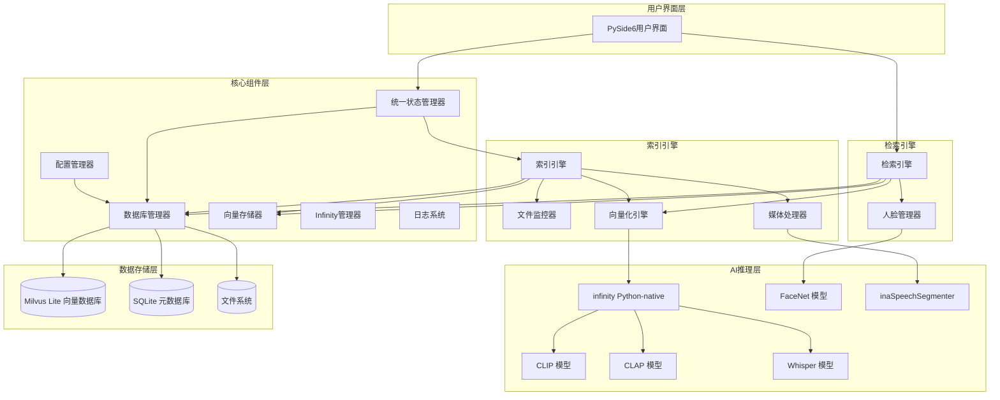

# msearch 多模态检索系统设计文档 (简化版)

## 1. 概述

本文档描述 msearch 多模态检索系统的简化技术架构。系统采用单体架构设计，专注于单机桌面应用场景，使用 michaelfeil/infinity 作为多模型服务引擎，支持文本、图像、视频、音频四种模态的精准检索。

### 1.1 项目目标

- **智能检索**: 无需手动整理、无需添加标签即可实现智能检索
- **跨模态搜索**: 支持用任意模态（文本、图像、音频）检索其他模态内容
- **高精度定位**: 支持毫秒级时间戳精确定位，时间戳精度±2秒要求
- **零配置**: 素材无需整理、无需标签
- **高性能本地推理**: 利用Infinity Python-native模式实现高效向量化
- **单体架构**: 简洁清晰的模块划分，易于理解和维护

### 1.2 系统工作流程

系统存在两条核心工作流程：

**工作流程一：文件处理与向量化**

文件监控器检测到新文件后，将文件路径提交给索引引擎，索引引擎负责从文件处理到向量化的完整流程，最终将结果存入数据库。

1. **扫描和监控阶段**：扫描和监控目标目录中的文件，写入UUID、hash、路径等基础元数据到数据库
2. **索引处理阶段**：索引引擎负责完整的处理流程
   - 文件预处理（格式转换、分辨率调整、切片等）
   - 调用AI模型生成向量嵌入
   - 将向量和元数据存储到数据库

**工作流程二：检索与结果返回**

- 接收用户的多模态查询输入（文本、图像、音频）
- 将查询输入向量化
- 在向量数据库中进行相似度检索
- 处理和排序检索结果
- 以JSON格式返回结果给用户

### 1.3 技术选型

#### 1.3.1 核心技术栈
| 技术层级 | 技术选择 | 核心特性 | 选型理由 |
|---------|---------|---------|---------|
| **应用架构** | **单体架构** | 模块化设计，职责清晰 | 适合单机桌面应用，易于理解和维护 |
| **异步处理** | **asyncio** | 基于asyncio的高性能异步处理 | 高并发，低延迟 |
| **AI推理层** | **michaelfeil/infinity** | 多模型服务引擎，高吞吐量低延迟 | 零配置部署，GPU自动调度 |
| **向量存储层** | **Milvus Lite** | 高性能本地向量数据库，CPU/GPU加速，支持分布式扩展 | 单机运行，无需额外服务，低延迟，支持更多向量索引类型 |
| **元数据层** | **SQLite** | 轻量级关系数据库，零配置，文件级便携 | 零配置，文件级数据便携性 |
| **配置管理** | **YAML + 环境变量** | 配置驱动设计，支持热重载 | 灵活配置，动态调整 |
| **日志系统** | **Python logging** | 多级别日志，自动轮转，分类存储 | 完善的日志管理 |
| **多模态模型** | **CLIP/CLAP/Whisper** | 专业化模型架构，针对不同模态优化 | 高精度多模态理解 |
| **媒体处理** | **FFmpeg + OpenCV + Librosa** | 专业级预处理，场景检测+智能切片 | 专业级媒体处理能力 |
| **文件监控** | **Watchdog** | 实时增量处理，跨平台文件系统事件 | 实时文件监控 |
| **测试框架** | **pytest + pytest-asyncio** | 异步测试支持，覆盖率报告 | 完整的测试体系 |

#### 1.3.2 专业化AI模型架构
| 模态类型 | 模型选择 | 应用场景 | 技术优势 |
|---------|---------|---------|---------|
| **文本-图像** | CLIP | 文本检索图片内容 | 跨模态语义对齐，高精度图像理解 |
| **文本-视频** | CLIP | 文本检索视频内容 | 跨模态语义对齐，精确时间定位 |
| **文本-音频** | CLAP | 文本检索音乐内容 | 专业音频语义理解 |
| **语音-文本** | Whisper | 语音内容转录检索 | 高精度多语言语音识别 |
| **音频分类** | inaSpeechSegmenter | 音频内容智能分类 | 精准区分音乐、语音、噪音 |
| **人脸识别** | FaceNet | 人脸特征提取 | 高精度人脸识别和匹配 |
| **媒体处理** | FFmpeg | 视频场景检测切片 | 专业级媒体预处理能力 |

#### 1.3.3 模型选择策略
**CLIP模型（文本-图像/视频检索）**
- 模型版本：openai/clip-vit-base-patch32（基础版）/ openai/clip-vit-large-patch14-336（高精度版）
- 核心能力：文本-图像跨模态语义对齐，支持视频关键帧精确定位
- 应用场景：文本查询图片、视频关键帧定位、图像相似度检索、静态图像内容分析
- 向量维度：512维（base版本）/ 768维（large版本）

**CLAP模型（文本-音频检索）**
- 模型版本：laion/clap-htsat-fused
- 核心能力：专业音频-文本语义对齐，针对音乐内容优化
- 应用场景：音乐风格检索、乐器识别、音频情感分析
- 向量维度：512维

**Whisper模型（语音-文本转换）**
- 模型版本：openai/whisper-base/medium/large（根据硬件配置选择）
- 核心能力：高精度多语言语音识别
- 应用场景：语音内容转录、语音语义检索
- 支持语言：99种语言

**FaceNet模型（人脸识别）**
- 模型版本：facenet-pytorch
- 核心能力：人脸特征提取和相似度计算
- 应用场景：人脸检测、人脸识别、人名检索
- 识别精度：95%以上

**inaSpeechSegmenter（音频内容分类）**
- 核心能力：智能音频内容分类，精准区分音乐、语音、噪音
- 应用场景：音频预处理、处理策略路由
- 分类准确率：90%以上

#### 1.3.4 michaelfeil/infinity 引擎优势
> **重要说明**: 本项目采用 **michaelfeil/infinity** (https://github.com/michaelfeil/infinity) 作为多模型服务引擎。Infinity 是一个专为文本嵌入、重排序模型、CLIP、CLAP 和 ColPali 设计的高吞吐量、低延迟服务引擎。

| 特性 | 技术优势 | 业务价值 |
|------|---------|---------|
| **高吞吐量** | 专为嵌入模型优化的REST API | 支持大规模文件批量处理 |
| **多后端支持** | CUDA/OpenVINO/CPU自适应 | 适配不同硬件环境 |
| **智能批处理** | 动态批处理优化GPU利用率 | 提升处理效率，降低成本 |
| **低延迟响应** | 毫秒级向量生成 | 实时检索体验 |
| **热加载支持** | 模型动态切换无需重启 | 灵活的模型管理 |
| **Python-native** | 直接Python集成，无需HTTP | 避免通信开销，性能更优 |

#### 1.3.5 技术选型优势
**性能优势**:
- Infinity引擎的Python-native模式避免HTTP通信开销
- Milvus Lite的IVF_FLAT/IVF_SQ8索引算法提供毫秒级检索响应
- FastAPI的异步处理机制提升系统并发能力
- 分辨率降采样减少70-80%显存占用

**可维护性优势**:
- 严格的前后端分离，UI和业务逻辑独立演进
- 配置驱动设计，所有参数可配置无硬编码
- 标准化的REST API接口，便于集成和扩展
- 完善的日志和错误处理机制

**可扩展性优势**:
- 微服务就绪架构，支持未来服务拆分
- 模块化设计，便于功能扩展
- 抽象存储层，支持数据库切换
- 插件式模型管理，支持模型热加载

**跨平台优势**:
- PySide6提供原生跨平台UI体验
- SQLite和Milvus Lite支持Windows/macOS/Linux
- Infinity引擎自适应硬件环境
- 统一的数据格式确保跨平台兼容
- Nuitka支持编译为各平台原生可执行文件

**开发效率优势**:
- uv极速依赖管理，安装速度比pip快10-100倍
- 自动虚拟环境管理，简化开发流程
- Nuitka编译优化，提升应用启动和运行性能
- 完整的工具链支持，从开发到部署一体化


## 2. 系统架构

### 2.1 整体架构图



### 2.2 架构设计原则

1. **单体架构**: 所有模块在同一进程中运行，通过直接函数调用通信
2. **模块化设计**: 按功能职责划分模块，职责清晰
3. **异步驱动**: 采用异步处理机制，提升系统响应性和并发能力
4. **配置驱动**: 所有参数配置化，支持动态调整
5. **简洁实用**: 避免过度抽象，直接使用成熟的API

### 2.3 简化的项目结构

```
msearch/
├── .gitignore
├── IFLOW.md
├── README.md
├── requirements.txt
├── requirements-test.txt
├── .git/
├── .kiro/
│   └── specs/
│       └── multimodal-search-system/
│           ├── design.md
│           ├── requirements.md
│           └── tasks.md
├── config/
│   └── config.yml          # 主配置文件
├── data/
│   ├── database/           # 数据库文件
│   ├── logs/               # 日志文件
│   └── models/             # AI模型文件
├── docs/
│   ├── api_documentation.md
│   ├── design.md
│   ├── development_plan.md
│   ├── requirements.md
│   ├── technical_implementation.md
│   ├── test_strategy.md
│   └── user_manual.md
├── examples/
│   ├── media_preprocessing_example.py
│   └── time_accurate_retrieval_demo.py
├── scripts/
│   ├── download_all_resources.sh
│   ├── install_auto.sh
│   └── install_offline.sh
├── src/                    # 源代码目录
│   ├── __init__.py
│   ├── main.py             # 应用入口
│   │
│   ├── core/               # 3大核心块
│   │   ├── __init__.py
│   │   ├── task_manager.py        # 核心块1: 任务管理器（用户任务进度展示和手动管理）
│   │   ├── embedding_engine.py    # 核心块2: 向量化引擎
│   │   └── vector_store.py        # 核心块3: 向量存储（专注Milvus Lite）
│   │
│   ├── components/         # 辅助组件
│   │   ├── __init__.py
│   │   ├── file_monitor.py        # 文件监控
│   │   ├── media_processor.py     # 媒体处理
│   │   ├── infinity_manager.py    # Infinity管理
│   │   ├── database_manager.py   # 数据库管理（SQLite）
│   │   └── config_manager.py      # 配置管理
│   │
│   ├── ui/                 # 用户界面
│   │   ├── __init__.py
│   │   ├── main_window.py
│   │   ├── search_widget.py
│   │   ├── config_widget.py
│   │   └── task_control_widget.py # 任务管理控制面板
│
├── tests/                   # 测试目录
│   ├── __init__.py
│   ├── conftest.py
│   ├── test_task_manager.py
│   ├── test_embedding_engine.py
│   ├── test_vector_store.py
│   ├── test_media_processor.py
│   ├── test_config_manager.py
│   ├── test_database_manager.py
│   ├── test_timestamp_accuracy.py
│   └── test_multimodal_fusion.py
├── logs/                    # 日志目录（项目根目录）
│   ├── msearch.log
│   ├── error.log
│   ├── performance.log
│   └── timestamp.log
├── temp/                   # 临时文件目录
├── testdata/               # 测试数据
└── venv/                   # 虚拟环境
```


## 3. 核心架构设计（基于3大核心块）

基于您的反馈，我们将架构简化为3大核心块，去除不必要的抽象层和微服务复杂性：

### 3.1 核心架构图（简化版）

```mermaid
graph TB
    subgraph "用户界面"
        UI[PySide6界面]
    end
    
    subgraph "核心块1: 任务管理器"
        TaskManager[任务管理器]
        FileMonitor[文件监控]
        MediaProcessor[媒体处理]
    end
    
    subgraph "核心块2: 向量化引擎"
        EmbeddingEngine[向量化引擎]
        InfinityManager[Infinity管理]
    end
    
    subgraph "核心块3: 向量存储"
        VectorStore[向量存储]
        DatabaseManager[数据库管理]
    end
    
    subgraph "AI模型层"
        CLIP[CLIP模型]
        CLAP[CLAP模型]
        Whisper[Whisper模型]
    end
    
    subgraph "数据层"
        MilvusLite[(Milvus Lite)]
        SQLite[(SQLite)]
    end
    
    UI --> TaskManager
    UI --> VectorStore
    
    TaskManager --> FileMonitor
    TaskManager --> MediaProcessor
    TaskManager --> EmbeddingEngine
    
    EmbeddingEngine --> InfinityManager
    InfinityManager --> CLIP
    InfinityManager --> CLAP
    InfinityManager --> Whisper
    
    VectorStore --> MilvusLite
    VectorStore --> DatabaseManager
    DatabaseManager --> SQLite
    
    TaskManager --> VectorStore
    EmbeddingEngine --> VectorStore
```



### 3.2 核心块1: 任务管理器 (TaskManager)

**职责**: 为用户提供直观的任务进度展示和手动管理界面，统一管理所有文件处理任务。

**核心功能**:
1. **任务进度展示**: 实时显示文件处理、向量化等任务的进度状态
2. **手动任务管理**: 支持用户手动启动、暂停、取消各类处理任务
3. **任务调度**: 创建和管理处理任务队列
4. **流程编排**: 协调预处理→向量化→存储的完整流程
5. **用户交互**: 提供用户友好的任务管理界面
6. **任务持久化**: 使用SQLite存储任务状态，支持系统重启恢复
7. **状态管理**: 
   ```
   PENDING (待处理)
       ↓
   PROCESSING (处理中)
       ↓
   COMPLETED (已完成) / FAILED (失败)
       ↓ (如果失败)
   RETRY (重试)
   ```
8. **优先级队列**: 支持紧急任务插队
9. **并发控制**: 限制同时处理的任务数量
10. **失败重试**: 支持指数退避算法的重试机制，针对向量化等依赖外部服务的操作优化
    - 初始重试间隔：1秒
    - 重试倍数：2（每次重试间隔翻倍）
    - 最大重试次数：5次
    - 可配置重试策略：按任务类型（预处理/向量化/存储）设置不同重试参数
11. **健康检查端点**: 提供HTTP健康检查接口，返回任务队列状态、失败率、平均处理时间等信息
12. **统一错误码**: 遵循系统统一错误码体系，便于监控和问题定位

**核心接口**:
```python
class TaskManager:
    # 任务展示和管理
    async def get_all_tasks(self) -> List[Dict]
    async def get_task_progress(self, task_id: str) -> Dict
    async def pause_task(self, task_id: str) -> None
    async def resume_task(self, task_id: str) -> None
    async def cancel_task(self, task_id: str) -> None
    
    # 手动操作
    async def start_full_scan(self, directory: str) -> str
    async def start_incremental_scan(self, directory: str) -> str
    async def reindex_file(self, file_path: str) -> str
    
    # 任务创建和处理
    async def create_task(self, file_path: str, task_type: str) -> str
    async def process_task(self, task_id: str) -> None
```

**集成组件**:
- **FileMonitor**: 文件系统监控
- **MediaProcessor**: 媒体文件预处理

### 3.3 核心块2: 向量化引擎 (EmbeddingEngine)

**职责**: 专注于AI模型管理和向量化处理，提供统一的向量化接口。

**设计原则**:
- 向量化引擎只负责封装模型方法，不包含模型选择逻辑
- 使用michaelfeil/infinity Python-native模式，不使用HTTP服务模式
- 模型选择由调度器根据文件类型和内容决定
- 所有方法返回标准化的numpy数组格式向量

**核心功能**:
1. **模型管理**: 管理CLIP/CLAP/Whisper模型
2. **向量化处理**: 将媒体内容转换为向量
3. **查询向量化**: 将用户查询转换为向量
4. **批量处理**: 支持批量向量化提升效率
5. **模型预热**: 支持模型预热以提升首次调用性能
6. **多后端支持**: 自动选择最优后端（torch/cuda/openvino）
7. **健康检查端点**: 提供HTTP健康检查接口，返回模型加载状态、GPU/CPU使用情况、模型性能指标等信息
8. **统一错误码**: 遵循系统统一错误码体系，便于监控和问题定位

**核心接口**:
```python
class EmbeddingEngine:
    # 文件向量化
    async def embed_image(self, image_data: bytes) -> List[float]
    async def embed_video_frame(self, frame_data: bytes) -> List[float]
    async def embed_audio(self, audio_data: bytes, audio_type: str) -> List[float]
    
    # 查询向量化
    async def embed_text_query(self, text: str, target_modality: str) -> List[float]
    async def embed_image_query(self, image_data: bytes) -> List[float]
    async def embed_audio_query(self, audio_data: bytes) -> List[float]
    
    # 语音处理
    async def transcribe_audio(self, audio_data: bytes) -> str
    
    # 批量处理
    async def embed_batch(self, items: List[Dict]) -> List[List[float]]
```

**向量化方法映射**:
| 接口方法 | 输入 | 输出 | 使用模型 | 应用场景 |
|---------|------|------|---------|---------|
| `embed_image(image_data)` | 图像字节流 | 512维向量 | CLIP | 图像向量化（异步方法） |
| `embed_text_for_visual(text)` | 文本字符串 | 512维向量 | CLIP | 图像/视频检索（异步方法） |
| `embed_text_for_music(text)` | 文本字符串 | 512维向量 | CLAP | 音乐检索（异步方法） |
| `embed_audio_music(audio_data)` | 音频字节流 | 512维向量 | CLAP | 音乐向量化（异步方法） |
| `transcribe_audio(audio_data)` | 音频字节流 | 文本字符串 | Whisper | 语音转录（异步方法） |
| `transcribe_and_embed(audio_data)` | 音频字节流 | 512维向量 | Whisper + CLIP | 转录并向量化（异步组合方法） |
| `embed_face(face_data)` | 人脸图像 | 512维向量 | FaceNet | 人脸向量化（异步方法） |

**Infinity引擎集成要点**:
- 使用AsyncEngineArray管理多个模型
- 每个模型独立配置EngineArgs
- 支持模型预热（model_warmup=True）
- 自动选择最优后端（torch/cuda/openvino）

**集成组件**:
- **InfinityManager**: Infinity引擎管理

### 3.4 核心块3: 向量存储 (VectorStore)

**职责**: 专注于 Milvus Lite 向量数据库的操作和管理。

**核心功能**:
1. **向量集合管理**: 创建、删除、检查向量集合
2. **向量CRUD操作**: 插入、查询、删除向量数据
3. **相似度检索**: 提供高性能向量相似度检索
4. **批量操作**: 支持批量向量插入和查询

**核心接口**:
```python
class VectorStore:
    # 集合管理
    async def create_collection(self, collection_name: str, dimension: int) -> None
    async def drop_collection(self, collection_name: str) -> None
    async def has_collection(self, collection_name: str) -> bool
    
    # 向量操作
    async def insert_vectors(self, collection: str, vectors: List[List[float]], ids: List[str]) -> None
    async def search_vectors(self, collection: str, query_vector: List[float], limit: int) -> List[Dict]
    async def delete_vectors(self, collection: str, ids: List[str]) -> None
    
    # 批量操作
    async def batch_insert(self, collection: str, vectors: List[List[float]], ids: List[str]) -> None
    async def batch_search(self, collection: str, query_vectors: List[List[float]], limit: int) -> List[List[Dict]]
```

### 3.5 简化的项目结构

```
msearch/
├── config/
│   └── config.yml
├── data/
│   └── models/             # AI模型文件存储 (CLIP/CLAP/Whisper/FaceNet)
├── src/
│   ├── main.py                    # 应用入口
│   │
│   ├── core/                      # 3大核心块
│   │   ├── task_manager.py        # 核心块1: 任务管理器（用户任务进度展示和手动管理）
│   │   ├── embedding_engine.py    # 核心块2: 向量化引擎
│   │   └── vector_store.py        # 核心块3: 向量存储（专注Milvus Lite）
│   │
│   ├── components/                # 辅助组件
│   │   ├── file_monitor.py        # 文件监控
│   │   ├── media_processor.py     # 媒体处理
│   │   ├── infinity_manager.py    # Infinity管理
│   │   ├── database_manager.py    # 数据库管理（SQLite）
│   │   └── config_manager.py      # 配置管理
│   │
│   ├── ui/                        # 用户界面
│   │   ├── main_window.py
│   │   ├── search_widget.py
│   │   ├── config_widget.py
│   │   └── task_control_widget.py # 任务管理控制面板
│
├── tests/                         # 测试
└── logs/                          # 日志
```

### 3.6 核心块交互流程

**文件处理流程**:
```
TaskManager.create_task() 
    ↓
TaskManager.process_task()
    ├─ MediaProcessor.process_file()
    ├─ EmbeddingEngine.embed_file()
    └─ VectorStore.insert_vectors()
```

**检索流程**:
```
UI.search_request()
    ↓
VectorStore.search_multimodal()
    ├─ EmbeddingEngine.embed_query()
    ├─ VectorStore.search_vectors()
    └─ VectorStore.get_file_metadata()
```

**手动操作流程**:
```
UI.manual_operation()
    ↓
TaskManager.full_scan()
    ├─ TaskManager.create_tasks()
    └─ TaskManager.process_tasks()
```

### 3.7 设计优势

1. **简洁明了**: 只有3个核心块，职责清晰
2. **易于理解**: 去除了不必要的抽象层
3. **便于维护**: 每个核心块独立，便于测试和维护
4. **性能优化**: 直接调用，减少中间层开销
5. **扩展性好**: 核心块内部可以独立优化和扩展


## 4. 工作流程

### 4.1 文件处理与向量化流程

基于简化的3核心块架构，文件处理流程如下：

```
TaskManager.文件监控检测新文件
    ↓
TaskManager.创建处理任务
    ↓
TaskManager.媒体预处理
    ├─ 图像：分辨率调整、格式转换
    ├─ 视频：场景检测、切片、音频分离
    └─ 音频：格式转换、内容分类
    ↓
EmbeddingEngine.向量化处理
    ├─ 图像：CLIP向量化
    ├─ 视频：CLIP向量化（每片段1帧）
    ├─ 音频（音乐）：CLAP向量化
    └─ 音频（语音）：Whisper转录 + CLIP向量化
    ↓
VectorStore.存储向量和元数据
    ↓
TaskManager.更新任务状态为完成
```

### 4.2 检索流程

基于简化的3核心块架构，检索流程如下：

```
用户输入查询（文本/图像/音频）
    ↓
VectorStore.接收查询请求
    ↓
EmbeddingEngine.查询向量化
    ├─ 文本查询：CLIP/CLAP向量化
    ├─ 图像查询：CLIP向量化
    └─ 音频查询：CLAP向量化或Whisper转录
    ↓
VectorStore.向量相似度检索
    ↓
VectorStore.查询元数据并融合结果
    ↓
返回排序后的检索结果
```

### 4.3 手动操作流程

基于简化的3核心块架构，手动操作流程如下：

```
用户通过UI触发手动操作
    ↓
TaskManager.验证操作可行性
    ↓
TaskManager.创建操作任务
    ├─ 全量扫描：扫描所有已配置目录
    ├─ 增量扫描：扫描未处理文件
    └─ 重新向量化：重新处理指定文件
    ↓
TaskManager.实时更新进度
    ↓
操作完成，UI显示结果
```

## 5. 视频时序定位

### 5.1 时间戳精度要求

- **用户需求精度**: ±2秒
- **切片边界精度**: ±0.1秒
- **帧级精度**: ±0.033秒（30fps）

### 5.2 时间戳计算

**绝对时间戳计算公式**:

```
absolute_timestamp = segment.start_time + frame_timestamp_in_segment
```

**示例**:

假设有一个切片从原始视频的120.5秒开始，持续5秒。如果从该切片中提取的帧位于切片内的第2.5秒位置，则该帧在原始视频中的绝对时间戳为：

```
absolute_timestamp = 120.5秒 + 2.5秒 = 123.0秒
```

### 5.3 向量Payload设计

**video_vectors的Payload结构**:

| 字段名 | 类型 | 说明 | 示例值 |
|-------|------|------|--------|
| file_uuid | UUID | 原始视频唯一标识 | "video-abc123" |
| segment_id | UUID | 切片唯一标识 | "seg-001" |
| absolute_timestamp | Float | 帧在原始视频中的绝对时间(秒) | 123.0 |

**设计说明**:
- **最小化payload**: 只存储必要的引用信息（file_uuid、segment_id）和预计算的绝对时间戳
- **数据库为主**: 其他详细信息（segment_index、start_time、end_time）从数据库查询
- **预计算时间戳**: absolute_timestamp在向量化前计算好，避免检索时重复计算

## 6. 配置管理

### 6.1 配置文件结构

```yaml
# config/config.yml
system:
  log_level: INFO
  max_workers: 4
  health_check_interval: 30  # 健康检查间隔（秒）

monitoring:
  directories:
    - path: /path/to/media
      priority: 1
      recursive: true
  check_interval: 5  # 秒
  debounce_delay: 500  # 毫秒，防抖延迟

processing:
  image:
    max_resolution: 2048
    max_size_mb: 10
    supported_formats: ['jpg', 'jpeg', 'png', 'webp']
  video:
    target_resolution: 720
    target_fps: 8
    max_segment_duration: 5
    scene_threshold: 0.15
    supported_formats: ['mp4', 'avi', 'mov', 'mkv']
  audio:
    sample_rate: 16000
    channels: 1
    min_music_duration: 30
    min_speech_duration: 3
    supported_formats: ['mp3', 'wav', 'flac', 'aac']

models:
  clip_model: openai/clip-vit-base-patch32
  clap_model: laion/clap-htsat-fused
  whisper_model: openai/whisper-base
  facenet_model: facenet-pytorch
  model_cache_dir: data/models
  enable_model_warmup: true

database:
  sqlite_path: data/database/msearch.db
  milvus_lite_path: data/database/milvus_lite
  vector_index_type: IVF_FLAT
  vector_index_params:
    nlist: 128
  vector_metric_type: IP

retry:
  initial_delay: 1  # 初始重试间隔（秒）
  multiplier: 2  # 重试倍数
  max_attempts: 5  # 最大重试次数
  task_specific:
    preprocessing:
      max_attempts: 3
      initial_delay: 0.5
    vectorization:
      max_attempts: 5
      initial_delay: 1
    storage:
      max_attempts: 3
      initial_delay: 0.5

logging:
  level: INFO
  format: '%(asctime)s - %(name)s - %(levelname)s - %(message)s'
  rotation:
    max_size_mb: 100
    backup_count: 10
  handlers:
    console:
      enabled: true
    file:
      enabled: true
      path: logs/msearch.log
    error_file:
      enabled: true
      path: logs/error.log
      level: ERROR
    performance_file:
      enabled: true
      path: logs/performance.log
      level: INFO
    timestamp_file:
      enabled: true
      path: logs/timestamp.log
      level: DEBUG

api:
  host: 127.0.0.1
  port: 8000
  enable_cors: true
  rate_limit:
    enabled: true
    requests_per_minute: 60
```

### 6.2 配置管理特性

**配置驱动设计**:
- 所有参数配置化，无硬编码
- 支持YAML格式配置文件
- 支持环境变量覆盖
- 配置热重载，无需重启应用

**配置验证**:
- 启动时验证配置完整性
- 配置变更时验证有效性
- 提供配置错误提示

**配置优先级**:
1. 环境变量（最高优先级）
2. 配置文件
3. 默认值（最低优先级）

## 7. 日志系统

### 7.1 日志架构设计

**多级别日志管理**:
- **DEBUG**: 详细的调试信息，用于开发和问题诊断
- **INFO**: 一般信息性消息，记录系统正常运行状态
- **WARNING**: 警告信息，表示潜在问题但不影响运行
- **ERROR**: 错误信息，记录错误事件但不中断服务
- **CRITICAL**: 严重错误，需要立即关注的系统级问题

**分类存储**:
- **主日志文件** (logs/msearch.log): 所有级别的日志
- **错误日志文件** (logs/error.log): 仅ERROR和CRITICAL级别
- **性能日志文件** (logs/performance.log): 性能指标和统计信息
- **时间戳日志文件** (logs/timestamp.log): 时间戳精度相关的调试信息

### 7.2 日志轮转策略

**自动轮转**:
- 单个日志文件最大大小：100MB
- 保留备份文件数量：10个
- 轮转触发条件：文件大小达到上限
- 备份文件命名：msearch.log.1, msearch.log.2, ...

**轮转优势**:
- 防止日志文件无限增长
- 保留历史日志便于问题追溯
- 自动清理旧日志文件

### 7.3 日志格式规范

**标准日志格式**:
```
%(asctime)s - %(name)s - %(levelname)s - %(message)s
```

**示例**:
```
2026-01-04 10:30:45,123 - msearch.core.task_manager - INFO - Task 12345 completed successfully
2026-01-04 10:30:46,456 - msearch.core.embedding_engine - ERROR - Model loading failed: CUDA out of memory
```

### 7.4 日志使用规范

**日志记录原则**:
1. **关键操作必须记录**: 文件处理、向量化、检索等核心操作
2. **错误必须记录**: 所有异常和错误情况
3. **性能指标记录**: 处理时间、吞吐量等性能数据
4. **避免过度记录**: 避免在循环中频繁记录DEBUG日志
5. **结构化日志**: 使用JSON格式便于日志分析工具解析

**日志级别使用指南**:
- **DEBUG**: 开发调试、详细执行流程
- **INFO**: 正常业务流程、状态变更
- **WARNING**: 可恢复的错误、资源使用警告
- **ERROR**: 需要关注的错误、业务异常
- **CRITICAL**: 系统级错误、服务不可用

## 8. 统一错误码体系

### 8.1 错误码设计原则

**错误码格式**: `模块代码-错误类型-具体错误`

**模块代码**:
- `SYS`: 系统级错误
- `CFG`: 配置错误
- `DB`: 数据库错误
- `VEC`: 向量存储错误
- `EMB`: 向量化引擎错误
- `TAS`: 任务管理错误
- `MED`: 媒体处理错误
- `API`: API接口错误

**错误类型**:
- `00`: 成功
- `01`: 参数错误
- `02`: 资源不足
- `03`: 超时错误
- `04`: 权限错误
- `05**: 数据不存在
- `06`: 数据冲突
- `07`: 服务不可用
- `99`: 未知错误

### 8.2 常见错误码定义

| 错误码 | 说明 | HTTP状态码 | 处理建议 |
|-------|------|-----------|---------|
| `SYS-00-000` | 成功 | 200 | - |
| `SYS-01-001` | 无效参数 | 400 | 检查请求参数 |
| `SYS-02-001` | 内存不足 | 503 | 增加系统资源或减少并发 |
| `SYS-03-001` | 操作超时 | 504 | 增加超时时间或优化处理 |
| `CFG-01-001` | 配置文件不存在 | 500 | 检查配置文件路径 |
| `CFG-01-002` | 配置格式错误 | 500 | 验证配置文件格式 |
| `DB-02-001` | 数据库连接失败 | 503 | 检查数据库服务状态 |
| `DB-05-001` | 记录不存在 | 404 | 检查查询条件 |
| `VEC-02-001` | 向量索引不存在 | 404 | 创建向量索引 |
| `EMB-02-001` | 模型未加载 | 503 | 加载AI模型 |
| `EMB-07-001` | 推理服务不可用 | 503 | 检查Infinity服务状态 |
| `TAS-05-001` | 任务不存在 | 404 | 检查任务ID |
| `TAS-06-001` | 任务状态冲突 | 409 | 检查任务当前状态 |
| `MED-01-001` | 不支持的文件格式 | 400 | 检查文件格式 |
| `MED-02-001` | 媒体处理失败 | 500 | 检查媒体文件完整性 |
| `API-01-001` | 请求格式错误 | 400 | 检查请求体格式 |
| `API-03-001` | 请求超时 | 504 | 减少请求数据量或增加超时时间 |

### 8.3 错误处理规范

**错误响应格式**:
```json
{
  "success": false,
  "error": {
    "code": "EMB-02-001",
    "message": "模型未加载",
    "details": "CLIP模型未加载，请先加载模型",
    "timestamp": "2026-01-04T10:30:45.123Z"
  }
}
```

**错误处理流程**:
1. **捕获异常**: 使用try-except捕获所有可能的异常
2. **转换错误码**: 将异常转换为统一的错误码
3. **记录日志**: 记录错误日志，包含错误码和详细信息
4. **返回响应**: 返回标准化的错误响应
5. **错误恢复**: 根据错误类型进行相应的恢复操作

**错误恢复策略**:
- **可重试错误**: 使用指数退避算法自动重试
- **资源不足错误**: 等待资源释放后重试
- **配置错误**: 提示用户检查配置，不自动重试
- **服务不可用错误**: 等待服务恢复后重试

## 9. 健康检查机制

### 9.1 健康检查端点

**系统级健康检查** (`GET /health`):
```json
{
  "status": "healthy",
  "timestamp": "2026-01-04T10:30:45.123Z",
  "components": {
    "database": {
      "status": "healthy",
      "connection_pool": "5/10"
    },
    "vector_store": {
      "status": "healthy",
      "collections": 3
    },
    "embedding_engine": {
      "status": "healthy",
      "loaded_models": ["CLIP", "CLAP", "Whisper"]
    },
    "task_manager": {
      "status": "healthy",
      "queue_length": 0,
      "active_tasks": 2
    }
  }
}
```

**组件级健康检查**:
- `GET /health/database`: 数据库健康状态
- `GET /health/vector_store`: 向量存储健康状态
- `GET /health/embedding_engine`: 向量化引擎健康状态
- `GET /health/task_manager`: 任务管理器健康状态

### 9.2 健康检查策略

**检查频率**: 默认30秒一次（可配置）

**检查内容**:
1. **数据库连接**: 检查SQLite和Milvus Lite连接状态
2. **向量存储**: 检查向量集合可用性
3. **模型加载**: 检查AI模型加载状态
4. **任务队列**: 检查任务队列状态和积压情况
5. **系统资源**: 检查CPU、内存、磁盘使用情况

**健康状态定义**:
- **healthy**: 所有组件正常
- **degraded**: 部分组件降级，但核心功能可用
- **unhealthy**: 核心组件不可用，需要立即处理

## 10. 测试策略

### 10.1 测试框架

- **测试框架**: pytest + pytest-cov + pytest-asyncio
- **覆盖率报告**: HTML格式的详细覆盖率报告
- **测试分类**:
  - **任务管理器测试** (`tests/test_task_manager.py`)
  - **向量化引擎测试** (`tests/test_embedding_engine.py`)
  - **向量存储测试** (`tests/test_vector_store.py`)
  - **媒体处理器测试** (`tests/test_media_processor.py`)
  - **配置管理器测试** (`tests/test_config_manager.py`)
  - **数据库管理器测试** (`tests/test_database_manager.py`)
  - **时间戳精度测试** (`tests/test_timestamp_accuracy.py`)
  - **多模态融合测试** (`tests/test_multimodal_fusion.py`)

### 10.2 测试覆盖率

- **核心功能测试覆盖率**: 85%+
- **性能基准**: 符合设计文档的所有性能要求

### 10.3 测试目录规范

根据项目测试规范，所有测试代码统一放在 `tests/` 目录下：

```
tests/
├── __init__.py
├── conftest.py
├── pytest.ini
├── .coverage/           # 覆盖率报告
├── .tmp/                # 临时文件（已 gitignore）
├── data/                # 测试数据
│   ├── msearch/
│   └── api/
├── benchmark/           # 性能基准
│   └── test_msearch_benchmark.py
├── test_task_manager.py
├── test_embedding_engine.py
├── test_vector_store.py
├── test_media_processor.py
├── test_config_manager.py
├── test_database_manager.py
├── test_timestamp_accuracy.py
└── test_multimodal_fusion.py
```

### 10.4 测试规范

**测试命名规范**:
- 测试文件以 `test_*.py` 命名
- 测试函数使用 `test_功能点_预期行为` 的蛇形命名
- 所有测试用例必须遵循 Arrange-Act-Assert（AAA）模式

**测试数据管理**:
- 测试数据与 fixtures 放在 `tests/data/` 子目录
- 按模块再分二级目录组织
- 禁止在测试代码中硬编码绝对路径
- 统一通过 `pytest` 的 `tmp_path` 或自定义 `fixture` 获取临时路径

**性能基准测试**:
- 性能基准测试放在 `tests/benchmark/` 目录
- 输出报告统一为 `.benchmark.json` 格式
- 任何测试不得污染项目根目录
- 临时文件统一输出到 `tests/.tmp/`

**覆盖率报告**:
- 覆盖率报告统一输出到 `tests/.coverage/` 目录
- HTML 与 XML 格式均需生成，供 CI 与本地查看

## 11. 部署与打包

### 11.1 依赖管理

使用 `uv` 进行依赖管理，安装速度比pip快10-100倍。

### 11.2 打包工具

使用 `Nuitka` 编译为各平台原生可执行文件，提升应用启动和运行性能。

### 11.3 跨平台支持

- **操作系统**: Windows 10/11、macOS、主流Linux发行版

### 11.4 部署脚本

项目提供自动化部署脚本：

- **install_auto.sh**: 自动化在线安装脚本
- **install_offline.sh**: 离线安装脚本
- **download_all_resources.sh**: 下载所有必要资源

### 11.5 安装流程

1. **环境检查**: 检查Python版本和系统依赖
2. **依赖安装**: 使用uv快速安装Python依赖
3. **模型下载**: 自动下载AI模型到指定目录
4. **配置生成**: 自动生成配置文件
5. **数据库初始化**: 初始化SQLite和Milvus Lite数据库
6. **服务启动**: 启动文件监控和处理服务

## 12. API接口文档

### 12.1 RESTful API设计

**基础URL**: `http://127.0.0.1:8000/api/v1`

**通用响应格式**:
```json
{
  "success": true,
  "data": {},
  "error": null,
  "timestamp": "2026-01-04T10:30:45.123Z"
}
```

### 12.2 检索API

**多模态检索** (`POST /search/multimodal`):
```json
{
  "text_query": "海边日落",
  "image_query": null,
  "audio_query": null,
  "limit": 10,
  "threshold": 0.7
}
```

**响应**:
```json
{
  "success": true,
  "data": {
    "results": [
      {
        "file_uuid": "abc123",
        "file_type": "image",
        "file_path": "/path/to/image.jpg",
        "score": 0.95,
        "timestamp": null
      }
    ],
    "total": 1
  }
}
```

### 12.3 任务管理API

**获取所有任务** (`GET /tasks`):
```json
{
  "success": true,
  "data": {
    "tasks": [
      {
        "task_id": "task-001",
        "file_path": "/path/to/video.mp4",
        "status": "PROCESSING",
        "progress": 75,
        "created_at": "2026-01-04T10:00:00.000Z"
      }
    ]
  }
}
```

**手动触发扫描** (`POST /tasks/scan`):
```json
{
  "directory": "/path/to/media",
  "scan_type": "full"
}
```

### 12.4 配置管理API

**获取配置** (`GET /config`):
```json
{
  "success": true,
  "data": {
    "system": {
      "log_level": "INFO",
      "max_workers": 4
    }
  }
}
```

**更新配置** (`PUT /config`):
```json
{
  "system": {
    "log_level": "DEBUG"
  }
}
```

### 12.5 健康检查API

**系统健康检查** (`GET /health`):
```json
{
  "status": "healthy",
  "timestamp": "2026-01-04T10:30:45.123Z",
  "components": {
    "database": {
      "status": "healthy"
    },
    "vector_store": {
      "status": "healthy"
    }
  }
}
```

## 13. 性能指标

### 13.1 系统性能要求

**文件处理性能**:
- 图像处理速度: ≥ 10张/秒
- 视频处理速度: ≥ 1段/秒（5秒切片）
- 音频处理速度: ≥ 5段/秒

**检索性能**:
- 向量检索延迟: ≤ 100ms
- 多模态融合检索: ≤ 200ms
- 时间戳精度: ±2秒

**并发性能**:
- 支持并发处理任务数: ≥ 4
- API请求并发数: ≥ 10
- 文件监控响应时间: ≤ 500ms

### 13.2 资源使用要求

**内存使用**:
- 基础运行内存: ≤ 2GB
- 模型加载内存: ≤ 4GB（CLIP+CLAP+Whisper）
- 向量数据库内存: 根据数据量动态调整

**磁盘使用**:
- 模型文件: 约 5GB
- 数据库文件: 根据数据量动态调整
- 日志文件: 自动轮转，最大1GB

**GPU使用**（如果可用）:
- 推理显存占用: ≤ 4GB
- 批处理优化: 动态调整批次大小

## 14. 安全性设计

### 14.1 数据安全

**文件访问控制**:
- 仅访问配置目录下的文件
- 禁止访问系统关键目录
- 支持白名单/黑名单配置

**数据加密**:
- 数据库文件加密（可选）
- API通信支持HTTPS
- 敏感配置信息加密存储

### 14.2 API安全

**认证授权**:
- API密钥认证（可选）
- 请求速率限制
- IP白名单（可选）

**输入验证**:
- 所有输入参数严格验证
- 防止SQL注入
- 防止路径遍历攻击

### 14.3 日志安全

**敏感信息保护**:
- 日志中不记录敏感信息
- 密码和密钥脱敏处理
- 访问日志审计

## 15. 扩展性设计

### 15.1 模型扩展

**插件式模型管理**:
- 支持动态加载新模型
- 模型配置化管理
- 模型热加载无需重启

**自定义模型支持**:
- 支持用户自定义模型
- 模型接口标准化
- 模型性能监控

### 15.2 存储扩展

**数据库抽象层**:
- 支持切换向量数据库
- 支持分布式部署
- 数据迁移工具

**存储策略扩展**:
- 支持多种索引类型
- 支持数据分片
- 支持数据备份恢复

### 15.3 功能扩展

**插件系统**:
- 支持功能插件
- 插件生命周期管理
- 插件间通信机制

**自定义处理流程**:
- 支持自定义预处理策略
- 支持自定义向量化流程
- 支持自定义结果排序算法

## 16. 版本历史

| 版本 | 日期 | 说明 |
|------|------|------|
| 2.1 | 2026-01-04 | 融合design-old.md中的优秀设计，增强技术选型、日志系统、错误码体系、健康检查、API文档等 |
| 2.0 | 2025-01-04 | 简化架构，移除微服务设计，合并冗余管理器，直接使用Milvus Lite API |
| 1.0 | 2024-XX-XX | 初始版本（微服务架构） |