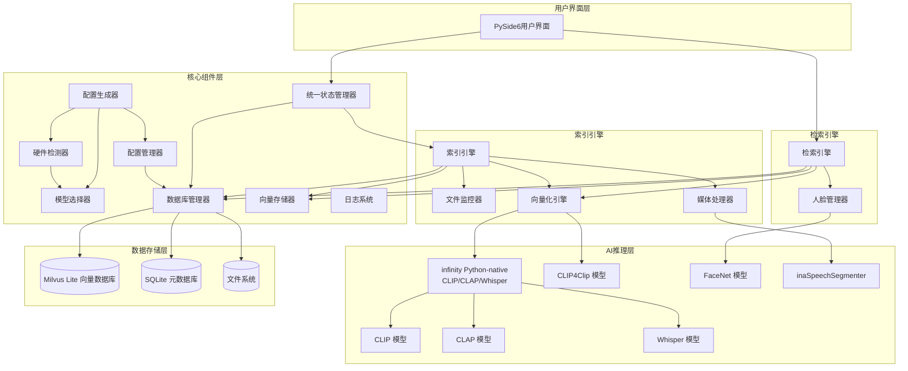
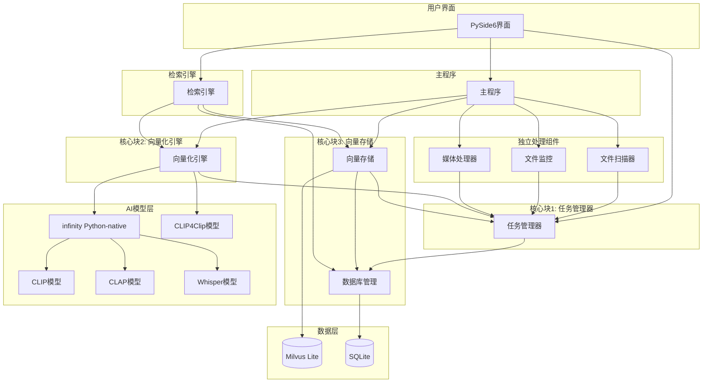

# msearch 多模态检索系统设计文档 

## 1. 概述

本文档描述 msearch 多模态检索系统的简化技术架构。系统采用单体架构设计，专注于单机桌面应用场景，使用 michaelfeil/infinity 作为多模型服务引擎，支持文本、图像、视频、音频四种模态的精准检索。

### 1.1 项目目标

- **智能检索**: 无需手动整理、无需添加标签即可实现智能检索
- **跨模态搜索**: 支持用任意模态（文本、图像、音频）检索其他模态内容
- **高精度定位**: 支持毫秒级时间戳精确定位，时间戳精度±2秒要求
- **零配置**: 素材无需整理、无需标签
- **高性能本地推理**: 利用Infinity Python-native模式实现高效向量化
- **单体架构**: 简洁清晰的模块划分，易于理解和维护

### 1.2 系统工作流程

系统存在两条核心工作流程：

**检索前工作流：文件处理与向量化**

程序运行后主动扫描并监控目标目录文件，将扫描或监视变化的文件路径提交给任务管理器，按流程调用预处理、向量化模块处理，最后将向量化结果存入向量存储库中，供检索流程使用。

1. **扫描和监控阶段**：文件监控器主动扫描目标目录并实时监控文件变化，将新文件或变化文件的路径提交给任务管理器
2. **任务管理阶段**：任务管理器使用 persist-queue 将任务立即持久化到 SQLite，防止意外断电等情况下任务丢失。persist-queue 提供线程安全的磁盘持久化队列，自动处理任务队列的存储和加载。为防止任务队列太长导致内存溢出，任务管理器每批只处理10个以内任务，完成后再从 persist-queue 加载新任务
3. **索引处理阶段**：按流程调用预处理、向量化模块处理
   - 文件预处理（格式转换、分辨率调整、切片等）
   - 调用AI模型生成向量嵌入
   - 将向量和元数据存储到向量存储库（Milvus Lite）

**检索工作流：检索与结果返回**

- 接收用户的多模态查询输入（文本、图像、音频）
- 将查询输入向量化
- 在向量数据库中进行相似度检索
- 处理和排序检索结果
- 以JSON格式返回结果给用户

### 1.3 技术选型

#### 1.3.1 核心技术栈
| 技术层级 | 技术选择 | 核心特性 | 选型理由 |
|---------|---------|---------|---------|
| **任务管理** | **persist-queue + SQLite** | 线程安全、磁盘持久化、基于SQLite的队列 | 防止任务丢失，自动持久化，支持故障恢复 |
| **异步处理** | **asyncio** | 基于asyncio的高性能异步处理 | 高并发，低延迟 |
| **AI推理层** | **michaelfeil/infinity** | 多模型服务引擎，高吞吐量低延迟 | 零配置部署，GPU自动调度 |
| **向量存储层** | **Milvus Lite** | 高性能本地向量数据库，CPU/GPU加速，支持分布式扩展 | 单机运行，无需额外服务，低延迟，支持更多向量索引类型 |
| **元数据层** | **SQLite** | 轻量级关系数据库，零配置，文件级便携 | 零配置，文件级数据便携性 |
| **配置管理** | **YAML + 环境变量** | 配置驱动设计，支持热重载 | 灵活配置，动态调整 |
| **日志系统** | **Python logging** | 多级别日志，自动轮转，分类存储 | 完善的日志管理 |
| **多模态模型** | **CLIP/CLIP4Clip/CLAP/Whisper** | 专业化模型架构，针对不同模态优化 | 高精度多模态理解 |
| **媒体处理** | **FFmpeg + OpenCV + Librosa** | 专业级预处理，场景检测+智能切片 | 专业级媒体处理能力 |
| **文件监控** | **Watchdog** | 实时增量处理，跨平台文件系统事件 | 实时文件监控 |
| **文件扫描** | **os.walk + pathlib** | 递归目录遍历，跨平台路径处理 | 初始文件扫描 |
| **测试框架** | **pytest + pytest-asyncio** | 异步测试支持，覆盖率报告 | 完整的测试体系 |

#### 1.3.2 专业化AI模型架构
| 模态类型 | 模型选择 | 应用场景 | 技术优势 |
|---------|---------|---------|---------|
| **文本-图像** | CLIP | 文本检索图片内容 | 跨模态语义对齐，高精度图像理解 |
| **文本-视频** | CLIP4Clip | 文本检索视频片段内容 | 片段级时序理解，降低计算和存储开销 |
| **文本-音频** | CLAP | 文本检索音乐内容 | 专业音频语义理解 |
| **语音-文本** | Whisper | 语音内容转录检索 | 高精度多语言语音识别 |
| **音频分类** | inaSpeechSegmenter | 音频内容智能分类 | 精准区分音乐、语音、噪音 |
| **人脸识别** | FaceNet | 人脸特征提取 | 高精度人脸识别和匹配 |
| **媒体处理** | FFmpeg | 视频场景检测切片 | 专业级媒体预处理能力 |

#### 1.3.3 模型选择策略
**CLIP模型（文本-图像检索）**
- 模型版本：openai/clip-vit-base-patch32（基础版）/ openai/clip-vit-large-patch14-336（高精度版）
- 核心能力：文本-图像跨模态语义对齐
- 应用场景：文本查询图片、图像相似度检索、静态图像内容分析
- 向量维度：512维（base版本）/ 768维（large版本）
- 集成方式：通过michaelfeil/infinity引擎

**CLIP4Clip模型（文本-视频片段检索）**
- 模型版本：clip4clip/ViT-B-16（基础版）/ clip4clip/ViT-L-14（高精度版）
- 核心能力：基于CLIP的视频-文本检索，支持片段级时序理解和定位
- 应用场景：文本查询视频片段、视频内容语义检索、时序定位
- 向量维度：512维（base版本）/ 768维（large版本）
- 集成方式：直接集成到EmbeddingEngine中，不依赖Infinity引擎
- 性能优势：相比CLIP逐帧向量化，计算时间减少80-90%，向量存储量减少70-80%
- 时序精度：片段级定位，精度±5秒（相比CLIP逐帧的±2秒有所降低）

**CLAP模型（文本-音频检索）**
- 模型版本：laion/clap-htsat-fused
- 核心能力：专业音频-文本语义对齐，针对音乐内容优化
- 应用场景：音乐风格检索、乐器识别、音频情感分析
- 向量维度：512维
- 集成方式：通过michaelfeil/infinity引擎

**Whisper模型（语音-文本转换）**
- 模型版本：openai/whisper-base/medium/large（根据硬件配置选择）
- 核心能力：高精度多语言语音识别
- 应用场景：语音内容转录、语音语义检索
- 支持语言：99种语言
- 集成方式：通过michaelfeil/infinity引擎

**FaceNet模型（人脸识别）**
- 模型版本：facenet-pytorch
- 核心能力：人脸特征提取和相似度计算
- 应用场景：人脸检测、人脸识别、人名检索
- 识别精度：95%以上
- 集成方式：独立模块（src/components/facenet_manager.py）

**inaSpeechSegmenter（音频内容分类）**
- 核心能力：智能音频内容分类，精准区分音乐、语音、噪音
- 应用场景：音频预处理、处理策略路由
- 分类准确率：90%以上
- 集成方式：独立模块（src/components/audio_classifier.py）

#### 1.3.4 michaelfeil/infinity 引擎优势
> **重要说明**: 本项目采用 **michaelfeil/infinity** (https://github.com/michaelfeil/infinity) 作为多模型服务引擎。Infinity 是一个专为文本嵌入、重排序模型、CLIP、CLAP 和 ColPali 设计的高吞吐量、低延迟服务引擎。

| 特性 | 技术优势 | 业务价值 |
|------|---------|---------|
| **高吞吐量** | 专为嵌入模型优化的REST API | 支持大规模文件批量处理 |
| **多后端支持** | CUDA/OpenVINO/CPU自适应 | 适配不同硬件环境 |
| **智能批处理** | 动态批处理优化GPU利用率 | 提升处理效率，降低成本 |
| **低延迟响应** | 毫秒级向量生成 | 实时检索体验 |
| **热加载支持** | 模型动态切换无需重启 | 灵活的模型管理 |
| **Python-native** | 直接Python集成，无需HTTP | 避免通信开销，性能更优 |

#### 1.3.5 技术选型优势
**性能优势**:
- Infinity引擎的Python-native模式避免HTTP通信开销
- Milvus Lite的IVF_FLAT/IVF_SQ8索引算法提供毫秒级检索响应
- FastAPI的异步处理机制提升系统并发能力
- 分辨率降采样减少70-80%显存占用

**可维护性优势**:
- 严格的前后端分离，UI和业务逻辑独立演进
- 配置驱动设计，所有参数可配置无硬编码
- 标准化的REST API接口，便于集成和扩展
- 完善的日志和错误处理机制

**可扩展性优势**:
- 微服务就绪架构，支持未来服务拆分
- 模块化设计，便于功能扩展
- 抽象存储层，支持数据库切换
- 插件式模型管理，支持模型热加载

**跨平台优势**:
- PySide6提供原生跨平台UI体验
- SQLite和Milvus Lite支持Windows/macOS/Linux
- Infinity引擎自适应硬件环境
- 统一的数据格式确保跨平台兼容
- Nuitka支持编译为各平台原生可执行文件

**开发效率优势**:
- uv极速依赖管理，安装速度比pip快10-100倍
- 自动虚拟环境管理，简化开发流程
- Nuitka编译优化，提升应用启动和运行性能
- 完整的工具链支持，从开发到部署一体化


## 1.4 开发策略

本项目采用分阶段开发策略，确保核心功能优先实现和验证：

### 开发优先级顺序
1. **核心功能开发**：优先完成3大核心块（任务管理器、向量化引擎、向量存储）的实现
2. **功能验证**：通过完整的测试套件验证所有功能，包括时间戳精度、跨模态检索等
3. **API接口**：提供RESTful API供WebUI调用，快速验证功能
4. **WebUI集成**：基于现有WebUI界面进行功能验证和用户测试
5. **PySide6桌面UI**：在功能完全验证后，最后开发桌面版用户界面

### 界面开发策略
- **快速验证阶段**：使用现有WebUI（webui/index.html）进行功能验证
- **最终桌面界面**：在功能稳定后开发PySide6桌面应用
- **并行开发支持**：WebUI和PySide6可共享相同的后端API，确保功能一致性

### 优势
- **风险降低**：核心功能先行验证，避免界面开发阻塞功能实现
- **快速迭代**：通过WebUI快速验证功能，缩短反馈周期
- **质量保证**：功能稳定后再进行桌面UI开发，减少界面重构

## 2. 系统架构

### 2.1 整体架构图



### 2.2 架构设计原则

1. **单体架构**: 所有模块在同一进程中运行，通过直接函数调用通信
2. **模块化设计**: 按功能职责划分模块，职责清晰
3. **异步驱动**: 采用异步处理机制，提升系统响应性和并发能力
4. **配置驱动**: 所有参数配置化，支持动态调整
5. **简洁实用**: 避免过度抽象，直接使用成熟的API
6. **硬件自适应**: 根据硬件配置自动选择最优模型和参数

### 2.3 项目结构

```
msearch/
├── .gitignore
├── IFLOW.md
├── README.md
├── requirements.txt
├── requirements-test.txt
├── .git/
├── .kiro/
│   └── specs/
│       └── multimodal-search-system/
│           ├── design.md
│           ├── requirements.md
│           └── tasks.md
├── config/
│   └── config.yml          # 主配置文件
├── data/
│   ├── database/           # 数据库文件
│   ├── logs/               # 日志文件
│   └── models/             # AI模型文件
├── docs/
│   ├── api_documentation.md
│   ├── design.md
│   ├── development_plan.md
│   ├── requirements.md
│   ├── technical_implementation.md
│   ├── test_strategy.md
│   └── user_manual.md
├── examples/
│   ├── media_preprocessing_example.py
│   └── time_accurate_retrieval_demo.py
├── scripts/
│   ├── download_all_resources.sh
│   ├── install_auto.sh
│   └── install_offline.sh
├── src/                    # 源代码目录
│   ├── __init__.py
│   ├── main.py             # 应用入口
│   │
│   ├── core/               # 3大核心块
│   │   ├── __init__.py
│   │   ├── task_manager.py        # 任务管理器（用户任务进度展示和手动管理）
│   │   ├── embedding_engine.py    # 向量化引擎（直接集成Infinity和CLIP4Clip）
│   │   └── vector_store.py        # 向量存储（专注Milvus Lite）
│   │
│   ├── components/         # 辅助组件
│   │   ├── __init__.py
│   │   ├── file_scanner.py        # 文件扫描（初始扫描）
│   │   ├── file_monitor.py        # 文件监控（实时监控）
│   │   ├── media_processor.py     # 媒体处理（视频切片、音频提取等）
│   │   ├── database_manager.py   # 数据库管理（SQLite）
│   │   ├── config_manager.py      # 配置管理
│   │   ├── config_generator.py    # 配置生成器（硬件自适应）
│   │   ├── hardware_detector.py   # 硬件检测器
│   │   ├── model_selector.py      # 模型选择器
│   │   └── search_engine.py       # 检索引擎
│   │
│   ├── ui/                 # 用户界面
│   │   ├── __init__.py
│   │   ├── main_window.py
│   │   ├── search_widget.py
│   │   ├── config_widget.py
│   │   ├── task_control_widget.py # 任务管理控制面板
│   │   └── setup_wizard.py        # 初次启动设置向导
│
├── tests/                   # 测试目录
│   ├── __init__.py
│   ├── conftest.py
│   ├── test_task_manager.py
│   ├── test_embedding_engine.py
│   ├── test_vector_store.py
│   ├── test_media_processor.py
│   ├── test_config_manager.py
│   ├── test_database_manager.py
│   ├── test_timestamp_accuracy.py
│   └── test_multimodal_fusion.py
├── logs/                    # 日志目录（项目根目录）
│   ├── msearch.log
│   ├── error.log
│   ├── performance.log
│   └── timestamp.log
├── temp/                   # 临时文件目录
├── testdata/               # 测试数据
└── venv/                   # 虚拟环境
```


## 3. 核心架构设计
### 3.1 核心架构图



### 3.2 核心块1: 任务管理器 (TaskManager)

**职责**: 为用户提供直观的任务进度展示和手动管理界面，统一管理所有文件处理任务的进度跟踪和状态管理。

**设计原则**:
- TaskManager 不直接集成 FileScanner、FileMonitor、MediaProcessor、EmbeddingEngine 等处理组件，这些组件是独立的，由主程序调用进行实际处理
- TaskManager 只负责任务的进度跟踪、状态管理和用户交互
- 使用 persist-queue 实现任务的持久化和队列管理

**核心功能**:
1. **任务进度展示**: 实时显示文件扫描、预处理、向量化、存储等任务的进度状态
2. **手动任务管理**: 支持用户手动启动、暂停、取消各类处理任务
3. **任务状态跟踪**: 记录任务处理状态和进度信息（通过 DatabaseManager）
4. **任务队列管理**: 使用 persist-queue 管理任务队列，防止任务丢失
5. **用户交互**: 提供用户友好的任务管理界面
6. **任务持久化**: 使用 persist-queue 将任务持久化到 SQLite，防止意外断电等情况下任务丢失。persist-queue 提供线程安全的磁盘持久化队列，自动处理任务队列的存储和加载
7. **状态管理**: 
   ```
   PENDING (待处理)
       ↓
   PROCESSING (处理中)
       ↓
   COMPLETED (已完成) / FAILED (失败)
       ↓ (如果失败)
   RETRY (重试)
   ```
8. **任务类型管理**: 支持多种任务类型的统一管理
   - **SCAN任务**: 文件扫描任务
   - **PREPROCESS任务**: 文件预处理任务
   - **EMBED任务**: 向量化任务
   - **STORAGE任务**: 向量存储任务
   - **INDEX任务**: 完整索引任务（包含预处理+向量化+存储）
9. **优先级队列**: 支持紧急任务插队
10. **并发控制**: 限制同时处理的任务数量（默认每批最多10个），从 persist-queue 批量加载任务
11. **失败重试**: 支持指数退避算法的重试机制，针对向量化等依赖外部服务的操作优化
    - 初始重试间隔：1秒
    - 重试倍数：2（每次重试间隔翻倍）
    - 最大重试次数：5次
    - 可配置重试策略：按任务类型（预处理/向量化/存储）设置不同重试参数
12. **健康检查端点**: 提供HTTP健康检查接口，返回任务队列状态、失败率、平均处理时间等信息
13. **异常处理**: 遵循系统异常处理体系，便于监控和问题定位

**核心接口**:
```python
class TaskManager:
    # 任务展示和管理
    async def get_all_tasks(self) -> List[Dict]
    async def get_task_progress(self, task_id: str) -> Dict
    async def pause_task(self, task_id: str) -> None
    async def resume_task(self, task_id: str) -> None
    async def cancel_task(self, task_id: str) -> None
    
    # 手动操作
    async def start_full_scan(self, directory: str) -> str
    async def start_incremental_scan(self, directory: str) -> str
    async def reindex_file(self, file_path: str) -> str
    
    # 任务创建和处理（支持多种任务类型）
    async def create_task(self, file_path: str, task_type: str) -> str
    async def create_scan_task(self, directory: str) -> str
    async def create_preprocess_task(self, file_path: str) -> str
    async def create_embed_task(self, file_path: str, modality: str) -> str
    async def create_storage_task(self, file_path: str, vectors: List[List[float]], metadata: Dict) -> str
    async def create_index_task(self, file_path: str) -> str  # 完整索引任务
    
    # 任务处理
    async def process_task(self, task_id: str) -> None
    async def process_batch_tasks(self, limit: int = 10) -> None
    
    # 任务队列管理
    async def submit_to_queue(self, task: Dict) -> None
    async def load_batch_tasks(self, limit: int = 10) -> List[Dict]
```

**任务类型定义**:
```python
class TaskType(Enum):
    SCAN = "scan"              # 文件扫描任务
    PREPROCESS = "preprocess"  # 文件预处理任务
    EMBED = "embed"            # 向量化任务
    STORAGE = "storage"        # 向量存储任务
    INDEX = "index"            # 完整索引任务（包含预处理+向量化+存储）
```

**说明**:
- FileScanner、FileMonitor、MediaProcessor、EmbeddingEngine 是独立的处理组件，由主程序调用
- TaskManager 只负责任务的进度跟踪、状态管理和用户交互
- TaskManager 通过 DatabaseManager 存储任务状态和进度信息
- TaskManager 通过 persist-queue 管理任务队列

### 3.2.1 FileScanner (文件扫描器)

**职责**: 负责系统启动时的初始文件扫描，遍历指定目录并返回所有待处理文件列表。

**设计原则**:
- 与FileMonitor职责分离：FileScanner负责初始扫描，FileMonitor负责实时监控
- 使用os.walk递归遍历目录，支持跨平台路径处理
- 支持文件过滤（按扩展名、大小、修改时间等）
- 支持增量扫描（只扫描新增或修改的文件）
- 扫描结果返回文件路径列表，不进行任何处理操作

**核心功能**:
1. **全量扫描**: 扫描指定目录下的所有文件
2. **增量扫描**: 只扫描新增或修改的文件
3. **文件过滤**: 根据配置过滤不需要处理的文件
4. **递归扫描**: 支持递归扫描子目录
5. **扫描统计**: 返回扫描结果统计信息（文件数量、总大小等）

**扫描流程**:
```
FileScanner.scan_directory(directory)
    ↓
递归遍历目录（os.walk）
    ↓
应用文件过滤规则
    ├─ 扩展名过滤
    ├─ 大小过滤
    └─ 修改时间过滤
    ↓
返回文件路径列表
```

**与FileMonitor的配合**:
- **系统启动时**: FileScanner执行全量扫描，处理所有现有文件
- **系统运行时**: FileMonitor实时监控文件变化，处理新增或修改的文件
- **定期增量扫描**: 可配置定期执行增量扫描，确保不遗漏任何文件

**配置示例**:
```yaml
scanner:
  recursive: true
  supported_extensions:
    image: ['jpg', 'jpeg', 'png', 'webp']
    video: ['mp4', 'avi', 'mov', 'mkv']
    audio: ['mp3', 'wav', 'flac', 'aac']
  max_file_size_mb: 1000
  min_file_size_kb: 1
  exclude_patterns:
    - '*.tmp'
    - '*.cache'
    - '.*'
```

### 3.3 核心块2: 向量化引擎 (EmbeddingEngine)

**职责**: 统一管理所有AI模型（CLIP/CLAP/Whisper/CLIP4Clip），提供统一的向量化接口。

**设计原则**:
- EmbeddingEngine 是所有模型调用的统一抽象层
- 直接使用 michaelfeil/infinity 的 Python-native 模式封装 CLIP/CLAP/Whisper 模型
- 直接使用 CLIP4Clip 模型进行视频片段级向量化和时序定位
- 不需要单独的 InfinityManager 和 CLIP4ClipManager 类
- 所有方法返回标准化的向量格式（List[float]）
- 其他组件只需依赖 EmbeddingEngine，无需关心底层模型实现

**核心功能**:
1. **统一模型管理**: 直接管理 CLIP/CLAP/Whisper/CLIP4Clip 模型
2. **向量化处理**: 将媒体内容转换为向量（图像、音频、视频、文本）
3. **查询向量化**: 将用户查询转换为向量
4. **批量处理**: 支持批量向量化提升效率
5. **模型预热**: 支持 infinity 的模型预热以提升首次调用性能
6. **多后端支持**: 自动选择最优后端（torch/cuda/openvino）
7. **视频片段处理**: 使用 CLIP4Clip 进行视频片段级向量化和时序定位
8. **健康检查端点**: 提供HTTP健康检查接口，返回模型加载状态、GPU/CPU使用情况、模型性能指标等信息
9. **异常处理**: 遵循系统异常处理体系，便于监控和问题定位

**核心接口**:
```python
class EmbeddingEngine:
    # 文件向量化（统一使用路径作为输入）
    async def embed_image_from_path(self, file_path: str) -> List[float]
    async def embed_audio_from_path(self, file_path: str) -> List[float]
    
    # 视频片段向量化（使用 CLIP4Clip）
    async def embed_video_segment(self, file_path: str) -> Tuple[List[float], float]
    async def embed_video_segments_batch(self, file_paths: List[str]) -> List[Tuple[List[float], float]]
    
    # 查询向量化（统一使用路径或文本）
    async def embed_text_query(self, text: str, target_modality: str) -> List[float]
    async def embed_image_from_path(self, file_path: str) -> List[float]
    async def embed_audio_from_path(self, file_path: str) -> List[float]
    
    # 语音处理
    async def transcribe_audio_from_path(self, file_path: str) -> str
    
    # 批量处理
    async def embed_batch(self, file_paths: List[str], modality: str) -> List[List[float]]
```

**向量化方法映射**:
| 接口方法 | 输入 | 输出 | 使用模型 | 应用场景 |
|---------|------|------|---------|---------|
| `embed_image_from_path(file_path)` | 文件路径 | 512维向量 | CLIP (infinity) | 图像向量化（文件和查询） |
| `embed_audio_from_path(file_path)` | 文件路径 | 512维向量 | CLAP (infinity) | 音频向量化（文件和查询） |
| `embed_video_segment(file_path)` | 视频片段文件路径 | (向量, 片段中心时间戳) | CLIP4Clip | 视频片段向量化 |
| `embed_video_segments_batch(file_paths)` | 视频片段文件路径列表 | [(向量, 片段中心时间戳), ...] | CLIP4Clip | 批量视频片段向量化 |
| `embed_text_query(text, target_modality)` | 文本字符串、目标模态 | 512维向量 | CLIP/CLAP (infinity) | 文本查询向量化 |
| `transcribe_audio_from_path(file_path)` | 文件路径 | 文本字符串 | Whisper (infinity) | 语音转录 |
| `embed_batch(file_paths, modality)` | 文件路径列表、模态 | 批量向量列表 | 多模型 | 批量向量化 |

**内部实现说明**:
- **CLIP/CLAP/Whisper**: 直接使用 michaelfeil/infinity 的 Python-native 模式（AsyncEmbeddingEngine），避免 HTTP 通信开销
- **CLIP4Clip**: 直接使用 CLIP4Clip 模型进行视频片段级向量化和时序定位
- **优势**: 统一的模型调用接口，简化依赖关系，便于维护和扩展

### 3.4 核心块3: 向量存储 (VectorStore)

**职责**: 专注于 Milvus Lite 向量数据库的操作和管理。

**核心功能**:
1. **向量集合管理**: 创建、删除、检查向量集合
2. **向量CRUD操作**: 插入、查询、删除向量数据
3. **相似度检索**: 提供高性能向量相似度检索
4. **批量操作**: 支持批量向量插入和查询

**核心接口**:
```python
class VectorStore:
    # 集合管理
    async def create_collection(self, collection_name: str, dimension: int) -> None
    async def drop_collection(self, collection_name: str) -> None
    async def has_collection(self, collection_name: str) -> bool
    
    # 向量操作
    async def insert_vectors(self, collection: str, vectors: List[List[float]], ids: List[str], metadata: List[Dict] = None) -> None
    async def search_vectors(self, collection: str, query_vector: List[float], limit: int) -> List[Dict]
    async def delete_vectors(self, collection: str, ids: List[str]) -> None
    
    # 批量操作
    async def batch_insert(self, collection: str, vectors: List[List[float]], ids: List[str], metadata: List[Dict] = None) -> None
    async def batch_search(self, collection: str, query_vectors: List[List[float]], limit: int) -> List[List[Dict]]
```

**集成组件**:
- **DatabaseManager**: SQLite元数据库管理，用于存储文件元数据和任务状态

### 3.4.1 DatabaseManager (数据库管理器)

**职责**: 专注于 SQLite 数据库的操作和管理，为任务管理器提供元数据存储支持。

**核心功能**:
1. **元数据存储**: 存储文件元数据（UUID、hash、路径等）
2. **任务状态跟踪**: 记录任务处理状态和进度信息
3. **批量操作**: 支持批量插入、更新、查询元数据
4. **事务管理**: 确保数据一致性
5. **健康检查**: 提供数据库连接状态检查

**详细设计**: 详见 [数据库设计文档](../../docs/database.md)，包含：
- 完整的 Schema 定义（FileMetadata、TaskProgress、VideoSegment、VideoVectorPayload）
- DatabaseManager 接口定义
- 数据库表结构设计（files、video_segments、task_progress）
- 索引设计和优化策略
- Schema 使用示例

### 3.4.2 HardwareDetector (硬件检测器)

**职责**: 检测系统硬件配置，为模型选择提供硬件信息。

**核心功能**:
1. **GPU检测**: 使用`torch.cuda.is_available()`检测CUDA兼容GPU
2. **CPU检测**: 使用`platform`和`psutil`库检测CPU型号和核心数
3. **内存检测**: 使用`psutil`库检测可用内存大小
4. **硬件信息汇总**: 返回完整的硬件配置信息
5. **缓存机制**: 缓存硬件检测结果，避免重复检测

**核心接口**:
```python
class HardwareDetector:
    async def detect_gpu(self) -> Dict
    async def detect_cpu(self) -> Dict
    async def detect_memory(self) -> Dict
    async def get_hardware_info(self) -> Dict
    async def clear_cache(self) -> None
```

**硬件信息格式**:
```python
{
    "gpu": {
        "available": True,
        "name": "NVIDIA GeForce RTX 3080",
        "memory_gb": 10.0,
        "cuda_version": "11.8"
    },
    "cpu": {
        "model": "Intel Core i7-12700K",
        "cores": 12,
        "threads": 20
    },
    "memory": {
        "total_gb": 32.0,
        "available_gb": 24.0
    }
}
```

### 3.4.3 ModelSelector (模型选择器)

**职责**: 根据硬件配置和用户需求选择最优模型配置。

**核心功能**:
1. **模型推荐**: 根据硬件配置自动推荐最优模型组合
2. **模型配置**: 生成模型配置参数
3. **性能预测**: 预测不同模型的性能表现
4. **用户自定义**: 支持用户自定义模型配置

**核心接口**:
```python
class ModelSelector:
    async def recommend_models(self, hardware_info: Dict) -> Dict
    async def generate_model_config(self, model_selection: Dict) -> Dict
    async def predict_performance(self, model_config: Dict, hardware_info: Dict) -> Dict
    async def validate_model_config(self, model_config: Dict) -> bool
```

**模型推荐策略**:
- **CUDA兼容GPU**: 推荐使用CUDA_INT8加速，选择高精度模型（CLIP-large、CLAP-large、Whisper-medium）
- **OpenVINO支持CPU**: 推荐使用OpenVINO后端，选择中等精度模型（CLIP-base、CLAP-base、Whisper-base）
- **低硬件配置**: 推荐轻量级模型（CLIP-base、CLAP-base、Whisper-base）

### 3.4.4 ConfigGenerator (配置生成器)

**职责**: 根据硬件检测结果和用户偏好生成系统配置文件。

**核心功能**:
1. **配置生成**: 根据硬件检测结果自动生成配置文件
2. **用户确认**: 展示推荐配置，允许用户调整
3. **配置验证**: 验证配置文件的有效性
4. **配置备份**: 保存配置历史，支持配置回滚

**核心接口**:
```python
class ConfigGenerator:
    async def generate_config(self, hardware_info: Dict, user_preferences: Dict = None) -> Dict
    async def validate_config(self, config: Dict) -> bool
    async def save_config(self, config: Dict, config_path: str) -> None
    async def load_config(self, config_path: str) -> Dict
    async def backup_config(self, config_path: str) -> None
    async def restore_config(self, backup_path: str) -> None
```

**配置生成流程**:
```
ConfigGenerator.generate_config()
    ↓
HardwareDetector.get_hardware_info()
    ↓
ModelSelector.recommend_models(hardware_info)
    ↓
生成配置文件
    ↓
ConfigValidator.validate_config(config)
    ↓
保存配置文件
```

### 3.5 架构说明

**设计原则**:
1. **核心块**：提供核心功能（TaskManager、EmbeddingEngine、VectorStore）
2. **辅助组件**：提供具体实现（FileScanner、FileMonitor、MediaProcessor、DatabaseManager、ConfigManager、SearchEngine）
3. **职责清晰**：每个模块只负责一个具体任务，避免职责重复

**架构优势**:
1. **职责清晰**: 每个模块只负责一个具体任务
2. **易于测试**: 模块可以独立测试，不依赖其他模块
3. **可复用**: 模块可以在不同场景下复用
4. **易于维护**: 模块内部逻辑独立，修改不影响其他模块
5. **易于扩展**: 新增功能只需添加新的辅助组件

**主程序调用示例**:
```python
# 主程序调用预处理组件
media_processor = MediaProcessor()
result = await media_processor.process_file(
    file_path="/path/to/video.mp4",
    config={"target_resolution": 720, "target_fps": 8}
)

# 主程序调用向量化引擎
embedding_engine = EmbeddingEngine()
result = await embedding_engine.embed_video_segment(
    file_path="/path/to/segment_001.mp4"
)

# 主程序调用向量存储
vector_store = VectorStore()
result = await vector_store.insert_vectors(
    collection="video_vectors",
    vectors=result["vectors"],
    ids=["seg001"],
    metadata={"file_uuid": "abc123"}
)
```

### 3.6 检索引擎 (SearchEngine)

**职责**: 实现多模态检索功能，提供统一的搜索接口。

**核心功能**:
1. **文本检索**: 支持基于文本的多模态检索
2. **图像检索**: 支持基于图像的多模态检索
3. **音频检索**: 支持基于音频的多模态检索
4. **混合检索**: 支持多种查询类型的组合检索
5. **结果融合**: 融合不同模态的检索结果
6. **结果排序**: 根据相关性对结果进行排序
7. **结果丰富**: 为检索结果添加详细元数据

**核心接口**:
```python
class SearchEngine:
    # 多模态检索
    async def search_by_text(self, query: str, limit: int = None) -> List[Dict]
    async def search_by_image_from_path(self, image_path: str, limit: int = None) -> List[Dict]
    async def search_by_audio_from_path(self, audio_path: str, limit: int = None) -> List[Dict]
    async def hybrid_search(self, text_query: str = None, image_path: str = None, audio_path: str = None, limit: int = None) -> List[Dict]
    
    # 搜索辅助功能
    async def identify_query_type(self, query: str) -> str
    async def get_search_suggestions(self, partial_query: str) -> List[str]
    
    # 结果处理功能
    async def _enrich_results(self, vector_results: List[Dict]) -> List[Dict]
    async def _aggregate_results(self, results: List[Dict]) -> List[Dict]
    async def _sort_results(self, results: List[Dict]) -> List[Dict]
```

**_enrich_results 方法实现**:

```python
async def _enrich_results(self, vector_results: List[Dict]) -> List[Dict]:
    """
    丰富检索结果，添加文件元数据和切片信息
    
    参数:
        vector_results: 向量检索结果列表，每个结果包含 file_uuid, segment_id, segment_center_timestamp, similarity_score
    
    返回:
        丰富后的检索结果列表，包含完整的文件信息和切片元数据
    """
    enriched_results = []
    
    for vector_result in vector_results:
        file_uuid = vector_result.get('file_uuid')
        segment_id = vector_result.get('segment_id')
        segment_center_timestamp = vector_result.get('segment_center_timestamp')
        similarity_score = vector_result.get('similarity_score', 0.0)
        
        # 查询文件元数据
        file_metadata = await self.database_manager.query_file_metadata(file_uuid)
        
        if not file_metadata:
            continue
        
        # 构建基础结果结构
        result = {
            'result_id': str(uuid.uuid4()),
            'file_uuid': file_uuid,
            'file_path': file_metadata['file_path'],
            'file_name': file_metadata['file_name'],
            'file_type': file_metadata['file_type'],
            'similarity_score': similarity_score,
            'modality': file_metadata['modality']
        }
        
        # 如果是视频切片结果，添加切片元数据
        if segment_id and file_metadata['file_type'] == 'video':
            segment_metadata = await self.database_manager.query_segment_metadata(segment_id)
            
            if segment_metadata:
                result.update({
                    'segment_id': segment_id,
                    'segment_index': segment_metadata['segment_index'],
                    'start_time': segment_metadata['start_time'],
                    'end_time': segment_metadata['end_time'],
                    'duration': segment_metadata['duration'],
                    'segment_center_timestamp': segment_center_timestamp,
                    'scene_boundary': segment_metadata['scene_boundary'],
                    'is_segment': True,
                    'thumbnail_path': self._get_thumbnail_path(segment_id)
                })
            else:
                # 如果找不到切片元数据，标记为完整视频
                result.update({
                    'is_segment': False,
                    'total_duration': file_metadata.get('total_duration', 0.0),
                    'frame_rate': file_metadata.get('frame_rate', 0.0),
                    'resolution': file_metadata.get('resolution', ''),
                    'thumbnail_path': self._get_thumbnail_path(file_uuid)
                })
        else:
            # 非切片结果（完整视频、图像、音频）
            result.update({
                'is_segment': False
            })
            
            if file_metadata['file_type'] == 'video':
                result.update({
                    'total_duration': file_metadata.get('total_duration', 0.0),
                    'frame_rate': file_metadata.get('frame_rate', 0.0),
                    'resolution': file_metadata.get('resolution', ''),
                    'thumbnail_path': self._get_thumbnail_path(file_uuid)
                })
            elif file_metadata['file_type'] == 'image':
                result.update({
                    'width': file_metadata.get('width', 0),
                    'height': file_metadata.get('height', 0),
                    'thumbnail_path': self._get_thumbnail_path(file_uuid)
                })
            elif file_metadata['file_type'] == 'audio':
                result.update({
                    'duration': file_metadata.get('duration', 0.0),
                    'sample_rate': file_metadata.get('sample_rate', 0),
                    'channels': file_metadata.get('channels', 1)
                })
        
        enriched_results.append(result)
    
    return enriched_results

async def _aggregate_results(self, results: List[Dict]) -> List[Dict]:
    """
    聚合同一文件的多个切片结果
    
    参数:
        results: 丰富后的检索结果列表
    
    返回:
        聚合后的检索结果列表
    """
    # 按 file_uuid 分组
    grouped = {}
    for result in results:
        file_uuid = result['file_uuid']
        
        if file_uuid not in grouped:
            grouped[file_uuid] = {
                'file_info': result,
                'segments': [],
                'max_similarity': result['similarity_score']
            }
        else:
            grouped[file_uuid]['segments'].append(result)
            grouped[file_uuid]['max_similarity'] = max(
                grouped[file_uuid]['max_similarity'],
                result['similarity_score']
            )
    
    # 生成聚合结果
    aggregated_results = []
    for file_uuid, group in grouped.items():
        file_info = group['file_info']
        segments = group['segments']
        
        # 如果只有一个切片或不是切片结果，直接返回
        if len(segments) <= 1 or not file_info.get('is_segment', False):
            if segments:
                aggregated_results.append(segments[0])
            else:
                aggregated_results.append(file_info)
        else:
            # 多个切片，生成聚合结果
            matched_segments = []
            for segment in segments:
                matched_segments.append({
                    'segment_id': segment['segment_id'],
                    'segment_index': segment['segment_index'],
                    'segment_center_timestamp': segment['segment_center_timestamp'],
                    'similarity_score': segment['similarity_score'],
                    'thumbnail_path': segment['thumbnail_path']
                })
            
            # 按时间排序切片
            matched_segments.sort(key=lambda x: x['segment_center_timestamp'])
            
            # 构建聚合结果
            aggregated_result = {
                'result_id': str(uuid.uuid4()),
                'file_uuid': file_uuid,
                'file_path': file_info['file_path'],
                'file_name': file_info['file_name'],
                'file_type': file_info['file_type'],
                'similarity_score': group['max_similarity'],
                'modality': file_info['modality'],
                'is_segment': False,
                'total_duration': file_info.get('total_duration', 0.0),
                'frame_rate': file_info.get('frame_rate', 0.0),
                'resolution': file_info.get('resolution', ''),
                'matched_segments': matched_segments,
                'matched_segment_count': len(matched_segments),
                'thumbnail_path': matched_segments[0]['thumbnail_path']  # 使用最相似切片的缩略图
            }
            
            aggregated_results.append(aggregated_result)
    
    return aggregated_results

async def _sort_results(self, results: List[Dict]) -> List[Dict]:
    """
    排序检索结果
    
    参数:
        results: 检索结果列表（可能是聚合结果或单个结果）
    
    返回:
        排序后的检索结果列表
    """
    # 按相似度分数降序排序
    results.sort(key=lambda x: x['similarity_score'], reverse=True)
    
    # 对于聚合结果，内部切片按时间戳升序排序
    for result in results:
        if 'matched_segments' in result:
            result['matched_segments'].sort(key=lambda x: x['segment_center_timestamp'])
    
    return results
```

### 3.7 核心块交互流程

**文件处理流程**:
```
FileMonitor.文件监控检测新文件
    ↓
TaskManager.create_task(file_path, task_type) 
    ↓
TaskManager.process_task(task_id)
    ├─ MediaProcessor.process_file(file_path)
    ├─ EmbeddingEngine.embed_*_from_path(file_path)
    └─ VectorStore.insert_vectors(collection, vectors, ids, metadata)
```

**检索流程**:
```
UI.search_request(query)
    ↓
SearchEngine.search_by_*_from_path(query_path)
    ├─ EmbeddingEngine.embed_*_from_path(query_path)
    ├─ VectorStore.search_vectors(collection, query_vector, limit)
    └─ SearchEngine._enrich_results(result_ids)
```

**手动操作流程**:
```
UI.manual_operation()
    ↓
TaskManager.start_full_scan(directory)
    ├─ TaskManager.create_tasks(file_paths, 'index')
    └─ TaskManager.process_tasks()
```

## 4. 工作流程

### 4.1 文件处理与向量化流程

基于简化的3核心块架构，文件处理流程如下：

**系统启动时的初始扫描流程**:
```
系统启动
    ↓
TaskManager.启动文件扫描任务
    ↓
FileScanner.scan_directory(directory, recursive=True)
    ↓
递归遍历目录（os.walk）
    ↓
应用文件过滤规则
    ├─ 扩展名过滤
    ├─ 大小过滤
    └─ 修改时间过滤
    ↓
返回文件路径列表
    ↓
TaskManager.为每个文件创建INDEX任务
    ↓
TaskManager.将任务提交给persist-queue
    ↓
persist-queue.自动将任务持久化到SQLite（线程安全，防止任务丢失）
    ↓
TaskManager.从persist-queue加载任务（每批最多10个，防止内存溢出）
    ↓
TaskManager.处理INDEX任务
    ↓
MediaProcessor.process_file(file_path, config)
    ├─ 识别文件类型
    ├─ 根据文件类型选择预处理策略
    ├─ 图像：分辨率调整、格式转换
    ├─ 视频：场景检测、切片、音频分离
    └─ 音频：格式转换、内容分类
    ↓
返回预处理结果
    ↓
EmbeddingEngine.embed_*_from_path(file_path)
    ├─ 根据模态选择AI模型
    ├─ 图像：CLIP模型
    ├─ 视频：CLIP模型（关键帧）
    ├─ 音频（音乐）：CLAP模型
    └─ 音频（语音）：Whisper + CLIP
    ↓
返回向量化结果
    ↓
VectorStore.insert_vectors(collection, vectors, ids, metadata)
    ├─ 存储文件元数据到SQLite
    ├─ 存储向量到Milvus Lite
    └─ 关联元数据和向量
    ↓
返回存储结果
    ↓
TaskManager.更新任务状态为完成
    ↓
TaskManager.从persist-queue加载下一批任务
```

**系统运行时的实时监控流程**:
```
FileMonitor.文件监控检测新文件
    ↓
TaskManager.create_index_task(file_path)
    ↓
TaskManager.将任务提交给persist-queue
    ↓
persist-queue.自动将任务持久化到SQLite
    ↓
TaskManager.从persist-queue加载任务
    ↓
TaskManager.处理INDEX任务（同上）
    ↓
MediaProcessor.process_file(file_path, config)
    ↓
EmbeddingEngine.embed_*_from_path(file_path)
    ↓
VectorStore.insert_vectors(collection, vectors, ids, metadata)
    ↓
TaskManager.更新任务状态为完成
```

**主程序直接调用示例**:
```
主程序直接调用预处理组件
    ↓
media_processor = MediaProcessor()
result = await media_processor.process_file(
    file_path="/path/to/video.mp4",
    config={"target_resolution": 720, "target_fps": 8}
)
    ↓
预处理组件独立工作
    ├─ 识别文件类型
    ├─ 执行预处理操作
    └─ 返回处理结果
    ↓
主程序处理结果
```

**架构优势**:
1. **模块独立**: 每个组件可以独立工作，不依赖其他组件
2. **灵活组合**: TaskManager可以灵活组合不同的组件
3. **易于测试**: 每个组件可以独立测试
4. **易于扩展**: 新增功能只需添加新的辅助组件
5. **职责清晰**: 每个模块只负责一个具体任务

### 4.2 检索流程

基于简化的3核心块架构，检索流程如下：

```
用户输入查询（文本/图像/音频）
    ↓
SearchEngine.接收查询请求
    ↓
EmbeddingEngine.查询向量化 (路径或文本输入)
    ├─ 文本查询：CLIP/CLAP向量化
    ├─ 图像查询：CLIP向量化
    └─ 音频查询：CLAP向量化或Whisper转录
    ↓
VectorStore.向量相似度检索
    ↓
DatabaseManager.查询元数据并融合结果
    ↓
SearchEngine.丰富结果数据
    ↓
返回排序后的检索结果
```

### 4.3 手动操作流程

基于简化的3核心块架构，手动操作流程如下：

```
用户通过UI触发手动操作
    ↓
TaskManager.验证操作可行性
    ↓
TaskManager.创建操作任务
    ├─ 全量扫描：扫描所有已配置目录
    ├─ 增量扫描：扫描未处理文件
    └─ 重新向量化：重新处理指定文件
    ↓
TaskManager.实时更新进度
    ↓
操作完成，UI显示结果
```

## 5. 视频时序定位

### 5.1 设计目标

为视频剪辑人员提供快速内容定位，±2秒精度（4秒范围内）完全满足需求。系统通过建立完整的元数据映射，实现从向量检索结果到原始视频时间位置的精确反向推导。

### 5.2 时间戳精度要求

- **片段级定位精度**: ±5秒（CLIP4Clip片段级向量化）
- **时间戳容差**: ±10秒（片段中心时间戳的容差范围）
- **切片边界精度**: ±0.1秒（场景检测切片边界）
- **帧级精度**: ±0.033秒（30fps，仅用于参考，CLIP4Clip不提供帧级精度）

**精度说明**:
- **片段级定位**: CLIP4Clip模型预测的片段中心时间戳，精度为±5秒，适用于快速检索和粗略定位
- **时间戳容差**: 在检索时，允许±10秒的容差范围，以适应片段级定位的不确定性
- **适用场景**: 快速检索、粗略定位、大视频库管理
- **局限性**: 不适用于需要帧级精度的场景（如逐帧编辑、精确时间点定位）

### 5.3 核心数据结构

#### 5.3.1 files表（文件元数据）

files表存储所有文件的元数据，包括原始文件和预处理生成的派生文件（如分离的音频、提取的帧等）。

**Schema定义**: 详见 [3.4.1 DatabaseManager](#341-databasemanager-数据库管理器) 中的 `FileMetadata` Schema

**数据库表结构**:
```sql
CREATE TABLE files (
    file_uuid TEXT PRIMARY KEY,
    file_path TEXT NOT NULL UNIQUE,
    file_name TEXT NOT NULL,
    file_type TEXT NOT NULL CHECK(file_type IN ('video', 'audio', 'image', 'derived')),
    modality TEXT NOT NULL CHECK(modality IN ('video', 'audio', 'image', 'text')),
    file_hash TEXT NOT NULL,
    file_size INTEGER NOT NULL CHECK(file_size >= 0),
    source_file_uuid TEXT,
    derived_type TEXT CHECK(derived_type IN ('separated_audio', 'video_segment', 'thumbnail')),
    total_duration REAL CHECK(total_duration >= 0),
    frame_rate REAL CHECK(frame_rate >= 0),
    resolution TEXT,
    width INTEGER CHECK(width >= 0),
    height INTEGER CHECK(height >= 0),
    sample_rate INTEGER CHECK(sample_rate >= 0),
    channels INTEGER CHECK(channels >= 0),
    created_at TIMESTAMP DEFAULT CURRENT_TIMESTAMP,
    updated_at TIMESTAMP DEFAULT CURRENT_TIMESTAMP,
    FOREIGN KEY (source_file_uuid) REFERENCES files(file_uuid)
);
```

**字段说明**:

| 字段名 | 类型 | 说明 | 示例值 |
|-------|------|------|--------|
| file_uuid | UUID | 文件唯一标识（主键） | "video-abc123" |
| file_path | String | 文件完整路径 | "/home/user/videos/interview.mp4" |
| file_name | String | 文件名 | "interview.mp4" |
| file_type | FileType | 文件类型（video/audio/image/derived） | "video" |
| modality | ModalityType | 模态类型（video/audio/image/text） | "video" |
| file_hash | String | 文件内容哈希（SHA256） | "a1b2c3d4..." |
| file_size | Integer | 文件大小（字节） | 104857600 |
| source_file_uuid | UUID | **源文件UUID（派生文件关联到原始文件）** | "video-abc123" 或 NULL |
| derived_type | DerivedType | 派生类型（separated_audio/video_segment/thumbnail） | "separated_audio" 或 NULL |
| total_duration | Float | 视频/音频总时长（秒） | 360.0 |
| frame_rate | Float | 视频帧率 | 30.0 |
| resolution | String | 视频/图像分辨率 | "1920x1080" |
| width | Integer | 图像宽度 | 1920 |
| height | Integer | 图像高度 | 1080 |
| sample_rate | Integer | 音频采样率 | 16000 |
| channels | Integer | 音频声道数 | 1 |
| created_at | Timestamp | 记录创建时间 | 2024-01-01 10:00:00 |
| updated_at | Timestamp | 记录更新时间 | 2024-01-01 10:05:00 |

**重要说明**:
- **原始文件**: `source_file_uuid` 为 NULL，`derived_type` 为 NULL
- **派生文件**: `source_file_uuid` 指向原始文件的 `file_uuid`，`derived_type` 标识派生类型
- **文件类型**: `file_type` 区分原始文件（video/audio/image）和派生文件（derived）
- **关联查询**: 通过 `source_file_uuid` 可以从派生文件追溯到原始文件

**派生类型说明**:
| derived_type | 说明 | 示例 |
|-------------|------|------|
| separated_audio | 从视频中分离的音频 | video.mp4 → audio.wav |
| video_segment | 视频场景检测切片 | video.mp4 → segment_001.mp4 |
| thumbnail | 生成的缩略图 | video.mp4 → thumb.jpg |

**Schema使用示例**:
```python
# 创建文件元数据
file_metadata = FileMetadata(
    file_uuid="video-abc123",
    file_path="/home/user/videos/interview.mp4",
    file_name="interview.mp4",
    file_type=FileType.VIDEO,
    modality=ModalityType.VIDEO,
    file_hash="a1b2c3d4...",
    file_size=104857600,
    total_duration=360.0,
    frame_rate=30.0,
    resolution="1920x1080",
    width=1920,
    height=1080
)

# 插入数据库
file_uuid = await database_manager.insert_file_metadata(file_metadata)
```

#### 5.3.2 video_segments表（视频切片元数据）

**Schema定义**: 详见 [3.4.1 DatabaseManager](#341-databasemanager-数据库管理器) 中的 `VideoSegment` Schema

**数据库表结构**:
```sql
CREATE TABLE video_segments (
    segment_id TEXT PRIMARY KEY,
    file_uuid TEXT NOT NULL,
    segment_index INTEGER NOT NULL CHECK(segment_index >= 0),
    start_time REAL NOT NULL CHECK(start_time >= 0),
    end_time REAL NOT NULL CHECK(end_time >= 0),
    duration REAL NOT NULL CHECK(duration >= 0),
    scene_boundary BOOLEAN DEFAULT 0,
    created_at TIMESTAMP DEFAULT CURRENT_TIMESTAMP,
    FOREIGN KEY (file_uuid) REFERENCES files(file_uuid),
    CHECK(end_time >= start_time),
    CHECK(duration = end_time - start_time)
);
```

**字段说明**:

| 字段名 | 类型 | 说明 | 示例值 |
|-------|------|------|--------|
| segment_id | UUID | 切片唯一标识 | "seg-001" |
| file_uuid | UUID | 原始视频唯一标识 | "video-abc123" |
| segment_index | Integer | 按原始视频时序的片段序号（从0开始） | 0, 1, 2... |
| start_time | Float | 在原始视频中的起始时间(秒) | 0.0, 120.5, 245.3 |
| end_time | Float | 在原始视频中的结束时间(秒) | 120.5, 245.3, 360.0 |
| duration | Float | 片段时长(秒) = end_time - start_time | 120.5, 124.8, 114.7 |
| scene_boundary | Boolean | 是否为场景边界切片 | true/false |

**重要约束**:
1. **切片时间连续性**: 相邻切片的时间必须连续，即前一切片的结束时间必须等于后一切片的开始时间
2. **切片时长准确性**: 切片时长必须等于结束时间减去开始时间的差值
3. **切片序号完整性**: 切片序号必须按时序连续递增，从0开始编号

**Schema使用示例**:
```python
# 创建视频切片
segment = VideoSegment(
    segment_id="seg-001",
    file_uuid="video-abc123",
    segment_index=0,
    start_time=0.0,
    end_time=120.5,
    duration=120.5,
    scene_boundary=True
)

# 插入数据库
segment_id = await database_manager.insert_video_segment(segment)

# 批量插入切片
segments = [
    VideoSegment(segment_id="seg-001", file_uuid="video-abc123", segment_index=0, start_time=0.0, end_time=120.5, duration=120.5, scene_boundary=True),
    VideoSegment(segment_id="seg-002", file_uuid="video-abc123", segment_index=1, start_time=120.5, end_time=245.3, duration=124.8, scene_boundary=False),
    VideoSegment(segment_id="seg-003", file_uuid="video-abc123", segment_index=2, start_time=245.3, end_time=360.0, duration=114.7, scene_boundary=True)
]
segment_ids = await database_manager.batch_insert_video_segments(segments)
```

#### 5.3.3 video_vectors的Payload结构（向量存储）

**Schema定义**: 详见 [3.4.1 DatabaseManager](#341-databasemanager-数据库管理器) 中的 `VideoVectorPayload` Schema

**Payload字段说明**:

| 字段名 | 类型 | 说明 | 示例值 |
|-------|------|------|--------|
| file_uuid | UUID | 原始视频唯一标识 | "video-abc123" |
| segment_id | UUID | 切片唯一标识 | "seg-001" |
| segment_center_timestamp | Float | **片段中心时间戳(秒，CLIP4Clip预测)** | 0.0, 2.5, 5.0... |

**设计说明**:
- **最小化payload**: 只存储必要的引用信息（file_uuid、segment_id）和CLIP4Clip预测的片段中心时间戳
- **数据库为主**: 其他详细信息（segment_index、start_time、end_time、duration、scene_boundary）从video_segments表查询
- **CLIP4Clip预测时间戳**: segment_center_timestamp由CLIP4Clip模型预测，表示片段在原始视频中的中心时间位置

**Schema使用示例**:
```python
# 创建向量Payload
payload = VideoVectorPayload(
    file_uuid="video-abc123",
    segment_id="seg-001",
    segment_center_timestamp=60.25
)

# 存储向量时使用Payload
metadata = payload.dict()
vector_store.insert_vectors(collection="video_vectors", vectors=[vector], ids=["vec-001"], metadata=[metadata])
```
|-------|------|------|--------|
| segment_id | UUID | 切片唯一标识 | "seg-001" |
| file_uuid | UUID | 原始视频唯一标识 | "video-abc123" |
| segment_index | Integer | 按原始视频时序的片段序号（从0开始） | 0, 1, 2... |
| start_time | Float | 在原始视频中的起始时间(秒) | 0.0, 120.5, 245.3 |
| end_time | Float | 在原始视频中的结束时间(秒) | 120.5, 245.3, 360.0 |
| duration | Float | 片段时长(秒) = end_time - start_time | 120.5, 124.8, 114.7 |
| scene_boundary | Boolean | 是否为场景边界切片 | true/false |

**重要约束**:
1. **切片时间连续性**: 相邻切片的时间必须连续，即前一切片的结束时间必须等于后一切片的开始时间
2. **切片时长准确性**: 切片时长必须等于结束时间减去开始时间的差值
3. **切片序号完整性**: 切片序号必须按时序连续递增，从0开始编号

#### 5.3.2 video_vectors的Payload结构（向量存储）

| 字段名 | 类型 | 说明 | 示例值 |
|-------|------|------|--------|
| file_uuid | UUID | 原始视频唯一标识 | "video-abc123" |
| segment_id | UUID | 切片唯一标识 | "seg-001" |
| segment_center_timestamp | Float | **片段中心时间戳(秒，CLIP4Clip预测)** | 0.0, 2.5, 5.0... |

**设计说明**:
- **最小化payload**: 只存储必要的引用信息（file_uuid、segment_id）和CLIP4Clip预测的片段中心时间戳
- **数据库为主**: 其他详细信息（segment_index、start_time、end_time、duration、scene_boundary）从video_segments表查询
- **CLIP4Clip预测时间戳**: segment_center_timestamp由CLIP4Clip模型预测，表示片段在原始视频中的中心时间位置

#### 5.3.3 预处理文件与原始文件的关联机制

为确保向量化后的检索结果能够正确返回原始文件ID，系统建立了完整的预处理文件与原始文件的关联机制。

**核心原则**:
1. **向量存储始终使用原始文件ID**: 无论向量化的是原始文件还是预处理生成的派生文件，向量存储的metadata中的`file_uuid`始终指向原始文件
2. **派生文件通过source_file_uuid追溯**: 所有预处理生成的派生文件（分离的音频、提取的帧等）都通过`source_file_uuid`字段关联到原始文件
3. **检索时自动追溯**: 检索时通过向量存储的`file_uuid`直接查询原始文件元数据，无需额外追溯步骤

**关联示例**:

**场景1: 视频切片向量化**
```
原始文件: interview.mp4 (file_uuid = "video-abc123")
    ↓ 预处理（场景检测切片）
切片文件: segment_001.mp4 (file_uuid = "seg-file-001", source_file_uuid = "video-abc123")
    ↓ CLIP4Clip向量化
向量存储: {
  "file_uuid": "video-abc123",  // 始终使用原始文件ID
  "segment_id": "seg-001",
  "segment_center_timestamp": 122.9
}
```

**场景2: 音频分离向量化**
```
原始文件: video_with_audio.mp4 (file_uuid = "video-def456")
    ↓ 预处理（音频分离）
分离音频: audio_separated.wav (file_uuid = "audio-001", source_file_uuid = "video-def456", derived_type = "separated_audio")
    ↓ 向量化
向量存储: {
  "file_uuid": "video-def456",  // 始终使用原始文件ID
  "segment_id": NULL,
  "segment_center_timestamp": NULL
}
```

**关键实现逻辑**:

1. **预处理阶段**:
   - 为原始文件生成唯一UUID（file_uuid）
   - 为每个派生文件生成独立UUID，但设置`source_file_uuid`指向原始文件
   - 将原始文件和派生文件的元数据都存储到files表

2. **向量化阶段**:
   - 从派生文件的元数据中读取`source_file_uuid`
   - 如果`source_file_uuid`存在，使用它作为向量存储的`file_uuid`
   - 如果`source_file_uuid`不存在（即原始文件），直接使用文件的`file_uuid`

3. **检索阶段**:
   - 向量检索返回的结果中包含`file_uuid`（原始文件ID）
   - 直接使用`file_uuid`查询原始文件元数据
   - 无需追溯派生文件链路

**数据库查询示例**:

```sql
-- 查询原始文件元数据
SELECT * FROM files 
WHERE file_uuid = 'video-abc123' 
  AND source_file_uuid IS NULL;

-- 查询某个原始文件的所有派生文件
SELECT * FROM files 
WHERE source_file_uuid = 'video-abc123';

-- 查询某个切片的原始文件
SELECT f.* 
FROM files s
JOIN files f ON s.source_file_uuid = f.file_uuid
WHERE s.file_uuid = 'seg-file-001';
```

**设计优势**:
- **简化检索逻辑**: 检索结果直接包含原始文件ID，无需额外追溯
- **支持多级派生**: 可以支持多级预处理（视频→切片→帧），最终向量存储始终指向原始文件
- **数据一致性**: 通过外键约束确保派生文件的`source_file_uuid`有效
- **灵活扩展**: 新增预处理类型只需扩展`derived_type`枚举，不影响检索逻辑

### 5.4 视频预处理与向量化流程

#### 5.4.1 预处理阶段（音频分离+视频切片）

视频预处理采用先分离音频后切片的处理流程，具体步骤如下：

1. **视频元数据提取**
   - 获取视频的唯一标识、总时长、帧率等基础信息
   - 检测视频是否包含音频轨道

2. **音频分离处理**
   - 若视频包含音频轨道，使用FFmpeg进行音频分离
   - 将分离的音频转换为标准格式：PCM 16位编码、16kHz采样率、单声道
   - 为分离的音频生成独立UUID，存储到临时目录
   - 在数据库中创建音频文件记录，标记为"derived"类型，并关联到源视频
   - 异步提交音频处理任务，包括音频分类和向量化

3. **严格场景检测切片**
   - 使用FFmpeg的场景检测功能，采用0.15的严格阈值（默认值为0.4）
   - 检测视频中的场景变化边界点
   - 对每个场景进行切片，确保最大切片时长不超过5秒
   - 对于过长的场景，按最大时长均匀切分

4. **切片元数据生成**
   - 为每个切片生成唯一UUID
   - 记录切片的起止时间、时长、索引等信息
   - 标记切片是否为场景边界切片
   - 标记切片是否包含音频
   - 每个切片只提取1帧（中间帧）用于后续向量化

5. **切片验证**
   - 验证相邻切片的时间连续性（误差小于0.001秒）
   - 验证切片总时长与视频总时长的一致性（误差小于0.1秒）

6. **处理结果输出**
   - 返回包含切片元数据和音频信息的结果
   - 记录处理统计信息，包括总时长、切片数、平均片段时长等

#### 5.4.2 向量化阶段

向量化阶段负责将预处理后的文件转换为向量嵌入，并确保向量存储时关联到原始文件ID。视频向量化采用CLIP4Clip模型进行片段级向量化，而非逐帧向量化，以大幅降低计算时间和向量存储量。

**核心原则**:
- **向量存储的file_uuid始终指向原始文件**: 这是确保检索结果能够正确返回原始文件ID的关键
- **预处理文件仅作为中间产物**: 预处理生成的文件（切片、分离的音频等）只用于向量化，不影响检索结果
- **使用CLIP4Clip进行片段级向量化**: 直接对视频片段进行向量化，无需提取帧，大幅提升性能

**向量化流程**:

1. **片段级向量化**: 使用EmbeddingEngine统一调用CLIP4Clip模型对视频片段进行向量化，无需提取帧

2. **时间戳获取**: CLIP4Clip模型预测片段的中心时间戳（`segment_center_timestamp`），该时间戳表示片段在原始视频中的时间位置

3. **确定原始文件ID**: 
   - 对于视频切片：从`video_segments`表读取`file_uuid`（原始视频ID）
   - 对于分离的音频：从`files`表读取派生文件的`source_file_uuid`
   - 对于原始文件：直接使用文件的`file_uuid`

4. **向量化**: 通过EmbeddingEngine调用CLIP4Clip模型生成视频片段向量嵌入

5. **存储向量**: 将向量和元数据存储到向量数据库，metadata包含：
   ```python
   {
     "file_uuid": original_file_uuid,  # 原始文件ID（关键）
     "segment_id": segment_id,         # 切片ID（如果是切片）
     "segment_center_timestamp": segment_center_timestamp  # 片段中心时间戳
   }
   ```

**实现伪代码**:

```python
async def vectorize_video_segment(segment_file_path: str, segment_id: str):
    """
    使用EmbeddingEngine统一调用CLIP4Clip向量化视频切片，确保使用原始文件ID
    """
    # 1. 查询切片元数据
    segment_metadata = await database_manager.query_segment_metadata(segment_id)
    original_file_uuid = segment_metadata['file_uuid']  # 获取原始视频ID
    
    # 2. 使用EmbeddingEngine统一调用CLIP4Clip进行片段级向量化
    vector, segment_center_timestamp = await embedding_engine.embed_video_segment(segment_file_path)
    
    # 3. 存储向量（关键：使用原始文件ID）
    metadata = {
        'file_uuid': original_file_uuid,  # 原始文件ID
        'segment_id': segment_id,
        'segment_center_timestamp': segment_center_timestamp
    }
    await vector_store.insert_vectors('video_vectors', [vector], [segment_id], [metadata])
```

```python
async def vectorize_video_segments_batch(segment_paths: List[str], segment_ids: List[str]):
    """
    批量向量化视频切片，提高处理效率
    """
    # 1. 批量查询切片元数据
    segments_metadata = await database_manager.query_segments_metadata(segment_ids)
    
    # 2. 批量向量化（通过EmbeddingEngine统一调用CLIP4Clip）
    vectors, timestamps = await embedding_engine.embed_video_segments_batch(segment_paths)
    
    # 3. 准备批量插入数据
    vectors_list = []
    ids_list = []
    metadatas_list = []
    
    for i, segment_id in enumerate(segment_ids):
        original_file_uuid = segments_metadata[i]['file_uuid']
        metadata = {
            'file_uuid': original_file_uuid,
            'segment_id': segment_id,
            'segment_center_timestamp': timestamps[i]
        }
        vectors_list.append(vectors[i])
        ids_list.append(segment_id)
        metadatas_list.append(metadata)
    
    # 4. 批量存储向量
    await vector_store.insert_vectors('video_vectors', vectors_list, ids_list, metadatas_list)
```

```python
async def vectorize_separated_audio(audio_file_path: str, audio_uuid: str):
    """
    向量化分离的音频，确保使用原始文件ID
    """
    # 1. 查询音频文件元数据
    audio_metadata = await database_manager.query_file_metadata(audio_uuid)
    original_file_uuid = audio_metadata['source_file_uuid']  # 获取原始视频ID
    
    # 2. 向量化音频
    vector = await embedding_engine.embed_audio_from_path(audio_file_path)
    
    # 3. 存储向量（关键：使用原始文件ID）
    metadata = {
        'file_uuid': original_file_uuid,  # 原始文件ID
        'segment_id': None,
        'segment_center_timestamp': None
    }
    await vector_store.insert_vectors('audio_vectors', [vector], [audio_uuid], [metadata])
```

**CLIP4Clip向量化优势**:

1. **计算效率提升**: 片段级向量化相比逐帧向量化，计算时间减少80-90%
2. **存储空间节省**: 向量存储量减少70-80%
3. **显存占用降低**: 避免处理大量帧导致的显存溢出风险
4. **时序定位能力**: CLIP4Clip天然具备时序定位能力，直接预测片段中心时间戳

**时序定位精度**:

- **片段级定位精度**: ±5秒（容差±10秒）
- **适用场景**: 快速检索、粗略定位、大视频库管理
- **局限性**: 不适用于需要帧级精度的场景（如逐帧编辑、精确时间点定位）

**关键保证机制**:

1. **数据库约束**: 
   - `video_segments`表的`file_uuid`字段必须指向有效的原始文件
   - `files`表的`source_file_uuid`字段必须指向有效的原始文件（外键约束）

2. **向量化前验证**:
   ```python
   # 在向量化前验证原始文件ID的有效性
   if not await database_manager.file_exists(original_file_uuid):
       raise ValueError(f"原始文件不存在: {original_file_uuid}")
   ```

3. **检索时无需追溯**:
   - 向量检索返回的metadata中直接包含原始文件的`file_uuid`
   - 直接使用`file_uuid`查询原始文件元数据
   - 无需追溯派生文件链路

**错误处理**:

如果向量化时无法确定原始文件ID（如`source_file_uuid`为NULL但文件类型为derived），系统将：
1. 记录错误日志
2. 标记该向量化任务为失败
3. 不存储该向量，避免污染检索结果

**设计优势**:

- **检索结果准确**: 检索结果始终包含原始文件ID，用户可以准确定位到源文件
- **简化检索逻辑**: 检索时无需追溯派生文件链路，直接查询原始文件元数据
- **数据一致性**: 通过数据库约束确保向量存储的`file_uuid`始终有效
- **易于维护**: 预处理流程可以独立演进，不影响检索逻辑

### 5.5 检索结果数据结构

为解决长视频切片后多个向量与原始文件的关联问题，系统设计了完整的检索结果数据结构，确保用户能够准确识别检索结果来自哪个文件以及具体的时间位置。

#### 5.7.1 视频检索结果结构

**基础检索结果字段**:
```json
{
  "result_id": "uuid",
  "file_uuid": "video-abc123",
  "file_path": "/path/to/original_video.mp4",
  "file_name": "original_video.mp4",
  "file_type": "video",
  "similarity_score": 0.95,
  "modality": "video"
}
```

**视频切片扩展字段**（当结果来自视频切片时）:
```json
{
  "segment_id": "seg-001",
  "segment_index": 5,
  "start_time": 120.5,
  "end_time": 125.3,
  "duration": 4.8,
  "segment_center_timestamp": 122.9,
  "scene_boundary": true,
  "is_segment": true,
  "thumbnail_path": "/path/to/thumbnails/seg-001.jpg"
}
```

**完整视频结果字段**（当结果来自完整视频时）:
```json
{
  "is_segment": false,
  "total_duration": 360.0,
  "frame_rate": 30.0,
  "resolution": "1920x1080"
}
```

#### 5.7.2 检索结果聚合策略

**同一视频多切片聚合**:
当检索结果中包含同一视频的多个切片时，系统提供以下聚合显示策略：

1. **按文件聚合模式**:
   - 将同一文件的所有切片结果聚合为一个结果项
   - 显示最相似的切片作为代表性结果
   - 展示该文件中匹配切片的数量和时间分布
   - 用户点击可展开查看所有切片详情

2. **按时间顺序排序**:
   - 在同一文件的切片结果中，按 segment_center_timestamp 升序排列
   - 方便用户快速定位连续的相关片段

3. **相似度加权排序**:
   - 在不同文件的结果中，仍按相似度分数排序
   - 同一文件的多个切片不会重复占用结果位置

#### 5.7.3 检索结果示例

**场景1：单个视频切片匹配**
```json
{
  "result_id": "res-001",
  "file_uuid": "video-abc123",
  "file_path": "/home/user/projects/footage/interview_001.mp4",
  "file_name": "interview_001.mp4",
  "file_type": "video",
  "similarity_score": 0.92,
  "modality": "video",
  "segment_id": "seg-015",
  "segment_index": 15,
  "start_time": 120.5,
  "end_time": 125.3,
  "duration": 4.8,
  "segment_center_timestamp": 122.9,
  "scene_boundary": true,
  "is_segment": true,
  "thumbnail_path": "/home/user/.msearch/thumbnails/seg-015.jpg"
}
```

**场景2：同一视频多切片聚合结果**
```json
{
  "result_id": "res-aggr-001",
  "file_uuid": "video-abc123",
  "file_path": "/home/user/projects/footage/interview_001.mp4",
  "file_name": "interview_001.mp4",
  "file_type": "video",
  "similarity_score": 0.89,
  "modality": "video",
  "is_segment": false,
  "total_duration": 360.0,
  "frame_rate": 30.0,
  "resolution": "1920x1080",
  "matched_segments": [
    {
      "segment_id": "seg-010",
      "segment_index": 10,
      "segment_center_timestamp": 85.2,
      "similarity_score": 0.89,
      "thumbnail_path": "/home/user/.msearch/thumbnails/seg-010.jpg"
    },
    {
      "segment_id": "seg-015",
      "segment_index": 15,
      "segment_center_timestamp": 122.9,
      "similarity_score": 0.92,
      "thumbnail_path": "/home/user/.msearch/thumbnails/seg-015.jpg"
    },
    {
      "segment_id": "seg-022",
      "segment_index": 22,
      "segment_center_timestamp": 180.5,
      "similarity_score": 0.87,
      "thumbnail_path": "/home/user/.msearch/thumbnails/seg-022.jpg"
    }
  ],
  "matched_segment_count": 3
}
```

**场景3：完整视频匹配**
```json
{
  "result_id": "res-002",
  "file_uuid": "video-def456",
  "file_path": "/home/user/projects/footage/short_clip.mp4",
  "file_name": "short_clip.mp4",
  "file_type": "video",
  "similarity_score": 0.88,
  "modality": "video",
  "is_segment": false,
  "total_duration": 15.0,
  "frame_rate": 30.0,
  "resolution": "1280x720",
  "thumbnail_path": "/home/user/.msearch/thumbnails/video-def456.jpg"
}
```

#### 5.7.4 检索结果处理流程

**步骤1：向量检索**
```
VectorStore.search_vectors(collection, query_vector, limit)
    ↓
返回匹配的向量结果（包含 file_uuid, segment_id, segment_center_timestamp）
```

**步骤2：元数据查询**
```
DatabaseManager.query_file_metadata(file_uuid)
    ↓
返回文件元数据（file_path, file_name, file_type, total_duration等）
```

**步骤3：切片元数据查询**（如果是切片结果）
```
DatabaseManager.query_segment_metadata(segment_id)
    ↓
返回切片元数据（segment_index, start_time, end_time, duration, scene_boundary等）
```

**步骤4：结果聚合**
```
SearchEngine._aggregate_results(results)
    ↓
按 file_uuid 聚合同一文件的多个切片结果
    ↓
计算聚合相似度分数（取最高分或加权平均）
    ↓
生成聚合结果或单个切片结果
```

**步骤5：结果排序**
```
SearchEngine._sort_results(results)
    ↓
按相似度分数降序排序
    ↓
同一文件的多个切片按 segment_center_timestamp 升序排列
```

#### 5.7.5 用户界面展示

**单个切片结果展示**:
- 显示原始视频文件名和路径
- 显示切片缩略图
- 显示时间戳位置（如 "01:22.9"）
- 显示相似度分数
- 提供跳转到原始视频按钮（带时间戳参数）

**聚合结果展示**:
- 显示原始视频文件名和路径
- 显示代表性切片缩略图（最相似的一个）
- 显示匹配切片数量（如 "匹配3个片段"）
- 显示时间分布（如 "01:25, 02:03, 03:00"）
- 显示最高相似度分数
- 提供展开查看所有切片详情按钮
- 提供跳转到原始视频按钮（可选择跳转到哪个时间戳）

**完整视频结果展示**:
- 显示视频文件名和路径
- 显示视频缩略图
- 显示视频总时长
- 显示相似度分数
- 提供打开视频按钮

## 6. 配置管理

### 6.1 配置文件结构

```yaml
# config/config.yml
system:
  log_level: INFO
  max_workers: 4
  health_check_interval: 30  # 健康检查间隔（秒）

monitoring:
  directories:
    - path: /path/to/media
      priority: 1
      recursive: true
  check_interval: 5  # 秒
  debounce_delay: 500  # 毫秒，防抖延迟

processing:
  image:
    max_resolution: 2048
    max_size_mb: 10
    supported_formats: ['jpg', 'jpeg', 'png', 'webp']
  video:
    target_resolution: 720
    target_fps: 8
    max_segment_duration: 5
    scene_threshold: 0.15
    supported_formats: ['mp4', 'avi', 'mov', 'mkv']
  audio:
    sample_rate: 16000
    channels: 1
    min_music_duration: 30
    min_speech_duration: 3
    supported_formats: ['mp3', 'wav', 'flac', 'aac']

models:
  clip_model: openai/clip-vit-base-patch32
  clap_model: laion/clap-htsat-fused
  whisper_model: openai/whisper-base
  facenet_model: facenet-pytorch
  clip4clip_model: clip4clip/ViT-B-16
  clip4clip_vector_dim: 512
  clip4clip_temporal_precision: 5  # 片段级定位精度（秒）
  clip4clip_timestamp_tolerance: 10  # 时间戳容差（秒）
  model_cache_dir: data/models
  enable_model_warmup: true

database:
  sqlite_path: data/database/msearch.db
  milvus_lite_path: data/database/milvus_lite
  vector_index_type: IVF_FLAT
  vector_index_params:
    nlist: 128
  vector_metric_type: IP

retry:
  initial_delay: 1  # 初始重试间隔（秒）
  multiplier: 2  # 重试倍数
  max_attempts: 5  # 最大重试次数
  task_specific:
    preprocessing:
      max_attempts: 3
      initial_delay: 0.5
    vectorization:
      max_attempts: 5
      initial_delay: 1
    storage:
      max_attempts: 3
      initial_delay: 0.5

logging:
  level: INFO
  format: '%(asctime)s - %(name)s - %(levelname)s - %(message)s'
  rotation:
    max_size_mb: 100
    backup_count: 10
  handlers:
    console:
      enabled: true
    file:
      enabled: true
      path: logs/msearch.log
    error_file:
      enabled: true
      path: logs/error.log
      level: ERROR
    performance_file:
      enabled: true
      path: logs/performance.log
      level: INFO
    timestamp_file:
      enabled: true
      path: logs/timestamp.log
      level: DEBUG

api:
  host: 127.0.0.1
  port: 8000
  enable_cors: true
  rate_limit:
    enabled: true
    requests_per_minute: 60
```

### 6.2 配置管理特性

**配置驱动设计**:
- 所有参数配置化，无硬编码
- 支持YAML格式配置文件
- 支持环境变量覆盖
- 配置热重载，无需重启应用

**配置验证**:
- 启动时验证配置完整性
- 配置变更时验证有效性
- 提供配置错误提示

**配置优先级**:
1. 环境变量（最高优先级）
2. 配置文件
3. 默认值（最低优先级）

## 7. 日志系统

### 7.1 日志架构设计

**多级别日志管理**:
- **DEBUG**: 详细的调试信息，用于开发和问题诊断
- **INFO**: 一般信息性消息，记录系统正常运行状态
- **WARNING**: 警告信息，表示潜在问题但不影响运行
- **ERROR**: 错误信息，记录错误事件但不中断服务
- **CRITICAL**: 严重错误，需要立即关注的系统级问题

**分类存储**:
- **主日志文件** (logs/msearch.log): 所有级别的日志
- **错误日志文件** (logs/error.log): 仅ERROR和CRITICAL级别
- **性能日志文件** (logs/performance.log): 性能指标和统计信息
- **时间戳日志文件** (logs/timestamp.log): 时间戳精度相关的调试信息

### 7.2 日志轮转策略

**自动轮转**:
- 单个日志文件最大大小：100MB
- 保留备份文件数量：10个
- 轮转触发条件：文件大小达到上限
- 备份文件命名：msearch.log.1, msearch.log.2, ...

**轮转优势**:
- 防止日志文件无限增长
- 保留历史日志便于问题追溯
- 自动清理旧日志文件

### 7.3 日志格式规范

**标准日志格式**:
```
%(asctime)s - %(name)s - %(levelname)s - %(message)s
```

**示例**:
```
2026-01-04 10:30:45,123 - msearch.core.task_manager - INFO - Task 12345 completed successfully
2026-01-04 10:30:46,456 - msearch.core.embedding_engine - ERROR - Model loading failed: CUDA out of memory
```

### 7.4 日志使用规范

**日志记录原则**:
1. **关键操作必须记录**: 文件处理、向量化、检索等核心操作
2. **错误必须记录**: 所有异常和错误情况
3. **性能指标记录**: 处理时间、吞吐量等性能数据
4. **避免过度记录**: 避免在循环中频繁记录DEBUG日志
5. **结构化日志**: 使用JSON格式便于日志分析工具解析

**日志级别使用指南**:
- **DEBUG**: 开发调试、详细执行流程
- **INFO**: 正常业务流程、状态变更
- **WARNING**: 可恢复的错误、资源使用警告
- **ERROR**: 需要关注的错误、业务异常
- **CRITICAL**: 系统级错误、服务不可用

## 8. 错误处理机制

### 8.1 错误处理原则

**核心原则**:
- **使用Python异常类**: 定义清晰的异常层次结构
- **友好的错误消息**: 错误消息对用户友好，易于理解
- **详细的错误日志**: 记录完整的错误上下文信息
- **快速失败**: 遇到错误立即抛出异常，不隐藏问题
- **可恢复性**: 区分可恢复和不可恢复错误

### 8.2 异常类定义

**基础异常类**:
```python
class MSearchError(Exception):
    """基础异常类，所有自定义异常的父类"""
    def __init__(self, message: str, details: str = None):
        self.message = message
        self.details = details
        super().__init__(self.message)
    
    def to_dict(self) -> dict:
        return {
            "error_type": self.__class__.__name__,
            "message": self.message,
            "details": self.details
        }
```

**模块级异常类**:
```python
# 配置错误
class ConfigurationError(MSearchError):
    """配置相关错误"""
    pass

# 数据库错误
class DatabaseError(MSearchError):
    """数据库操作错误"""
    pass

class RecordNotFoundError(DatabaseError):
    """记录不存在"""
    pass

# 向量存储错误
class VectorStoreError(MSearchError):
    """向量存储操作错误"""
    pass

class IndexNotFoundError(VectorStoreError):
    """向量索引不存在"""
    pass

# 向量化引擎错误
class EmbeddingError(MSearchError):
    """向量化引擎错误"""
    pass

class ModelNotLoadedError(EmbeddingError):
    """模型未加载"""
    pass

class ModelInferenceError(EmbeddingError):
    """模型推理失败"""
    pass

# 任务管理错误
class TaskError(MSearchError):
    """任务管理错误"""
    pass

class TaskNotFoundError(TaskError):
    """任务不存在"""
    pass

class TaskConflictError(TaskError):
    """任务状态冲突"""
    pass

# 媒体处理错误
class MediaProcessingError(MSearchError):
    """媒体处理错误"""
    pass

class UnsupportedFormatError(MediaProcessingError):
    """不支持的文件格式"""
    pass

# API错误
class APIError(MSearchError):
    """API接口错误"""
    pass

class InvalidRequestError(APIError):
    """无效请求"""
    pass

class TimeoutError(MSearchError):
    """操作超时"""
    pass
```

### 8.3 错误处理规范

**错误处理流程**:
1. **捕获异常**: 使用try-except捕获特定异常
2. **记录日志**: 使用logger记录详细的错误信息和堆栈
3. **友好提示**: 向用户返回友好的错误消息
4. **错误恢复**: 根据异常类型决定是否重试

**错误处理示例**:
```python
import logging

logger = logging.getLogger(__name__)

async def process_file(file_path: str):
    try:
        # 业务逻辑
        result = await embedding_engine.embed_image_from_path(file_path)
        return result
    except UnsupportedFormatError as e:
        logger.error(f"不支持的文件格式: {file_path}, 错误: {e.message}")
        raise
    except ModelNotLoadedError as e:
        logger.error(f"模型未加载: {e.message}, 详情: {e.details}")
        raise
    except EmbeddingError as e:
        logger.error(f"向量化失败: {file_path}, 错误: {e.message}", exc_info=True)
        raise
    except Exception as e:
        logger.error(f"未知错误: {file_path}, 错误: {str(e)}", exc_info=True)
        raise MSearchError(f"处理文件失败: {file_path}", details=str(e))
```

**错误响应格式**:
```json
{
  "success": false,
  "error": {
    "error_type": "ModelNotLoadedError",
    "message": "CLIP模型未加载，请先加载模型",
    "details": "模型路径: /models/clip_vit_base_patch32"
  }
}
```

### 8.4 错误日志规范

**日志记录要求**:
- **ERROR级别**: 记录所有异常和错误
- **包含上下文**: 记录文件路径、任务ID、用户ID等关键信息
- **堆栈跟踪**: 使用`exc_info=True`记录完整堆栈
- **结构化日志**: 使用JSON格式便于分析

**日志示例**:
```python
logger.error(
    "向量化失败",
    extra={
        "error_type": "EmbeddingError",
        "file_path": file_path,
        "task_id": task_id,
        "error_message": str(e),
        "stack_trace": traceback.format_exc()
    }
)
```

### 8.5 错误恢复策略

**可重试错误**:
- 网络超时
- 资源暂时不可用
- 使用指数退避算法重试

**不可重试错误**:
- 配置错误
- 文件格式不支持
- 记录不存在
- 不自动重试，提示用户检查

**重试策略**:
```python
import asyncio

async def retry_with_backoff(func, max_retries=3, base_delay=1):
    for attempt in range(max_retries):
        try:
            return await func()
        except TimeoutError as e:
            if attempt == max_retries - 1:
                raise
            delay = base_delay * (2 ** attempt)
            logger.warning(f"重试 {attempt + 1}/{max_retries}, 延迟 {delay}s")
            await asyncio.sleep(delay)
```

## 9. 健康检查机制

### 9.1 健康检查端点

**系统级健康检查** (`GET /health`):
```json
{
  "status": "healthy",
  "timestamp": "2026-01-04T10:30:45.123Z",
  "components": {
    "database": {
      "status": "healthy",
      "connection_pool": "5/10"
    },
    "vector_store": {
      "status": "healthy",
      "collections": 3
    },
    "embedding_engine": {
      "status": "healthy",
      "loaded_models": ["CLIP", "CLAP", "Whisper"]
    },
    "task_manager": {
      "status": "healthy",
      "queue_length": 0,
      "active_tasks": 2
    }
  }
}
```

**组件级健康检查**:
- `GET /health/database`: 数据库健康状态
- `GET /health/vector_store`: 向量存储健康状态
- `GET /health/embedding_engine`: 向量化引擎健康状态
- `GET /health/task_manager`: 任务管理器健康状态

### 9.2 健康检查策略

**检查频率**: 默认30秒一次（可配置）

**检查内容**:
1. **数据库连接**: 检查SQLite和Milvus Lite连接状态
2. **向量存储**: 检查向量集合可用性
3. **模型加载**: 检查AI模型加载状态
4. **任务队列**: 检查任务队列状态和积压情况
5. **系统资源**: 检查CPU、内存、磁盘使用情况

**健康状态定义**:
- **healthy**: 所有组件正常
- **degraded**: 部分组件降级，但核心功能可用
- **unhealthy**: 核心组件不可用，需要立即处理

## 10. 部署与打包

> 详细部署指南请参考 [部署文档](../../docs/deployment.md)

### 10.1 概述

系统提供完整的部署和打包方案，支持跨平台安装和自动化配置。

### 10.2 主要特性

- **跨平台支持**: Windows 10/11、macOS、主流Linux发行版
- **硬件自适应**: 根据硬件配置自动选择最优模型和参数
- **零配置安装**: 用户无需手动配置，一键完成安装
- **自动化部署**: 提供自动化安装脚本和配置生成器

### 10.3 技术栈

- **依赖管理**: uv（安装速度比pip快10-100倍）
- **打包工具**: Nuitka（编译为各平台原生可执行文件）
- **配置管理**: YAML + 环境变量

### 10.4 快速开始

```bash
# 在线安装
bash scripts/install_auto.sh

# 离线安装
bash scripts/install_offline.sh
```

详细部署步骤和配置说明请参考 [部署文档](../../docs/deployment.md)。

## 11. API接口文档

> 详细API文档请参考 [API文档](../../docs/api_documentation.md)

### 11.1 概述

系统提供RESTful API接口，支持多模态检索、任务管理、配置管理和健康检查等功能。

### 11.2 主要特性

- **RESTful设计**: 遵循REST架构风格
- **多模态支持**: 支持文本、图像、音频、视频的检索
- **统一响应格式**: 标准化的JSON响应格式
- **错误处理**: 完善的错误处理和异常机制

### 11.3 技术栈

- **后端框架**: FastAPI
- **AI推理引擎**: michaelfeil/infinity
- **向量数据库**: Milvus Lite

### 11.4 快速开始

**基础URL**: `http://127.0.0.1:8000/api/v1`

详细API接口说明请参考 [API文档](../../docs/api_documentation.md)。

## 12. 性能指标

> 详细性能指标请参考 [性能文档](../../docs/performance.md)

### 12.1 概述

系统设计满足高性能要求，确保文件处理、检索和并发操作的高效执行。

### 12.2 核心性能指标

**文件处理性能**:
- 图像处理速度: ≥ 10张/秒
- 视频处理速度: ≥ 1段/秒（5秒切片）
- 音频处理速度: ≥ 5段/秒

**检索性能**:
- 向量检索延迟: ≤ 100ms
- 多模态融合检索: ≤ 200ms
- 时间戳精度: ±2秒

**并发性能**:
- 支持并发处理任务数: ≥ 4
- API请求并发数: ≥ 10
- 文件监控响应时间: ≤ 500ms

详细性能指标和基准测试请参考 [性能文档](../../docs/performance.md)。

## 13. 安全性设计

> 详细安全设计请参考 [安全文档](../../docs/security.md)

### 13.1 概述

系统采用多层次安全防护机制，确保数据安全和系统稳定运行。

### 13.2 主要安全特性

- **数据安全**: 文件访问控制、数据加密
- **API安全**: 认证授权、输入验证
- **日志安全**: 敏感信息保护、访问审计

详细安全设计说明请参考 [安全文档](../../docs/security.md)。

## 14. 扩展性设计

> 详细扩展性设计请参考 [扩展性文档](../../docs/extensibility.md)

### 14.1 概述

系统采用插件化架构，支持模型、存储和功能的灵活扩展。

### 14.2 主要扩展能力

- **模型扩展**: 插件式模型管理、自定义模型支持
- **存储扩展**: 数据库抽象层、多种索引类型
- **功能扩展**: 插件系统、自定义处理流程

详细扩展性设计说明请参考 [扩展性文档](../../docs/extensibility.md)。

## 15. 测试策略

> 详细测试策略请参考 [测试文档](../../docs/test_strategy.md)

### 15.1 概述

系统采用完整的测试体系，确保代码质量和功能正确性。

### 15.2 测试框架

- **测试框架**: pytest + pytest-cov + pytest-asyncio
- **覆盖率报告**: HTML格式的详细覆盖率报告
- **测试分类**: 单元测试、集成测试、端到端测试

### 15.3 测试规范

- **测试命名规范**: test_*.py 文件命名
- **测试数据管理**: 统一放在 tests/data/ 目录
- **性能基准测试**: 放在 tests/benchmark/ 目录

详细测试策略和规范请参考 [测试文档](../../docs/test_strategy.md)。

## 16. 用户界面设计

### 16.1 设计原则

用户界面开发遵循以下原则：

1. **功能优先**: 在完成所有核心功能验证和API接口后，最后开发用户界面
2. **快速验证**: 使用现有WebUI进行功能快速验证，缩短反馈周期
3. **分阶段开发**: 先WebUI验证，后PySide6桌面UI，确保功能稳定
4. **跨平台兼容**: PySide6提供原生跨平台体验，支持Windows/macOS/Linux
5. **异步集成**: UI与后端异步通信，避免界面冻结

### 16.2 开发顺序

**阶段1: WebUI快速验证**
- 使用现有WebUI（webui/index.html）
- 连接后端RESTful API
- 快速验证核心功能
- 收集用户反馈

**阶段2: PySide6桌面UI**
- 在功能完全验证后开发
- 提供原生桌面应用体验
- 集成本地文件系统
- 跨平台打包部署

### 16.3 UI架构概述

PySide6桌面UI采用模块化设计，主要包含以下组件：

**核心界面模块**:
- **主窗口**: 应用程序主界面，整合所有功能模块
- **搜索界面**: 多模态检索输入和结果展示
- **配置管理界面**: 系统配置和参数调整
- **任务控制面板**: 任务进度展示和手动管理

**辅助界面模块**:
- **设置向导**: 初次启动配置向导
- **日志查看器**: 系统日志实时查看
- **状态监控**: 系统健康状态监控

**技术特点**:
- 基于PySide6框架，原生跨平台支持
- 使用QThread进行异步任务处理
- 信号槽机制实现组件间通信
- 支持暗色/亮色主题切换

### 16.4 核心功能界面

**搜索界面**:
- 多模态输入框（文本/图像/音频）
- 检索结果列表（支持预览和定位）
- 时间戳精确定位（±5秒精度）
- 跨模态检索结果展示

**任务控制面板**:
- 实时任务进度展示
- 任务队列管理（启动/暂停/取消）
- 任务类型筛选（扫描/预处理/向量化/存储）
- 任务历史记录查询

**配置管理界面**:
- 模型配置（CLIP/CLAP/Whisper等）
- 索引参数调整
- 路径配置（素材目录/数据库路径）
- 性能优化设置

### 16.5 技术实现

**异步任务集成**:
- 使用QThread处理耗时操作
- 信号槽机制更新UI状态
- 避免界面冻结，保持响应性

**本地文件系统集成**:
- QFileDialog文件选择
- QFileSystemWatcher文件监控
- 拖拽上传支持

**跨平台兼容性**:
- 统一的路径处理（pathlib）
- 平台特定的配置管理
- 原生系统集成（通知、托盘等）

> 详细UI设计文档请参考 [用户界面设计文档](../../docs/ui_design.md)
