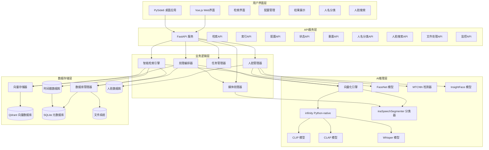

# iFlow CLI 上下文文档 - msearch 项目

## 项目概述

msearch 是一款跨平台的多模态桌面搜索软件，旨在成为用户的"第二大脑"。它允许用户通过自然语言、图片截图或音频片段快速、精准地在本地素材库中定位相关的图片、视频（精确到关键帧）和音频文件，实现"定位到秒"的检索体验。

### 核心价值

- **智能检索**: 无需手动整理、无需添加标签即可实现智能检索
- **跨模态搜索**: 支持用任意模态（文本、图像、音频）检索其他模态内容
- **高精度定位**: 支持毫秒级时间戳精确定位，时间戳精度±2秒要求
- **零配置**: 素材无需整理、无需标签
- **高性能本地推理**: 利用Infinity Python-native模式实现高效向量化
- **松耦合架构**: 数据库与业务逻辑分离，支持未来技术栈更换
- **国内网络优化**: 自动配置国内镜像源，解决网络访问问题
- **人脸识别增强**: 集成先进的人脸检测和识别能力
- **智能音频处理**: 使用inaSpeechSegmenter自动分类音频内容（音乐/语音），基于质量检测过滤低质量片段
- **完整桌面应用**: 基于PySide6的现代化桌面GUI，提供完整的用户体验
- **Web界面支持**: 基于Vue.js + Vite的现代化Web界面
- **测试问题修复**: 提供完整的测试环境问题解决方案，包括GPU驱动兼容性问题修复

## 技术架构

### 核心技术栈

| 层级 | 技术选择 | 核心特性 |
|------|----------|----------|
| **用户界面层** | **PySide6** | 跨平台原生UI，与系统深度集成 |
| **Web界面** | **Vue.js + Vite** | 现代化Web界面，响应式设计 |
| **API服务层** | **FastAPI** | 异步高性能，自动生成OpenAPI文档 |
| **AI推理层** | **michaelfeil/infinity** | 多模型服务引擎，高吞吐量低延迟 |
| **向量存储层** | **Qdrant** | 高性能向量数据库，本地部署，毫秒级检索 |
| **元数据层** | **SQLite** | 轻量级关系数据库，零配置，文件级便携 |
| **依赖管理** | **uv (astral-sh/uv)** | 极速包管理器，比pip快10-100倍 |
| **应用打包** | **Nuitka** | Python编译器，编译为机器码，性能优异 |
| **多模态模型** | **CLIP/CLAP/Whisper** | 专业化模型架构，针对不同模态优化 |
| **人脸识别** | **FaceNet + MTCNN + InsightFace** | 高精度人脸检测和特征提取 |
| **音频分类** | **inaSpeechSegmenter** | 智能音频内容分类（音乐/语音） |
| **媒体处理** | **FFmpeg + OpenCV + Librosa** | 专业级预处理，场景检测+智能切片 |
| **文件监控** | **Watchdog** | 实时增量处理，跨平台文件系统事件 |

### 专业化AI模型架构

| 模态类型 | 模型选择 | 应用场景 | 技术优势 |
|---------|---------|---------|---------|
| **文本-图像** | CLIP | 文本检索图片内容 | 跨模态语义对齐，高精度图像理解 |
| **文本-视频** | CLIP | 文本检索视频内容 | 跨模态语义对齐，精确时间定位 |
| **文本-音频** | CLAP | 文本检索音乐内容 | 专业音频语义理解 |
| **语音-文本** | Whisper | 语音内容转录检索 | 高精度多语言语音识别 |
| **音频分类** | inaSpeechSegmenter | 音频内容智能分类 | 精准区分音乐、语音、噪音 |
| **人脸识别** | FaceNet | 人脸特征提取 | 高精度人脸识别和匹配 |
| **媒体处理** | FFmpeg | 视频场景检测切片 | 专业级媒体预处理能力 |

### 系统架构



## 项目结构

```
msearch/
├── .gitignore
├── IFLOW.md
├── README.md
├── requirements.txt
├── .git/
├── .kiro/
│   └── specs/
│       └── multimodal-search-system/
│           ├── design.md
│           ├── requirements.md
│           └── tasks.md
├── config/
│   └── config.yml
├── data/
│   ├── database/
│   │   └── qdrant/
│   │       └── collection/
│   │           ├── msearch_audio_collection/
│   │           ├── msearch_face_collection/
│   │           ├── msearch_image_collection/
│   │           └── msearch_video_collection/
│   ├── databases/
│   ├── logs/
│   └── models/
│       ├── clap/
│       │   └── .cache/
│       │       └── huggingface/
│       │           └── download/
│       ├── clip/
│       │   └── .cache/
│       │       └── huggingface/
│       │           └── download/
│       ├── .infinity_cache/
│       └── whisper/
│           └── .cache/
│               └── huggingface/
│                   └── download/
├── deploy_test/
│   ├── README.md
│   └── test_file_monitoring.py
├── docs/
│   ├── api_documentation.md
│   ├── design.md
│   ├── development_plan.md
│   ├── requirements.md
│   ├── technical_implementation.md
│   ├── test_strategy.md
│   └── user_manual.md
├── examples/
│   ├── media_preprocessing_example.py
│   └── time_accurate_retrieval_demo.py
├── scripts/
│   ├── download_all_resources.sh
│   ├── fix_infinity_emb.sh
│   ├── install_auto.sh
│   ├── install_offline.sh
│   ├── integration_test_with_infinity.sh
│   ├── setup_models.py
│   ├── setup_test_environment.py
│   ├── start_infinity_services.sh
│   └── stop_infinity_services.sh
├── src/
│   ├── __init__.py
│   ├── api/
│   │   ├── __init__.py
│   │   ├── main.py         # FastAPI主应用
│   │   ├── middleware/
│   │   │   ├── __init__.py
│   │   │   ├── cors.py
│   │   │   ├── error_handler.py
│   │   │   └── __pycache__/
│   │   ├── models/
│   │   │   ├── __init__.py
│   │   │   ├── common_models.py
│   │   │   ├── config_models.py
│   │   │   ├── search_models.py
│   │   │   └── __pycache__/
│   │   └── routes/
│   │       ├── __init__.py
│   │       ├── config.py   # 配置API
│   │       ├── face.py     # 人脸识别API
│   │       ├── monitoring.py # 监控API
│   │       ├── search.py   # 检索API
│   │       ├── status.py   # 状态API
│   │       ├── tasks.py    # 任务控制API
│   │       └── __pycache__/
│   ├── business/
│   │   ├── __init__.py
│   │   ├── embedding_engine.py   # 向量化引擎
│   │   ├── face_cluster_manager.py # 人脸聚类管理器
│   │   ├── face_manager.py       # 人脸管理器
│   │   ├── face_model_manager.py # 人脸模型管理器
│   │   ├── file_monitor.py       # 文件监控服务
│   │   ├── load_balancer.py      # 负载均衡器
│   │   ├── media_processor.py    # 媒体处理器
│   │   ├── multimodal_fusion_engine.py # 多模态融合引擎
│   │   ├── orchestrator.py       # 处理编排器
│   │   ├── search_engine.py      # 搜索引擎
│   │   ├── smart_retrieval.py      # 智能检索引擎
│   │   ├── task_manager.py       # 任务管理器
│   │   ├── temporal_localization_engine.py # 时序定位引擎
│   │   ├── time_accurate_retrieval.py      # 时间戳精确检索引擎
│   │   ├── video_audio_stream_processor.py # 视频音频流处理器
│   │   └── __pycache__/
│   ├── core/
│   │   ├── __init__.py
│   │   ├── config_manager.py     # 配置管理器
│   │   ├── config.py             # 配置类定义
│   │   ├── file_type_detector.py # 文件类型检测器
│   │   ├── infinity_manager.py   # Infinity服务管理器
│   │   ├── logger_manager.py     # 日志管理器
│   │   ├── logging_config.py     # 日志配置
│   │   └── __pycache__/
│   ├── gui/                # 桌面GUI应用
│   │   ├── __init__.py
│   │   ├── api_client.py   # API客户端
│   │   ├── app.py          # GUI应用主类
│   │   ├── gui_main.py     # GUI入口点
│   │   ├── main_window.py  # 主窗口
│   │   ├── main.py         # GUI启动脚本
│   │   ├── search_worker.py # 搜索工作器
│   │   ├── theme_manager.py # 主题管理器
│   │   └── widgets/        # 界面组件
│   │       ├── config_widget.py # 配置组件
│   │       ├── face_recognition_widget.py # 人脸识别组件
│   │       ├── file_manager_widget.py # 文件管理组件
│   │       ├── search_widget.py # 搜索组件
│   │       ├── side_bar_widget.py # 侧边栏组件
│   │       ├── status_bar_widget.py # 状态栏组件
│   │       ├── system_monitor_widget.py # 系统监控组件
│   │       └── timeline_widget.py # 时间线组件
│   ├── processors/         # 专业处理器
│   │   ├── __init__.py
│   │   ├── audio_classifier.py   # 音频分类器
│   │   ├── audio_processor.py    # 音频处理器
│   │   ├── image_processor.py    # 图像处理器
│   │   ├── media_processor.py    # 媒体处理器
│   │   ├── text_processor.py     # 文本处理器
│   │   ├── timestamp_processor.py # 时间戳处理器
│   │   ├── video_audio_stream_processor.py # 视频音频流处理器
│   │   └── video_processor.py    # 视频处理器
│   ├── storage/            # 存储层
│   │   ├── __init__.py
│   │   ├── database.py           # 数据库连接
│   │   ├── db_adapter.py         # 数据库适配器
│   │   ├── face_database.py      # 人脸数据库管理
│   │   ├── timestamp_database.py # 时间戳数据库
│   │   └── vector_store.py       # Qdrant向量数据库客户端
│   ├── utils/              # 工具函数
│   │   └── __init__.py
│   └── webui/              # Web用户界面
│       ├── index.html          # 主页面
│       ├── package.json        # 前端依赖
│       ├── README.md           # WebUI说明
│       ├── vite.config.js      # Vite配置
│       └── src/                # Vue.js源码
│           ├── App.vue         # 根组件
│           ├── main.js         # 入口文件
│           ├── components/     # 组件目录
│           │   ├── ResultDetailDialog.vue # 结果详情对话框
│           │   └── TimelinePlayer.vue # 时间线播放器
│           ├── router/         # 路由配置
│           │   └── index.js    # 路由配置文件
│           ├── utils/          # 工具函数
│           │   └── api.js      # API工具函数
│           └── views/          # 页面视图
│               ├── ConfigView.vue # 配置视图
│               ├── FaceRecognitionView.vue # 人脸识别视图
│               ├── FileManagerView.vue # 文件管理视图
│               ├── SearchView.vue # 搜索视图
│               └── TimelineView.vue # 时间线视图
├── temp/
├── testdata/
└── venv/
```

## 核心组件

### 1. 处理编排器 (Orchestrator)

处理编排器是系统的核心组件，负责协调各专业处理模块的调用顺序和数据流转：

- **策略路由**: 根据文件类型选择处理策略
- **流程编排**: 管理预处理→向量化→存储的调用顺序
- **状态管理**: 跟踪处理进度、状态转换和错误恢复
- **资源协调**: 协调CPU/GPU资源分配
- **批处理编排**: 智能组织批处理任务
- **文件删除处理**: 处理文件删除的完整流程，包括向量数据清理
- **严格场景检测**: 实现视频场景检测阈值0.15（比默认0.4更严格），最大切片时长5秒
- **视频音频分离**: 自动检测并分离视频中的音频轨道，进行独立处理

### 2. 时间戳精确检索引擎 (TimeAccurateRetrieval)

专门用于实现±2秒精度时间戳检索的核心引擎：

- **精确时间检索**: 实现±2秒精度的视频片段检索
- **多模态同步**: 同步视频、音频等多模态数据的时间戳
- **时间线生成**: 生成连续的时间线数据用于可视化
- **精度验证**: 验证检索结果的时间精度是否符合要求
- **连续性检测**: 检测时间线的连续性和完整性
- **时间戳合并**: 自动合并重叠或相邻的时间段
- **UUID解析**: 动态换算向量UUID到源文件UUID，返回源文件信息而非切片信息

### 3. 向量化引擎 (EmbeddingEngine)

专业化多模态向量化引擎，使用Infinity Python-native模式：

- **CLIP模型**: 文本-图像/视频检索
- **CLAP模型**: 文本-音乐检索  
- **Whisper模型**: 语音转文本检索
- **智能模型选择**: 根据硬件环境自动选择最优模型
- **批处理优化**: 提升GPU利用率
- **Python-native模式**: 直接内存调用，避免HTTP序列化开销
- **音频智能处理**: 使用inaSpeechSegmenter自动分类音频内容并进行质量过滤

### 4. 人脸模型管理器 (FaceModelManager)

人脸识别和特征提取引擎：

- **MTCNN检测器**: 高精度人脸检测
- **FaceNet模型**: 人脸特征向量提取
- **InsightFace模型**: 增强的人脸识别能力
- **人脸数据库**: 人脸特征向量存储
- **相似度匹配**: 人脸特征对比和识别
- **批量处理**: 支持批量人脸检测和特征提取

### 5. 智能检索引擎 (SmartRetrieval)

智能检索和结果融合：

- **查询类型识别**: 自动识别查询意图（人名、音频、视觉、通用）
- **动态权重分配**: 根据查询类型调整模型权重
- **多模态融合**: 融合不同模型的检索结果
- **时序定位**: 精确定位视频/音频中的相关片段
- **人脸预检索**: 针对人名查询启用人脸预检索生成文件白名单
- **UUID解析集成**: 集成resolve_to_source_file和resolve_video_location功能
- **时间戳精度查询**: 集成TimestampDatabase，返回±2.5秒时间范围

### 6. 负载均衡器 (LoadBalancer)

资源调度和负载管理：

- **GPU资源调度**: 智能分配GPU计算资源
- **并发控制**: 管理并发处理任务
- **健康检查**: 监控服务状态和性能
- **故障转移**: 自动处理服务故障

### 7. 时间戳处理器 (TimestampProcessor)

专门处理时间戳数据的组件：

- **时间戳信息**: 管理时间戳数据结构和元信息
- **时间精度**: 确保时间戳精度符合±2秒要求
- **同步处理**: 处理多模态数据的时间同步
- **漂移校正**: 检测和校正时间漂移

### 8. 视频音频流处理器 (VideoAudioStreamProcessor)

处理媒体流数据的组件：

- **流信息提取**: 提取视频和音频流的基本信息
- **场景检测**: 检测视频中的场景变化
- **音频分类**: 对音频内容进行分类（音乐/语音）
- **流同步**: 同步视频和音频流的时间戳
- **质量验证**: 验证流同步质量
- **音频分离**: 从视频中分离音频轨道进行独立处理

### 9. Web用户界面 (WebUI)

基于Vue.js + Vite的现代化Web界面：

- **现代化界面**: 响应式设计，支持多设备访问
- **完整功能模块**: 搜索、配置、文件管理、人脸识别、时间线等
- **组件化架构**: 使用Element Plus UI组件库
- **路由管理**: 基于Vue Router的页面导航

## 工作流程

### 离线处理/索引流程

1. 文件监控服务检测新文件或用户手动提交文件索引请求
2. 处理编排器(Orchestrator)协调整个处理流程
3. 文件信息存入 SQLite 数据库，状态设为待处理
4. 媒体预处理器对文件进行切片处理
   - 视频处理：先分离音频轨道，再进行严格场景检测（阈值0.15）切片，最大时长5秒
   - 每个视频片段只提取1帧（中间帧）代表整个片段
   - 音频内容使用inaSpeechSegmenter分类后处理
5. 模型管理器将切片转换为向量
6. 向量存储服务将向量存入 Qdrant
7. 人脸模型管理器检测和提取人脸特征
8. 媒体片段信息存入时间戳数据库和 SQLite 数据库
9. 文件状态更新为已完成

### 在线检索流程

1. 用户通过 API 或 WebUI 提交查询（文本/图像/音频）
2. 智能检索引擎(SmartRetrievalEngine)分析查询类型并计算动态权重
3. 模型管理器将查询转换为向量
4. 向量存储服务在 Qdrant 中搜索相似向量
5. 时序定位引擎精确定位相关时间片段
6. 时间戳精确检索引擎验证±2秒精度要求并解析UUID到源文件
7. 多模态融合引擎合并不同模型的检索结果
8. 根据向量ID查询 SQLite 获取文件和片段信息
9. 结果聚合后返回给用户（包含源文件信息而非切片信息）

### 人脸识别流程

1. 媒体处理过程中检测到人脸
2. MTCNN检测器定位人脸区域
3. FaceNet/InsightFace模型提取人脸特征向量
4. 人脸特征向量存储到人脸数据库
5. 与已知人名档案进行比对
6. 将分类结果存入数据库
7. 支持用户反馈和模型优化

### 人脸搜索流程

1. 用户通过人脸API提交人名或人脸图像
2. 对于人名搜索，直接查询数据库中的人名分类记录
3. 对于人脸图像搜索，人脸模型管理器将图像转换为向量
4. 向量存储服务在 Qdrant 中搜索相似人脸向量
5. 根据向量ID查询 SQLite 获取文件和片段信息
6. 结果聚合后返回给用户

### 智能音频处理流程

1. 媒体处理过程中检测到音频内容
2. inaSpeechSegmenter自动分类音频片段（音乐/语音）
3. 计算音频质量分数并过滤低质量片段
4. 音乐片段使用CLAP模型向量化
5. 语音片段使用Whisper转录后向量化
6. 向量存储服务将向量存入 Qdrant
7. 支持基于音频内容的跨模态检索

## 智能检索策略

### 查询类型识别

智能检索引擎能够自动识别查询类型：
- **人名查询**: 检测查询中的人名并启用人脸预检索
- **音频查询**: 根据关键词识别音乐或语音查询
- **视觉查询**: 识别视觉相关关键词
- **混合查询**: 默认的综合检索模式

### 动态权重分配

根据不同查询类型动态调整各模态权重：
- **人名查询**: 视觉模态主导(50%)，音频模态辅助(25%)
- **音乐查询**: CLAP模型权重最高(70%)
- **语音查询**: Whisper模型权重最高(70%)
- **视觉查询**: CLIP模型权重最高(70%)
- **默认查询**: 均衡权重分配

### 文件白名单机制

针对人名查询，系统会先进行人脸预检索生成文件白名单，缩小搜索范围，提高检索效率。

## 数据库存储设计

### 数据库表结构更新

#### 主要表结构变更

| 表名 | 新增字段 | 字段说明 |
|------|---------|---------|
| files | file_category | 文件分类(source/processed/derived/thumbnail) |
| files | source_file_id | 源文件UUID，用于关联源文件 |
| files | can_delete | 标记文件是否可删除，用于预处理文件管理 |
| video_segments | segment_id | 切片唯一标识 |
| video_segments | file_uuid | 源视频文件UUID |
| video_segments | segment_index | 按原始视频时序的片段序号 |
| video_segments | start_time | 切片在原始视频中的起始时间 |
| video_segments | end_time | 切片在原始视频中的结束时间 |
| video_segments | duration | 切片时长 |
| video_segments | scene_boundary | 是否为场景边界切片 |
| video_segments | has_audio | 标记是否有音频 |
| file_relationships | id | 关系唯一标识 |
| file_relationships | source_file_id | 源文件UUID |
| file_relationships | derived_file_id | 派生文件UUID |
| file_relationships | relationship_type | 关系类型(audio_from_video等) |

### 核心表结构

| 表名 | 主要字段 | 用途 |
|------|---------|------|
| files | id, file_path, file_type, file_size, file_hash, file_category, source_file_id, can_delete, created_at, indexed_at, status | 文件基础信息 |
| video_segments | segment_id, file_uuid, segment_index, start_time, end_time, duration, scene_boundary, has_audio | 视频片段信息 |
| tasks | id, file_id, task_type, status, progress, error_message, created_at, updated_at | 处理任务信息 |
| file_relationships | id, source_file_id, derived_file_id, relationship_type, created_at | 文件关联关系 |
| persons | id, name, aliases, created_at | 人物信息 |
| file_faces | id, file_id, person_id, timestamp, confidence | 人脸检测结果 |

### Qdrant向量集合设计

| 集合名称 | 向量维度 | 距离算法 | Payload字段 | 用途 |
|---------|---------|---------|------------|------|
| image_vectors | 512 | Cosine | file_id, file_path, file_type | 存储图像向量 |
| video_vectors | 512 | Cosine | file_uuid, segment_id, absolute_timestamp | 存储视频帧向量 |
| audio_vectors | 512 | Cosine | file_id, audio_type, start_time, end_time | 存储音频向量 |
| face_vectors | 512 | Cosine | file_id, person_id, person_name, timestamp | 存储人脸向量 |

### 视频时间戳处理机制

#### 核心数据结构

**video_segments表（视频切片元数据）**:

| 字段名 | 类型 | 说明 | 示例值 |
|-------|------|------|--------|
| segment_id | UUID | 切片唯一标识 | "seg-001" |
| file_uuid | UUID | 原始视频唯一标识 | "video-abc123" |
| segment_index | Integer | 按原始视频时序的片段序号（从0开始） | 0, 1, 2... |
| start_time | Float | 在原始视频中的起始时间(秒) | 0.0, 120.5, 245.3 |
| end_time | Float | 在原始视频中的结束时间(秒) | 120.5, 245.3, 360.0 |
| duration | Float | 片段时长(秒) = end_time - start_time | 120.5, 124.8, 114.7 |
| scene_boundary | Boolean | 是否为场景边界切片 | true/false |

**video_vectors的Payload结构（向量存储）**:

| 字段名 | 类型 | 说明 | 示例值 |
|-------|------|------|--------|
| file_uuid | UUID | 原始视频唯一标识 | "video-abc123" |
| segment_id | UUID | 切片唯一标识 | "seg-001" |
| absolute_timestamp | Float | **帧在原始视频中的绝对时间(秒，预计算存储)** | 0.0, 2.5, 5.0... |

### UUID解析和源文件定位

#### resolve_to_source_file函数

动态换算向量UUID到源文件UUID的函数，确保返回源文件信息而非切片信息。

#### resolve_video_location函数

解析视频切片位置信息，计算±2.5秒的时间范围给用户。

## 依赖管理

项目依赖通过requirements.txt管理：

### 核心依赖
- torch==2.2.0, torchvision==0.17.0 - PyTorch深度学习框架 (稳定版本)
- transformers>=4.35.0 - Hugging Face Transformers (新模型支持)
- numpy>=1.24.0, pandas>=2.0.0 - 科学计算
- fastapi>=0.104.0, uvicorn>=0.23.0 - Web框架 (安全修复)
- pydantic>=2.5.0 - 数据验证 (稳定性提升)
- starlette>=0.27.0 - FastAPI核心依赖
- httpx>=0.25.0, requests>=2.31.0 - HTTP客户端 (安全修复)
- aiohttp>=3.8.0, aiofiles>=23.0.0 - 异步文件操作 (文件上传必需)
- python-multipart>=0.0.6 - 文件上传支持 (FastAPI必需)

### 数据库和存储
- sqlalchemy>=2.0.0 - SQL ORM框架
- qdrant-client>=1.6.0 - Qdrant向量数据库客户端

### 媒体处理
- pillow>=10.1.0 - 图像处理 (安全修复)
- opencv-python>=4.8.0 - 计算机视觉
- librosa>=0.10.0, soundfile>=0.12.0 - 音频处理
- pydub>=0.25.0 - 音频格式转换
- ffmpeg-python>=0.2.0 - FFmpeg Python绑定 (视频处理)
- scikit-image>=0.21.0 - 高级图像处理

### 科学计算和机器学习
- scipy>=1.10.0 - 科学计算库
- scikit-learn>=1.3.0 - 机器学习库

### AI模型相关
- openai-whisper>=20230314 - 语音识别
- inaspeechsegmenter>=0.0.9 - 音频内容分析
- facenet-pytorch>=2.5.0 - 人脸识别
- mtcnn>=0.1.1 - 人脸检测
- insightface>=0.7.0 - 人脸分析
- sentence-transformers>=2.2.0 - 多语言文本嵌入
- infinity-emb[all]>=0.0.20 - 统一向量嵌入服务
- optimum[onnxruntime]>=1.14.0 - ONNX运行时优化 (infinity-emb性能优化)
- accelerate>=0.20.0 - 模型加速库 (infinity-emb GPU支持)

### GUI和Web界面
- PySide6>=6.0.0 - 桌面应用GUI框架
- WebUI使用Vue.js, Vue Router, Axios, Element Plus等前端技术栈

### 系统工具和监控
- watchdog>=3.0.0 - 文件系统监控
- psutil>=5.9.0 - 系统资源监控
- tqdm>=4.65.0 - 进度条显示
- colorama>=0.4.0 - 彩色终端输出
- pyyaml>=6.0.1 - YAML配置解析 (安全修复)
- python-dotenv>=1.0.0 - 环境变量管理
- chardet>=5.0.0 - 字符编码检测
- python-magic>=0.4.0 - 文件类型检测

## 启动和运行

### 环境配置

```bash
# 安装依赖
pip install -r requirements.txt

# 或使用国内镜像源
pip install -r requirements.txt -i https://pypi.tuna.tsinghua.edu.cn/simple
```

### 下载离线资源

```bash
# 下载所有离线资源
bash scripts/download_all_resources.sh

# 或使用自动安装脚本
bash scripts/install_auto.sh
```

### 启动服务

```bash
# Linux/macOS 启动Infinity服务
bash scripts/start_infinity_services.sh

# Windows 启动Infinity服务
scripts\start_infinity_services.bat

# 启动API服务（主项目）
python src/api/main.py

# 启动桌面GUI应用
python src/gui/main.py

# 启动WebUI（在src/webui目录下）
cd src/webui
npm install
npm run dev

# 运行时间戳精确检索演示
python examples/time_accurate_retrieval_demo.py
```

### 服务端口配置

- **API服务**: 127.0.0.1:8000
- **Qdrant数据库**: 127.0.0.1:6333
- **Infinity服务**: 
  - CLIP: 7997
  - CLAP: 7998  
  - Whisper: 7999
- **WebUI**: 127.0.0.1:5173 (Vite开发服务器)

### 配置管理

系统支持详细的配置管理，所有配置项集中在 `config/config.yml` 文件中。配置文件包含以下主要部分：

- **基础系统配置**: 日志级别、数据目录、监控目录等
- **功能开关配置**: 人脸识别、音频处理、视频处理等功能开关
- **AI模型配置**: 模型存储路径、设备分配等
- **向量存储配置**: 存储向量类型、文本向量策略等
- **文件处理配置**: 支持格式、预处理参数、时间戳处理等
- **人脸识别配置**: 检测和匹配参数
- **智能检索配置**: 查询路由、权重分配等
- **数据库配置**: SQLite和Qdrant连接参数
- **Infinity服务配置**: 服务地址和端口
- **API服务配置**: 端点配置和CORS设置
- **性能优化配置**: GPU内存管理、批处理优化等
- **日志系统配置**: 多级别日志输出和格式设置

## 开发实践

### 代码规范

- 使用类型注解
- 遵循 PEP 8 代码风格
- 使用 black 进行代码格式化
- 使用 mypy 进行类型检查
- 使用 flake8 进行代码质量检查

### 测试策略

- 单元测试使用 pytest
- 异步测试支持
- 覆盖率报告
- 集成测试框架
- Mock技术隔离外部依赖

### 配置管理

所有可配置项集中在 `config/config.yml` 文件中，支持不同环境的配置。主要配置包括：

- **系统配置**: 日志级别、工作线程数、数据目录
- **数据库配置**: SQLite和Qdrant连接参数
- **Infinity服务**: 模型配置、端口设置、设备分配
- **媒体处理**: 视频/音频处理参数
- **人脸识别**: 检测和匹配参数
- **智能检索**: 权重配置和关键词识别
- **音频处理**: inaSpeechSegmenter配置和质量检测参数
- **时间戳处理**: 精确时间戳处理参数和精度要求
- **WebUI配置**: 前端相关配置

### 日志系统

- 详细的错误定位信息（包含模块名、函数名和行号）
- 独立的错误日志文件，便于问题排查
- 访问日志记录所有HTTP请求
- 性能指标日志帮助优化系统性能
- 可配置的日志级别和格式
- 自动日志轮转防止日志文件过大
- 多级别日志配置（DEBUG/INFO/WARNING/ERROR/CRITICAL）
- 专门的时间戳处理日志用于调试时间精度问题

## 硬件自适应

系统根据硬件环境自动选择最优模型：
- CUDA环境：高性能模型（需要NVIDIA GPU和CUDA支持）
- OpenVINO环境：中等性能模型（适用于Intel硬件）
- CPU环境：基础性能模型（资源占用较低）

## 部署方案

### 国内镜像优化部署

项目支持国内镜像优化部署：
- 使用 https://pypi.tuna.tsinghua.edu.cn/simple 作为PyPI镜像
- 使用 https://hf-mirror.com 作为HuggingFace镜像
- 使用 https://kkgithub.com/ 作为GitHub镜像

### 离线部署

项目支持完整的离线部署：
- 离线资源下载脚本（`scripts/download_all_resources.sh`）
- 一键部署脚本（`scripts/install_auto.sh`）
- 预下载模型文件和依赖包
- 本地Qdrant二进制文件包含

### 绿色安装部署

项目支持绿色安装部署：
- 所有依赖和模型可离线下载
- 无需网络连接即可完成部署
- 支持断点续传和增量下载

## 测试和质量保证

### 测试要求

1. **分层测试**：单元测试→集成测试→系统测试的完整测试体系
2. **核心功能自动化测试覆盖率≥80%**：确保核心功能质量
3. **性能导向**：关键路径性能测试必须通过
4. **持续集成**：每次代码提交触发自动测试
5. **时间戳精度测试**：需达到±2秒要求
6. **多模态检索功能完整性测试**：确保跨模态检索功能正常
7. **配置管理器功能测试**：验证配置加载和管理功能
8. **各组件初始化和依赖注入验证**：确保系统启动正常
9. **API端点功能测试**：验证所有API接口功能
10. **文件处理完整流程测试**：确保文件处理流程完整

### 测试基础设施

- **单元测试**: 使用pytest框架，覆盖核心功能
- **集成测试**: 验证组件间协作
- **覆盖率报告**: 确保代码质量
- **持续集成**: GitHub Actions自动化测试
- **基本结构测试**: 验证模块导入和基本实例化
- **时间戳精度测试**: 专门验证±2秒精度要求
- **真实数据测试**: 使用真实媒体文件进行测试
- **GPU/CPU环境适配测试**: 验证不同硬件环境下的兼容性

### 测试问题解决方案

项目提供完整的测试环境问题解决方案：

#### GPU驱动问题解决
- GPU驱动诊断工具
- PyTorch CUDA版本匹配检查
- 自动化修复脚本

#### 库版本兼容性解决
- 依赖版本冲突检测
- 自动降级/升级方案
- CPU版本替代方案

#### 测试环境配置
- CPU专用配置文件（config_cpu.yml）
- 环境隔离方案
- 批量测试修复脚本

### 部署和迁移测试

项目具备完整的部署和迁移测试能力：
- 离线资源下载脚本（支持Windows和Linux）
- 支持环境变量注入功能测试
- 支持跨平台迁移兼容性测试
- 支持不同硬件环境（CPU/GPU）适配测试
- 提供完整的问题诊断和修复工具

## 新增功能和工具

### 完整的桌面GUI应用
- **现代化界面**: 基于PySide6的跨平台桌面应用
- **完整功能模块**: 搜索、配置、文件管理、人脸识别、时间线等
- **主题管理**: 支持多主题切换和界面定制
- **响应式设计**: 适配不同屏幕尺寸和分辨率

### Web用户界面
- **现代化界面**: 基于Vue.js + Vite的Web界面
- **完整功能模块**: 搜索、配置、文件管理、人脸识别、时间线等
- **响应式设计**: 适配不同设备访问
- **组件化架构**: 使用Element Plus UI组件库

### 增强的测试基础设施
- **全面的测试覆盖**: 单元测试、集成测试、系统测试
- **时间戳精度测试**: 专门验证±2秒精度要求
- **真实数据测试**: 使用真实媒体文件进行测试
- **GPU/CPU环境适配**: 自动检测和适配不同硬件环境

### 测试问题解决方案
- **自动化修复脚本**: 一键诊断和修复常见测试问题
- **GPU驱动兼容性**: 解决Windows环境下GPU驱动冲突
- **库版本管理**: 自动处理依赖版本冲突
- **CPU替代方案**: 提供完整的CPU运行环境

### 增强的配置管理
- **多环境配置**: 支持开发、测试、生产环境配置
- **动态配置加载**: 支持运行时配置更新
- **配置验证**: 自动验证配置文件正确性
- **CPU专用配置**: 针对无GPU环境的优化配置

### 完善的日志系统
- **多级别日志**: DEBUG/INFO/WARNING/ERROR/CRITICAL
- **分类日志存储**: 主日志、错误日志、性能日志、时间戳日志
- **日志监控**: 自动监控错误率和性能指标
- **开发/生产模式**: 不同环境下的日志优化配置

### 桌面GUI应用完善

基于PySide6的现代化桌面应用，提供完整的用户界面：

#### 主要组件
- **主窗口** (main_window.py): 完整的桌面应用框架
- **搜索组件** (search_widget.py): 多模态搜索界面
- **配置组件** (config_widget.py): 系统配置管理界面
- **人脸识别组件** (face_recognition_widget.py): 人脸搜索和管理
- **文件管理组件** (file_manager_widget.py): 文件浏览和管理
- **时间线组件** (timeline_widget.py): 时间轴浏览和导航
- **侧边栏组件** (side_bar_widget.py): 功能导航
- **状态栏组件** (status_bar_widget.py): 系统状态显示
- **系统监控组件** (system_monitor_widget.py): 系统资源监控
- **主题管理器** (theme_manager.py): 界面主题管理

#### 功能特性
- 跨平台原生界面
- 拖拽文件支持
- 实时搜索结果展示
- 多线程搜索处理
- 响应式界面设计

### Web用户界面完善

基于Vue.js + Vite的现代化Web界面，提供完整的用户界面：

#### 主要视图
- **搜索视图**: 多模态搜索界面
- **配置视图**: 系统配置管理界面
- **人脸识别视图**: 人脸搜索和管理
- **文件管理视图**: 文件浏览和管理
- **时间线视图**: 时间轴浏览和导航

#### 核心组件
- **结果详情对话框**: 详细显示搜索结果
- **时间线播放器**: 可交互的时间线播放器
- **API工具函数**: 封装了与后端API的交互逻辑

### 时间戳精确检索功能

系统实现了±2秒精度的时间戳检索功能，具备以下特性：

#### 时间戳处理引擎
- **精确时间检索**: 实现±2秒精度的视频片段检索
- **多模态同步**: 同步视频、音频等多模态数据的时间戳
- **时间线生成**: 生成连续的时间线数据用于可视化
- **精度验证**: 验证检索结果的时间精度是否符合要求
- **连续性检测**: 检测时间线的连续性和完整性
- **时间戳合并**: 自动合并重叠或相邻的时间段
- **UUID解析**: 动态换算向量UUID到源文件UUID，返回源文件信息

#### 流处理功能
- **视频音频流处理器**: 处理媒体流数据，提取时间戳信息
- **场景检测**: 检测视频中的场景变化
- **音频分类**: 对音频内容进行分类（音乐/语音）
- **流同步**: 同步视频和音频流的时间戳
- **质量验证**: 验证流同步质量
- **音频分离**: 从视频中分离音频轨道进行独立处理

## 未来规划

1. 持续完善桌面GUI应用功能和用户体验
2. 增强人脸分类和识别功能
3. 优化性能和资源使用效率
4. 支持更多媒体格式和编解码器
5. 实现命令行接口工具
6. 进一步完善测试覆盖率和自动化
7. 增强跨平台兼容性和稳定性
8. 实现智能标签和自动分类功能
9. 支持多语言界面国际化
10. 增加数据备份和恢复功能
11. 完善WebUI功能和用户体验
12. 集成更多AI模型和功能
13. 实现分布式部署支持
14. 添加用户行为分析和推荐功能

---

*最后更新: 2025-11-21*