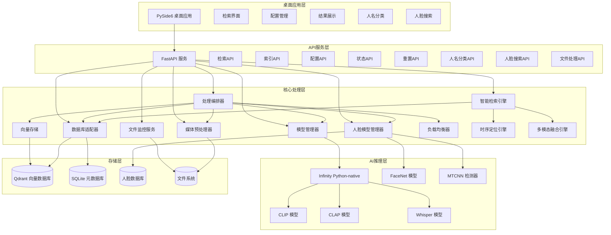

# iFlow CLI 上下文文档 - msearch 项目

## 项目概述

msearch 是一款跨平台的多模态桌面搜索软件，旨在成为用户的"第二大脑"。它允许用户通过自然语言、图片截图或音频片段快速、精准地在本地素材库中定位相关的图片、视频（精确到关键帧）和音频文件，实现"定位到秒"的检索体验。

### 核心价值

- **智能检索**: 无需手动整理、无需添加标签即可实现智能检索
- **跨模态搜索**: 支持用任意模态（文本、图像、音频）检索其他模态内容
- **高精度定位**: 支持毫秒级时间戳精确定位
- **零配置**: 素材无需整理、无需标签
- **高性能本地推理**: 利用Infinity Python-native模式实现高效向量化
- **松耦合架构**: 数据库与业务逻辑分离，支持未来技术栈更换
- **国内网络优化**: 自动配置国内镜像源，解决网络访问问题
- **人脸识别增强**: 集成先进的人脸检测和识别能力

## 技术架构

### 核心技术栈

| 层级 | 技术选择 | 核心特性 |
|------|----------|----------|
| **桌面应用** | **PySide6** | 跨平台原生UI，与系统深度集成 |
| **API网关** | **FastAPI** | 异步高性能，自动生成OpenAPI文档 |
| **向量引擎** | **Infinity Python-native** | 零HTTP开销推理，直接内存调用 |
| **多模态模型** | **CLIP/CLAP/Whisper** | 专业化模型架构，针对不同模态优化 |
| **人脸识别** | **FaceNet + MTCNN** | 高精度人脸检测和特征提取 |
| **向量数据库** | **Qdrant** | Rust高性能存储，本地部署，毫秒级检索 |
| **元数据存储** | **SQLite** | ACID事务支持，零配置，文件级便携 |
| **媒体处理** | **FFmpeg + OpenCV + Librosa** | 专业级预处理，场景检测+智能切片 |
| **文件监控** | **Watchdog** | 实时增量处理，跨平台文件系统事件 |

### 系统架构



## 项目结构

```
msearch/
├── .coveragerc             # 测试覆盖率配置
├── .gitignore              # Git忽略文件
├── IFLOW.md                # iFlow CLI上下文文档
├── requirements.txt        # Python依赖清单
├── config/                 # 配置文件目录
│   ├── config.yml          # 主配置文件
│   └── face_retrieval.yml  # 人脸检索配置文件
├── data/                   # 数据目录
│   ├── db/                 # SQLite数据库文件
│   ├── temp/               # 临时文件目录
│   └── thumbnails/         # 缩略图目录
├── deploy_test/            # 部署测试目录
├── docs/                   # 文档目录
│   ├── config_management_guide.md # 配置管理指南
│   ├── deployment_guide.md # 部署指南
│   ├── design.md           # 系统设计文档
│   ├── development_plan.md # 开发计划文档
│   ├── processing_orchestrator.md # 处理编排器文档
│   ├── requirements.md     # 需求文档
│   ├── technical_reference.md # 技术参考文档
│   └── test_strategy.md    # 测试策略文档
├── offline/                # 离线资源目录
│   ├── models/             # 预训练模型
│   └── packages/           # Python依赖包
├── scripts/                # 脚本目录
│   ├── deploy_msearch.sh   # 部署脚本
│   ├── download_model_resources.sh # 离线资源下载脚本
│   └── test_download.sh    # 下载测试脚本
├── src/                    # 源代码目录
│   ├── api/                # API服务层
│   │   └── main.py         # FastAPI主应用
│   ├── core/               # 核心组件
│   │   ├── config_manager.py     # 配置管理器
│   │   ├── config.py             # 配置类定义
│   │   ├── database.py           # 数据库连接
│   │   ├── db_adapter.py         # 数据库适配器
│   │   ├── file_type_detector.py # 文件类型检测器
│   │   ├── infinity_manager.py   # Infinity服务管理器
│   │   ├── load_balancer.py      # 负载均衡器
│   │   ├── logging_config.py     # 日志配置
│   │   ├── multimodal_fusion_engine.py # 多模态融合引擎
│   │   ├── processing_orchestrator.py  # 处理编排器
│   │   ├── smart_retrieval.py    # 智能检索引擎
│   │   └── temporal_localization_engine.py # 时序定位引擎
│   ├── gui/                # 桌面GUI应用
│   │   ├── api_client.py   # API客户端
│   │   ├── app.py          # GUI应用
│   │   ├── main_window.py  # 主窗口
│   │   ├── search_worker.py # 搜索工作器
│   │   └── widgets/        # 界面组件
│   ├── models/             # 模型相关组件
│   │   ├── face_database.py      # 人脸数据库
│   │   ├── face_model_manager.py # 人脸模型管理器
│   │   ├── model_manager.py      # 模型管理器
│   │   └── vector_store.py       # 向量存储
│   └── services/           # 服务层组件
│       ├── file_monitor.py       # 文件监控服务
│       └── media_processor.py    # 媒体预处理器
├── tests/                  # 测试目录
│   ├── unit/               # 单元测试
│   │   ├── test_file_type_detector.py
│   │   ├── test_load_balancer.py
│   │   └── test_processing_orchestrator.py
│   ├── conftest.py         # 测试配置
│   ├── run_tests.py        # 测试运行脚本
│   └── README.md           # 测试说明
├── testdata/               # 测试数据目录
└── webui/                  # Web用户界面
    ├── index.html          # 主页面
    ├── package.json        # 前端依赖
    ├── vite.config.js      # Vite配置
    └── src/                # Vue.js源码
        ├── App.vue         # 根组件
        ├── main.js         # 入口文件
        ├── assets/         # 静态资源
        ├── components/     # 组件目录
        ├── router/         # 路由配置
        ├── store/          # 状态管理
        ├── utils/          # 工具函数
        └── views/          # 页面视图
```

## 核心组件

### 1. 处理编排器 (ProcessingOrchestrator)

处理编排器是系统的核心组件，负责协调各专业处理模块的调用顺序和数据流转：

- **策略路由**: 根据文件类型选择处理策略
- **流程编排**: 管理预处理→向量化→存储的调用顺序
- **状态管理**: 跟踪处理进度、状态转换和错误恢复
- **资源协调**: 协调CPU/GPU资源分配
- **批处理编排**: 智能组织批处理任务

### 2. 模型管理器 (ModelManager)

专业化多模态向量化引擎：

- **CLIP模型**: 文本-图像/视频检索
- **CLAP模型**: 文本-音乐检索
- **Whisper模型**: 语音转文本检索
- **智能模型选择**: 根据硬件环境自动选择最优模型
- **批处理优化**: 提升GPU利用率

### 3. 人脸模型管理器 (FaceModelManager)

人脸识别和特征提取引擎：

- **MTCNN检测器**: 高精度人脸检测
- **FaceNet模型**: 人脸特征向量提取
- **人脸数据库**: 人脸特征向量存储
- **相似度匹配**: 人脸特征对比和识别
- **批量处理**: 支持批量人脸检测和特征提取

### 4. 智能检索引擎 (SmartRetrieval)

智能检索和结果融合：

- **查询类型识别**: 自动识别查询意图
- **动态权重分配**: 根据查询类型调整模型权重
- **多模态融合**: 融合不同模型的检索结果
- **时序定位**: 精确定位视频/音频中的相关片段

### 5. 负载均衡器 (LoadBalancer)

资源调度和负载管理：

- **GPU资源调度**: 智能分配GPU计算资源
- **并发控制**: 管理并发处理任务
- **健康检查**: 监控服务状态和性能
- **故障转移**: 自动处理服务故障

## 工作流程

### 离线处理/索引流程

1. 文件监控服务检测新文件或用户手动提交文件索引请求
2. 处理编排器(ProcessingOrchestrator)协调整个处理流程
3. 文件信息存入 SQLite 数据库，状态设为待处理
4. 媒体预处理器对文件进行切片处理
5. 模型管理器将切片转换为向量
6. 向量存储服务将向量存入 Qdrant
7. 人脸模型管理器检测和提取人脸特征
8. 媒体片段信息存入 SQLite 数据库
9. 文件状态更新为已完成

### 在线检索流程

1. 用户通过 API 提交查询（文本/图像/音频）
2. 智能检索引擎(SmartRetrievalEngine)分析查询类型并计算动态权重
3. 模型管理器将查询转换为向量
4. 向量存储服务在 Qdrant 中搜索相似向量
5. 时序定位引擎精确定位相关时间片段
6. 多模态融合引擎合并不同模型的检索结果
7. 根据向量ID查询 SQLite 获取文件和片段信息
8. 结果聚合后返回给用户

### 人脸识别流程

1. 媒体处理过程中检测到人脸
2. MTCNN检测器定位人脸区域
3. FaceNet模型提取人脸特征向量
4. 人脸特征向量存储到人脸数据库
5. 与已知人名档案进行比对
6. 将分类结果存入数据库
7. 支持用户反馈和模型优化

### 人脸搜索流程

1. 用户通过人脸API提交人名或人脸图像
2. 对于人名搜索，直接查询数据库中的人名分类记录
3. 对于人脸图像搜索，人脸模型管理器将图像转换为向量
4. 向量存储服务在 Qdrant 中搜索相似人脸向量
5. 根据向量ID查询 SQLite 获取文件和片段信息
6. 结果聚合后返回给用户

## 智能检索策略

### 查询类型识别

智能检索引擎能够自动识别查询类型：
- **人名查询**: 检测查询中的人名并启用人脸预检索
- **音频查询**: 根据关键词识别音乐或语音查询
- **视觉查询**: 识别视觉相关关键词
- **混合查询**: 默认的综合检索模式

### 动态权重分配

根据不同查询类型动态调整各模态权重：
- **人名查询**: 视觉模态主导(50%)，音频模态辅助(25%)
- **音乐查询**: CLAP模型权重最高(70%)
- **语音查询**: Whisper模型权重最高(70%)
- **视觉查询**: CLIP模型权重最高(70%)
- **默认查询**: 均衡权重分配

### 文件白名单机制

针对人名查询，系统会先进行人脸预检索生成文件白名单，缩小搜索范围，提高检索效率。

## 依赖管理

项目依赖通过requirements.txt管理：

### 核心依赖
- torch>=2.0.0, torchvision>=0.15.0 - PyTorch深度学习框架
- transformers>=4.30.0 - Hugging Face Transformers
- numpy>=1.24.0, pandas>=2.0.0 - 科学计算
- fastapi>=0.100.0, uvicorn>=0.23.0 - Web框架
- pydantic>=2.0.0 - 数据验证
- sqlalchemy>=2.0.0, qdrant-client>=1.6.0 - 数据库
- watchdog>=3.0.0 - 文件监控

### AI模型相关
- openai-whisper>=20230314 - 语音识别
- inaspeechsegmenter>=0.0.9 - 音频内容分析
- facenet-pytorch>=2.5.0 - 人脸识别
- mtcnn>=0.1.1 - 人脸检测
- insightface>=0.7.0 - 人脸分析

### 媒体处理
- pillow>=10.0.0 - 图像处理
- opencv-python>=4.8.0 - 计算机视觉
- librosa>=0.10.0, soundfile>=0.12.0 - 音频处理
- pydub>=0.25.0 - 音频格式转换

### 其他工具
- scipy>=1.10.0, scikit-learn>=1.3.0 - 科学计算
- requests>=2.31.0, httpx>=0.25.0 - HTTP客户端
- pyyaml>=6.0.0 - YAML配置解析
- tqdm>=4.65.0 - 进度条显示

## 启动和运行

### 环境配置

```bash
# 安装依赖
pip install -r requirements.txt

# 或使用国内镜像源
pip install -r requirements.txt -i https://pypi.tuna.tsinghua.edu.cn/simple
```

### 下载离线资源

```bash
# 下载所有离线资源
bash scripts/download_model_resources.sh
```

### 启动服务

```bash
# 启动API服务（主项目）
python src/api/main.py

# 启动部署测试环境
cd deploy_test
bash start_services.sh

# 运行测试
python tests/run_tests.py

# 运行特定测试并生成覆盖率报告
python tests/run_tests.py tests/unit/test_processing_orchestrator.py --coverage
```

### 服务端口配置

- **API服务**: 127.0.0.1:8001 (主项目) / 127.0.0.1:8002 (部署测试)
- **Qdrant数据库**: 127.0.0.1:6333
- **Infinity服务**: 7997-7999 (CLIP/CLAP/Whisper)

## 开发实践

### 代码规范

- 使用类型注解
- 遵循 PEP 8 代码风格
- 使用 black 进行代码格式化
- 使用 mypy 进行类型检查
- 使用 flake8 进行代码质量检查

### 测试策略

- 单元测试使用 pytest
- 异步测试支持
- 覆盖率报告
- 集成测试框架
- Mock技术隔离外部依赖

### 配置管理

所有可配置项集中在 `config/config.yml` 文件中，支持不同环境的配置。主要配置包括：

- **系统配置**: 日志级别、工作线程数、数据目录
- **数据库配置**: SQLite和Qdrant连接参数
- **Infinity服务**: 模型配置、端口设置、设备分配
- **媒体处理**: 视频/音频处理参数
- **人脸识别**: 检测和匹配参数
- **智能检索**: 权重配置和关键词识别

### 日志系统

- 详细的错误定位信息（包含模块名、函数名和行号）
- 独立的错误日志文件，便于问题排查
- 访问日志记录所有HTTP请求
- 性能指标日志帮助优化系统性能
- 可配置的日志级别和格式
- 自动日志轮转防止日志文件过大

## 硬件自适应

系统根据硬件环境自动选择最优模型：
- CUDA环境：高性能模型（需要NVIDIA GPU和CUDA支持）
- OpenVINO环境：中等性能模型（适用于Intel硬件）
- CPU环境：基础性能模型（资源占用较低）

## 部署方案

### 国内镜像优化部署

项目支持国内镜像优化部署：
- 使用 https://pypi.tuna.tsinghua.edu.cn/simple 作为PyPI镜像
- 使用 https://hf-mirror.com 作为HuggingFace镜像
- 使用 https://gitclone.com 作为GitHub镜像

### 绿色安装部署

项目支持绿色安装部署：
- 离线资源下载脚本
- 预编译依赖包

### 离线部署

项目支持离线部署：
- 预下载模型文件
- 离线依赖包

## 测试和质量保证

### 测试要求

1. **环境变量注入**：支持环境变量一次性注入，简化部署
2. **跨平台兼容性**：确保软件能在不同系统间迁移和部署
3. **真实大模型测试**：完成文本和图片检索的真实大模型测试
4. **测试目录**：测试时在test目录下进行，包含创建的虚拟环境等尽可能还原真实安装场景。

### 测试基础设施

- **单元测试**: 使用pytest框架，覆盖核心功能
- **集成测试**: 验证组件间协作
- **覆盖率报告**: 确保代码质量
- **持续集成**: GitHub Actions自动化测试

### 部署和迁移测试

项目具备完整的部署和迁移测试能力：
- 离线资源下载脚本
- 支持环境变量注入功能测试
- 支持跨平台迁移兼容性测试
- 支持不同硬件环境（CPU/GPU）适配测试

## 未来规划

1. 完善桌面GUI应用
2. 增强人脸分类功能
3. 优化性能和资源使用
4. 支持更多媒体格式
5. 改进用户界面和体验
6. 实现命令行接口工具
7. 完善测试覆盖
8. 支持视频和音频的完整检索功能
9. 增强跨平台兼容性
10. 实现智能标签和分类功能
11. 支持多语言界面
12. 增加数据备份和恢复功能
13. 完善WebUI功能和用户体验

---

*最后更新: 2025-10-13*