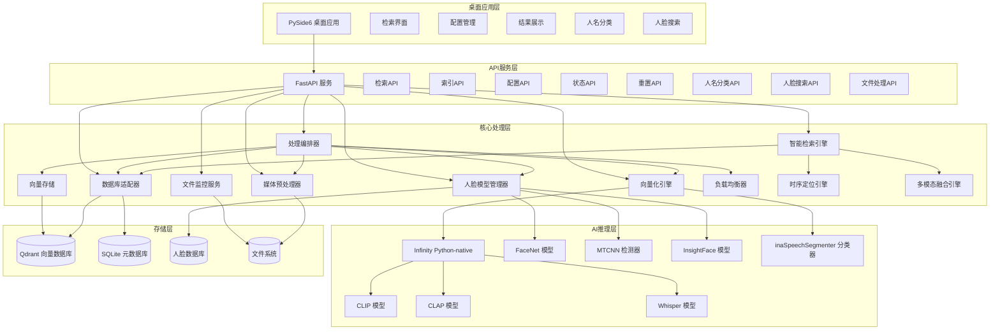

# iFlow CLI 上下文文档 - msearch 项目

## 项目概述

msearch 是一款跨平台的多模态桌面搜索软件，旨在成为用户的"第二大脑"。它允许用户通过自然语言、图片截图或音频片段快速、精准地在本地素材库中定位相关的图片、视频（精确到关键帧）和音频文件，实现"定位到秒"的检索体验。

### 核心价值

- **智能检索**: 无需手动整理、无需添加标签即可实现智能检索
- **跨模态搜索**: 支持用任意模态（文本、图像、音频）检索其他模态内容
- **高精度定位**: 支持毫秒级时间戳精确定位，时间戳精度±2秒要求
- **零配置**: 素材无需整理、无需标签
- **高性能本地推理**: 利用Infinity Python-native模式实现高效向量化
- **松耦合架构**: 数据库与业务逻辑分离，支持未来技术栈更换
- **国内网络优化**: 自动配置国内镜像源，解决网络访问问题
- **人脸识别增强**: 集成先进的人脸检测和识别能力
- **智能音频处理**: 使用inaSpeechSegmenter自动分类音频内容（音乐/语音），基于质量检测过滤低质量片段
- **完整桌面应用**: 基于PySide6的现代化桌面GUI，提供完整的用户体验
- **测试问题修复**: 提供完整的测试环境问题解决方案，包括GPU驱动兼容性问题修复

## 技术架构

### 核心技术栈

| 层级 | 技术选择 | 核心特性 |
|------|----------|----------|
| **桌面应用** | **PySide6** | 跨平台原生UI，与系统深度集成 |
| **API网关** | **FastAPI** | 异步高性能，自动生成OpenAPI文档 |
| **向量引擎** | **Infinity Python-native** | 零HTTP开销推理，直接内存调用 |
| **多模态模型** | **CLIP/CLAP/Whisper** | 专业化模型架构，针对不同模态优化 |
| **人脸识别** | **FaceNet + MTCNN + InsightFace** | 高精度人脸检测和特征提取 |
| **音频分类** | **inaSpeechSegmenter** | 智能音频内容分类（音乐/语音） |
| **向量数据库** | **Qdrant** | Rust高性能存储，本地部署，毫秒级检索 |
| **元数据存储** | **SQLite** | ACID事务支持，零配置，文件级便携 |
| **媒体处理** | **FFmpeg + OpenCV + Librosa** | 专业级预处理，场景检测+智能切片 |
| **文件监控** | **Watchdog** | 实时增量处理，跨平台文件系统事件 |

### 系统架构



## 项目结构

```
msearch/
├── .coveragerc             # 测试覆盖率配置
├── .gitignore              # Git忽略文件
├── IFLOW.md                # iFlow CLI上下文文档
├── requirements.txt        # Python依赖清单
├── config/                 # 配置文件目录
│   └── config.yml          # 主配置文件
├── offline/                # 离线资源目录
│   ├── bin/                # 二进制文件（Qdrant等）
│   ├── github/             # GitHub相关资源（FFmpeg等）
│   ├── models/             # AI模型文件
│   └── packages/           # Python依赖包
├── scripts/                # 脚本目录
│   ├── deploy_msearch.sh   # 一键部署脚本
│   ├── deploy_msearch.bat  # Windows部署脚本
│   ├── download_model_resources.sh # 离线资源下载脚本
│   ├── download_model_resources.bat # Windows离线资源下载脚本
│   ├── start_all_services.sh # 启动所有服务脚本
│   ├── stop_all_services.sh # 停止所有服务脚本
│   ├── start_qdrant.sh     # 启动Qdrant服务脚本
│   ├── start_qdrant.bat    # Windows Qdrant启动脚本
│   ├── stop_qdrant.sh      # 停止Qdrant服务脚本
│   ├── stop_qdrant.bat     # Windows Qdrant停止脚本
│   ├── start_infinity_services.sh # 启动Infinity服务脚本
│   └── stop_infinity_services.sh # 停止Infinity服务脚本
├── src/                    # 源代码目录
│   ├── api/                # API服务层
│   │   ├── main.py         # FastAPI主应用
│   │   ├── routes/         # API路由
│   │   │   ├── search.py   # 检索API
│   │   │   ├── config.py   # 配置API
│   │   │   ├── tasks.py    # 任务控制API
│   │   │   └── status.py   # 状态查询API
│   │   ├── models/         # API数据模型
│   │   │   ├── search_models.py # 检索请求/响应模型
│   │   │   ├── config_models.py # 配置模型
│   │   │   └── common_models.py # 通用模型
│   │   └── middleware/     # 中间件
│   │       ├── cors.py     # CORS中间件
│   │       └── error_handler.py # 错误处理中间件
│   ├── core/               # 核心组件
│   │   ├── config_manager.py     # 配置管理器
│   │   ├── config.py             # 配置类定义
│   │   ├── file_type_detector.py # 文件类型检测器
│   │   ├── logger_manager.py     # 日志管理器
│   │   ├── logging_config.py     # 日志配置
│   │   └── infinity_manager.py   # Infinity服务管理器
│   ├── business/           # 业务逻辑层
│   │   ├── processing_orchestrator.py # 处理编排器
│   │   ├── smart_retrieval.py    # 智能检索引擎
│   │   ├── multimodal_fusion_engine.py # 多模态融合引擎
│   │   ├── temporal_localization_engine.py # 时序定位引擎
│   │   ├── embedding_engine.py   # 向量化引擎
│   │   ├── face_model_manager.py # 人脸模型管理器
│   │   ├── file_monitor.py       # 文件监控服务
│   │   ├── load_balancer.py      # 负载均衡器
│   │   ├── face_manager.py       # 人脸管理器
│   │   ├── media_processor.py    # 媒体处理器
│   │   ├── search_engine.py      # 搜索引擎
│   │   └── task_manager.py       # 任务管理器
│   ├── processors/         # 专业处理器
│   │   ├── audio_classifier.py   # 音频分类器
│   │   ├── audio_processor.py    # 音频处理器
│   │   ├── image_processor.py    # 图像处理器
│   │   ├── media_processor.py    # 媒体处理器
│   │   ├── text_processor.py     # 文本处理器
│   │   ├── timestamp_processor.py # 时间戳处理器
│   │   └── video_processor.py    # 视频处理器
│   ├── storage/            # 存储层
│   │   ├── vector_store.py       # Qdrant向量数据库客户端
│   │   ├── face_database.py      # 人脸数据库管理
│   │   ├── db_adapter.py         # 数据库适配器
│   │   └── database.py           # 数据库连接
│   ├── utils/              # 工具函数
│   └── gui/                # 桌面GUI应用
│       ├── api_client.py   # API客户端
│       ├── app.py          # GUI应用主类
│       ├── gui_main.py     # GUI入口点
│       ├── main_window.py  # 主窗口
│       ├── main.py         # GUI启动脚本
│       ├── search_worker.py # 搜索工作器
│       ├── theme_manager.py # 主题管理器
│       └── widgets/        # 界面组件
│           ├── config_widget.py # 配置组件
│           ├── face_recognition_widget.py # 人脸识别组件
│           ├── file_manager_widget.py # 文件管理组件
│           ├── search_widget.py # 搜索组件
│           ├── side_bar_widget.py # 侧边栏组件
│           ├── status_bar_widget.py # 状态栏组件
│           └── timeline_widget.py # 时间线组件
├── tests/                  # 测试目录
│   ├── conftest.py         # 测试配置
│   ├── run_tests.py        # 测试运行脚本
│   ├── run_integration_tests.py # 集成测试运行脚本
│   ├── test_basic_structure.py # 基本结构测试
│   ├── integration/        # 集成测试
│   │   ├── test_integration.py # 集成测试
│   │   ├── test_api_basic.py # API基础测试
│   │   ├── test_basic_functionality.py # 基本功能测试
│   │   ├── test_basic_integration.py # 基础集成测试
│   │   ├── test_integration_comprehensive.py # 综合集成测试
│   │   ├── test_integration_execution.py # 集成执行测试
│   │   ├── test_real_data.py # 真实数据测试
│   │   ├── test_temporal_integration.py # 时间集成测试
│   │   ├── test_timestamp_accuracy.py # 时间戳精度测试
│   │   └── test_with_real_data.py # 真实数据使用测试
│   └── unit/               # 单元测试
│       ├── test_api_modules.py # API模块测试
│       ├── test_basic_imports.py # 基础导入测试
│       ├── test_basic_imports_fast.py # 快速基础导入测试
│       ├── test_core_components.py # 核心组件测试
│       ├── test_core_only.py # 核心功能测试
│       ├── test_embedding_engine.py # 向量化引擎测试
│       ├── test_file_type_detector.py # 文件类型检测器测试
│       ├── test_import.py # 导入测试
│       ├── test_load_balancer.py # 负载均衡器测试
│       ├── test_media_processor.py # 媒体处理器测试
│       ├── test_media_processors.py # 媒体处理器测试
│       ├── test_processing_orchestrator.py # 处理编排器测试
│       ├── test_processing_orchestrator_enhanced.py # 增强处理编排器测试
│       ├── test_search_engine.py # 搜索引擎测试
│       ├── test_simple_functionality.py # 简单功能测试
│       ├── test_simple.py # 简单测试
│       ├── test_smart_retrieval.py # 智能检索测试
│       ├── test_temporal_localization_engine.py # 时间定位引擎测试
│       ├── test_temporal_localization_enhanced.py # 增强时间定位测试
│       ├── test_timestamp_functionality.py # 时间戳功能测试
│       └── test_vector_store.py # 向量存储测试
└── webui/                  # Web用户界面
    ├── index.html          # 主页面
    ├── package.json        # 前端依赖
    ├── README.md           # WebUI说明
    ├── vite.config.js      # Vite配置
    └── src/                # Vue.js源码
        ├── App.vue         # 根组件
        ├── main.js         # 入口文件
        ├── components/     # 组件目录
        │   ├── ResultDetailDialog.vue # 结果详情对话框
        │   └── TimelinePlayer.vue # 时间线播放器
        ├── router/         # 路由配置
        │   └── index.js    # 路由配置文件
        ├── utils/          # 工具函数
        │   └── api.js      # API工具函数
        └── views/          # 页面视图
            ├── ConfigView.vue # 配置视图
            ├── FaceRecognitionView.vue # 人脸识别视图
            ├── FileManagerView.vue # 文件管理视图
            ├── SearchView.vue # 搜索视图
            └── TimelineView.vue # 时间线视图
```

## 核心组件

### 1. 处理编排器 (ProcessingOrchestrator)

处理编排器是系统的核心组件，负责协调各专业处理模块的调用顺序和数据流转：

- **策略路由**: 根据文件类型选择处理策略
- **流程编排**: 管理预处理→向量化→存储的调用顺序
- **状态管理**: 跟踪处理进度、状态转换和错误恢复
- **资源协调**: 协调CPU/GPU资源分配
- **批处理编排**: 智能组织批处理任务

### 2. 向量化引擎 (EmbeddingEngine)

专业化多模态向量化引擎，使用Infinity Python-native模式：

- **CLIP模型**: 文本-图像/视频检索
- **CLAP模型**: 文本-音乐检索  
- **Whisper模型**: 语音转文本检索
- **智能模型选择**: 根据硬件环境自动选择最优模型
- **批处理优化**: 提升GPU利用率
- **Python-native模式**: 直接内存调用，避免HTTP序列化开销
- **音频智能处理**: 使用inaSpeechSegmenter自动分类音频内容并进行质量过滤

### 3. 人脸模型管理器 (FaceModelManager)

人脸识别和特征提取引擎：

- **MTCNN检测器**: 高精度人脸检测
- **FaceNet模型**: 人脸特征向量提取
- **InsightFace模型**: 增强的人脸识别能力
- **人脸数据库**: 人脸特征向量存储
- **相似度匹配**: 人脸特征对比和识别
- **批量处理**: 支持批量人脸检测和特征提取

### 4. 智能检索引擎 (SmartRetrieval)

智能检索和结果融合：

- **查询类型识别**: 自动识别查询意图（人名、音频、视觉、通用）
- **动态权重分配**: 根据查询类型调整模型权重
- **多模态融合**: 融合不同模型的检索结果
- **时序定位**: 精确定位视频/音频中的相关片段
- **人脸预检索**: 针对人名查询启用人脸预检索生成文件白名单

### 5. 负载均衡器 (LoadBalancer)

资源调度和负载管理：

- **GPU资源调度**: 智能分配GPU计算资源
- **并发控制**: 管理并发处理任务
- **健康检查**: 监控服务状态和性能
- **故障转移**: 自动处理服务故障

## 工作流程

### 离线处理/索引流程

1. 文件监控服务检测新文件或用户手动提交文件索引请求
2. 处理编排器(ProcessingOrchestrator)协调整个处理流程
3. 文件信息存入 SQLite 数据库，状态设为待处理
4. 媒体预处理器对文件进行切片处理
5. 模型管理器将切片转换为向量
6. 向量存储服务将向量存入 Qdrant
7. 人脸模型管理器检测和提取人脸特征
8. 媒体片段信息存入 SQLite 数据库
9. 文件状态更新为已完成

### 在线检索流程

1. 用户通过 API 提交查询（文本/图像/音频）
2. 智能检索引擎(SmartRetrievalEngine)分析查询类型并计算动态权重
3. 模型管理器将查询转换为向量
4. 向量存储服务在 Qdrant 中搜索相似向量
5. 时序定位引擎精确定位相关时间片段
6. 多模态融合引擎合并不同模型的检索结果
7. 根据向量ID查询 SQLite 获取文件和片段信息
8. 结果聚合后返回给用户

### 人脸识别流程

1. 媒体处理过程中检测到人脸
2. MTCNN检测器定位人脸区域
3. FaceNet/InsightFace模型提取人脸特征向量
4. 人脸特征向量存储到人脸数据库
5. 与已知人名档案进行比对
6. 将分类结果存入数据库
7. 支持用户反馈和模型优化

### 人脸搜索流程

1. 用户通过人脸API提交人名或人脸图像
2. 对于人名搜索，直接查询数据库中的人名分类记录
3. 对于人脸图像搜索，人脸模型管理器将图像转换为向量
4. 向量存储服务在 Qdrant 中搜索相似人脸向量
5. 根据向量ID查询 SQLite 获取文件和片段信息
6. 结果聚合后返回给用户

### 智能音频处理流程

1. 媒体处理过程中检测到音频内容
2. inaSpeechSegmenter自动分类音频片段（音乐/语音）
3. 计算音频质量分数并过滤低质量片段
4. 音乐片段使用CLAP模型向量化
5. 语音片段使用Whisper转录后向量化
6. 向量存储服务将向量存入 Qdrant
7. 支持基于音频内容的跨模态检索

## 智能检索策略

### 查询类型识别

智能检索引擎能够自动识别查询类型：
- **人名查询**: 检测查询中的人名并启用人脸预检索
- **音频查询**: 根据关键词识别音乐或语音查询
- **视觉查询**: 识别视觉相关关键词
- **混合查询**: 默认的综合检索模式

### 动态权重分配

根据不同查询类型动态调整各模态权重：
- **人名查询**: 视觉模态主导(50%)，音频模态辅助(25%)
- **音乐查询**: CLAP模型权重最高(70%)
- **语音查询**: Whisper模型权重最高(70%)
- **视觉查询**: CLIP模型权重最高(70%)
- **默认查询**: 均衡权重分配

### 文件白名单机制

针对人名查询，系统会先进行人脸预检索生成文件白名单，缩小搜索范围，提高检索效率。

## 依赖管理

项目依赖通过requirements.txt管理：

### 核心依赖
- torch>=2.0.0, torchvision>=0.15.0 - PyTorch深度学习框架
- transformers>=4.30.0 - Hugging Face Transformers
- numpy>=1.24.0, pandas>=2.0.0 - 科学计算
- fastapi>=0.100.0, uvicorn>=0.23.0 - Web框架
- pydantic>=2.0.0 - 数据验证
- sqlalchemy>=2.0.0, qdrant-client>=1.6.0 - 数据库
- watchdog>=3.0.0 - 文件监控

### AI模型相关
- openai-whisper>=20230314 - 语音识别
- inaspeechsegmenter>=0.0.9 - 音频内容分析
- facenet-pytorch>=2.5.0 - 人脸识别
- mtcnn>=0.1.1 - 人脸检测
- insightface>=0.7.0 - 人脸分析
- sentence-transformers>=2.2.0 - 多语言文本嵌入

### 媒体处理
- pillow>=10.0.0 - 图像处理
- opencv-python>=4.8.0 - 计算机视觉
- librosa>=0.10.0, soundfile>=0.12.0 - 音频处理
- pydub>=0.25.0 - 音频格式转换

### 其他工具
- scipy>=1.10.0, scikit-learn>=1.3.0 - 科学计算
- requests>=2.31.0, httpx>=0.25.0 - HTTP客户端
- pyyaml>=6.0.0 - YAML配置解析
- tqdm>=4.65.0 - 进度条显示
- colorama>=0.4.0 - 彩色终端输出

## 启动和运行

### 环境配置

```bash
# 安装依赖
pip install -r requirements.txt

# 或使用国内镜像源
pip install -r requirements.txt -i https://pypi.tuna.tsinghua.edu.cn/simple
```

### 下载离线资源

```bash
# Linux/macOS 下载所有离线资源
bash scripts/download_model_resources.sh

# Windows 下载所有离线资源
scripts\download_model_resources.bat
```

### 启动服务

```bash
# Linux/macOS 启动所有服务（包括Qdrant和Infinity）
bash scripts/start_all_services.sh

# Windows 启动Qdrant服务
scripts\start_qdrant.bat

# 启动API服务（主项目）
python src/api/main.py

# 启动桌面GUI应用
python src/gui/main.py

# 运行测试
python tests/run_tests.py

# 运行特定测试并生成覆盖率报告
python tests/run_tests.py tests/unit/test_processing_orchestrator.py --coverage

# 运行集成测试
python tests/run_integration_tests.py
```

### 测试问题修复

针对测试环境中可能出现的GPU驱动和库兼容性问题：

```bash
# Windows环境运行测试修复脚本
fix_test_issues.bat

# 使用CPU配置文件启动
python src/api/main.py --config config_cpu.yml
```

### 服务端口配置

- **API服务**: 127.0.0.1:8000
- **Qdrant数据库**: 127.0.0.1:6333
- **Infinity服务**: 
  - CLIP: 7997
  - CLAP: 7998  
  - Whisper: 7999

### 一键部署

```bash
# Linux/macOS 在线部署
bash scripts/deploy_msearch.sh

# Windows 在线部署
scripts\deploy_msearch.bat

# 离线部署（需要先下载离线资源）
bash scripts/deploy_msearch.sh --offline
scripts\deploy_msearch.bat --offline

# 强制重新部署
bash scripts/deploy_msearch.sh --force
scripts\deploy_msearch.bat --force
```

## 开发实践

### 代码规范

- 使用类型注解
- 遵循 PEP 8 代码风格
- 使用 black 进行代码格式化
- 使用 mypy 进行类型检查
- 使用 flake8 进行代码质量检查

### 测试策略

- 单元测试使用 pytest
- 异步测试支持
- 覆盖率报告
- 集成测试框架
- Mock技术隔离外部依赖

### 配置管理

所有可配置项集中在 `config/config.yml` 文件中，支持不同环境的配置。主要配置包括：

- **系统配置**: 日志级别、工作线程数、数据目录
- **数据库配置**: SQLite和Qdrant连接参数
- **Infinity服务**: 模型配置、端口设置、设备分配
- **媒体处理**: 视频/音频处理参数
- **人脸识别**: 检测和匹配参数
- **智能检索**: 权重配置和关键词识别
- **音频处理**: inaSpeechSegmenter配置和质量检测参数

### 日志系统

- 详细的错误定位信息（包含模块名、函数名和行号）
- 独立的错误日志文件，便于问题排查
- 访问日志记录所有HTTP请求
- 性能指标日志帮助优化系统性能
- 可配置的日志级别和格式
- 自动日志轮转防止日志文件过大
- 多级别日志配置（DEBUG/INFO/WARNING/ERROR/CRITICAL）

## 硬件自适应

系统根据硬件环境自动选择最优模型：
- CUDA环境：高性能模型（需要NVIDIA GPU和CUDA支持）
- OpenVINO环境：中等性能模型（适用于Intel硬件）
- CPU环境：基础性能模型（资源占用较低）

## 部署方案

### 国内镜像优化部署

项目支持国内镜像优化部署：
- 使用 https://pypi.tuna.tsinghua.edu.cn/simple 作为PyPI镜像
- 使用 https://hf-mirror.com 作为HuggingFace镜像
- 使用 https://kkgithub.com/ 作为GitHub镜像

### 离线部署

项目支持完整的离线部署：
- 离线资源下载脚本（`scripts/download_model_resources.sh`）
- 一键部署脚本（`scripts/deploy_msearch.sh`）
- 预下载模型文件和依赖包
- 本地Qdrant二进制文件包含

### 绿色安装部署

项目支持绿色安装部署：
- 所有依赖和模型可离线下载
- 无需网络连接即可完成部署
- 支持断点续传和增量下载

## 测试和质量保证

### 测试要求

1. **分层测试**：单元测试→集成测试→系统测试的完整测试体系
2. **核心功能自动化测试覆盖率≥80%**：确保核心功能质量
3. **性能导向**：关键路径性能测试必须通过
4. **持续集成**：每次代码提交触发自动测试
5. **时间戳精度测试**：需达到±2秒要求
6. **多模态检索功能完整性测试**：确保跨模态检索功能正常
7. **配置管理器功能测试**：验证配置加载和管理功能
8. **各组件初始化和依赖注入验证**：确保系统启动正常
9. **API端点功能测试**：验证所有API接口功能
10. **文件处理完整流程测试**：确保文件处理流程完整

### 测试基础设施

- **单元测试**: 使用pytest框架，覆盖核心功能
- **集成测试**: 验证组件间协作
- **覆盖率报告**: 确保代码质量
- **持续集成**: GitHub Actions自动化测试
- **基本结构测试**: 验证模块导入和基本实例化
- **时间戳精度测试**: 专门验证时间戳精度要求
- **真实数据测试**: 使用真实媒体文件进行测试
- **GPU/CPU环境适配测试**: 验证不同硬件环境下的兼容性

### 测试问题解决方案

项目提供完整的测试环境问题解决方案：

#### GPU驱动问题解决
- GPU驱动诊断工具
- PyTorch CUDA版本匹配检查
- 自动化修复脚本

#### 库版本兼容性解决
- 依赖版本冲突检测
- 自动降级/升级方案
- CPU版本替代方案

#### 测试环境配置
- CPU专用配置文件（config_cpu.yml）
- 环境隔离方案
- 批量测试修复脚本

### 部署和迁移测试

项目具备完整的部署和迁移测试能力：
- 离线资源下载脚本（支持Windows和Linux）
- 支持环境变量注入功能测试
- 支持跨平台迁移兼容性测试
- 支持不同硬件环境（CPU/GPU）适配测试
- 提供完整的问题诊断和修复工具

## 新增功能和工具

### 完整的桌面GUI应用
- **现代化界面**: 基于PySide6的跨平台桌面应用
- **完整功能模块**: 搜索、配置、文件管理、人脸识别、时间线等
- **主题管理**: 支持多主题切换和界面定制
- **响应式设计**: 适配不同屏幕尺寸和分辨率

### 增强的测试基础设施
- **全面的测试覆盖**: 单元测试、集成测试、系统测试
- **时间戳精度测试**: 专门验证±2秒精度要求
- **真实数据测试**: 使用真实媒体文件进行测试
- **GPU/CPU环境适配**: 自动检测和适配不同硬件环境

### 测试问题解决方案
- **自动化修复脚本**: 一键诊断和修复常见测试问题
- **GPU驱动兼容性**: 解决Windows环境下GPU驱动冲突
- **库版本管理**: 自动处理依赖版本冲突
- **CPU替代方案**: 提供完整的CPU运行环境

### 增强的配置管理
- **多环境配置**: 支持开发、测试、生产环境配置
- **动态配置加载**: 支持运行时配置更新
- **配置验证**: 自动验证配置文件正确性
- **CPU专用配置**: 针对无GPU环境的优化配置

### 完善的日志系统
- **多级别日志**: DEBUG/INFO/WARNING/ERROR/CRITICAL
- **分类日志存储**: 主日志、错误日志、性能日志、时间戳日志
- **日志监控**: 自动监控错误率和性能指标
- **开发/生产模式**: 不同环境下的日志优化配置

## 新增功能和工具

### 桌面GUI应用完善

基于PySide6的现代化桌面应用，提供完整的用户界面：

#### 主要组件
- **主窗口** (main_window.py): 完整的桌面应用框架
- **搜索组件** (search_widget.py): 多模态搜索界面
- **配置组件** (config_widget.py): 系统配置管理界面
- **人脸识别组件** (face_recognition_widget.py): 人脸搜索和管理
- **文件管理组件** (file_manager_widget.py): 文件浏览和管理
- **时间线组件** (timeline_widget.py): 时间轴浏览和导航
- **侧边栏组件** (side_bar_widget.py): 功能导航
- **状态栏组件** (status_bar_widget.py): 系统状态显示
- **主题管理器** (theme_manager.py): 界面主题管理

#### 功能特性
- 跨平台原生界面
- 拖拽文件支持
- 实时搜索结果展示
- 多线程搜索处理
- 响应式界面设计

### 测试问题诊断和修复工具

#### 完整的测试问题解决方案
- **GPU驱动问题诊断**: 自动检测GPU驱动状态和CUDA兼容性
- **库版本兼容性检查**: 检测PyTorch、infinity_emb等库的版本冲突
- **CPU版本配置**: 提供完整的CPU运行环境配置
- **自动化修复脚本**: 一键修复常见的测试环境问题

#### 测试工具
- **基础导入测试**: 验证核心模块导入
- **结构完整性测试**: 验证项目结构完整性
- **时间戳精度测试**: 验证±2秒精度要求
- **真实数据测试**: 使用真实媒体文件进行测试
- **集成测试套件**: 全面的组件集成测试

### 增强的配置管理

#### 详细的配置系统
- **多级别日志配置**: 支持组件级别的日志控制
- **性能优化配置**: GPU内存管理和批处理优化
- **时间戳处理配置**: 精确的时间戳处理参数
- **多模态检索配置**: 智能权重分配和查询路由
- **硬件自适应配置**: 根据硬件环境自动调整参数

#### 配置文件
- **config.yml**: 完整的主配置文件
- **config_cpu.yml**: CPU专用配置文件

### 文档系统完善

#### 完整的文档体系
- **API文档** (api_documentation.md): 完整的API接口文档
- **部署指南** (deployment_guide.md): 详细的部署说明
- **Windows部署指南** (deployment_guide_windows.md): Windows专用部署指南
- **测试修复指南** (test_fix_guide.md): 测试问题解决方案
- **用户手册** (user_manual.md): 完整的用户使用指南
- **设计文档** (design.md): 系统设计说明
- **需求文档** (requirements.md): 项目需求说明

## 未来规划

1. 持续完善桌面GUI应用功能和用户体验
2. 增强人脸分类和识别功能
3. 优化性能和资源使用效率
4. 支持更多媒体格式和编解码器
5. 实现命令行接口工具
6. 进一步完善测试覆盖率和自动化
7. 增强跨平台兼容性和稳定性
8. 实现智能标签和自动分类功能
9. 支持多语言界面国际化
10. 增加数据备份和恢复功能
11. 完善WebUI功能和用户体验
12. 集成更多AI模型和功能
13. 实现分布式部署支持
14. 添加用户行为分析和推荐功能

---

*最后更新: 2025-10-20*