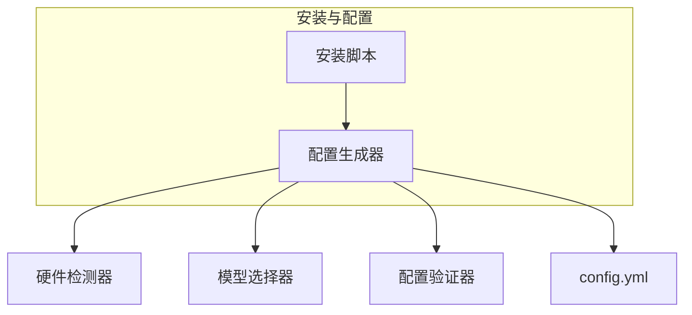

# MSearch 部署文档

> **文档导航**: [需求文档](../.kiro/specs/multimodal-search-system/requirements.md) | [设计文档](../.kiro/specs/multimodal-search-system/design.md) | [API文档](api_documentation.md) | [测试策略](test_strategy.md) | [技术实现指南](technical_implementation.md) | [用户手册](user_manual.md) | [部署文档](DEPLOYMENT.md)

## 1. 概述

本文档描述 msearch 多模态检索系统的部署和打包方案，包括依赖管理、跨平台支持、安装脚本设计和配置生成等内容。

### 1.1 部署目标

- **跨平台支持**: Windows 10/11、macOS、主流Linux发行版
- **硬件自适应**: 根据硬件配置自动选择最优模型和参数
- **零配置安装**: 用户无需手动配置，一键完成安装
- **自动化部署**: 提供自动化安装脚本和配置生成器

### 1.2 技术栈

- **依赖管理**: uv（安装速度比pip快10-100倍）
- **打包工具**: Nuitka（编译为各平台原生可执行文件）
- **配置管理**: YAML + 环境变量

## 2. 依赖管理

### 2.1 uv 依赖管理器

使用 `uv` 进行依赖管理，安装速度比pip快10-100倍。

**安装 uv**:
```bash
# Linux/macOS
curl -LsSf https://astral.sh/uv/install.sh | sh

# Windows
powershell -c "irm https://astral.sh/uv/install.ps1 | iex"
```

**使用 uv 安装依赖**:
```bash
uv pip install -r requirements.txt
```

### 2.2 主要依赖

```txt
# AI推理引擎
infinity>=0.0.7

# 向量数据库
pymilvus>=2.3.0

# Web框架
fastapi>=0.104.0
uvicorn>=0.24.0

# 媒体处理
opencv-python>=4.8.0
librosa>=0.10.0
ffmpeg-python>=0.2.0

# 文件监控
watchdog>=3.0.0

# 任务队列
persist-queue>=0.8.0

# 配置管理
pyyaml>=6.0.0

# 日志
python-json-logger>=2.0.0

# 测试
pytest>=7.4.0
pytest-cov>=4.1.0
pytest-asyncio>=0.21.0
```

## 3. 打包工具

### 3.1 Nuitka 编译器

使用 `Nuitka` 编译为各平台原生可执行文件，提升应用启动和运行性能。

**安装 Nuitka**:
```bash
uv pip install nuitka
```

**编译命令**:
```bash
# Linux/macOS
python -m nuitka --standalone --onefile --enable-plugin=pylint-plugins src/main.py

# Windows
python -m nuitka --standalone --onefile --windows-console-mode=disable --enable-plugin=pylint-plugins src/main.py
```

### 3.2 打包优化

- **静态链接**: 减少依赖，提高兼容性
- **代码优化**: 提升运行性能
- **体积压缩**: 减小可执行文件大小

## 4. 跨平台支持

### 4.1 支持的操作系统

- **Windows**: Windows 10/11
- **macOS**: macOS 10.15+
- **Linux**: Ubuntu 20.04+, CentOS 8+, Debian 11+

### 4.2 平台特定配置

**Windows**:
- 使用 Windows 服务模式运行
- 支持系统托盘图标
- 自动启动配置

**macOS**:
- 支持 LaunchAgent 自动启动
- 支持 Menu Bar 图标
- 代码签名和公证

**Linux**:
- 支持 systemd 服务
- 支持 AppImage 打包
- 自动启动脚本

## 5. 安装脚本设计

### 5.1 设计目标

- **跨平台支持**: 支持Windows 10/11和主流Linux发行版（Ubuntu、CentOS、Debian）
- **硬件自适应**: 根据硬件配置自动选择最优模型和参数
- **零配置安装**: 用户无需手动配置，一键完成安装
- **依赖自动安装**: 自动检测和安装所需依赖
- **友好的用户界面**: 提供命令行和图形界面两种安装方式
- **错误处理**: 完善的错误处理和日志记录

### 5.2 硬件自适应设计

通过安装脚本分析硬件配置，支持硬件自适应模型选择：

**硬件检测内容**:
- **GPU检测**: 使用`torch.cuda.is_available()`检测CUDA兼容GPU
- **CPU检测**: 使用`platform`和`psutil`库检测CPU型号和核心数
- **内存检测**: 使用`psutil`库检测可用内存大小

**模型推荐策略**:
- **CUDA兼容GPU**: 推荐使用CUDA_INT8加速，选择高精度模型（CLIP-large、CLAP-large、Whisper-medium）
- **OpenVINO支持CPU**: 推荐使用OpenVINO后端，选择中等精度模型（CLIP-base、CLAP-base、Whisper-base）
- **低硬件配置**: 推荐轻量级模型（CLIP-base、CLAP-base、Whisper-base）

**配置生成**: 根据硬件检测结果生成配置文件，无需手动修改

**运行时加载**: 系统启动时从配置文件加载模型配置

## 6. 配置生成器

### 6.1 配置生成流程

1. **硬件检测**: 调用硬件检测模块获取系统配置信息
2. **模型选择**: 根据硬件配置自动推荐最优模型组合
3. **用户确认**: 展示推荐配置，允许用户调整
4. **配置生成**: 生成`config/config.yml`配置文件
5. **配置验证**: 验证配置文件的有效性

### 6.2 配置生成器架构



## 7. 部署脚本

项目提供自动化部署脚本：

- **install_auto.sh**: 自动化在线安装脚本
- **install_offline.sh**: 离线安装脚本
- **download_all_resources.sh**: 下载所有必要资源

### 7.1 在线安装脚本

```bash
#!/bin/bash
# install_auto.sh

echo "开始安装 MSearch..."

# 环境检查
echo "检查Python版本..."
python3 --version || { echo "Python 3.8+ 未安装"; exit 1; }

# 安装uv
echo "安装uv依赖管理器..."
curl -LsSf https://astral.sh/uv/install.sh | sh

# 安装依赖
echo "安装Python依赖..."
uv pip install -r requirements.txt

# 硬件检测
echo "检测硬件配置..."
python3 scripts/hardware_detect.py

# 配置生成
echo "生成配置文件..."
python3 scripts/config_generator.py

# 模型下载
echo "下载AI模型..."
python3 scripts/download_models.py

# 数据库初始化
echo "初始化数据库..."
python3 scripts/init_database.py

echo "安装完成！"
```

### 7.2 离线安装脚本

```bash
#!/bin/bash
# install_offline.sh

echo "开始离线安装 MSearch..."

# 环境检查
echo "检查Python版本..."
python3 --version || { echo "Python 3.8+ 未安装"; exit 1; }

# 安装uv
echo "安装uv依赖管理器..."
if [ -f "bin/uv" ]; then
    cp bin/uv /usr/local/bin/
else
    echo "未找到uv二进制文件"
    exit 1
fi

# 安装依赖
echo "安装Python依赖..."
uv pip install --no-index --find-links=packages/ -r requirements.txt

# 配置生成
echo "生成配置文件..."
python3 scripts/config_generator.py

# 数据库初始化
echo "初始化数据库..."
python3 scripts/init_database.py

echo "离线安装完成！"
```

## 8. 安装流程

### 8.1 完整安装流程

1. **环境检查**: 检查Python版本和系统依赖
2. **硬件检测**: 检测GPU、CPU、内存等硬件配置
3. **依赖安装**: 使用uv快速安装Python依赖
4. **配置生成**: 根据硬件检测结果自动生成配置文件
5. **模型下载**: 自动下载AI模型到指定目录
6. **数据库初始化**: 初始化SQLite和Milvus Lite数据库
7. **服务启动**: 启动文件监控和处理服务

### 8.2 快速开始

```bash
# 在线安装
bash scripts/install_auto.sh

# 离线安装
bash scripts/install_offline.sh
```

## 9. 初次启动设置向导

首次启动时，系统会引导用户完成初始配置，确保系统能够正常运行。

### 9.1 向导流程

1. **欢迎界面**: 介绍系统功能和特性
2. **硬件确认**: 展示检测到的硬件配置，允许用户确认或修改
3. **监控目录设置**: 选择要监控的媒体文件目录
4. **模型配置**: 确认或调整AI模型配置
5. **初始化数据库**: 初始化SQLite和Milvus Lite数据库
6. **完成设置**: 显示配置摘要，进入主界面

### 9.2 向导界面设计


### 9.3 向导功能特性

- **智能默认值**: 根据硬件检测结果自动填充推荐配置
- **配置验证**: 实时验证用户输入的有效性
- **进度显示**: 显示初始化进度，提供用户反馈
- **错误处理**: 友好的错误提示和解决方案
- **配置备份**: 保存配置历史，支持配置回滚

### 9.4 监控目录设置

用户可以选择一个或多个目录进行监控：

**目录配置参数**:
- **路径**: 要监控的目录路径
- **优先级**: 目录处理优先级（1-10，数字越大优先级越高）
- **递归扫描**: 是否递归扫描子目录
- **文件类型**: 要监控的文件类型（图片、视频、音频）

**默认配置**:
```yaml
monitoring:
  directories:
    - path: ~/Pictures
      priority: 1
      recursive: true
      file_types: ['image']
    - path: ~/Videos
      priority: 2
      recursive: true
      file_types: ['video']
    - path: ~/Music
      priority: 3
      recursive: true
      file_types: ['audio']
```

### 9.5 模型配置

用户可以确认或调整AI模型配置：

**模型配置选项**:
- **CLIP模型**: 选择CLIP模型版本（base/large）
- **CLAP模型**: 选择CLAP模型版本（base/large）
- **Whisper模型**: 选择Whisper模型版本（base/medium/large）
- **模型缓存目录**: 设置模型缓存目录路径
- **模型预热**: 是否在启动时预热模型

**配置验证**:
- 检查磁盘空间是否足够
- 验证模型下载URL的有效性
- 检查网络连接状态（在线安装）

## 10. 运行和停止

### 10.1 启动服务

```bash
# 开发模式
python src/main.py

# 生产模式
python src/main.py --production

# 后台运行（Linux）
nohup python src/main.py --production > logs/msearch.log 2>&1 &

# Windows服务模式
python src/main.py --install-service
```

### 10.2 停止服务

```bash
# Linux
pkill -f msearch

# Windows
taskkill /F /IM msearch.exe

# 停止Windows服务
python src/main.py --uninstall-service
```

## 11. 故障排查

### 11.1 常见问题

**问题1: 模型下载失败**
- 检查网络连接
- 检查磁盘空间
- 使用离线安装包

**问题2: GPU不可用**
- 检查CUDA驱动安装
- 检查PyTorch版本
- 切换到CPU模式

**问题3: 数据库初始化失败**
- 检查文件权限
- 检查磁盘空间
- 删除现有数据库重新初始化

### 11.2 日志查看

```bash
# 查看系统日志
tail -f logs/msearch.log

# 查看错误日志
tail -f logs/error.log

# 查看调试日志
tail -f logs/debug.log
```

## 12. 升级和卸载

### 12.1 升级

```bash
# 在线升级
bash scripts/upgrade.sh

# 手动升级
uv pip install --upgrade -r requirements.txt
```

### 12.2 卸载

```bash
# Linux
bash scripts/uninstall.sh

# Windows
运行 uninstall.exe

# 手动清理
rm -rf ~/.msearch
rm -rf /usr/local/bin/msearch
```
