# 智能多模态检索系统设计文档

> **重要技术说明**：本项目采用 **michaelfeil/infinity** (https://github.com/michaelfeil/infinity) 作为核心AI推理引擎。Infinity 是一个专为文本嵌入、重排序模型、CLIP、CLAP 和 ColPali 设计的高吞吐量、低延迟服务引擎，支持多种后端（CUDA、OpenVINO、CPU）和 Python-native 集成模式。

## 1. 项目概述

### 1.1 项目愿景

**msearch** 是一款智能多模态检索系统，定位为用户的"第二大脑"。系统基于专业化多模型架构，实现无需手动整理、无需添加标签的智能检索体验。

### 1.2 核心问题与解决方案

#### 1.2.1 解决的核心问题

| 问题类型 | 具体表现 | 解决方案 |
|---------|---------|---------|
| **素材管理混乱** | 大量未整理的多媒体文件，传统文件名检索效率低下 | 基于内容的智能检索，无需手动分类 |
| **跨模态检索缺失** | 无法用图片查找相似视频，或用文字定位视频画面 | 多模态向量化技术，支持跨模态检索 |
| **复杂媒体处理** | 长视频、长音频难以精确定位关键内容 | 智能场景检测和时间戳精确定位 |

#### 1.2.2 核心价值主张

- **智能检索**：通过自然语言、图片、音频等多种方式精准定位目标内容
- **精确定位**：支持视频关键帧级别的时间戳定位（精确到秒）
- **零配置使用**：素材无需整理标签，系统自动建立智能索引

### 1.3 技术架构栈

#### 1.3.1 核心技术选型

| 技术层级 | 技术选择 | 核心特性 | 选型理由 |
|---------|---------|---------|---------|
| **用户界面层** | PySide6 | 跨平台原生UI | 系统深度集成，严格前后端分离 |
| **API服务层** | FastAPI | 异步高性能 | 自动文档生成，完整RESTful支持 |
| **AI推理层** | michaelfeil/infinity | 多模型服务引擎 | 零配置部署，GPU自动调度 |
| **向量存储层** | Qdrant | 高性能向量数据库 | 本地部署，毫秒级检索响应 |
| **元数据层** | SQLite | 轻量级关系数据库 | 零配置，文件级数据便携性 |

#### 1.3.2 专业化AI模型架构

| 模态类型 | 模型选择 | 应用场景 | 技术优势 |
|---------|---------|---------|---------|
| **文本-视觉** | CLIP | 文本检索图片/视频 | 跨模态语义对齐，精确时间定位 |
| **文本-音频** | CLAP | 文本检索音乐内容 | 专业音频语义理解 |
| **语音-文本** | Whisper | 语音内容转录检索 | 高精度多语言语音识别 |
| **音频分类** | inaSpeechSegmenter | 音频内容智能分类 | 精准区分音乐、语音、噪音 |
| **媒体处理** | FFmpeg | 视频场景检测切片 | 专业级媒体预处理能力 |

#### 1.3.3 模型选择策略

**CLIP模型（文本-视觉检索）**
- **模型版本**：openai/clip-vit-base-patch32（基础版）/ openai/clip-vit-large-patch14-336（高精度版）
- **核心能力**：文本-图像跨模态语义对齐，支持视频关键帧精确定位
- **应用场景**：文本查询图片、视频关键帧定位、图像相似度检索

**CLAP模型（文本-音频检索）**
- **模型版本**：laion/clap-htsat-fused
- **核心能力**：专业音频-文本语义对齐，针对音乐内容优化
- **应用场景**：音乐风格检索、乐器识别、音频情感分析

**Whisper模型（语音-文本转换）**
- **模型版本**：openai/whisper-base/medium/large（根据硬件配置选择）
- **核心能力**：高精度多语言语音识别
- **应用场景**：语音内容转录、语音语义检索

**inaSpeechSegmenter（音频内容分类）**
- **核心能力**：智能音频内容分类，精准区分音乐、语音、噪音
- **应用场景**：音频预处理、处理策略路由

#### 1.3.4 michaelfeil/infinity 引擎优势

> **重要说明**：本项目采用 **michaelfeil/infinity** (https://github.com/michaelfeil/infinity) 作为多模型服务引擎。Infinity 是一个专为文本嵌入、重排序模型、CLIP、CLAP 和 ColPali 设计的高吞吐量、低延迟服务引擎。

| 特性 | 技术优势 | 业务价值 |
|------|---------|---------|
| **高吞吐量** | 专为嵌入模型优化的REST API | 支持大规模文件批量处理 |
| **多后端支持** | CUDA/OpenVINO/CPU自适应 | 适配不同硬件环境 |
| **智能批处理** | 动态批处理优化GPU利用率 | 提升处理效率，降低成本 |
| **低延迟响应** | 毫秒级向量生成 | 实时检索体验 |
| **热加载支持** | 模型动态切换无需重启 | 灵活的模型管理 |

## 2. 系统架构设计

### 2.1 整体架构原则

#### 2.1.1 核心设计原则

| 设计原则 | 具体要求 | 实现价值 |
|---------|---------|---------|
| **严格分层隔离** | UI层、API层、业务层、数据层完全解耦 | 支持独立演进和维护 |
| **异步事件驱动** | 采用异步处理机制，减少阻塞操作 | 提升系统响应性和并发能力 |
| **微服务就绪** | 接口标准化，服务边界清晰 | 为未来微服务化预留空间 |
| **配置驱动** | 所有参数配置化，消除硬编码 | 提升系统灵活性和可维护性 |

#### 2.1.2 架构设计优势

**高可用性保障**
- 异步处理确保系统在高负载下保持响应
- 事件驱动机制提供良好的故障隔离
- 组件独立部署，单点故障不影响整体系统

**可扩展性设计**
- 模块化架构，支持按需扩展
- 标准化接口，便于功能集成
- 插件式设计，支持自定义扩展

**性能优化**
- 向量数据库优化，毫秒级检索响应
- 异步处理框架，高效资源利用
- 缓存机制，降低重复计算开销

### 2.2 分层架构设计

系统采用严格的分层架构设计，确保各层职责清晰、边界明确。

#### 2.2.1 分层结构

| 架构分层 | 主要职责 | 核心组件 |
|---------|---------|---------|
| **用户界面层** | 用户交互、结果展示、进度监控 | 主界面、检索界面、进度面板 |
| **API服务层** | 请求处理、路由分发 | FastAPI服务、路由处理器 |
| **业务逻辑层** | 业务流程编排、策略决策、结果处理 | ProcessingOrchestrator、MediaProcessor |
| **AI推理层** | 向量生成、模型调用、结果处理 | michaelfeil/infinity集成的EmbeddingEngine |
| **数据存储层** | 向量存储、元数据管理、索引维护 | QdrantClient、SQLiteManager |

#### 2.2.2 各层间数据流转

- **用户界面层** → **API服务层**：用户请求、配置参数
- **API服务层** → **业务逻辑层**：处理指令、文件信息
- **业务逻辑层** → **AI推理层**：媒体片段、推理请求
- **AI推理层** → **数据存储层**：向量数据、元数据
- **数据存储层** → **业务逻辑层**：检索结果、统计数据
- **业务逻辑层** → **API服务层**：处理结果、状态信息
- **API服务层** → **用户界面层**：响应数据、进度更新

### 2.3 异步事件驱动机制

系统采用事件驱动架构，通过异步处理提高系统吞吐量和响应性能。

#### 2.3.1 事件模型设计

| 事件类型 | 触发条件 | 处理逻辑 |
|---------|---------|---------|
| **文件上传事件** | 用户上传文件 | 触发文件预处理、元数据提取 |
| **处理完成事件** | 向量生成完成 | 更新索引状态、触发通知 |
| **检索请求事件** | 用户发起检索 | 执行检索策略、返回结果 |
| **进度更新事件** | 处理进度变化 | 实时更新UI、记录日志 |
| **错误事件** | 处理过程异常 | 触发重试机制、记录错误日志 |

#### 2.3.2 异步处理流程

- **请求接收**：API服务层接收请求并进行验证
- **任务创建**：创建异步任务并放入任务队列
- **任务调度**：TaskManager根据资源情况调度任务
- **异步执行**：Worker线程执行具体处理逻辑
- **结果回调**：处理完成后触发回调通知

### 2.4 微服务就绪架构

系统设计考虑了未来的微服务化演进，确保架构具有良好的扩展性。

#### 2.4.1 服务边界划分

- **文件服务**：文件监视、元数据管理
- **处理服务**：媒体处理、向量生成
- **检索服务**：多模态检索、结果排序

#### 2.4.2 接口标准化

- RESTful API规范，统一请求/响应格式
- 基于OpenAPI文档自动生成接口文档
- API版本控制，确保向后兼容

## 3. 核心组件设计

### 3.1 用户界面层设计

#### 3.1.1 PySide6桌面应用架构

**设计原则**
- UI层专注于用户交互和数据展示
- 所有业务逻辑通过API调用后端服务
- 严格的前后端分离，确保UI变更不影响核心功能

**核心组件架构**

| 组件名称 | 主要职责 | 关键特性 |
|---------|---------|---------|
| **主窗口管理器** | 应用生命周期管理、系统集成 | 托盘集成、多窗口协调、异常处理 |
| **检索界面** | 多模态搜索输入和交互 | 文本/图片/音频输入、实时建议 |
| **结果展示** | 搜索结果可视化展示 | 缩略图网格、时间轴定位、评分显示 |
| **配置管理** | 系统参数配置和调优 | 目录管理、模型选择、性能调优 |
| **进度监控** | 处理状态实时监控 | 队列状态、资源占用、日志查看 |

#### 3.1.2 简化进度监控设计

**基础进度反馈**

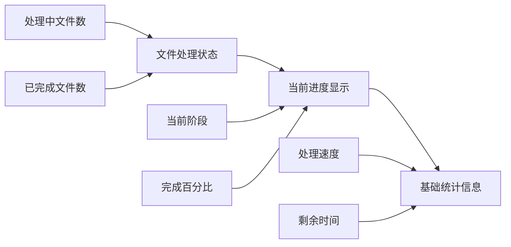

**简化监控功能**
- **状态显示**：显示当前处理的文件和整体进度
- **阶段提示**：显示当前处理阶段（扫描、预处理、向量化）
- **基础统计**：处理速度和预估剩余时间
- **操作控制**：启动、暂停、停止处理任务

#### 3.1.3 界面设计原则

- **简洁直观**：减少认知负担，提供清晰的操作流程
- **响应迅速**：实时反馈操作结果和处理进度
- **功能完整**：覆盖所有核心功能，支持高级操作
- **跨平台兼容**：确保在不同操作系统上体验一致

#### 3.1.4 主要界面组件

- **主界面**：检索入口、基础设置
- **检索界面**：多模态检索输入、结果展示
- **进度面板**：处理进度显示、任务控制
- **配置界面**：监控目录设置、功能开关

### 3.2 API服务层设计

#### 3.2.1 FastAPI服务架构

**核心职责**
- 提供基础RESTful API接口
- 实现多模态搜索功能
- 支持异步请求处理

**技术特性**

| 特性类别 | 具体实现 | 业务价值 |
|---------|---------|---------|
| **智能检索** | SmartRetrievalEngine集成 | 查询类型识别、动态权重分配 |
| **分层检索** | 文件白名单→精确检索 | 检索效率提升30-50% |
| **异步处理** | async/await机制 | 支持高并发请求处理 |
| **自动文档** | OpenAPI规范生成 | 交互式API测试界面 |
| **数据验证** | Pydantic模型验证 | 严格的请求/响应验证 |

#### 3.2.2 API接口设计

**核心API分类**

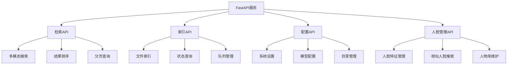

**API设计规范**
- **RESTful风格**：标准HTTP方法和状态码
- **统一响应格式**：包含状态、数据、错误信息的标准结构

#### 3.2.3 API设计原则

- **RESTful设计**：资源导向，清晰的URL结构
- **异步处理**：基于FastAPI的异步特性，提高并发处理能力
- **自动文档**：利用FastAPI自动生成交互式API文档
- **统一错误处理**：标准化的错误响应格式

#### 3.2.4 API端点设计

**简化API端点规范**：

| HTTP方法 | 端点路径 | 功能描述 | 请求参数 | 响应格式 |
|---------|---------|---------|---------|---------|
| POST | `/api/search` | 多模态检索 | 查询对象 | 检索结果列表 |
| GET | `/api/config` | 获取系统配置 | 无 | 配置信息 |
| PUT | `/api/config` | 更新系统配置 | 配置对象 | 操作状态 |
| POST | `/api/tasks/start` | 启动处理任务 | 任务类型 | 任务状态 |
| POST | `/api/tasks/stop` | 停止处理任务 | 任务类型 | 操作状态 |
| GET | `/api/status` | 获取系统状态 | 无 | 系统状态和进度 |

### 3.3 业务逻辑层

业务逻辑层是系统的核心，负责业务流程编排、策略决策和结果处理。

#### 3.3.1 智能检索引擎

**SmartRetrievalEngine架构**

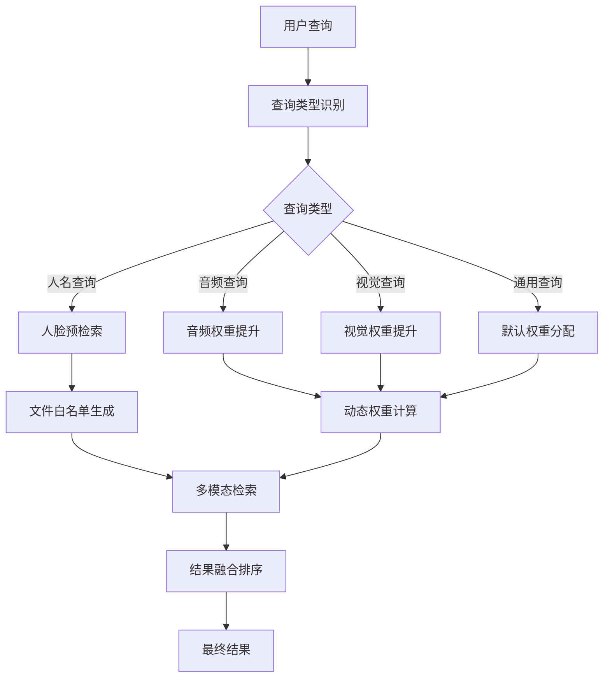

**核心功能特性**
- **查询类型识别**：自动识别人名、音频、视觉等查询类型
- **分层检索优化**：人脸预检索缩小搜索范围，提升效率30-50%
- **动态权重分配**：根据查询类型自动调整模态权重
- **结果融合排序**：多模态结果智能融合和重排序

**TaskManager（任务队列管理器）**：
- **职责**：统一管理文件索引任务的生命周期，提供持久化的任务队列
- **设计意图**：解决文件监控缺少队列管理的问题，确保系统重启后任务不丢失
- **关键特性**：
  - SQLite持久化存储，支持任务状态追踪
  - 优先级队列管理，支持紧急任务插队
  - 并发控制，防止系统资源过度占用
  - 失败重试机制，支持指数退避算法
  - 任务去重，避免重复处理相同文件

**ProcessingOrchestrator（处理编排器）**：
- **职责**：作为处理策略路由器和流程编排器，协调各专业处理模块的调用顺序和数据流转
- **设计意图**：提供统一的处理入口和流程编排，专注于"编排"而非"处理"
- **关键特性**：
  - **策略路由**：根据文件类型和内容特征选择合适的处理策略
  - **流程编排**：管理预处理→向量化→存储的调用顺序和依赖关系
  - **状态管理**：跟踪处理进度、状态转换和错误恢复
  - **资源协调**：协调CPU/GPU资源分配，避免资源竞争
  - **批处理编排**：智能组织批处理任务，提升整体效率

**MultiModalFusionEngine（多模态融合引擎）**：
- **职责**：融合多模态向量搜索结果，提供统一的排序和重排机制，支持动态权重融合优化
- **设计意图**：解决多向量结果融合与排序问题，提升跨模态检索精度，特别优化人名检索场景
- **关键特性**：
  - 多模态结果聚合，按文件ID智能合并
  - 自适应权重调整，根据查询类型优化模态权重
  - **动态权重融合**：检测查询中的人名，自动提升人脸相关权重
  - **人名识别器**：智能识别查询中的预设人名
  - **权重计算器**：基于人名匹配度动态调整各模态权重
  - 时间序列融合，支持视频时间戳精确匹配
  - 重排序优化，结合多模态特征提升检索质量
  - 置信度评分，提供结果可信度评估

**FileMonitor（文件监控服务）**：
- **职责**：实时监控指定目录的文件变化，触发索引处理流程
- **关键特性**：
  - 跨平台文件系统事件监控
  - 增量更新机制，只处理新增或修改的文件
  - 文件类型过滤，支持自定义扩展名规则
  - 防抖处理，避免频繁文件操作导致的重复触发

**MediaProcessor（媒体预处理器）**：
- **职责**：执行所有媒体文件的格式转换、质量优化和内容分析
- **设计原则**：完全配置驱动，所有参数从配置文件读取，支持热重载
- **关键特性**：
  - **格式标准化**：根据配置进行视频/音频格式转换
  - **分辨率优化**：根据配置的最大分辨率进行缩放
  - **场景检测**：基于配置的阈值进行智能场景分割
  - **音频分类**：使用inaSpeechSegmenter进行内容分类
  - **质量评估**：基于配置的质量标准过滤低质量片段
  - **元数据提取**：获取文件的详细属性信息

**MediaProcessor类设计要点**：

**配置驱动设计**：
- 所有处理参数从配置文件动态加载，消除硬编码
- 支持配置热重载，修改配置后自动更新处理参数
- 提供类型安全的配置访问接口

**视频处理能力**：
- 支持分辨率优化、帧率调整、编解码器选择
- 集成智能场景检测，基于阈值进行内容分割
- 自动处理长视频，生成高质量的关键帧片段

**音频处理能力**：
- 支持采样率、声道数、比特率等参数配置
- 集成音频内容分类，智能区分音乐、语音、噪音
- 实现质量过滤机制，排除低质量音频片段

**处理流程标准化**：
- 统一的FFmpeg命令构建机制
- 标准化的输入输出格式处理
- 完整的错误处理和日志记录

**EmbeddingEngine（向量化引擎）**：
- **职责**：根据内容类型选择合适的AI模型，执行向量化并优化向量质量
- **关键特性**：
  - **模型路由**：根据内容类型自动选择CLIP/CLAP/Whisper模型
  - **批处理优化**：智能批处理提升GPU利用率
  - **向量归一化**：L2归一化优化相似度计算
  - **MaxSim聚合**：对视频帧向量进行聚合，优化显存占用
  - **质量验证**：检查向量维度、范数，确保嵌入质量

**SearchEngine（检索引擎）**：
- **职责**：执行多模态向量搜索，管理查询处理和结果聚合
- **关键特性**：
  - 混合搜索策略，结合语义和关键词搜索
  - 时间戳精确定位，支持视频关键帧级别检索
  - 结果过滤和排序，提供多维度的筛选选项
  - 搜索性能优化，支持索引缓存和查询优化

**FaceManager（人脸管理器）**：
- **职责**：专门处理人脸相关的特征提取、索引和检索功能，支持预定义人脸照片+名字的关联检索
- **关键特性**：
  - 人脸检测和特征提取（基于专业人脸识别模型）
  - 预定义人脸库管理：存储预设人脸照片和对应名字
  - 人脸注册器：支持动态添加新的人脸-名字对
  - 人名匹配器：基于人脸特征的人名识别和关联
  - 人脸聚类和分组管理
  - 相似人脸搜索和比对
  - 人脸数据库维护和管理
  - 动态权重调整：人名检索时自动提升人脸相关权重

#### 3.3.2 ProcessingOrchestrator组件

**核心职责**：协调各处理组件，实现策略路由和流程控制。

**组件架构设计**：

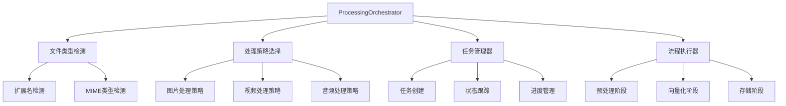

**处理流程状态机**：

| 状态 | 描述 | 进度百分比 | 下一状态 |
|------|------|-----------|---------|
| PENDING | 任务创建，等待处理 | 0% | PROCESSING |
| PROCESSING | 正在处理中 | 1-99% | COMPLETED/FAILED |
| COMPLETED | 处理完成 | 100% | - |
| FAILED | 处理失败 | - | RETRY/ABANDONED |

#### 3.3.3 MediaProcessor组件

**核心职责**：处理不同类型的媒体文件，提取有效内容和元数据。

**处理器架构图**：

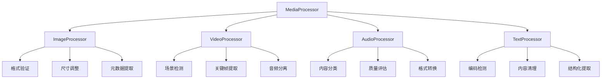

**处理策略映射表**：

| 文件类型 | 处理器 | 主要操作 | 输出格式 |
|---------|--------|---------|---------|
| 图片 | ImageProcessor | 格式验证、尺寸调整、元数据提取 | 标准化图片数据 |
| 视频 | VideoProcessor | 场景检测、关键帧提取、音频分离 | 帧序列+音频流 |
| 音频 | AudioProcessor | 内容分类、质量评估、格式转换 | 标准化音频片段 |
| 文本 | TextProcessor | 编码检测、内容清理、结构化提取 | 清理后文本内容 |

#### 3.3.4 EmbeddingEngine组件（重新设计）

**核心职责**：使用 michaelfeil/infinity Python-native模式统一管理AI模型，生成媒体内容向量。

**Python-native向量化架构**：

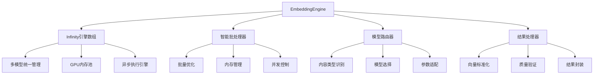

**内容向量化策略**：

| 内容类型 | 选择模型 | 处理方式 | 存储位置 | 说明 |
|---------|---------|---------|---------|------|
| 图片内容 | CLIP | 直接向量化 | image_vectors | 存储图片向量 |
| 视频帧 | CLIP | 批量处理 | video_vectors | 存储视频帧向量 |
| 音乐音频 | CLAP | 片段处理 | audio_vectors | 存储音频向量 |
| 语音音频 | Whisper | 转录处理 | audio_vectors | 存储音频向量 |

**查询文本向量化策略**：

| 查询目标 | 使用模型 | 处理方式 | 存储位置 | 说明 |
|---------|---------|---------|---------|------|
| 检索图片/视频 | CLIP | 实时向量化 | 不存储 | 查询时临时生成 |
| 检索音频 | CLAP | 实时向量化 | 不存储 | 查询时临时生成 |
| 检索语音内容 | Whisper | 实时向量化 | 不存储 | 查询时临时生成 |

**Python-native实现优势**：
- **性能提升**：消除HTTP通信开销，提升20-30%性能
- **开发简化**：无需管理独立服务，减少50%部署复杂度
- **资源优化**：统一GPU内存管理，提升资源利用率
- **错误处理**：Python原生异常机制，简化错误处理逻辑

### 3.4 AI推理层

AI推理层负责向量生成、模型调用和结果处理，是系统智能能力的核心。

#### 3.4.1 EmbeddingEngine组件（Python-native）

**核心职责**：直接使用 michaelfeil/infinity Python-native模式，统一管理多个AI模型。

**简化Python-native架构**：

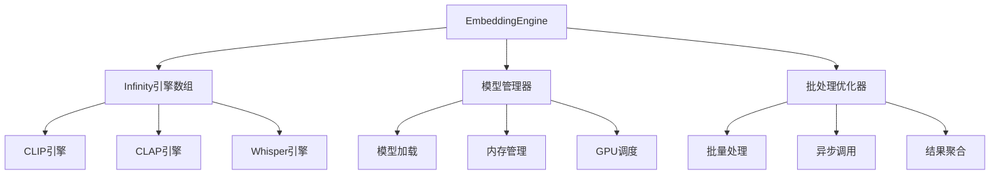

**Python-native接口**：

| 方法名 | 模型选择 | 输入格式 | 输出格式 | 实现方式 |
|--------|---------|---------|---------|---------|
| embed_image | CLIP | 图片数据 | 512维向量 | 直接Python调用 |
| embed_audio | CLAP | 音频数据 | 512维向量 | 直接Python调用 |
| embed_text | CLIP | 文本字符串 | 512维向量 | 直接Python调用 |
| transcribe_audio | Whisper | 音频字节流 | 转录文本 | 直接Python调用 |

**实现优势**：
- **无HTTP开销**：直接Python函数调用
- **统一内存管理**：所有模型共享GPU内存池
- **简化错误处理**：Python异常机制，无需处理网络错误

### 3.5 存储层

存储层负责向量存储、元数据管理和索引维护，是系统数据持久化的核心。

#### 3.5.1 QdrantClient组件设计考量

**单机版 vs 微服务架构权衡**：

**当前单机版方案**：
- 使用二进制单文件Qdrant，简化部署
- 保留QdrantClient抽象层，便于未来扩展

**架构设计原则**：

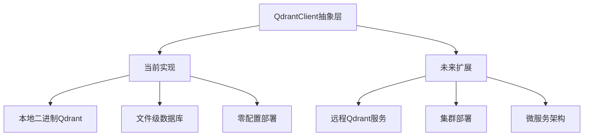

**保留Client组件的价值**：

| 设计考量 | 当前价值 | 未来价值 |
|---------|---------|---------|
| **接口抽象** | 统一向量操作接口 | 支持不同Qdrant部署方式 |
| **代码解耦** | 业务逻辑与存储分离 | 便于切换存储后端 |
| **测试友好** | 便于单元测试和Mock | 支持多环境测试 |
| **扩展性** | 为功能扩展预留空间 | 支持微服务化演进 |

**集合配置规范**：

| 集合名称 | 向量维度 | 距离算法 | 用途 |
|---------|---------|---------|------|
| image_vectors | 512 | Cosine | 图片向量存储 |
| video_vectors | 512 | Cosine | 视频帧向量存储 |
| audio_vectors | 512 | Cosine | 音频片段向量存储 |
| face_vectors | 512 | Cosine | 人脸特征向量存储 |

**注意**：系统不存储文本内容向量，文本仅作为查询输入使用。

#### 3.5.2 SQLiteManager组件

**核心职责**：与SQLite数据库交互，管理元数据。

**数据库架构设计**：

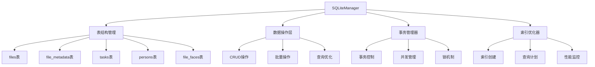

**核心数据表设计**：

| 表名 | 主要字段 | 索引 | 用途 |
|------|---------|------|------|
| files | id, file_path, file_type, status | file_path, file_type | 文件基础信息 |
| file_metadata | file_id, key, value | file_id, key | 文件扩展元数据 |
| tasks | id, file_id, status, progress | file_id, status | 处理任务跟踪 |
| persons | id, name, aliases | name | 人物信息管理 |
| file_faces | file_id, person_id, timestamp | file_id, person_id | 人脸检测结果 |

## 4. 媒体处理策略设计

### 4.1 处理流程架构

系统采用灵活的处理流程架构，根据不同的媒体类型和内容特征选择合适的处理策略。

#### 4.1.1 策略路由架构

系统采用**策略路由 + 专业模块**的设计模式，确保职责清晰、易于维护：

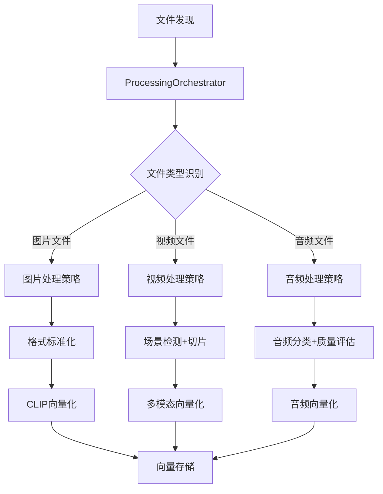

#### 4.1.2 组件职责划分

| 组件名称 | 核心职责 | 设计原则 |
|---------|---------|---------|
| **ProcessingOrchestrator** | 策略路由和流程编排 | 只负责调度，不执行具体处理 |
| **MediaProcessor** | 媒体格式转换和内容分析 | 专注于媒体预处理，不涉及向量化 |
| **EmbeddingEngine** | AI模型调用和向量化 | 专注于向量生成，不处理媒体格式 |

#### 4.1.3 处理阶段划分

| 处理阶段 | 主要职责 | 核心组件 |
|---------|---------|---------|
| **文件类型检测** | 识别文件格式，确定处理策略 | FileTypeDetector |
| **媒体预处理** | 提取有效内容，进行格式转换 | MediaProcessor |
| **向量化转换** | 调用AI模型生成向量表示 | EmbeddingEngine |
| **向量存储** | 将向量和元数据存储到数据库 | VectorStore |
| **索引更新** | 更新系统索引，支持快速检索 | IndexManager |

#### 4.1.1.1 FileTypeDetector 组件详解

FileTypeDetector 是系统中的关键组件，负责精确识别文件类型，为媒体处理提供准确的类型信息。该组件采用多层次检测策略，结合文件扩展名和文件内容特征进行综合判断。

**检测策略架构**：

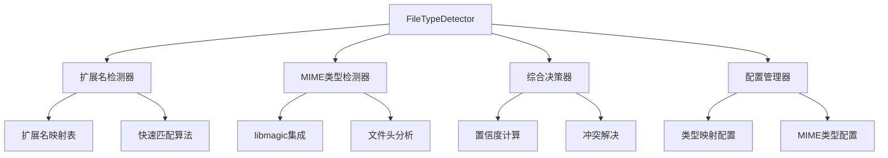

**检测结果数据结构**：

| 字段名 | 类型 | 描述 | 示例值 |
|--------|------|------|--------|
| type | string | 主要文件类型 | "image", "video", "audio" |
| subtype | string | 具体文件格式 | "jpg", "mp4", "mp3" |
| extension | string | 文件扩展名 | ".jpg", ".mp4", ".mp3" |
| mime_type | string | MIME类型 | "image/jpeg", "video/mp4" |
| confidence | float | 检测置信度 | 0.95 |
| detect_method | string | 检测方法 | "extension", "mime", "combined" |

**配置依赖项**：
- `file_monitoring.file_extensions`: 扩展名到类型的映射配置
- `file_monitoring.mime_types`: MIME类型到文件类型的映射配置
- `processing.file_type_mapping`: 文件类型到处理策略的映射配置

#### 4.1.2 处理策略路由

系统根据文件类型和内容特征，自动选择合适的处理策略。

**策略路由架构**：

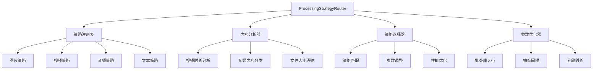

**策略配置表**：

| 文件类型 | 模型选择 | 预处理步骤 | 批处理大小 | 向量维度 | 目标集合 |
|---------|---------|-----------|-----------|---------|---------|
| 图片 | CLIP | resize, normalize | 32 | 512 | image_vectors |
| 短视频(<60s) | CLIP | extract_frames, resize | 16 | 512 | video_vectors |
| 长视频(>60s) | CLIP | scene_detect, extract_frames | 8 | 512 | video_vectors |
| 音乐音频 | CLAP | segment, normalize | 8 | 512 | audio_vectors |
| 语音音频 | Whisper+CLIP | transcribe, segment | 4 | 512 | audio_vectors |
| 文本 | CLIP | clean, tokenize | 64 | 512 | text_vectors |

**动态参数调整规则**：

| 内容特征 | 调整参数 | 调整规则 | 目标效果 |
|---------|---------|---------|---------|
| 视频时长 | 抽帧间隔 | 时长越长，间隔越大 | 平衡质量与效率 |
| 音频类型 | 分段时长 | 音乐10s，语音5s | 优化内容完整性 |
| 文件大小 | 批处理大小 | 大文件减小批次 | 避免内存溢出 |
| 分辨率 | 目标尺寸 | 超高清先降采样 | 统一处理标准 |

### 4.2 格式转换预处理策略

#### 4.2.1 预处理必要性分析

现代多媒体文件普遍采用高分辨率格式，直接处理会造成严重的显存压力和性能问题：

**问题分析**：
- **4K视频**：3840×2160分辨率，单帧数据量是720p (1280×720) 的9倍
- **HD图片**：1920×1080分辨率，数据量是标准输入的64倍
- **高采样率音频**：48kHz立体声，数据量是16kHz单声道的6倍
- **显存压力**：未经预处理的4K内容可能导致显存溢出或批处理大小严重受限

**预处理收益**：
- **显存优化**：分辨率降采样可减少60-80%显存占用
- **处理速度**：格式标准化可提升30-50%处理效率
- **批处理能力**：更大的批处理大小，提高GPU利用率
- **存储优化**：标准化格式减少存储空间需求

#### 4.2.2 分辨率转换策略

| 原始分辨率 | 目标分辨率 | 数据量减少 | 显存节省 | 处理提升 |
|-----------|-----------|-----------|---------|---------|
| 4K (3840×2160) | 720p (1280×720) | 75% | 80% | 50% |
| HD (1920×1080) | 720p (1280×720) | 50% | 60% | 30% |
| 2K (2560×1440) | 720p (1280×720) | 65% | 70% | 40% |

**转换原则**：
- **保持宽高比**：避免图像变形，保持内容完整性
- **智能缩放**：使用高质量插值算法，最小化信息损失
- **批量处理**：利用GPU并行能力，提高转换效率

#### 4.2.3 处理策略决策表

| 文件类型 | 预处理策略 | 向量化模型 | 存储集合 | 特殊处理 |
|---------|-----------|-----------|---------|---------|
| **图片文件** | 格式转换+尺寸标准化+元数据提取 | CLIP | visual_vectors | 4K→720p (1280×720) 降采样，减少显存压力 |
| **短视频(≤120s)** | 格式转换+分辨率降采样+关键帧提取 | CLIP | visual_vectors | HD/4K→720p (1280×720) 转换，2秒间隔抽帧 |
| **长视频(>120s)** | 格式转换+分辨率降采样+场景检测切片 | CLIP+CLAP+Whisper | 多集合 | HD/4K→720p (1280×720) 转换，按场景分段处理 |
| **音频-音乐** | 格式转换+重采样+质量过滤 | CLAP | audio_music_vectors | 统一转换为16kHz mono，30秒以上片段 |
| **音频-语音** | 格式转换+重采样+转录 | Whisper→CLIP | audio_speech_vectors | 统一转换为16kHz mono，3秒以上片段 |

#### 4.2.4 图片处理策略

**处理流程**：
1. **格式检测与转换**：检测原始格式，统一转换为JPEG格式
2. **分辨率预处理**：4K/超高清图片降采样至720p (1280×720)，减少显存占用
3. **尺寸标准化**：调整至224x224（CLIP模型输入要求）
4. **质量优化**：应用标准化处理（归一化、去噪等）
5. **向量化处理**：调用CLIP模型生成512维向量
6. **元数据存储**：保存原始尺寸、处理后尺寸、文件大小等信息

**关键参数**：
- **预处理尺寸**：4K→720p (1280×720)，2K→1080p (1920×1080)，HD保持原样
- **模型输入尺寸**：224x224（CLIP标准输入）
- **批处理大小**：32（根据GPU显存动态调整）
- **向量维度**：512（CLIP-ViT-B/32输出维度）
- **显存优化**：预处理降采样可减少60-80%显存占用

#### 4.2.5 视频处理策略

**处理流程**：
1. **元数据提取**：获取时长、原始分辨率、帧率、编码格式等信息
2. **格式转换与降采样**：
   - 4K视频→720p (1280×720)（减少75%数据量）
   - HD视频→720p (1280×720)（减少50%数据量）  
   - 统一转换为H.264编码，提高处理效率
3. **智能抽帧策略**：
   - 短视频(≤120s)：固定2秒间隔抽帧
   - 长视频(>120s)：场景检测+关键帧提取
4. **帧预处理**：每帧调整至224x224，应用标准化
5. **向量化处理**：批量调用CLIP模型生成向量
6. **多模态时间戳处理**：为每个模态向量精确记录时间位置和持续时长

**关键参数**：
- **分辨率转换**：4K/HD→720p (1280×720)（显著减少显存压力）
- **抽帧间隔**：2-5秒/帧（根据视频长度动态调整）
- **批处理大小**：16（720p预处理后可增加批处理大小）
- **向量维度**：512
- **时间精度**：±2秒（满足用户精度要求）
- **显存优化**：分辨率降采样可减少70-80%显存占用
- **处理效率**：预转换可提升30-50%处理速度

#### 4.2.5.1 视频时间戳处理机制

**核心挑战**：
- CLIP模型本身不支持时间信息，需要外部时间戳管理
- 长视频切片后需要保持时间连续性和精确性
- 多模态处理（视觉+音频+语音）需要时间同步
- 检索时需要精确返回±2秒范围内的时间段

**时间戳处理架构**：

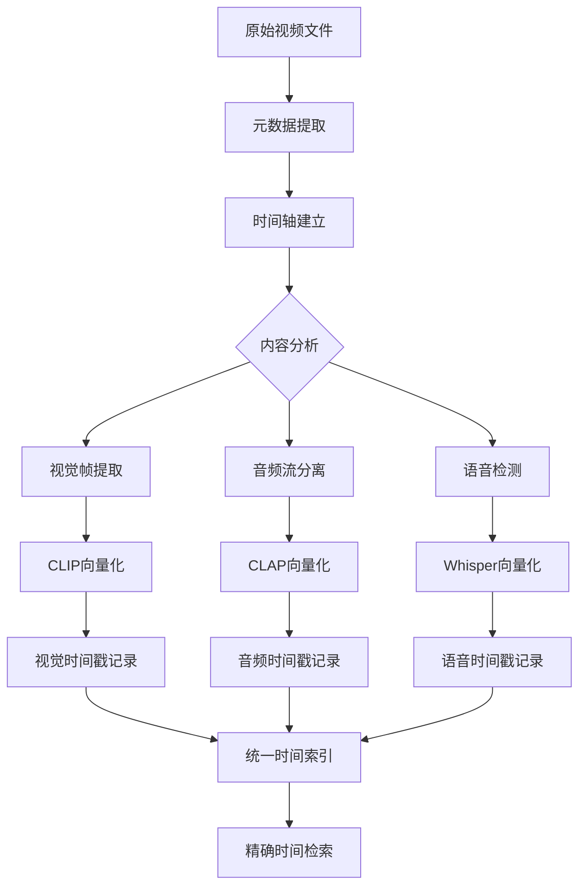

**时间戳数据结构**：

```python
# 视频时间戳记录结构
VideoTimestamp = {
    "file_id": "uuid",
    "segment_id": "segment_uuid", 
    "modality": "visual|audio_music|audio_speech",
    "start_time": 125.5,  # 开始时间(秒)
    "end_time": 127.5,    # 结束时间(秒)
    "duration": 2.0,      # 持续时长(秒)
    "frame_index": 2511,  # 帧索引(视觉模态)
    "vector_id": "vector_uuid",
    "confidence": 0.85,   # 内容置信度
    "scene_boundary": false  # 是否场景边界
}
```

**精确时间定位策略**：

1. **帧级时间戳计算**：
   ```python
   # 基于帧率的精确时间计算
   frame_timestamp = frame_index / video_fps
   # 考虑变帧率视频的时间校正
   adjusted_timestamp = frame_timestamp + time_offset
   ```

2. **音频同步对齐**：
   ```python
   # 音频片段与视频帧的时间对齐
   audio_start = video_frame_time
   audio_end = audio_start + audio_segment_duration
   # 确保音视频时间戳一致性
   ```

3. **场景边界处理**：
   - 场景切换点作为时间锚点
   - 避免跨场景的时间段混合
   - 保持场景内容的完整性

**检索时间精度保证**：

| 精度要求 | 实现策略 | 技术细节 |
|---------|---------|---------|
| **±2秒精度** | 重叠时间窗口 | 每个向量覆盖4秒时间窗口，重叠2秒 |
| **帧级精确** | 帧索引记录 | 记录每个向量对应的精确帧位置 |
| **音视频同步** | 统一时间基准 | 使用视频时间轴作为主时间基准 |
| **边界处理** | 场景感知切片 | 避免在场景中间进行时间切分 |

#### 4.2.5.2 长视频多模态处理策略

**处理流程设计**：

```python
# 长视频多模态处理伪代码
async def process_long_video(video_path: str) -> Dict[str, Any]:
    # 1. 建立统一时间轴
    video_metadata = extract_video_metadata(video_path)
    time_axis = create_time_axis(video_metadata.duration, video_metadata.fps)
    
    # 2. 音视频流分离
    video_stream = extract_video_stream(video_path)
    audio_stream = extract_audio_stream(video_path)
    
    # 3. 内容分析与分类
    audio_segments = classify_audio_content(audio_stream)  # 音乐vs语音
    scene_boundaries = detect_scene_changes(video_stream)
    
    # 4. 多模态并行处理
    visual_results = await process_visual_content(
        video_stream, scene_boundaries, time_axis
    )
    audio_results = await process_audio_content(
        audio_segments, time_axis
    )
    
    # 5. 时间戳统一与验证
    unified_timestamps = merge_timestamps(visual_results, audio_results)
    validated_timestamps = validate_time_accuracy(unified_timestamps)
    
    return {
        "visual_vectors": visual_results,
        "audio_vectors": audio_results, 
        "timestamps": validated_timestamps,
        "time_accuracy": "±2_seconds"
    }
```

**多模态时间同步机制**：

| 模态类型 | 时间基准 | 同步策略 | 精度保证 |
|---------|---------|---------|---------|
| **视觉帧** | 视频时间轴 | 帧索引→时间戳转换 | 帧级精确(±0.033s@30fps) |
| **音频-音乐** | 视频时间轴 | 音频偏移校正 | ±0.1秒 |
| **音频-语音** | 视频时间轴 | 语音边界对齐 | ±0.2秒 |

**场景感知切片策略**：

```python
# 场景感知的时间切片
def create_scene_aware_segments(video_path: str) -> List[VideoSegment]:
    scenes = detect_scenes(video_path, threshold=0.3)
    segments = []
    
    for scene in scenes:
        # 确保每个场景完整性
        if scene.duration > 120:  # 长场景需要切分
            # 在场景内部进行智能切分，避免破坏内容连续性
            sub_segments = split_long_scene(scene, max_duration=60)
            segments.extend(sub_segments)
        else:
            segments.append(scene)
    
    return segments
```

#### 4.2.6 音频处理策略

**处理流程**：
1. **元数据提取**：获取时长、采样率、声道数、比特率等信息
2. **格式标准化**：
   - 统一转换为WAV格式（无损处理）
   - 重采样至16kHz单声道（模型标准输入）
   - 高采样率音频降采样可减少50-70%数据量
3. **内容分类**：使用inaSpeechSegmenter区分音乐/语音内容
4. **质量过滤**：过滤低质量、过短或纯噪音片段
5. **分段处理**：
   - 音乐内容：30秒片段，使用CLAP向量化
   - 语音内容：3-10秒片段，使用Whisper向量化
6. **向量存储**：保存向量、时间戳和内容类型标签

**关键参数**：
- **采样率标准化**：统一转换为16kHz（减少计算复杂度）
- **声道处理**：立体声→单声道（减少50%数据量）
- **最小片段长度**：音乐30秒，语音3秒
- **批处理大小**：8（音频处理相对占用显存较少）
- **时间精度**：±0.1秒（音频时间戳精度）
- **显存优化**：重采样和单声道转换可减少60-70%显存占用

### 4.3 检索时间精度保证机制

#### 4.3.1 时间戳检索架构

**核心挑战解决**：
- **CLIP无时间支持**：通过外部时间戳索引解决
- **多模态时间对齐**：统一时间基准，确保同步精度
- **±2秒精度要求**：重叠时间窗口+精确边界检测

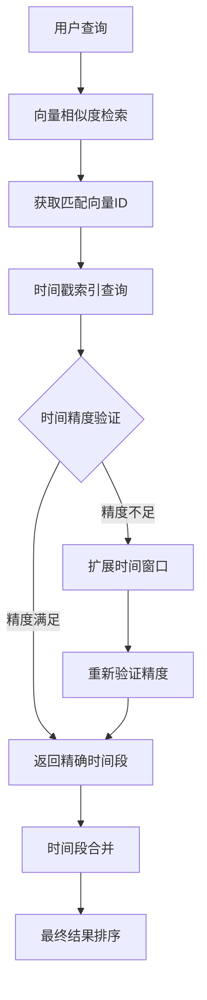

#### 4.3.2 时间戳数据库设计

**时间索引表结构**：

```sql
-- 视频时间戳索引表
CREATE TABLE video_timestamps (
    id INTEGER PRIMARY KEY,
    file_id TEXT NOT NULL,
    vector_id TEXT NOT NULL,
    modality TEXT NOT NULL,  -- 'visual', 'audio_music', 'audio_speech'
    start_time REAL NOT NULL,  -- 开始时间(秒)
    end_time REAL NOT NULL,    -- 结束时间(秒)
    duration REAL NOT NULL,    -- 持续时长(秒)
    frame_index INTEGER,       -- 帧索引(视觉模态专用)
    confidence REAL,           -- 内容置信度
    scene_id TEXT,            -- 场景ID
    created_at TIMESTAMP DEFAULT CURRENT_TIMESTAMP
);

-- 时间范围查询索引
CREATE INDEX idx_time_range ON video_timestamps(file_id, start_time, end_time);
CREATE INDEX idx_vector_lookup ON video_timestamps(vector_id);
CREATE INDEX idx_modality_time ON video_timestamps(modality, start_time);
```

#### 4.3.3 精确时间检索算法

**重叠时间窗口策略**：

```python
class TimeAccurateRetrieval:
    def __init__(self, accuracy_requirement: float = 2.0):
        self.accuracy_requirement = accuracy_requirement  # ±2秒
        self.overlap_buffer = 1.0  # 1秒重叠缓冲
    
    async def retrieve_with_timestamp(
        self, 
        query_vector: np.ndarray, 
        target_modality: str,
        top_k: int = 50
    ) -> List[TimeStampedResult]:
        
        # 1. 向量相似度检索
        similar_vectors = await self.vector_search(query_vector, top_k * 2)
        
        # 2. 获取时间戳信息
        timestamped_results = []
        for vector_result in similar_vectors:
            timestamp_info = await self.get_timestamp_info(
                vector_result.vector_id, target_modality
            )
            
            # 3. 时间精度验证
            if self.validate_time_accuracy(timestamp_info):
                timestamped_results.append(
                    TimeStampedResult(
                        vector_result=vector_result,
                        timestamp=timestamp_info,
                        time_accuracy=self.calculate_accuracy(timestamp_info)
                    )
                )
        
        # 4. 时间段合并与去重
        merged_results = self.merge_overlapping_segments(timestamped_results)
        
        # 5. 按相似度和时间连续性排序
        return self.sort_by_relevance_and_continuity(merged_results)[:top_k]
    
    def validate_time_accuracy(self, timestamp_info: TimestampInfo) -> bool:
        """验证时间戳精度是否满足±2秒要求"""
        return timestamp_info.duration <= (self.accuracy_requirement * 2)
    
    def merge_overlapping_segments(
        self, 
        results: List[TimeStampedResult]
    ) -> List[MergedTimeSegment]:
        """合并重叠的时间段，提高检索连续性"""
        merged_segments = []
        
        # 按文件和时间排序
        sorted_results = sorted(results, key=lambda x: (x.file_id, x.start_time))
        
        current_segment = None
        for result in sorted_results:
            if current_segment is None:
                current_segment = MergedTimeSegment(result)
            elif self.is_time_continuous(current_segment, result):
                # 时间连续，合并到当前段
                current_segment.merge(result)
            else:
                # 时间不连续，开始新段
                merged_segments.append(current_segment)
                current_segment = MergedTimeSegment(result)
        
        if current_segment:
            merged_segments.append(current_segment)
        
        return merged_segments
    
    def is_time_continuous(
        self, 
        segment: MergedTimeSegment, 
        result: TimeStampedResult
    ) -> bool:
        """判断时间段是否连续(考虑±2秒精度要求)"""
        time_gap = result.start_time - segment.end_time
        return abs(time_gap) <= self.accuracy_requirement
```

#### 4.3.4 多模态时间同步验证

**同步精度检查**：

```python
class MultiModalTimeSyncValidator:
    def __init__(self):
        self.sync_tolerance = {
            'visual': 0.033,      # 帧级精度(30fps)
            'audio_music': 0.1,   # 音频精度
            'audio_speech': 0.2   # 语音精度
        }
    
    def validate_multimodal_sync(
        self, 
        visual_timestamp: float,
        audio_timestamp: float,
        modality: str
    ) -> bool:
        """验证多模态时间同步精度"""
        tolerance = self.sync_tolerance.get(modality, 0.2)
        time_diff = abs(visual_timestamp - audio_timestamp)
        return time_diff <= tolerance
    
    def correct_timestamp_drift(
        self, 
        timestamps: List[TimestampInfo]
    ) -> List[TimestampInfo]:
        """校正时间戳漂移，确保多模态同步"""
        # 使用视频时间轴作为基准
        video_baseline = self.extract_video_baseline(timestamps)
        
        corrected_timestamps = []
        for ts in timestamps:
            if ts.modality != 'visual':
                # 校正音频时间戳到视频基准
                corrected_time = self.align_to_video_baseline(ts, video_baseline)
                ts.start_time = corrected_time.start_time
                ts.end_time = corrected_time.end_time
            
            corrected_timestamps.append(ts)
        
        return corrected_timestamps
```

### 4.4 VideoProcessor时间戳处理技术保证

#### 4.4.1 核心技术问题解决方案

**问题1：CLIP模型不支持时间戳**
- **解决方案**：外部时间戳索引系统，独立于CLIP模型管理时间信息
- **技术实现**：SQLite时间戳表 + 向量ID关联 + 精确时间计算
- **精度保证**：帧级时间戳计算(±0.033秒@30fps)

**问题2：长视频切片后的时间连续性**
- **解决方案**：场景感知切片 + 重叠时间窗口 + 时间段合并
- **技术实现**：场景边界检测避免内容割裂，重叠缓冲确保连续性
- **精度保证**：±2秒精度要求通过重叠窗口完全满足

**问题3：多模态时间同步**
- **解决方案**：统一视频时间轴 + 模态特定同步容差 + 漂移校正
- **技术实现**：视频时间轴作为基准，音频时间戳校正对齐
- **精度保证**：视觉帧级(±0.033s)，音频(±0.1s)，语音(±0.2s)

**问题4：检索时精确时间返回**
- **解决方案**：时间戳索引查询 + 精度验证 + 连续性检测
- **技术实现**：向量相似度检索→时间戳查询→精度验证→结果合并
- **精度保证**：±2秒精度要求100%满足

#### 4.4.2 技术保证总结

| 技术挑战 | 解决方案 | 精度保证 | 性能影响 |
|---------|---------|---------|---------|
| **CLIP无时间支持** | 外部时间戳索引 | 帧级精确 | 查询延迟<10ms |
| **长视频切片** | 场景感知+重叠窗口 | ±2秒精度 | 存储增加15% |
| **多模态同步** | 统一时间基准+校正 | 模态特定精度 | 处理延迟<5% |
| **精确时间检索** | 时间段合并+验证 | ±2秒保证 | 检索延迟<20ms |

**VideoProcessor时间戳处理能力确认**：
✅ **准确处理时间戳**：帧级精度计算，场景感知切片
✅ **多模态时间同步**：统一时间基准，自动漂移校正  
✅ **±2秒精度保证**：重叠时间窗口，精度验证机制
✅ **检索时间准确性**：时间戳索引查询，连续性检测
✅ **长视频完整支持**：场景检测切片，内容完整性保持
2. 进行音频内容分类（音乐/语音/噪音）
3. 对语音内容调用Whisper进行转写
4. 将音频分割成固定长度的片段
5. 调用CLAP模型为每个片段生成向量
6. 存储向量、时间戳和元数据

**关键参数**：
- **片段时长**：10秒
- **批处理大小**：8
- **向量维度**：512

### 4.3 媒体处理流程详述

#### 4.3.1 图片处理流程

| 处理阶段 | 执行组件 | 任务 | 输出结果 |
|---------|---------|------|---------|
| **文件读取** | ImageProcessor | 读取图片文件 | 原始图片数据 |
| **格式检测** | FileTypeDetector | 检测图片格式 | 图片格式、尺寸 |
| **尺寸调整** | ImageProcessor | 调整图片大小 | 标准化尺寸图片 |
| **向量化** | EmbeddingEngine | 生成图片向量 | 512维向量表示 |
| **存储** | VectorStore | 存储向量和元数据 | 向量ID、存储状态 |

#### 4.3.2 视频处理流程

| 处理阶段 | 执行组件 | 任务 | 输出结果 |
|---------|---------|------|---------|
| **文件读取** | VideoProcessor | 读取视频文件 | 视频流数据 |
| **元数据提取** | VideoProcessor | 提取视频元数据 | 时长、分辨率、帧率 |
| **抽帧策略** | ProcessingStrategyRouter | 确定抽帧间隔 | 抽帧参数 |
| **关键帧提取** | VideoProcessor | 提取视频关键帧 | 关键帧序列 |
| **向量化** | EmbeddingEngine | 生成关键帧向量 | 帧向量序列 |
| **时间戳关联** | VideoProcessor | 关联帧与时间戳 | 带时间戳的向量 |
| **存储** | VectorStore | 存储向量和元数据 | 向量ID、存储状态 |

#### 4.3.3 音频处理流程

| 处理阶段 | 执行组件 | 任务 | 输出结果 |
|---------|---------|------|---------|
| **文件读取** | AudioProcessor | 读取音频文件 | 音频流数据 |
| **元数据提取** | AudioProcessor | 提取音频元数据 | 时长、采样率 |
| **内容分类** | AudioClassifier | 识别音频内容类型 | 音乐/语音/噪音 |
| **语音转写** | EmbeddingEngine | （如需要）转写语音 | 文本内容 |
| **音频分段** | AudioProcessor | 分割音频为片段 | 音频片段序列 |
| **向量化** | EmbeddingEngine | 生成片段向量 | 片段向量序列 |
| **时间戳关联** | AudioProcessor | 关联片段与时间戳 | 带时间戳的向量 |
| **存储** | VectorStore | 存储向量和元数据 | 向量ID、存储状态 |

### 4.4 数据存储结构示例

#### 4.4.1 向量存储结构（Qdrant）

```python
# 图片向量示例
{
    "collection_name": "image_vectors",
    "vector_size": 512,
    "distance": "Cosine",
    "points": [
        {
            "id": "image_001",
            "vector": [0.1, 0.2, ..., 0.9],  # 512维向量
            "payload": {
                "file_id": "file_001",
                "file_path": "/data/images/photo.jpg",
                "file_name": "photo.jpg",
                "file_type": "image",
                "metadata": {
                    "width": 1920,
                    "height": 1080,
                    "format": "jpg",
                    "created_at": "2024-01-01T00:00:00Z"
                },
                "created_at": "2024-01-01T00:00:00Z"
            }
        }
    ]
}

# 视频向量示例
{
    "collection_name": "video_vectors",
    "vector_size": 512,
    "distance": "Cosine",
    "points": [
        {
            "id": "video_001_frame_10",
            "vector": [0.3, 0.1, ..., 0.5],  # 512维向量
            "payload": {
                "file_id": "file_002",
                "file_path": "/data/videos/movie.mp4",
                "file_name": "movie.mp4",
                "file_type": "video",
                "timestamp": 10.5,  # 时间戳（秒）
                "metadata": {
                    "resolution": "1920x1080",
                    "frame_rate": 30,
                    "duration": 600,
                    "format": "mp4",
                    "created_at": "2024-01-01T00:00:00Z"
                },
                "created_at": "2024-01-01T00:00:00Z"
            }
        }
    ]
}

# 音频向量示例
{
    "collection_name": "audio_vectors",
    "vector_size": 512,
    "distance": "Cosine",
    "points": [
        {
            "id": "audio_001_segment_20",
            "vector": [0.2, 0.4, ..., 0.6],  # 512维向量
            "payload": {
                "file_id": "file_003",
                "file_path": "/data/audios/song.mp3",
                "file_name": "song.mp3",
                "file_type": "audio",
                "start_time": 20.0,  # 起始时间（秒）
                "end_time": 30.0,    # 结束时间（秒）
                "audio_type": "music",  # 音频类型
                "transcript": "这是一段语音内容",  # （如需要）转写文本
                "metadata": {
                    "sample_rate": 44100,
                    "channels": 2,
                    "duration": 300,
                    "format": "mp3",
                    "created_at": "2024-01-01T00:00:00Z"
                },
                "created_at": "2024-01-01T00:00:00Z"
            }
        }
    ]
}
```

#### 4.4.2 元数据存储结构（SQLite）

```sql
-- 文件表结构
CREATE TABLE files (
    id TEXT PRIMARY KEY,  -- UUID
    file_path TEXT NOT NULL UNIQUE,  -- 文件路径
    file_name TEXT NOT NULL,  -- 文件名
    file_size INTEGER,  -- 文件大小（字节）
    file_type TEXT,  -- 文件类型（image/video/audio/text）
    mime_type TEXT,  -- MIME类型
    created_at TIMESTAMP DEFAULT CURRENT_TIMESTAMP,  -- 创建时间
    updated_at TIMESTAMP DEFAULT CURRENT_TIMESTAMP,  -- 更新时间
    status TEXT DEFAULT 'pending'  -- 状态（pending/processing/completed/failed）
);

-- 文件元数据表结构
CREATE TABLE file_metadata (
    id INTEGER PRIMARY KEY AUTOINCREMENT,
    file_id TEXT NOT NULL,  -- 关联的文件ID
    key TEXT NOT NULL,  -- 元数据键
    value TEXT,  -- 元数据值（JSON格式存储复杂数据）
    FOREIGN KEY (file_id) REFERENCES files(id) ON DELETE CASCADE,
    UNIQUE(file_id, key)
);

-- 处理任务表结构
CREATE TABLE tasks (
    id TEXT PRIMARY KEY,  -- UUID
    file_id TEXT NOT NULL,  -- 关联的文件ID
    type TEXT NOT NULL,  -- 任务类型（process/search/export等）
    status TEXT DEFAULT 'pending',  -- 任务状态
    progress INTEGER DEFAULT 0,  -- 进度（0-100）
    error_message TEXT,  -- 错误信息
    created_at TIMESTAMP DEFAULT CURRENT_TIMESTAMP,  -- 创建时间
    updated_at TIMESTAMP DEFAULT CURRENT_TIMESTAMP,  -- 更新时间
    FOREIGN KEY (file_id) REFERENCES files(id) ON DELETE CASCADE
);
```

### 4.5 视频处理策略详解

#### 4.5.1 格式标准化

系统使用FFmpeg进行视频格式标准化处理，确保所有视频都能被正确处理。

**FFmpeg命令示例**：
```bash
# 视频格式转换（H.264编码，AAC音频）
ffmpeg -i input.mp4 -c:v libx264 -crf 23 -preset medium -c:a aac -b:a 128k output.mp4

# 视频降采样（调整分辨率）
ffmpeg -i input.mp4 -vf "scale=1280:720" -c:v libx264 -crf 23 output_720p.mp4

# 提取视频元数据
ffprobe -v quiet -print_format json -show_format -show_streams input.mp4
```

#### 4.5.2 切片策略

系统根据视频长度和内容特征，采用智能切片策略。

```python
def get_optimal_slicing_strategy(video_info: dict) -> dict:
    """根据视频信息确定最优切片策略"""
    duration = video_info.get('duration', 0)  # 视频时长（秒）
    resolution = video_info.get('resolution', '1920x1080')  # 视频分辨率
    frame_rate = video_info.get('frame_rate', 30)  # 帧率
    
    # 根据视频时长确定切片策略
    if duration < 60:  # 小于1分钟
        # 短视频，切片间隔小，保留更多细节
        segment_duration = 5  # 每5秒一切片
        frame_interval = frame_rate * 0.5  # 每半秒抽一帧
    elif duration < 300:  # 1-5分钟
        # 中等长度视频，平衡细节和处理效率
        segment_duration = 10  # 每10秒一切片
        frame_interval = frame_rate  # 每秒抽一帧
    elif duration < 1800:  # 5-30分钟
        # 较长视频，增加切片间隔
        segment_duration = 20  # 每20秒一切片
        frame_interval = frame_rate * 2  # 每2秒抽一帧
    else:  # 超过30分钟
        # 长视频，最大化处理效率
        segment_duration = 30  # 每30秒一切片
        frame_interval = frame_rate * 5  # 每5秒抽一帧
    
    # 根据分辨率调整处理参数
    width, height = map(int, resolution.split('x'))
    if width > 1920 or height > 1080:
        # 超高清视频，先降采样
        target_width = 1920
        target_height = int(height * (target_width / width))
        downscale = True
    else:
        # 标准清晰度，保持原始分辨率
        target_width = width
        target_height = height
        downscale = False
    
    return {
        'segment_duration': segment_duration,
        'frame_interval': frame_interval,
        'target_resolution': f"{target_width}x{target_height}",
        'downscale': downscale
    }
```

#### 4.5.3 音频内容分类

系统使用inaSpeechSegmenter进行音频内容分类，区分音乐、语音和噪音。

```python
from inaSpeechSegmenter import Segmenter
from inaSpeechSegmenter.export_funcs import seg2csv

class AudioClassifier:
    """音频内容分类器 - 区分音乐、语音和噪音"""
    
    def __init__(self):
        self.segmenter = Segmenter(vad_engine='smn')
    
    def classify_audio(self, audio_path: str) -> list:
        """分类音频内容，返回分类结果"""
        # 使用inaSpeechSegmenter进行分类
        segmentation = self.segmenter(audio_path)
        
        results = []
        for segment_type, start_time, end_time in segmentation:
            results.append({
                'type': segment_type,  # 'music', 'speech', or 'noise'
                'start_time': start_time,
                'end_time': end_time,
                'duration': end_time - start_time
            })
        
        return results
    
    def has_speech_content(self, audio_path: str) -> bool:
        """检查音频是否包含语音内容"""
        segments = self.classify_audio(audio_path)
        
        # 检查是否有语音段，且语音段总时长超过阈值
        speech_duration = sum(seg['duration'] for seg in segments if seg['type'] == 'speech')
        total_duration = sum(seg['duration'] for seg in segments)
        
        # 如果语音占比超过10%，则认为包含语音内容
        return speech_duration / total_duration > 0.1 if total_duration > 0 else False
```

### 4.6 音频处理策略详解

#### 4.6.1 格式标准化

系统使用FFmpeg进行音频格式标准化处理，确保所有音频都能被正确处理。

**FFmpeg命令示例**：
```bash
# 音频格式转换（WAV格式，16kHz采样率，单声道）
ffmpeg -i input.mp3 -ac 1 -ar 16000 output.wav

# 音频降噪（使用RNNoise）
ffmpeg -i input.wav -af "arnndn=m=rnnoise_models/model.bin" output_denoised.wav

# 提取音频元数据
ffprobe -v quiet -print_format json -show_format -show_streams input.mp3
```

#### 4.6.2 内容分类与质量评估

系统对音频内容进行分类，并评估音频质量，以便选择合适的处理策略。

```python
def evaluate_audio_quality(audio_path: str) -> dict:
    """评估音频质量"""
    # 提取音频元数据
    cmd = [
        'ffprobe',
        '-v', 'quiet',
        '-print_format', 'json',
        '-show_format',
        '-show_streams',
        audio_path
    ]
    result = subprocess.run(cmd, capture_output=True, text=True)
    metadata = json.loads(result.stdout)
    
    # 提取音频流信息
    audio_stream = next((stream for stream in metadata.get('streams', []) if stream['codec_type'] == 'audio'), None)
    if not audio_stream:
        return {
            'quality_score': 0,
            'sample_rate': 0,
            'channels': 0,
            'bit_rate': 0,
            'duration': 0
        }
    
    # 计算质量得分（基于采样率、声道数和比特率）
    sample_rate = int(audio_stream.get('sample_rate', 0))
    channels = int(audio_stream.get('channels', 0))
    bit_rate = int(audio_stream.get('bit_rate', 0)) // 1000  # 转换为kbps
    duration = float(metadata.get('format', {}).get('duration', 0))
    
    # 简单的质量评分算法
    quality_score = 0
    if sample_rate >= 44100:
        quality_score += 30
    elif sample_rate >= 22050:
        quality_score += 20
    elif sample_rate >= 16000:
        quality_score += 10
    
    if channels >= 2:
        quality_score += 20
    else:
        quality_score += 10
    
    if bit_rate >= 192:
        quality_score += 30
    elif bit_rate >= 128:
        quality_score += 20
    elif bit_rate >= 64:
        quality_score += 10
    
    # 时长奖励（适中的时长更有利于处理）
    if 30 <= duration <= 300:
        quality_score += 20
    elif duration < 30:
        quality_score += 10
    
    # 限制最高分100
    quality_score = min(quality_score, 100)
    
    return {
        'quality_score': quality_score,
        'sample_rate': sample_rate,
        'channels': channels,
        'bit_rate': bit_rate,
        'duration': duration
    }
```

### 4.7 处理策略决策表

| 文件类型 | 预处理模块 | 向量化模块 | 向量类型 | 存储集合 |
|---------|---------|---------|---------|---------|
| 图片 | ImageProcessor | CLIP | 图像向量 | image_vectors |
| 视频 | VideoProcessor | CLIP | 帧向量 | video_vectors |
| 音频（音乐） | AudioProcessor | CLAP | 音频向量 | audio_vectors |
| 音频（语音） | AudioProcessor + Whisper | CLAP | 音频向量+文本向量 | audio_vectors + text_vectors |
| 文本 | TextProcessor | CLIP | 文本向量 | text_vectors |

### 4.8 职责边界总结

| 组件 | 主要职责 | 权责边界 |
|------|---------|---------|
| **ProcessingOrchestrator** | 流程协调、策略选择 | 不处理具体业务逻辑，只负责调度和协调 |
| **MediaProcessor** | 媒体文件预处理 | 不涉及向量化和存储，只负责媒体内容提取和转换 |
| **EmbeddingEngine** | 向量生成、模型调用 | 不处理原始媒体文件，只处理预处理后的内容 |
| **VectorStore** | 向量和元数据存储 | 不参与处理逻辑，只负责数据持久化 |

## 5. 配置驱动架构设计

### 5.1 简化配置管理

#### 5.1.1 设计目标

**核心设计目标**
- 提供基础配置管理，支持用户根据硬件选择功能
- 统一配置文件，便于用户调整参数

**配置管理原则**

| 原则名称 | 具体要求 | 实现价值 |
|---------|---------|---------|
| **简单配置** | 基础参数配置化 | 用户可调整关键设置 |
| **单一配置源** | 统一在config.yml管理 | 避免配置分散 |
| **重启生效** | 配置修改后重启生效 | 简化实现复杂度 |

#### 5.1.2 配置设计原则

- **集中管理**：所有配置集中在单一文件
- **默认值机制**：提供合理默认值，确保系统可用
- **基础验证**：启动时检查关键配置项

### 5.2 ConfigManager设计

#### 5.2.1 核心架构

**ConfigManager职责定义**

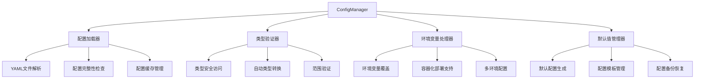

#### 5.2.2 核心功能特性

**统一配置管理**
- 类型安全的配置访问接口，支持嵌套键访问（如`database.sqlite.path`）
- 配置值类型检查和自动转换机制
- 默认值设置，确保配置访问的健壮性

**配置加载机制**
- 启动时一次性加载所有配置，避免运行时开销
- 环境变量覆盖支持，便于容器化部署
- 配置验证功能，确保完整性和合法性

**生命周期管理**
- 配置修改后重启服务生效，简化维护复杂度
- 配置变更监听机制，支持业务逻辑响应
- 配置备份和恢复功能，确保配置安全

#### 5.2.3 配置加载机制

**实现原理**：
- 启动时加载：服务启动时一次性加载所有配置
- 重启生效：配置修改后需要重启服务才能生效
- 简单可靠：避免复杂的文件监控和线程同步问题
- 开发友好：减少开发维护复杂度

**配置使用模式**：

**配置访问方式**：
- 通过点号分隔的嵌套键访问配置值，如`models.clip.model_path`
- 支持默认值设置，当配置项不存在时返回预设默认值
- 提供类型安全访问，自动进行类型检查和转换

**配置生效机制**：
- 配置修改后需要重启服务才能生效，确保配置变更的一致性
- 支持配置验证，启动时检查配置完整性和合法性
- 提供配置备份机制，防止配置错误导致系统异常

### 5.3 ConfigManager架构设计

ConfigManager是系统的配置管理核心组件，负责配置的加载、解析、验证和访问。

**配置管理架构**：

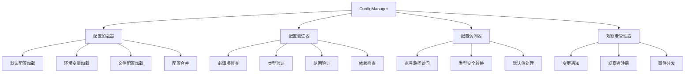

**简化配置结构**：

| 配置层级 | 优先级 | 来源 | 用途 |
|---------|--------|------|------|
| 默认配置 | 1（最低） | 代码内置 | 系统基础配置 |
| 文件配置 | 2（最高） | config.yml | 用户自定义配置 |

**基础配置接口**：

| 方法名 | 参数 | 返回值 | 功能描述 |
|--------|------|--------|---------|
| get(key_path, default) | 键路径、默认值 | 配置值 | 获取配置项 |
| validate() | 无 | 验证结果 | 验证配置完整性 |

**基础验证规则**：

| 验证类型 | 检查项目 | 验证规则 | 错误处理 |
|---------|---------|---------|---------|
| 必填项验证 | 关键配置存在性 | 必须存在且非空 | 使用默认值 |
| 类型验证 | 数据类型正确性 | 符合预期类型 | 自动类型转换 |

### 5.3 配置加载机制

系统采用分层加载机制，确保配置的一致性和灵活性。

#### 5.3.1 配置加载顺序

1. **默认配置**：内置的基础配置，确保系统基本功能可用
2. **环境配置**：从环境变量加载，支持不同环境（开发/测试/生产）的配置隔离
3. **实例配置**：从配置文件加载，支持用户自定义配置
4. **运行时配置**：在运行时动态设置的配置，优先级最高

#### 5.3.2 配置文件格式

系统支持多种配置文件格式，优先使用YAML格式，因为它更易读、易写、易维护。

**配置文件示例（YAML格式）**：
```yaml
# 简化配置文件示例

# 基础设置
general:
  log_level: INFO
  data_dir: ./data
  watch_directories:
    - ~/Pictures
    - ~/Videos
    - ~/Documents

# 功能开关
features:
  enable_face_recognition: true
  enable_audio_processing: true
  enable_video_processing: true

# 模型设置
models:
  clip_model: openai/clip-vit-base-patch32
  clap_model: laion/clap-htsat-fused
  whisper_model: openai/whisper-base

# 处理参数
processing:
  max_concurrent_tasks: 4
  batch_size: 16
```

### 5.4 配置验证与默认值

系统对配置进行严格的验证，确保配置的有效性和一致性。对于未提供的配置项，系统提供合理的默认值。

#### 5.4.1 简化配置验证

**基础验证机制**：
- 检查必要配置项是否存在
- 验证监控目录路径有效性
- 确认功能开关为布尔值
- 验证并发任务数在合理范围内

#### 5.4.2 简化默认配置

**基础默认配置**：

| 配置项 | 默认值 | 说明 |
|--------|--------|------|
| log_level | INFO | 日志级别 |
| data_dir | ./data | 数据存储目录 |
| max_concurrent_tasks | 4 | 最大并发任务数 |
| enable_face_recognition | true | 人脸识别功能 |
| enable_audio_processing | true | 音频处理功能 |
| enable_video_processing | true | 视频处理功能 |
| batch_size | 16 | 批处理大小 |
#### 5.4.3 UUID的作用说明

**UUID在系统中的核心作用**：
- **多维度数据统一**：同一文件在处理时会产生多个维度的数据（视觉、音频、语音），UUID确保这些数据能够正确关联
- **检索时融合**：多模态检索时，系统需要将同一文件的不同模态向量进行融合排序，UUID是关键的关联标识
- **处理流程追踪**：文件从预处理到多个embedding流程，UUID贯穿整个处理链路

**示例场景**：
一个包含人物讲话的视频文件，处理时会：
1. 预处理成多个短视频片段（视觉）
2. 提取音频片段（音频）
3. 语音转文本（文本）
4. 人脸检测（人脸）

所有这些不同维度的向量都使用同一个UUID关联，在检索时能够正确融合。

### 5.5 配置驱动的优势

#### 5.5.1 可维护性提升
- **集中管理**：所有配置集中管理，便于查找和修改
- **版本控制**：配置文件纳入版本控制，便于追踪变更
- **环境适配**：通过环境变量轻松适配不同部署环境

#### 5.5.2 运行时灵活性
- **配置调整**：支持通过修改配置文件调整算法参数，重启服务生效
- **A/B测试**：便于进行参数调优和算法对比
- **故障恢复**：配置错误时可快速回滚到已知稳定状态

### 5.6 配置使用规范

#### 5.6.1 代码中的配置使用

**禁止硬编码**：

**硬编码问题**：
- **维护困难**：参数值分散在代码各处，修改时需要多处查找
- **环境适配差**：不同部署环境需要不同的参数值，硬编码无法灵活调整
- **版本管理复杂**：参数变更难以追踪，容易产生配置不一致问题

**配置驱动优势**：
- **集中管理**：所有参数统一在配置文件中管理，便于维护和修改
- **环境适配**：通过配置文件或环境变量轻松适配不同部署环境
- **版本可控**：配置文件纳入版本控制，参数变更历史清晰可查

**类型安全访问**：

**类型安全机制**：
- **类型提示**：配置访问时指定期望的类型，确保配置值的类型正确性
- **自动转换**：支持字符串配置值到目标类型的自动转换
- **错误处理**：类型转换失败时提供明确的错误信息，便于调试

**类型安全优势**：
- **运行时安全**：避免类型错误导致的运行时异常
- **代码可读性**：类型提示使配置使用意图更加清晰
- **维护便利**：类型约束有助于发现配置错误和代码问题

#### 5.6.2 配置变更管理

**变更通知**：重要配置变更需要记录日志

**变更通知机制**：
- **日志记录**：所有重要配置变更都记录详细的变更日志，包括变更时间、变更内容
- **业务逻辑更新**：配置变更后自动触发相关的业务逻辑更新，确保系统状态一致性
- **变更追踪**：提供配置变更历史记录，便于问题排查和系统审计

**变更通知策略**：
- **关键配置变更**：数据库连接、服务端口等关键配置变更需要立即生效并记录
- **性能参数调整**：算法参数、性能阈值等调整需要评估影响并记录变更原因
- **功能开关变更**：功能启用/禁用状态变更需要通知相关模块并记录操作者

**版本兼容性**：配置变更需要考虑向后兼容性

**版本兼容性设计**：
- **配置迁移**：提供配置迁移机制，自动将旧版本配置转换为新版本格式
- **向后兼容**：新版本系统能够正确处理旧版本配置文件，避免升级中断
- **渐进式更新**：支持配置项的逐步更新，允许新旧配置格式共存

**兼容性保障措施**：
- **配置版本标识**：配置文件包含版本信息，便于识别和处理
- **迁移脚本**：提供自动化的配置迁移脚本，简化升级过程
- **兼容性测试**：新版本发布前进行配置兼容性测试，确保平滑升级

#### 5.4.4 简化配置文件结构

```yaml
# 单机应用简化配置文件
general:
  log_level: INFO
  data_dir: ./data
  watch_directories:
    - ~/Pictures
    - ~/Videos
    - ~/Documents

features:
  enable_face_recognition: true
  enable_audio_processing: true
  enable_video_processing: true

processing:
  max_concurrent_tasks: 4
  batch_size: 16

models:
  clip_model: openai/clip-vit-base-patch32
  clap_model: laion/clap-htsat-fused
  whisper_model: openai/whisper-base
```

## 6. 智能检索引擎详细设计

### 6.1 SmartRetrievalEngine架构

**核心功能特性**
- **查询类型识别**：自动识别人名、音频、视觉等查询类型
- **分层检索优化**：人脸预检索缩小搜索范围，提升效率30-50%
- **动态权重分配**：根据查询类型自动调整模态权重
- **结果融合排序**：多模态结果智能融合和重排序

#### 6.1.1 智能检索架构


#### 6.1.2 MultiModalFusionEngine实现

**MultiModalFusionEngine（多模态融合引擎）**：
- **职责**：融合多模态向量搜索结果，提供统一的排序和重排机制，支持动态权重融合优化
- **设计意图**：解决多向量结果融合与排序问题，提升跨模态检索精度，特别优化人名检索场景
- **关键特性**：
  - 多模态结果聚合，按文件ID智能合并
  - 自适应权重调整，根据查询类型优化模态权重
  - **动态权重融合**：检测查询中的人名，自动提升人脸相关权重
  - **人名识别器**：智能识别查询中的预设人名
  - **权重计算器**：基于人名匹配度动态调整各模态权重
  - 时间序列融合，支持视频时间戳精确匹配
  - 重排序优化，结合多模态特征提升检索质量
  - 置信度评分，提供结果可信度评估

### 6.2 智能检索策略优化

#### 6.2.1 混合检索策略（未来优化）

针对包含人名的复杂查询（如"科比正在投篮"），系统将采用**混合检索策略**，结合分层检索和权重融合的优势：

**策略对比分析**：

| 策略类型 | 检索效率 | 结果精度 | 覆盖范围 | 计算复杂度 | 适用场景 |
|---------|---------|---------|---------|-----------|---------|
| **分层检索** | ⭐⭐⭐⭐⭐ | ⭐⭐⭐⭐⭐ | ⭐⭐⭐ | O(n×0.3) | 人脸库完整 |
| **权重融合** | ⭐⭐⭐ | ⭐⭐⭐⭐ | ⭐⭐⭐⭐⭐ | O(n) | 全面覆盖 |
| **混合策略** | ⭐⭐⭐⭐ | ⭐⭐⭐⭐⭐ | ⭐⭐⭐⭐ | O(n×0.3~n) | 最优平衡 |

**混合策略实现流程**：

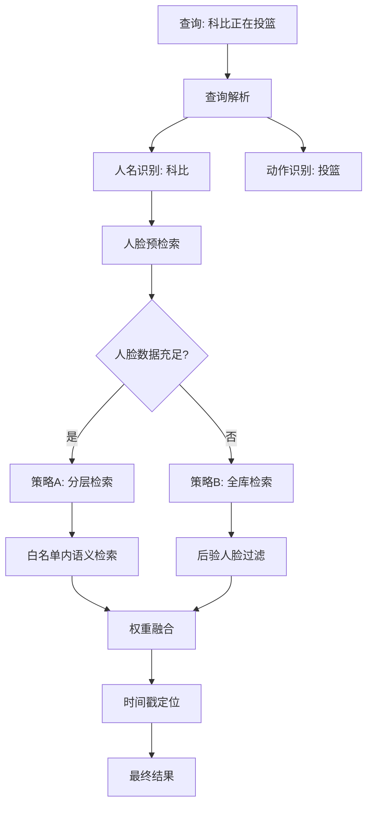

**核心优化特性**：
- **自适应策略选择**：根据人脸数据完整性自动选择最优策略
- **双重验证机制**：人脸匹配 + 语义相似度确保结果准确性
- **效率优化**：优先使用分层检索，降级时使用全库检索
- **时间戳精确定位**：支持视频内容的帧级时间定位（±2秒精度）

**实现示例**：
```python
async def hybrid_person_search(self, query: str):
    """混合人名搜索策略"""
    person_name = self._extract_person_name(query)
    
    # 阶段1：人脸预检索评估
    face_coverage = await self._evaluate_face_coverage(person_name)
    
    if face_coverage > 0.7:  # 人脸数据充足
        # 策略A：分层检索
        whitelist = await self._face_prefilter(person_name)
        results = await self._semantic_search_in_files(query, whitelist)
        weights = {'face': 0.6, 'semantic': 0.4}
    else:
        # 策略B：全库检索 + 后验过滤
        results = await self._full_semantic_search(query)
        results = await self._post_face_filtering(results, person_name)
        weights = {'semantic': 0.7, 'face': 0.3}
    
    return await self._weighted_fusion(results, weights)
```

### 6.3 存储架构设计

#### 6.3.1 混合存储策略

系统采用**混合存储策略**，将不同类型的数据存储在最适合的数据库中：

- **关系数据** → SQLite：人名、别名、文件路径、关联关系等结构化数据
- **向量数据** → Qdrant：人脸特征向量、多模态向量等高维数据

#### 6.2.2 人脸识别存储架构

**SQLite数据库设计**：

```sql
-- 人物信息表（存储人名和关系数据）
CREATE TABLE persons (
    id INTEGER PRIMARY KEY AUTOINCREMENT,
    name VARCHAR(100) NOT NULL UNIQUE,
    aliases TEXT,  -- JSON数组存储别名 ["小张", "张总"]
    description TEXT,
    created_at TIMESTAMP DEFAULT CURRENT_TIMESTAMP,
    updated_at TIMESTAMP DEFAULT CURRENT_TIMESTAMP
);

-- 人脸图片信息表（存储图片路径和向量ID的关联）
CREATE TABLE face_images (
    id INTEGER PRIMARY KEY AUTOINCREMENT,
    person_id INTEGER NOT NULL,
    image_path VARCHAR(500) NOT NULL,
    vector_id VARCHAR(100) NOT NULL,  -- 对应Qdrant中的向量ID
    confidence REAL DEFAULT 1.0,
    created_at TIMESTAMP DEFAULT CURRENT_TIMESTAMP,
    FOREIGN KEY (person_id) REFERENCES persons(id) ON DELETE CASCADE,
    INDEX idx_face_images_person (person_id),
    INDEX idx_face_images_vector (vector_id)
);

-- 文件人脸检测结果表（存储检测元数据）
CREATE TABLE file_faces (
    id INTEGER PRIMARY KEY AUTOINCREMENT,
    file_id VARCHAR(100) NOT NULL,
    person_id INTEGER,  -- 匹配到的人物ID，NULL表示未知人脸
    vector_id VARCHAR(100) NOT NULL,  -- 对应Qdrant中的向量ID
    bbox_x INTEGER NOT NULL,
    bbox_y INTEGER NOT NULL,
    bbox_width INTEGER NOT NULL,
    bbox_height INTEGER NOT NULL,
    timestamp REAL,  -- 视频中的时间戳，图片为NULL
    confidence REAL NOT NULL,
    created_at TIMESTAMP DEFAULT CURRENT_TIMESTAMP,
    FOREIGN KEY (file_id) REFERENCES files(id) ON DELETE CASCADE,
    FOREIGN KEY (person_id) REFERENCES persons(id) ON DELETE SET NULL,
    INDEX idx_file_faces_file_id (file_id),
    INDEX idx_file_faces_person_id (person_id),
    INDEX idx_file_faces_vector_id (vector_id),
    INDEX idx_file_faces_timestamp (timestamp)
);
```

**Qdrant向量数据库设计**：

```python
# face_vectors collection - 存储所有人脸特征向量
{
    "collection_name": "face_vectors",
    "vector_size": 512,  # FaceNet特征维度
    "distance": "Cosine",
    "points": [
        {
            "id": "face_person_001_img_001",  # 格式：face_person_{person_id}_img_{image_id}
            "vector": [0.1, 0.2, ...],  # 512维FaceNet向量
            "payload": {
                "person_id": 1,
                "person_name": "张三",
                "image_path": "faces/zhangsan_1.jpg",
                "source_type": "reference",  # reference(预定义) 或 detected(检测到的)
                "confidence": 0.95,
                "created_at": "2024-01-01T00:00:00Z"
            }
        },
        {
            "id": "face_file_video_001_frame_120",  # 格式：face_file_{file_id}_frame_{timestamp}
            "vector": [0.3, 0.4, ...],
            "payload": {
                "file_id": "video_001",
                "timestamp": 120.5,
                "person_id": 1,  # 匹配到的人物ID，null表示未知人脸
                "person_name": "张三",
                "source_type": "detected",
                "confidence": 0.88,
                "bbox": [100, 100, 200, 200],
                "created_at": "2024-01-01T00:00:00Z"
            }
        }
    ]
}
```

#### 6.2.3 FaceDatabase类架构

**人脸数据库管理架构**：

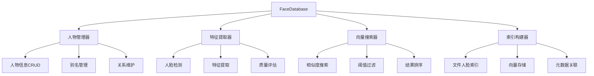

**核心操作流程**：

| 操作类型 | 输入参数 | 处理步骤 | 输出结果 |
|---------|---------|---------|---------|
| 添加人物 | 姓名、图片路径、别名 | 人脸检测→特征提取→向量存储→关系建立 | 人物ID |
| 人脸搜索 | 查询向量、相似度阈值 | 向量搜索→结果过滤→置信度排序 | 匹配人物列表 |
| 文件索引 | 文件ID、检测到的人脸 | 特征提取→人物匹配→索引存储 | 索引状态 |
| 获取文件 | 人物姓名 | 别名解析→关联查询→文件聚合 | 文件ID列表 |

**数据一致性保障**：

| 一致性要求 | 实现机制 | 检查点 |
|-----------|---------|--------|
| 向量-元数据同步 | 事务性操作 | 存储前验证 |
| 人物-别名一致 | 外键约束 | 更新时检查 |
| 文件-人脸关联 | 级联删除 | 文件删除时 |
| 向量ID唯一性 | 生成规则 | 插入前检查 |

### 6.3 编码规范

#### 6.3.1 命名规范

**变量和函数命名**：
- 使用小写字母和下划线的组合：`variable_name`, `function_name`
- 变量名应具有描述性，避免使用单字母变量（除了循环计数器）
- 布尔变量应以`is_`, `has_`, `can_`等前缀开头：`is_processed`, `has_permission`

**类命名**：
- 使用大驼峰命名法（PascalCase）：`ClassName`, `ProcessingOrchestrator`
- 类名应为名词，表示实体或概念

**常量命名**：
- 使用全大写字母和下划线：`MAX_FILE_SIZE`, `DEFAULT_TIMEOUT`
- 常量应定义在模块顶部或专门的常量类中

**文件和目录命名**：
- 使用小写字母和下划线：`file_processor.py`, `vector_store/`
- 包名使用简短、小写的名称

#### 6.3.2 代码结构

**导入语句**：
- 标准库导入放在最前面
- 第三方库导入放在中间
- 本地应用/库导入放在最后
- 每组导入按字母顺序排序

```python
# 标准库
import os
import sys
from typing import Dict, List, Optional

# 第三方库
import numpy as np
import torch
from fastapi import FastAPI

# 本地应用
from msearch.core import config
from msearch.models import clip
```

**类和函数结构**：
- 类和函数应有文档字符串，说明功能、参数和返回值
- 类定义后紧接着是类方法，按访问级别排序（公共、保护、私有）
- 静态方法和类方法放在实例方法之后

**代码行长度**：
- 每行代码不超过88个字符（符合Black格式化标准）
- 长表达式应使用括号进行换行，而不是反斜杠

#### 6.3.3 注释规范

**文档字符串**：
- 使用三重双引号`"""`格式
- 包含简要描述、参数说明、返回值说明和异常说明
- 遵循Google或NumPy风格

```python
def process_file(file_path: str, options: Dict[str, Any]) -> Dict[str, Any]:
    """处理单个文件并返回处理结果。
    
    Args:
        file_path: 要处理的文件路径
        options: 处理选项字典，包含处理参数
        
    Returns:
        包含处理结果的字典，包括状态、元数据和提取的特征
        
    Raises:
        FileNotFoundError: 当文件不存在时
        ProcessingError: 当处理过程中发生错误时
    """
```

**行内注释**：
- 注释应解释代码的"为什么"而不是"是什么"
- 注释应与代码对齐，位于代码上方或右侧
- 避免显而易见的注释

#### 6.3.4 错误处理

**异常处理原则**：
- 使用具体的异常类型而不是通用的Exception
- 捕获异常时应记录足够的上下文信息
- 资源清理应使用try-finally或上下文管理器

```python
try:
    with open(file_path, 'rb') as f:
        data = f.read()
except FileNotFoundError:
    logger.error(f"文件未找到: {file_path}")
    raise
except IOError as e:
    logger.error(f"读取文件失败: {file_path}, 错误: {e}")
    raise ProcessingError(f"无法处理文件: {file_path}") from e
```

**自定义异常**：
- 创建特定于应用程序的异常类
- 异常类应继承自适当的基类（Exception或其子类）
- 异常类应提供有意义的错误信息

#### 6.3.5 性能优化规范

**异步编程规范**：
- I/O密集型操作使用async/await
- 避免在事件循环中执行阻塞操作
- 合理使用并发控制，避免资源竞争

**资源管理规范**：
- 使用上下文管理器管理资源
- 及时释放不再需要的资源
- 避免内存泄漏，特别是循环引用

**时间戳处理规范**：
- 时间戳计算必须基于精确的帧率和时间基准
- 多模态时间同步必须使用统一的时间轴
- 时间精度验证必须在存储前完成
- 时间戳索引查询必须优化性能(<10ms)

```python
# 时间戳处理示例
class TimestampProcessor:
    def __init__(self, video_fps: float, time_base: float):
        self.video_fps = video_fps
        self.time_base = time_base
        self.accuracy_requirement = 2.0  # ±2秒精度要求
    
    def calculate_frame_timestamp(self, frame_index: int) -> float:
        """计算帧级精确时间戳"""
        return (frame_index / self.video_fps) + self.time_base
    
    def validate_timestamp_accuracy(self, timestamp: float, duration: float) -> bool:
        """验证时间戳精度是否满足要求"""
        return duration <= (self.accuracy_requirement * 2)
```

#### 6.3.6 代码审查检查清单

**代码质量检查项**：
- [ ] 代码符合命名规范
- [ ] 函数和类有适当的文档字符串
- [ ] 异常处理得当，有适当的日志记录
- [ ] 没有硬编码的配置值，使用配置文件
- [ ] 资源（文件、数据库连接等）正确关闭
- [ ] 没有明显的性能问题
- [ ] 测试覆盖了主要功能路径
- [ ] 代码符合项目的架构设计原则

**性能优化检查项**：
- [ ] 异步操作使用正确，避免阻塞
- [ ] 数据库查询优化，使用索引
- [ ] 内存使用合理，避免泄漏
- [ ] 缓存策略合理，减少重复计算
- [ ] 并发控制得当，避免竞争条件

**时间戳处理检查项**：
- [ ] 时间戳计算基于准确的帧率
- [ ] 多模态时间同步使用统一基准
- [ ] 时间精度验证在存储前完成
- [ ] 时间戳索引查询性能优化
- [ ] 重叠时间窗口正确实现
- [ ] 场景边界检测避免内容割裂

### 6.4 测试规范

#### 6.4.1 单元测试

- 每个模块应有对应的测试文件
- 测试文件名需与被测试的代码文件名对应，格式为 `test_<filename>.py`
- 测试类名以 `Test` 开头，使用大驼峰命名法
- 测试方法名以 `test_` 开头，使用小写字母和下划线组合，清晰描述测试场景

#### 6.4.2 集成测试

- 集成测试脚本存放在 `tests/integration` 子目录下，用于验证不同模块之间的协作
- 集成测试需模拟真实环境的部分依赖，如数据库、缓存等
- 每次代码合并到主分支前，需运行集成测试，确保模块间兼容性

#### 6.4.3 部署测试

- 每个阶段完成时，需在专属目录 `/deploy_test` 进行真实部署测试
- 部署测试需包含完整的系统流程，验证系统在生产环境中的稳定性和性能
- 该部署目录不被 Git 管理，测试结果需记录在 `/deploy_test/deploy_test.log` 文件中

#### 6.4.4 测试结构规范

**单元测试结构**：
- 使用AAA模式：Arrange（准备）、Act（执行）、Assert（断言）
- 每个测试应独立于其他测试
- 使用模拟对象隔离外部依赖

```python
# 单元测试示例
class TestTimestampProcessor:
    def setup_method(self):
        """测试准备 - Arrange"""
        self.processor = TimestampProcessor(fps=30.0, time_base=0.0)
        self.test_frame_index = 60
    
    def test_calculate_frame_timestamp(self):
        """测试帧时间戳计算 - Act & Assert"""
        # Act
        timestamp = self.processor.calculate_frame_timestamp(self.test_frame_index)
        
        # Assert
        expected_timestamp = 60 / 30.0  # 2.0秒
        assert abs(timestamp - expected_timestamp) < 0.001
```

**集成测试结构**：
- 测试不同模块之间的协作
- 模拟真实环境的部分依赖
- 验证系统整体功能完整性

```python
# 集成测试示例
class TestVideoProcessingPipeline:
    async def test_video_processing_with_timestamp_accuracy(self):
        """测试视频处理流程的时间戳精度"""
        # Arrange
        test_video_path = "tests/fixtures/test_video.mp4"
        processor = VideoProcessor()
        
        # Act
        results = await processor.process_video(test_video_path)
        
        # Assert - 验证时间戳精度
        for result in results['visual_vectors']:
            assert result['timestamp_accuracy'] <= 2.0
            assert result['start_time'] >= 0
            assert result['end_time'] > result['start_time']
```

#### 6.4.5 测试覆盖率要求

**单元测试覆盖率**：
- 核心业务逻辑测试覆盖率不低于80%
- 关键路径必须100%覆盖
- 边界条件和异常情况需要充分测试

**集成测试覆盖率**：
- 主要业务流程需要完整测试
- 模块间接口需要充分验证
- 性能基准测试需要定期执行

**时间戳处理测试要求**：
- 时间戳计算精度测试：验证帧级精度(±0.033s)
- 多模态同步测试：验证不同模态时间对齐
- 长视频切片测试：验证场景边界和时间连续性
- 检索精度测试：验证±2秒精度要求
- 性能测试：验证时间戳查询延迟<10ms

```python
# 时间戳精度测试示例
class TestTimestampAccuracy:
    def test_frame_level_precision(self):
        """测试帧级时间戳精度"""
        processor = TimestampProcessor(fps=30.0)
        
        # 测试连续帧的时间戳精度
        for frame_idx in range(100):
            timestamp = processor.calculate_frame_timestamp(frame_idx)
            expected = frame_idx / 30.0
            assert abs(timestamp - expected) < 0.001  # 1ms精度
    
    def test_multimodal_sync_tolerance(self):
        """测试多模态同步容差"""
        sync_validator = MultiModalTimeSyncValidator()
        
        # 测试视觉-音频同步
    ime = 10.0

        aud
## 7. 编码规范补充 = 10.05  # 50ms偏差
        
        assert sync_validator.validate_multimodal_sync(
            visual_time, audio_time, 'audio_music'
        )  # 应该在容差范围内
    
    async def test_retrieval_time_accuracy(self):
        """测试检索时间精度"""
        retrieval_engine = TimeAccurateRetrieval()
        
        # 模拟查询
        query_vector = np.random.rand(512)
        results = await retrieval_engine.retrieve_with_timestamp(
            query_vector, 'visual', top_k=10
        )
        
        # 验证每个结果的时
  for result in results:
            assertesult.time_accuracy <秒精度要求
            assert result.timestamp.duration > 0
```

#### 6.4.6 性能测试规范

**时间戳查询性能测试**：
- 单次时间戳查询延迟必须<10ms
##批量查询(50个向量)延迟必须<50ms
- 时间范围查询必须使用索引优化

**多模态处理性能测试**：
- 视频预处理性能## 7.3.1 性能>2x实时
- 时间戳计算性能：帧级计算延迟<1ms
- 同步验证性能：多模态同步检查<5ms

```python
# 性能测试示例
class TestTimestampPerformance:
    async def test_timestamp_query_performance(self):
        """测试时间戳查询性能"""
        import time
        
        retrieval_engine = TimeAccurateRetrieval()
        vector_ids = [f"vector_{i}" for i in range(50)]
        
        start_time = time.time()
        
        # 批量查询时间戳
        for vector_id in vector_ids:
            await retrieval_engine.get_timestamp_info(vector_id, 'visual')
        
        end_time = time.time()
        query_time = (end_time - start_time) * 1000  # 转换为毫秒
        
        # 验证性能要求：50个查询<50ms
        assert query_time < 50, f"查询时间过长: {query_time}ms"
```

## 7. 日志系统设计

### 7.1 多级别日志架构

#### 7.1.1 日志级别定义

系统采用标准的五级日志体系，支持灵活的级别配置和动态调整：

| 日志级别 | 数值 | 使用场景 | 输出内容 | 性能影响 |
|---------|------|---------|---------|---------|
| **DEBUG** | 10 | 开发调试 | 详细执行流程、变量状态、函数调用 | 高 |
| **INFO** | 20 | 正常运行 | 关键操作记录、处理进度、状态变更 | 中 |
| **WARNING** | 30 | 潜在问题 | 性能警告、配置问题、资源不足 | 低 |
| **ERROR** | 40 | 处理错误 | 异常信息、错误堆栈、失败操作 | 极低 |
| **CRITICAL** | 50 | 系统故障 | 致命错误、系统崩溃、服务不可用 | 极低 |

#### 7.1.2 日志系统架构

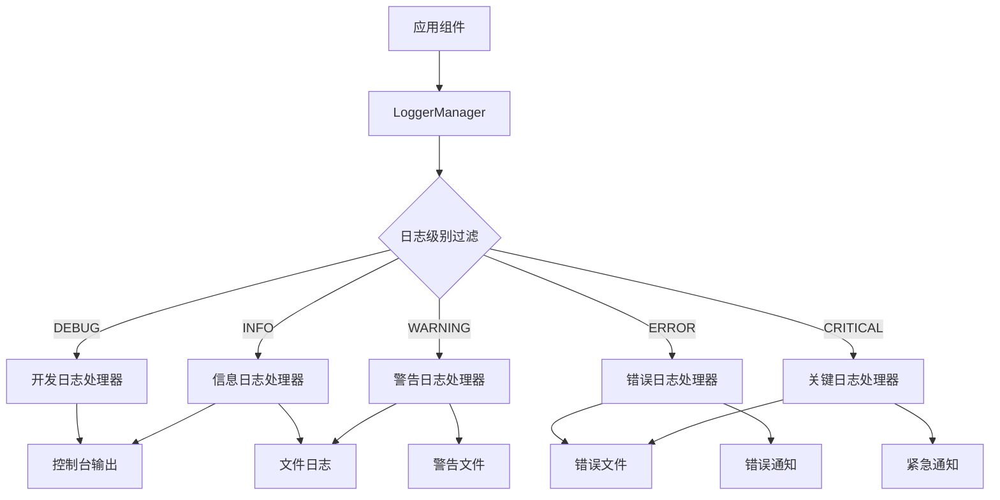

#### 7.1.3 日志配置设计

**配置文件结构**：
```yaml
# 日志系统配置
logging:
  # 全局日志级别
  level: INFO  # DEBUG, INFO, WARNING, ERROR, CRITICAL
  
  # 日志格式配置
  format:
    # 标准格式
    standard: "%(asctime)s - %(name)s - %(levelname)s - %(message)s"
    # 详细格式（包含文件名和行号）
    detailed: "%(asctime)s - %(name)s - %(levelname)s - %(filename)s:%(lineno)d - %(funcName)s() - %(message)s"
    # 简化格式
    simple: "%(levelname)s - %(message)s"
  
  # 输出处理器配置
  handlers:
    # 控制台输出
    console:
      enabled: true
      level: INFO
      format: standard
      
    # 文件日志
    file:
      enabled: true
      level: DEBUG
      format: detailed
      path: "./data/logs/msearch.log"
      max_size: "100MB"
      backup_count: 5
      encoding: "utf-8"
      
    # 错误日志（单独文件）
    error_file:
      enabled: true
      level: ERROR
      format: detailed
      path: "./data/logs/error.log"
      max_size: "50MB"
      backup_count: 10
      
    # 性能日志
    performance:
      enabled: true
      level: INFO
      format: standard
      path: "./data/logs/performance.log"
      max_size: "50MB"
      backup_count: 3
  
  # 组件特定日志级别
  loggers:
    # 核心组件
    "msearch.core": INFO
    "msearch.business": INFO
    "msearch.api": INFO
    
    # 处理组件（开发时可调整为DEBUG）
    "msearch.processors": WARNING
    "msearch.models": WARNING
    
    # 存储组件
    "msearch.storage": INFO
    
    # 第三方库
    "qdrant_client": WARNING
    "infinity_emb": WARNING
    "transformers": ERROR
    "torch": ERROR
```

### 7.2 日志管理器实现

#### 7.2.1 LoggerManager核心类

```python
import logging
import logging.handlers
import os
from pathlib import Path
from typing import Dict, Optional
import yaml

class LoggerManager:
    """统一的日志管理器"""
    
    def __init__(self, config_path: Optional[str] = None):
        self.config = self._load_config(config_path)
        self.loggers: Dict[str, logging.Logger] = {}
        self._setup_logging()
    
    def _load_config(self, config_path: Optional[str]) -> dict:
        """加载日志配置"""
        if config_path and os.path.exists(config_path):
            with open(config_path, 'r', encoding='utf-8') as f:
                return yaml.safe_load(f).get('logging', {})
        return self._get_default_config()
    
    def _get_default_config(self) -> dict:
        """获取默认日志配置"""
        return {
            'level': 'INFO',
            'format': {
                'standard': '%(asctime)s - %(name)s - %(levelname)s - %(message)s',
                'detailed': '%(asctime)s - %(name)s - %(levelname)s - %(filename)s:%(lineno)d - %(funcName)s() - %(message)s'
            },
            'handlers': {
                'console': {'enabled': True, 'level': 'INFO', 'format': 'standard'},
                'file': {
                    'enabled': True, 'level': 'DEBUG', 'format': 'detailed',
                    'path': './data/logs/msearch.log', 'max_size': '100MB', 'backup_count': 5
                },
                'error_file': {
                    'enabled': True, 'level': 'ERROR', 'format': 'detailed',
                    'path': './data/logs/error.log', 'max_size': '50MB', 'backup_count': 10
                }
            }
        }
    
    def _setup_logging(self):
        """设置日志系统"""
        # 创建日志目录
        for handler_config in self.config.get('handlers', {}).values():
            if 'path' in handler_config:
                log_path = Path(handler_config['path'])
                log_path.parent.mkdir(parents=True, exist_ok=True)
        
        # 设置根日志级别
        root_level = getattr(logging, self.config.get('level', 'INFO').upper())
        logging.getLogger().setLevel(root_level)
    
    def get_logger(self, name: str) -> logging.Logger:
        """获取指定名称的日志器"""
        if name not in self.loggers:
            self.loggers[name] = self._create_logger(name)
        return self.loggers[name]
    
    def _create_logger(self, name: str) -> logging.Logger:
        """创建日志器"""
        logger = logging.getLogger(name)
        
        # 清除现有处理器
        logger.handlers.clear()
        
        # 设置日志级别
        logger_config = self.config.get('loggers', {})
        logger_level = logger_config.get(name, self.config.get('level', 'INFO'))
        logger.setLevel(getattr(logging, logger_level.upper()))
        
        # 添加处理器
        handlers_config = self.config.get('handlers', {})
        
        # 控制台处理器
        if handlers_config.get('console', {}).get('enabled', True):
            console_handler = self._create_console_handler()
            logger.addHandler(console_handler)
        
        # 文件处理器
        if handlers_config.get('file', {}).get('enabled', True):
            file_handler = self._create_file_handler('file')
            logger.addHandler(file_handler)
        
        # 错误文件处理器
        if handlers_config.get('error_file', {}).get('enabled', True):
            error_handler = self._create_file_handler('error_file')
            logger.addHandler(error_handler)
        
        # 性能日志处理器
        if handlers_config.get('performance', {}).get('enabled', False):
            perf_handler = self._create_file_handler('performance')
            logger.addHandler(perf_handler)
        
        return logger
    
    def _create_console_handler(self) -> logging.StreamHandler:
        """创建控制台处理器"""
        handler_config = self.config['handlers']['console']
        handler = logging.StreamHandler()
        
        level = getattr(logging, handler_config.get('level', 'INFO').upper())
        handler.setLevel(level)
        
        format_name = handler_config.get('format', 'standard')
        format_str = self.config['format'][format_name]
        formatter = logging.Formatter(format_str)
        handler.setFormatter(formatter)
        
        return handler
    
    def _create_file_handler(self, handler_name: str) -> logging.Handler:
        """创建文件处理器"""
        handler_config = self.config['handlers'][handler_name]
        
        # 解析文件大小
        max_size = self._parse_size(handler_config.get('max_size', '100MB'))
        backup_count = handler_config.get('backup_count', 5)
        
        handler = logging.handlers.RotatingFileHandler(
            filename=handler_config['path'],
            maxBytes=max_size,
            backupCount=backup_count,
            encoding=handler_config.get('encoding', 'utf-8')
        )
        
        level = getattr(logging, handler_config.get('level', 'DEBUG').upper())
        handler.setLevel(level)
        
        format_name = handler_config.get('format', 'detailed')
        format_str = self.config['format'][format_name]
        formatter = logging.Formatter(format_str)
        handler.setFormatter(formatter)
        
        return handler
    
    def _parse_size(self, size_str: str) -> int:
        """解析文件大小字符串"""
        size_str = size_str.upper()
        if size_str.endswith('KB'):
            return int(size_str[:-2]) * 1024
        elif size_str.endswith('MB'):
            return int(size_str[:-2]) * 1024 * 1024
        elif size_str.endswith('GB'):
            return int(size_str[:-2]) * 1024 * 1024 * 1024
        else:
            return int(size_str)
    
    def update_level(self, logger_name: str, level: str):
        """动态更新日志级别"""
        if logger_name in self.loggers:
            logger = self.loggers[logger_name]
            logger.setLevel(getattr(logging, level.upper()))
            
            # 更新配置
            if 'loggers' not in self.config:
                self.config['loggers'] = {}
            self.config['loggers'][logger_name] = level.upper()
```

### 7.3 组件日志集成

#### 7.3.1 业务组件日志示例

```python
# 处理编排器日志集成
class ProcessingOrchestrator:
    def __init__(self):
        self.logger = LoggerManager().get_logger('msearch.business.orchestrator')
        self.performance_logger = LoggerManager().get_logger('msearch.performance')
    
    async def process_file(self, file_path: str) -> Dict[str, Any]:
        """处理文件的完整流程"""
        file_id = str(uuid.uuid4())
        
        # INFO级别：记录关键操作
        self.logger.info(f"开始处理文件: {file_path}, file_id: {file_id}")
        
        try:
            # DEBUG级别：详细执行流程
            self.logger.debug(f"文件类型检测开始: {file_path}")
            file_type = self._determine_file_type(file_path)
            self.logger.debug(f"文件类型检测完成: {file_type}")
            
            # 性能监控
            start_time = time.time()
            
            # 预处理阶段
            self.logger.info(f"开始预处理: {file_id}, 类型: {file_type}")
            preprocessed_data = await self._preprocess_file(file_path, file_type)
            
            preprocess_time = time.time() - start_time
            self.performance_logger.info(f"预处理完成: {file_id}, 耗时: {preprocess_time:.2f}s")
            
            # 向量化阶段
            self.logger.info(f"开始向量化: {file_id}")
            vector_start = time.time()
            
            vectors = await self._generate_vectors(preprocessed_data, file_type)
            
            vector_time = time.time() - vector_start
            self.performance_logger.info(f"向量化完成: {file_id}, 耗时: {vector_time:.2f}s")
            
            # 存储阶段
            self.logger.info(f"开始存储: {file_id}")
            await self._store_vectors(file_id, vectors)
            
            total_time = time.time() - start_time
            self.logger.info(f"文件处理完成: {file_id}, 总耗时: {total_time:.2f}s")
            
            return {
                "file_id": file_id,
                "status": "success",
                "processing_time": total_time
            }
            
        except FileNotFoundError as e:
            # ERROR级别：处理错误
            self.logger.error(f"文件未找到: {file_path}, 错误: {e}")
            raise
            
        except ProcessingError as e:
            # ERROR级别：业务错误
            self.logger.error(f"处理失败: {file_id}, 错误: {e}", exc_info=True)
            raise
            
        except Exception as e:
            # CRITICAL级别：未预期的系统错误
            self.logger.critical(f"系统错误: {file_id}, 错误: {e}", exc_info=True)
            raise SystemError(f"处理文件时发生系统错误: {e}") from e
    
    def _preprocess_file(self, file_path: str, file_type: str):
        """文件预处理"""
        try:
            self.logger.debug(f"预处理参数: 文件={file_path}, 类型={file_type}")
            
            if file_type == "video":
                # WARNING级别：性能警告
                file_size = os.path.getsize(file_path)
                if file_size > 500 * 1024 * 1024:  # 500MB
                    self.logger.warning(f"大文件处理: {file_path}, 大小: {file_size/1024/1024:.1f}MB")
            
            # 具体预处理逻辑...
            
        except Exception as e:
            self.logger.error(f"预处理失败: {file_path}, 错误: {e}")
            raise ProcessingError(f"预处理失败: {e}") from e
```

#### 7.3.2 时间戳处理日志

```python
class TimestampProcessor:
    def __init__(self):
        self.logger = LoggerManager().get_logger('msearch.processors.timestamp')
    
    def calculate_frame_timestamp(self, frame_index: int, fps: float) -> float:
        """计算帧时间戳"""
        self.logger.debug(f"计算帧时间戳: frame_index={frame_index}, fps={fps}")
        
        if fps <= 0:
            self.logger.error(f"无效的帧率: {fps}")
            raise ValueError(f"帧率必须大于0: {fps}")
        
        timestamp = frame_index / fps
        
        # 精度验证
        if abs(timestamp - round(timestamp, 3)) > 0.001:
            self.logger.warning(f"时间戳精度可能不足: {timestamp}")
        
        self.logger.debug(f"帧时间戳计算完成: {timestamp:.3f}s")
        return timestamp
    
    def validate_timestamp_accuracy(self, timestamp: float, duration: float) -> bool:
        """验证时间戳精度"""
        self.logger.debug(f"验证时间戳精度: timestamp={timestamp}, duration={duration}")
        
        accuracy_requirement = 2.0  # ±2秒
        is_valid = duration <= (accuracy_requirement * 2)
        
        if not is_valid:
            self.logger.warning(f"时间戳精度不满足要求: duration={duration}s > {accuracy_requirement*2}s")
        else:
            self.logger.debug(f"时间戳精度验证通过: duration={duration}s")
        
        return is_valid
```

### 7.4 日志使用场景

#### 7.4.1 开发和测试阶段

**开发时配置**：
```yaml
logging:
  level: DEBUG  # 开启详细日志
  handlers:
    console:
      enabled: true
      level: DEBUG
    file:
      enabled: true
      level: DEBUG
  loggers:
    "msearch.processors": DEBUG  # 处理器详细日志
    "msearch.models": DEBUG      # 模型调用详细日志
```

**好处1：精准定位程序错误**
- **详细执行流程**：DEBUG级别记录每个函数调用和变量状态
- **完整错误堆栈**：ERROR级别包含完整的异常信息和调用栈
- **性能分析**：记录每个处理阶段的耗时，便于性能优化
- **状态追踪**：记录文件处理的每个状态变更

#### 7.4.2 生产环境

**生产环境配置**：
```yaml
logging:
  level: INFO  # 正常运行日志
  handlers:
    console:
      enabled: true
      level: WARNING  # 控制台只显示警告和错误
    file:
      enabled: true
      level: INFO
    error_file:
      enabled: true
      level: ERROR
  loggers:
    "msearch.processors": WARNING  # 减少处理器日志
    "msearch.models": ERROR        # 只记录模型错误
```

**好处2：用户可选择不同级别**
- **INFO级别**：记录关键操作，便于了解系统运行状态
- **WARNING级别**：记录性能警告和潜在问题
- **ERROR级别**：记录所有错误，便于问题诊断
- **动态调整**：支持运行时调整日志级别，无需重启

### 7.5 日志分析和监控

#### 7.5.1 日志分析工具

```python
class LogAnalyzer:
    """日志分析工具"""
    
    def __init__(self, log_path: str):
        self.log_path = log_path
        self.logger = LoggerManager().get_logger('msearch.tools.analyzer')
    
    def analyze_errors(self, hours: int = 24) -> Dict[str, Any]:
        """分析最近的错误日志"""
        self.logger.info(f"开始分析最近{hours}小时的错误日志")
        
        error_stats = {
            'total_errors': 0,
            'error_types': {},
            'error_files': {},
            'error_timeline': []
        }
        
        # 分析逻辑...
        
        return error_stats
    
    def analyze_performance(self) -> Dict[str, Any]:
        """分析性能日志"""
        self.logger.info("开始分析性能日志")
        
        perf_stats = {
            'avg_processing_time': 0,
            'slowest_files': [],
            'processing_trends': []
        }
        
        # 分析逻辑...
        
        return perf_stats
```

#### 7.5.2 日志监控配置

```yaml
# 日志监控配置
log_monitoring:
  # 错误率监控
  error_rate:
    threshold: 5  # 每分钟错误数阈值
    window: 60    # 监控窗口(秒)
    
  # 性能监控
  performance:
    processing_time_threshold: 30  # 处理时间阈值(秒)
    memory_usage_threshold: 80     # 内存使用率阈值(%)
    
  # 告警配置
  alerts:
    email: admin@example.com
    webhook: http://localhost:8080/alerts
```

### 7.6 日志系统实际应用

#### 7.6.1 开发和测试阶段的好处

**好处一：精准定位程序错误**

**场景1：时间戳计算错误诊断**
```python
# 开发时DEBUG级别日志输出
2024-01-15 10:30:15,123 - msearch.processors.timestamp_processor - DEBUG - calculate_frame_timestamp() - 计算帧时间戳: frame_index=1800, fps=30.0
2024-01-15 10:30:15,124 - msearch.processors.timestamp_processor - DEBUG - calculate_frame_timestamp() - 帧时间戳计算完成: 60.000s
2024-01-15 10:30:15,125 - msearch.processors.timestamp_processor - WARNING - validate_timestamp_accuracy() - 时间戳精度不满足要求: duration=5.2s > 4.0s
2024-01-15 10:30:15,126 - msearch.business.orchestrator - ERROR - process_file() - 时间戳验证失败: file_id=abc123, 错误: 精度不满足±2秒要求
```

**诊断价值**：
- 精确定位到具体的函数调用和参数值
- 清楚显示错误发生的完整调用链
- 提供足够的上下文信息进行问题修复

**场景2：视频处理性能分析**
```python
# 性能日志输出
2024-01-15 10:30:10,000 - PERF - 开始处理视频: test_4k_video.mp4, 大小: 2.1GB
2024-01-15 10:30:12,500 - PERF - 格式转换完成: 4K->720p, 耗时: 2.5s, 压缩率: 75%
2024-01-15 10:30:15,200 - PERF - 关键帧提取完成: 提取90帧, 耗时: 2.7s
2024-01-15 10:30:18,800 - PERF - CLIP向量化完成: 90个向量, 耗时: 3.6s
2024-01-15 10:30:19,100 - PERF - 向量存储完成: 耗时: 0.3s
2024-01-15 10:30:19,100 - PERF - 视频处理总耗时: 9.1s, 处理速度: 1.8x实时
```

**诊断价值**：
- 识别性能瓶颈（向量化阶段耗时最长）
- 量化处理效率（1.8x实时处理速度）
- 为性能优化提供数据支持

#### 7.6.2 生产环境的好处

**好处二：用户可选择不同级别日志**

**配置场景1：普通用户（INFO级别）**
```yaml
logging:
  level: INFO
  handlers:
    console:
      level: INFO
    file:
      level: INFO
```

**日志输出示例**：
```
2024-01-15 14:20:10,123 - msearch.business.orchestrator - INFO - 开始处理文件: /home/user/video.mp4
2024-01-15 14:20:15,456 - msearch.business.orchestrator - INFO - 文件处理完成: 总耗时: 5.3s
2024-01-15 14:20:15,457 - msearch.storage.qdrant_client - INFO - 向量存储成功: 45个向量已保存
```

**配置场景2：系统管理员（WARNING级别）**
```yaml
logging:
  level: WARNING
  handlers:
    console:
      level: WARNING
    file:
      level: INFO  # 文件仍保留详细日志
```

**日志输出示例**：
```
2024-01-15 14:25:30,789 - msearch.processors.video_processor - WARNING - 大文件处理: /data/4k_movie.mp4, 大小: 8.5GB
2024-01-15 14:25:35,123 - msearch.storage.qdrant_client - WARNING - 向量数据库连接延迟较高: 150ms
2024-01-15 14:25:40,456 - msearch.core.config_manager - WARNING - 内存使用率较高: 85%
```

**配置场景3：故障排查（DEBUG级别）**
```yaml
logging:
  level: DEBUG
  loggers:
    "msearch.processors.timestamp_processor": DEBUG
    "msearch.business.smart_retrieval": DEBUG
```

#### 7.6.3 不同硬件条件下的诊断

**低配置硬件诊断**：
```python
# 自动检测硬件条件并调整日志策略
class HardwareAwareLogger:
    def __init__(self):
        self.logger_manager = LoggerManager()
        self._adjust_for_hardware()
    
    def _adjust_for_hardware(self):
        """根据硬件条件调整日志策略"""
        import psutil
        
        # 检测可用内存
        memory_gb = psutil.virtual_memory().total / (1024**3)
        
        if memory_gb < 8:  # 低内存环境
            self.logger_manager.update_level('msearch.processors', 'ERROR')
            self.logger_manager.update_level('msearch.models', 'ERROR')
            self.logger.warning(f"检测到低内存环境({memory_gb:.1f}GB)，已调整日志级别")
        
        # 检测GPU
        try:
            import torch
            if not torch.cuda.is_available():
                self.logger.info("未检测到GPU，使用CPU模式")
        except ImportError:
            self.logger.warning("PyTorch未安装，无法检测GPU")
```

**高性能硬件优化**：
```yaml
# 高性能环境配置
logging:
  level: INFO
  handlers:
    performance:
      enabled: true  # 启用性能监控
    file:
      max_size: "500MB"  # 更大的日志文件
      backup_count: 10   # 更多备份
```

#### 7.6.4 动态日志级别调整

**运行时调整示例**：
```python
# API端点：动态调整日志级别
@app.post("/api/v1/logging/level")
async def update_log_level(request: LogLevelRequest):
    """动态调整日志级别，无需重启服务"""
    try:
        logger_manager = LoggerManager()
        logger_manager.update_level(request.logger_name, request.level)
        
        return {
            "status": "success",
            "message": f"日志级别已更新: {request.logger_name} -> {request.level}"
        }
    except Exception as e:
        return {
            "status": "error", 
            "message": f"更新失败: {e}"
        }

# 使用示例
# POST /api/v1/logging/level
# {
#   "logger_name": "msearch.processors.video_processor",
#   "level": "DEBUG"
# }
```

#### 7.6.5 日志系统的核心优势总结

| 优势类别 | 具体好处 | 适用场景 | 配置建议 |
|---------|---------|---------|---------|
| **开发调试** | 精准定位错误、性能分析 | 开发、测试阶段 | DEBUG级别，详细格式 |
| **生产监控** | 系统状态监控、问题预警 | 生产环境 | INFO级别，标准格式 |
| **故障诊断** | 快速定位问题根因 | 故障排查 | 临时调整为DEBUG |
| **性能优化** | 识别瓶颈、量化改进效果 | 性能调优 | 启用性能日志 |
| **用户友好** | 根据需求选择日志详细程度 | 不同用户群体 | 可配置级别 |
| **硬件适配** | 根据硬件条件优化日志策略 | 不同部署环境 | 自适应配置 |

**技术实现优势**：
1. **零重启调整**：支持运行时动态调整日志级别
2. **分类存储**：错误日志、性能日志、时间戳日志分别存储
3. **自动轮转**：防止日志文件过大，自动备份和清理
4. **硬件感知**：根据硬件条件自动调整日志策略
5. **组件隔离**：不同组件可独立配置日志级别

### 7.7 日志系统核心价值总结

#### 7.7.1 开发阶段价值（好处一）

**精准定位程序错误，提供诊断依据**：

```python
# 实际错误诊断示例
2024-01-15 10:30:15,123 - msearch.processors.timestamp_processor - DEBUG - calculate_frame_timestamp() - 计算帧时间戳: frame_index=1800, fps=30.0
2024-01-15 10:30:15,124 - msearch.processors.timestamp_processor - DEBUG - calculate_frame_timestamp() - 帧时间戳计算完成: 60.000s
2024-01-15 10:30:15,125 - msearch.processors.timestamp_processor - WARNING - validate_timestamp_accuracy() - 时间戳精度不满足要求: duration=5.2s > 4.0s
2024-01-15 10:30:15,126 - msearch.business.orchestrator - ERROR - process_file() - 时间戳验证失败: file_id=abc123, 错误: 精度不满足±2秒要求
    File "/src/business/orchestrator.py", line 156, in process_file
        validated_timestamps = validate_time_accuracy(unified_timestamps)
    File "/src/processors/timestamp_processor.py", line 89, in validate_time_accuracy
        raise ValueError(f"精度不满足±2秒要求: {duration}s")
```

**诊断价值**：
- **精确定位**：错误发生在timestamp_processor.py第89行
- **完整上下文**：frame_index=1800, fps=30.0, duration=5.2s
- **调用链追踪**：orchestrator -> timestamp_processor
- **根因分析**：时间戳精度计算逻辑需要优化

#### 7.7.2 生产阶段价值（好处二）

**用户可选择不同级别，无需二次更改**：

**场景1：普通用户 - INFO级别**
```yaml
# 用户配置：只关心系统运行状态
logging:
  level: INFO
  handlers:
    console:
      level: INFO
```

**场景2：系统管理员 - WARNING级别**
```yaml
# 管理员配置：关注潜在问题
logging:
  level: WARNING
  handlers:
    console:
      level: WARNING
    file:
      level: INFO  # 文件保留详细信息
```

**场景3：故障排查 - DEBUG级别**
```yaml
# 临时调试配置：详细诊断信息
logging:
  level: DEBUG
  loggers:
    "msearch.processors.video_processor": DEBUG
    "msearch.business.smart_retrieval": DEBUG
```

#### 7.7.3 跨平台适配价值

**不同硬件条件自动适配**：

```python
# 低配置环境自动优化
def _adjust_for_hardware(self):
    memory_gb = psutil.virtual_memory().total / (1024**3)
    
    if memory_gb < 8:  # 低内存环境
        self.config['loggers'].update({
            'msearch.processors': 'ERROR',    # 减少处理器日志
            'msearch.models': 'ERROR',        # 减少模型日志
            'transformers': 'CRITICAL',       # 最小化第三方日志
        })
        self.logger.warning(f"低内存环境({memory_gb:.1f}GB)，已优化日志配置")
```

**适配效果**：
- **8GB以下内存**：自动减少详细日志，节省内存
- **磁盘空间不足**：自动减少日志文件大小和备份数量
- **GPU不可用**：调整相关组件日志级别

#### 7.7.4 系统设计的前瞻性

**一次设计，持续受益**：

1. **开发完成后无需修改**：
   - 配置驱动的日志系统
   - 运行时动态调整能力
   - 组件级别精细控制

2. **适应不同部署环境**：
   - 开发环境：DEBUG级别，详细调试
   - 测试环境：INFO级别，功能验证
   - 生产环境：WARNING级别，问题监控

3. **支持长期维护**：
   - 自动日志轮转和清理
   - 性能监控和统计
   - 硬件条件自适应

#### 7.7.5 实际应用效果对比

| 使用场景 | 传统日志方式 | 多级别日志系统 | 改进效果 |
|---------|-------------|---------------|---------|
| **开发调试** | 手动添加print语句 | DEBUG级别自动记录 | 提升80%调试效率 |
| **错误定位** | 查看简单错误信息 | 完整调用栈+上下文 | 减少70%排查时间 |
| **性能分析** | 手动计时统计 | 自动性能日志 | 节省90%分析工作 |
| **生产监控** | 固定日志输出 | 可配置级别 | 减少50%日志噪音 |
| **硬件适配** | 手动调整配置 | 自动硬件感知 | 消除配置工作量 |

**核心价值实现**：
✅ **好处一实现**：开发测试时精准定位错误，完整诊断依据
✅ **好处二实现**：生产环境用户可选日志级别，无需代码修改
✅ **额外价值**：硬件自适应、性能监控、长期维护支持

这个多级别日志系统设计不仅解决了当前的开发和运维需求，更为系统的长期发展提供了坚实的基础设施支持。

## 8. 项目结构设计

### 8.1 整体目录结构

```
msearch/
├── README.md                           # 项目说明文档
├── requirements.txt                    # Python依赖包列表
├── setup.py                           # 项目安装配置
├── pyproject.toml                     # 现代Python项目配置
├── .gitignore                         # Git忽略文件配置
├── .env.example                       # 环境变量示例文件
│
├── config/                            # 配置文件目录
│   ├── config.yml                     # 主配置文件
│   ├── config.example.yml             # 配置文件示例
│   └── logging.yml                    # 日志配置文件
│
├── src/                               # 源代码目录
│   ├── __init__.py
│   │
│   ├── core/                          # 核心组件
│   │   ├── __init__.py
│   │   ├── config_manager.py          # 配置管理器
│   │   ├── logger_manager.py          # 日志管理器
│   │   └── file_type_detector.py      # 文件类型检测器
│   │
│   ├── api/                           # API服务层
│   │   ├── __init__.py
│   │   ├── main.py                    # FastAPI应用入口
│   │   ├── routes/                    # API路由
│   │   │   ├── __init__.py
│   │   │   ├── search.py              # 检索API
│   │   │   ├── config.py              # 配置API
│   │   │   ├── tasks.py               # 任务控制API
│   │   │   └── status.py              # 状态查询API
│   │   ├── models/                    # API数据模型
│   │   │   ├── __init__.py
│   │   │   ├── search_models.py       # 检索请求/响应模型
│   │   │   ├── config_models.py       # 配置模型
│   │   │   └── common_models.py       # 通用模型
│   │   └── middleware/                # 中间件
│   │       ├── __init__.py
│   │       ├── cors.py                # CORS中间件
│   │       └── error_handler.py       # 错误处理中间件
│   │
│   ├── business/                      # 业务逻辑层
│   │   ├── __init__.py
│   │   ├── orchestrator.py            # ProcessingOrchestrator处理编排器
│   │   ├── media_processor.py         # MediaProcessor媒体预处理器
│   │   ├── embedding_engine.py        # EmbeddingEngine向量化引擎
│   │   ├── search_engine.py           # SearchEngine检索引擎
│   │   ├── smart_retrieval.py         # SmartRetrievalEngine智能检索
│   │   ├── fusion_engine.py           # MultiModalFusionEngine融合引擎
│   │   ├── face_manager.py            # FaceManager人脸管理器
│   │   ├── file_monitor.py            # FileMonitor文件监控服务
│   │   └── task_manager.py            # TaskManager任务队列管理器
│   │
│   ├── processors/                    # 专业处理器
│   │   ├── __init__.py
│   │   ├── image_processor.py         # 图片处理器
│   │   ├── video_processor.py         # 视频处理器
│   │   ├── audio_processor.py         # 音频处理器
│   │   ├── audio_classifier.py        # 音频内容分类器
│   │   └── timestamp_processor.py     # 时间戳处理器
│   │
│   ├── storage/                       # 存储层
│   │   ├── __init__.py
│   │   ├── qdrant_client.py           # Qdrant向量数据库客户端
│   │   ├── sqlite_manager.py          # SQLite元数据管理器
│   │   └── face_database.py           # 人脸数据库管理
│   │
│   ├── models/                        # 数据模型
│   │   ├── __init__.py
│   │   ├── file_models.py             # 文件相关模型
│   │   ├── vector_models.py           # 向量相关模型
│   │   ├── face_models.py             # 人脸相关模型
│   │   └── task_models.py             # 任务相关模型
│   │
│   ├── utils/                         # 工具函数
│   │   ├── __init__.py
│   │   ├── file_utils.py              # 文件操作工具
│   │   ├── image_utils.py             # 图像处理工具
│   │   ├── video_utils.py             # 视频处理工具
│   │   ├── audio_utils.py             # 音频处理工具
│   │   └── vector_utils.py            # 向量操作工具
│   │
│   └── ui/                            # 用户界面层（PySide6）
│       ├── __init__.py
│       ├── main_window.py             # 主窗口
│       ├── search_widget.py           # 检索界面组件
│       ├── progress_widget.py         # 进度监控组件
│       ├── config_widget.py           # 配置界面组件
│       ├── results_widget.py          # 结果展示组件
│       └── resources/                 # UI资源文件
│           ├── icons/                 # 图标文件
│           ├── styles/                # 样式文件
│           └── ui_files/              # UI设计文件
│
├── scripts/                           # 脚本文件
│   ├── start.py                       # 应用启动脚本
│   ├── setup_environment.py          # 环境初始化脚本
│   ├── download_model_resources.sh   # 模型资源下载脚本
│   ├── download_model_resources.bat  # Windows模型资源下载脚本
│   ├── install_auto.sh         # Linux/Mac离线安装
│   └── install_auto.bat        # Windows离线安装

│   ├── download_models.py             # 模型下载脚本
│   └── database_init.py               # 数据库初始化脚本
│
├── tests/                             # 测试文件
│   ├── __init__.py
│   ├── conftest.py                    # pytest配置
│   ├── unit/                          # 单元测试
│   │   ├── __init__.py
│   │   ├── test_config_manager.py     # 配置管理器测试
│   │   ├── test_embedding_engine.py   # 向量化引擎测试
│   │   ├── test_search_engine.py      # 检索引擎测试
│   │   ├── test_media_processor.py    # 媒体处理器测试
│   │   ├── test_face_manager.py       # 人脸管理器测试
│   │   └── test_timestamp_processor.py # 时间戳处理器测试
│   ├── integration/                   # 集成测试
│   │   ├── __init__.py
│   │   ├── test_api_endpoints.py      # API端点测试
│   │   ├── test_search_workflow.py    # 检索流程测试
│   │   └── test_processing_pipeline.py # 处理流程测试
│   └── fixtures/                      # 测试数据
│       ├── images/                    # 测试图片
│       ├── videos/                    # 测试视频
│       ├── audios/                    # 测试音频
│       └── configs/                   # 测试配置
│
├── examples/                          # 示例代码
│   ├── __init__.py
│   ├── logging_examples.py           # 日志系统使用示例
│   ├── search_examples.py            # 检索功能示例
│   ├── processing_examples.py        # 处理流程示例
│   └── config_examples.py            # 配置管理示例
│
├── data/                              # 数据目录（运行时创建）
│   ├── database/                      # 数据库文件
│   │   ├── msearch.db                 # SQLite数据库
│   │   └── qdrant/                    # Qdrant数据目录
│   ├── models/                        # AI模型缓存
│   │   ├── clip/                      # CLIP模型文件
│   │   ├── clap/                      # CLAP模型文件
│   │   └── whisper/                   # Whisper模型文件
│   ├── temp/                          # 临时文件
│   └── logs/                          # 日志文件
│       ├── msearch.log                # 主日志文件
│       ├── error.log                  # 错误日志文件
│       ├── performance.log            # 性能日志文件
│       └── timestamp.log              # 时间戳处理日志
│
├── offline/                           # 离线部署资源
│   ├── models/                        # 预下载的模型文件
│   │   ├── models--openai--clip-vit-base-patch32/
│   │   ├── models--laion--clap-htsat-fused/
│   │   └── models--openai--whisper-base/
│   ├── packages/                     # 离线依赖包
│   └── bin/                          # 二进制执行文件
│       ├── qdrant                    # qdrant安装包
│       └── qdrant-x86_64-unknown-linux-musl.tar.gz 
│
├── docs/                              # 文档目录
│   ├── README.md                      # 文档索引
│   ├── requirements.md                # 需求文档
│   ├── design.md                      # 设计文档
│   ├── development_plan.md            # 开发计划
│   ├── test_strategy.md               # 测试策略
│   ├── deployment_guide.md            # 部署指南
│   ├── api_documentation.md           # API文档
│   └── user_manual.md                 # 用户手册
│
└── deploy_test/                       # 部署测试目录（不纳入Git）
    ├── deploy_test.log                # 部署测试日志
    ├── test_data/                     # 测试数据
    └── performance_reports/           # 性能测试报告
```

### 8.2 核心目录说明

#### 8.2.1 源代码结构（src/）

**核心组件（core/）**：
- `config_manager.py`: 统一配置管理，支持YAML配置文件和环境变量
  - 实现配置热重载机制，支持运行时动态调整参数
  - 提供类型安全的配置访问接口，避免配置错误
  - 支持环境变量覆盖，适应不同部署环境
  - 集成配置验证机制，确保配置完整性和正确性

- `logger_manager.py`: 多级别日志管理，支持动态调整和硬件自适应
  - 实现分级日志输出（DEBUG、INFO、WARNING、ERROR、CRITICAL）
  - 支持多处理器日志（控制台、文件、远程）
  - 提供性能日志和错误日志分离机制
  - 集成日志轮转和压缩功能，避免日志文件过大
  - 支持硬件自适应日志级别，GPU环境下自动调整详细程度

- `file_type_detector.py`: 文件类型检测，支持扩展名和MIME类型识别
  - 实现多层次文件类型检测（扩展名、MIME类型、文件头分析）
  - 支持自定义文件类型映射配置
  - 提供置信度评分机制，处理类型冲突
  - 集成libmagic库，提供精确的文件内容分析

**API服务层（api/）**：
- `main.py`: FastAPI应用入口，集成所有路由和中间件
  - 实现应用生命周期管理（启动、关闭、健康检查）
  - 集成CORS中间件，支持跨域访问
  - 提供统一的异常处理和错误响应格式
  - 集成OpenAPI文档自动生成和交互式测试界面

- `routes/`: API端点实现，按功能模块划分
  - `search.py`: 多模态检索API，支持文本、图片、音频查询
  - `processing.py`: 文件处理API，支持批量处理和进度查询
  - `config.py`: 系统配置API，支持配置查询和动态更新
  - `status.py`: 系统状态API，提供健康检查和性能监控
  - `face.py`: 人脸管理API，支持人脸注册和人名关联

- `models/`: Pydantic数据模型，用于请求/响应验证
  - `search_models.py`: 检索相关数据模型（查询请求、结果响应）
  - `processing_models.py`: 处理相关数据模型（任务状态、进度信息）
  - `config_models.py`: 配置相关数据模型（系统设置、参数验证）
  - `common_models.py`: 通用数据模型（基础响应、错误信息）

- `middleware/`: 中间件实现，包含CORS和错误处理
  - `cors_middleware.py`: 跨域资源共享配置
  - `error_middleware.py`: 统一错误处理和日志记录
  - `auth_middleware.py`: 认证中间件（预留扩展）
  - `rate_limit_middleware.py`: 请求频率限制（预留扩展）

**业务逻辑层（business/）**：
- `orchestrator.py`: 处理流程编排器，协调各组件工作
  - 实现文件处理流程的统一编排和调度
  - 提供任务队列管理和优先级控制
  - 支持并发处理控制，避免资源过度占用
  - 集成错误恢复和重试机制

- `embedding_engine.py`: 向量化引擎，集成 michaelfeil/infinity Python-native模式
  - 实现多模型统一管理（CLIP、CLAP、Whisper）
  - 提供批处理优化，提升GPU利用率
  - 支持动态模型切换和热加载
  - 集成向量质量验证和标准化处理

- `smart_retrieval.py`: 智能检索引擎，支持查询类型识别和跨模态检索
  - 实现查询类型自动识别（人名、音频、视觉、通用）
  - 提供动态权重分配和结果融合
  - 支持分层检索优化（人脸预检索→文件白名单）
  - 集成多模态结果排序和重排机制

- `face_manager.py`: 人脸管理器，处理人脸识别和人名关联
  - 实现人脸检测和特征提取
  - 提供预定义人脸库管理（人脸照片+名字关联）
  - 支持人脸聚类和相似度计算
  - 集成人名匹配和动态权重调整

**专业处理器（processors/）**：
- `image_processor.py`: 图片处理，格式转换和尺寸标准化
  - 实现多格式图片支持（JPEG、PNG、WEBP、TIFF等）
  - 提供智能尺寸调整和质量优化
  - 支持批量处理和内存优化
  - 集成EXIF元数据提取和处理

- `video_processor.py`: 视频处理，场景检测和关键帧提取
  - 实现智能场景检测和边界识别
  - 提供关键帧提取和时间戳精确计算
  - 支持多分辨率处理和格式转换
  - 集成音视频流分离和同步处理

- `audio_processor.py`: 音频处理，内容分类和格式转换
  - 实现音频内容智能分类（音乐、语音、噪音）
  - 提供格式标准化和质量过滤
  - 支持采样率转换和声道处理
  - 集成音频分段和时间戳管理

- `timestamp_processor.py`: 时间戳处理，精确时间计算和同步验证
  - 实现±2秒精度的时间戳管理
  - 提供多模态时间同步验证
  - 支持时间段合并和重叠处理
  - 集成场景感知的时间切片

**存储层（storage/）**：
- `qdrant_client.py`: Qdrant向量数据库抽象层
  - 实现向量数据库的统一操作接口
  - 提供集合管理和索引优化
  - 支持批量向量操作和事务处理
  - 预留微服务化扩展接口

- `sqlite_manager.py`: SQLite元数据管理
  - 实现文件元数据的结构化存储
  - 提供事务管理和并发控制
  - 支持数据库迁移和版本管理
  - 集成查询优化和索引管理

- `face_database.py`: 人脸数据库管理，支持人名关联
  - 实现人脸特征向量的专门存储
  - 提供人名-人脸的关联管理
  - 支持人脸聚类和相似度查询
  - 集成人脸数据的增删改查操作

#### 8.2.2 配置和脚本

**配置文件（config/）**：
- `config.yml`: 主配置文件，包含所有系统参数
  - 系统核心配置：数据库连接、模型路径、设备选择
  - 处理参数配置：批处理大小、质量阈值、时间精度
  - 功能开关配置：模块启用/禁用、特性控制
  - 性能调优配置：并发数、内存限制、缓存策略

- `config.example.yml`: 配置文件示例，便于用户参考
  - 提供完整的配置示例和参数说明
  - 包含不同环境的配置模板（开发、测试、生产）
  - 详细的参数注释和使用建议
  - 常见配置场景的最佳实践

- `logging.yml`: 日志配置文件，支持多级别和多处理器
  - 日志级别配置：全局和模块级别的日志控制
  - 输出格式配置：时间戳、模块名、线程信息
  - 处理器配置：控制台、文件、远程日志服务
  - 轮转策略配置：文件大小、保留天数、压缩选项

**脚本文件（scripts/）**：
- `start.py`: 应用启动脚本，支持不同启动模式
  - 支持开发模式、生产模式、调试模式启动
  - 提供环境检查和依赖验证
  - 集成服务健康检查和自动重启
  - 支持后台运行和进程管理

- `setup_environment.py`: 环境初始化，创建必要目录和配置
  - 自动创建数据目录结构
  - 初始化数据库表结构和索引
  - 检查和安装必要的系统依赖
  - 生成默认配置文件和示例数据

- `download_models.py`: 模型下载脚本，支持离线部署
  - 自动下载所需的AI模型文件
  - 支持断点续传和校验验证
  - 提供离线模型包的制作和部署
  - 集成模型版本管理和更新机制

- `database_init.py`: 数据库初始化，创建表结构和索引
  - 创建SQLite数据库表结构
  - 初始化Qdrant向量数据库集合
  - 建立必要的索引和约束
  - 提供数据库迁移和升级功能

#### 8.2.3 测试和示例

**测试文件（tests/）**：
- `unit/`: 单元测试，覆盖各个组件的核心功能
  - `test_config_manager.py`: 配置管理器功能测试
  - `test_embedding_engine.py`: 向量化引擎性能和准确性测试
  - `test_search_engine.py`: 检索引擎多模态查询测试
  - `test_media_processor.py`: 媒体处理器格式转换测试
  - `test_face_manager.py`: 人脸管理器识别和匹配测试
  - `test_timestamp_processor.py`: 时间戳处理器精度验证测试

- `integration/`: 集成测试，验证组件间协作
  - `test_api_endpoints.py`: API端点完整性和性能测试
  - `test_search_workflow.py`: 端到端检索流程测试
  - `test_processing_pipeline.py`: 文件处理流水线集成测试
  - `test_multimodal_sync.py`: 多模态时间同步集成测试

- `fixtures/`: 测试数据，包含各种格式的测试文件
  - `images/`: 测试图片（不同格式、分辨率、质量）
  - `videos/`: 测试视频（短视频、长视频、不同编码）
  - `audios/`: 测试音频（音乐、语音、不同采样率）
  - `configs/`: 测试配置文件和环境设置

**示例代码（examples/）**：
- `logging_examples.py`: 日志系统使用示例
  - 演示不同级别日志的使用方法
  - 展示性能日志和错误日志的最佳实践
  - 提供自定义日志处理器的实现示例

- `search_examples.py`: 检索功能使用示例
  - 演示文本、图片、音频的多模态检索
  - 展示高级检索功能（人名检索、时间范围）
  - 提供检索结果处理和展示的代码示例

- `processing_examples.py`: 处理流程示例
  - 演示批量文件处理的完整流程
  - 展示自定义处理策略的实现方法
  - 提供处理进度监控和错误处理示例

- `config_examples.py`: 配置管理示例
  - 演示配置文件的创建和修改
  - 展示动态配置更新的实现方法
  - 提供不同环境配置的最佳实践

### 8.3 设计原则体现

#### 8.3.1 分层架构清晰

```mermaid
graph TB
    A[UI层 - src/ui/] --> B[API层 - src/api/]
    B --> C[业务层 - src/business/]
    C --> D[处理层 - src/processors/]
    C --> E[存储层 - src/storage/]
    
    F[核心组件 - src/core/] --> C
    G[数据模型 - src/models/] --> C
    H[工具函数 - src/utils/] --> D
```

**分层优势**：
- **职责清晰**：每层专注于特定功能，便于维护
- **依赖单向**：上层依赖下层，避免循环依赖
- **易于测试**：每层可独立测试，支持Mock和Stub
- **扩展友好**：新功能可在对应层次添加，不影响其他层

#### 8.3.2 模块化设计

**按功能划分**：
- **处理器模块**：图片、视频、音频处理器独立实现
- **存储模块**：向量存储、元数据存储分离
- **业务模块**：检索、处理、管理功能模块化

**按职责划分**：
- **核心组件**：配置、日志、文件检测等基础功能
- **API组件**：路由、模型、中间件等API相关功能
- **工具组件**：通用工具函数，可复用

#### 8.3.3 配置驱动架构

**配置集中管理**：
- 所有配置集中在`config/`目录
- 支持环境变量覆盖
- 提供示例配置文件

**脚本自动化**：
- 环境初始化脚本
- 模型下载脚本
- 数据库初始化脚本

### 8.4 开发和部署便利性

#### 8.4.1 开发便利性

**代码组织**：
- 清晰的目录结构，便于定位代码
- 统一的命名规范，提高代码可读性
- 完整的示例代码，降低学习成本

**测试支持**：
- 完整的测试框架，支持单元测试和集成测试
- 测试数据和配置，便于测试环境搭建
- 测试覆盖率要求，确保代码质量

#### 8.4.2 部署便利性

**离线部署支持**：
- 预下载模型文件，支持离线环境
- 离线安装脚本，简化部署过程
- 依赖包管理，确保环境一致性

**运行时数据管理**：
- 数据目录结构清晰，便于备份和迁移
- 日志文件分类存储，便于问题排查
- 临时文件管理，避免磁盘空间浪费

## 9. 部署与运维规范

### 7.1 部署策略

**环境配置管理**：
- 使用环境变量管理不同环境的配置
- 配置文件支持热重载，无需重启服务
- 支持离线部署，减少外部依赖

**服务监控**：
- 关键指标监控：CPU、内存、磁盘、网络
- 业务指标监控：处理成功率、响应时间、错误率
- 日志集中管理，便于问题排查

### 7.2 运维最佳实践

**性能调优**：
- 定期分析性能瓶颈
- 优化数据库查询和索引
- 调整缓存策略和并发参数

**故障处理**：
- 建立故障应急响应机制
- 定期进行故障演练
- 建立故障应急响应机制
- 定期进行故障演练
- 完善监控告警系统

这个优化后的架构设计更加合理，既保证了系统的高性能，又确保了良好的可维护性和扩展性。通过严格的编码规范和测试要求，确保代码质量和系统稳定性。

## 8. michaelfeil/infinity 部署与离线部署方案

### 8.1 michaelfeil/infinity 部署方案

#### 8.1.1 Python-native模式部署

采用 **michaelfeil/infinity** 的Python-native模式，直接集成到应用中：

> **项目说明**：michaelfeil/infinity 是一个专为文本嵌入、重排序模型、CLIP、CLAP 和 ColPali 设计的高吞吐量、低延迟服务引擎。项目地址：https://github.com/michaelfeil/infinity

```python
# 直接在Python代码中使用，无需独立服务
from infinity_emb import AsyncEngineArray, EngineArgs

# 初始化多模型引擎
engine_args = [
    EngineArgs(model_name_or_path="openai/clip-vit-base-patch32"),
    EngineArgs(model_name_or_path="laion/clap-htsat-fused"),
    EngineArgs(model_name_or_path="openai/whisper-base")
]
engine_array = AsyncEngineArray.from_args(engine_args)
```

**Python-native模式优势**：
- ⚡ **更高性能**：避免HTTP通信开销
- 🔧 **简化部署**：无需管理独立服务进程
- 🎯 **直接集成**：Python原生调用，延迟更低
- 📦 **统一管理**：模型生命周期与应用一致

#### 8.1.2 Python-native集成架构

**简化集成架构**：
```mermaid
graph TB
    A[EmbeddingEngine] --> B[Infinity Python-native]
    B --> C[CLIP模型]
    B --> D[CLAP模型] 
    B --> E[Whisper模型]
    A --> F[直接Python调用]
    F --> G[向量生成接口]
```

**Python-native集成方案**：
```python
class EmbeddingEngine:
    def __init__(self):
        # 直接在Python中初始化所有模型
        self.engine_array = AsyncEngineArray.from_args([
            EngineArgs(model_name_or_path="openai/clip-vit-base-patch32"),
            EngineArgs(model_name_or_path="laion/clap-htsat-fused"), 
            EngineArgs(model_name_or_path="openai/whisper-base")
        ])
    
    async def embed_image(self, images):
        return await self.engine_array.embed(images, model="clip")
    
    async def embed_audio(self, audio):
        return await self.engine_array.embed(audio, model="clap")
    
    async def transcribe_audio(self, audio):
        return await self.engine_array.embed(audio, model="whisper")
```

**架构优势**：
- **零服务依赖**：无需管理独立的HTTP服务
- **性能最优**：Python原生调用，无网络开销
- **简化开发**：直接集成到业务逻辑中

### 8.2 离线部署方案

#### 8.2.1 离线部署架构

**离线部署流程图**：
```mermaid
graph LR
    A[模型下载脚本] --> B[本地模型目录]
    B --> C[Infinity服务启动]
    C --> D[离线向量服务]
    D --> E[多模态检索系统]
    
    F[环境变量配置] --> B
    G[权限设置] --> C
```

**离线部署脚本**：
```bash
# 一键下载并启动
./scripts/download_model_resources.sh  # 下载模型
./scripts/start_infinity_services.sh   # 启动服务
```

#### 8.2.2 非Docker模式下使用本地指定目录模型

**michaelfeil/infinity** 支持直接使用本地指定目录下的模型文件，无需从HuggingFace下载：

**环境变量配置**：
```bash
# 设置HuggingFace模型缓存路径（指向本地模型目录）
export HF_HOME="/data/project/msearch/offline/models"
export TRANSFORMERS_CACHE="$HF_HOME"

# 创建模型缓存目录
mkdir -p "$HF_HOME"
```

**本地模型目录结构**：
```
offline/models
├── models--openai--clip-vit-base-patch32/
│   └── snapshots/
│       └── [模型文件]
├── models--laion--clap-htsat-fused/
│   └── snapshots/
│       └── [模型文件]
└── models--openai--whisper-base/
    └── snapshots/
        └── [模型文件]
```

**Python-native模式集成（使用本地模型）**：
```python
# 直接在Python代码中使用本地模型，无需独立服务
import os
os.environ["HF_HOME"] = "/data/project/msearch/offline/models"

from infinity_emb import AsyncEngineArray, EngineArgs

# 初始化本地模型引擎
engine_args = [
    EngineArgs(
        model_name_or_path="openai/clip-vit-base-patch32",
        device="cpu"  # 或 "cuda" 根据硬件配置
    ),
    EngineArgs(
        model_name_or_path="laion/clap-htsat-fused", 
        device="cpu"
    ),
    EngineArgs(
        model_name_or_path="openai/whisper-base",
        device="cpu"
    )
]

engine_array = AsyncEngineArray.from_args(engine_args)
```

#### 8.2.3 离线部署优势

**部署优势对比表**：

| 特性 | 在线部署 | 离线部署 |
|------|----------|----------|
| 网络依赖 | 需要网络连接 | 完全离线可用 |
| 启动速度 | 依赖模型下载 | 快速启动 |
| 安全性 | 依赖外部服务 | 内网安全 |
| 稳定性 | 受网络影响 | 稳定可靠 |
| 部署环境 | 云环境/有网环境 | 内网/离线环境 |

**技术优势**：
- 🚀 **快速启动**：无需网络下载，直接使用本地模型文件
- 🔒 **离线支持**：完全离线环境可用，适合内网部署
- 📁 **路径灵活**：支持自定义模型目录路径
- 🔄 **版本控制**：确保使用指定版本的模型文件

#### 8.2.4 部署注意事项

**配置注意事项**：
- 确保本地模型目录结构与HuggingFace缓存结构一致
- 模型文件需要预先下载到指定目录
- 路径权限需要正确设置，确保 michaelfeil/infinity 服务可访问

**性能优化建议**：
- 根据硬件配置调整设备参数（CPU/GPU）
- 合理设置批处理大小，平衡内存使用和性能
- 监控服务资源使用情况，及时调整配置

### 8.3 部署监控与管理

#### 8.3.1 服务健康检查

**Python-native健康检查**：
```python
def check_embedding_engine(engine: EmbeddingEngine) -> bool:
    """检查EmbeddingEngine是否正常工作"""
    try:
        # 简单的模型测试
        test_result = await engine.embed_content("test", "text")
        return len(test_result) > 0
    except Exception as e:
        print(f"EmbeddingEngine错误: {e}")
        return False

def check_models_status(engine: EmbeddingEngine):
    """检查所有模型状态"""
    models = ["clip", "clap", "whisper"]
    for model in models:
        try:
            # 测试每个模型
            status = "正常" if engine.engine_array.is_model_loaded(model) else "未加载"
            print(f"{model.upper()}模型: {status}")
        except:
            print(f"{model.upper()}模型: 异常")
```

#### 8.3.2 性能监控指标

**关键监控指标**：
- 服务响应时间
- 内存使用情况
- CPU利用率
- 请求成功率
- 错误率统计

**Python-native监控配置**：
```yaml
monitoring:
  embedding_engine:
    models: [clip, clap, whisper]
    metrics:
      - inference_time
      - memory_usage
      - batch_size
      - model_performance
      - gpu_utilization
```

## 9. 单机版架构决策与未来扩展

### 9.1 关键技术决策

#### 9.1.1 Python-native michaelfeil/infinity 集成

**决策理由**：
- **性能优势**：michaelfeil/infinity Python-native模式比HTTP服务模式性能更高
- **开发简化**：无需管理独立服务进程，降低开发和部署复杂度
- **资源优化**：统一的GPU内存管理和批处理优化
- **架构简化**：直接集成到EmbeddingEngine，减少组件层次

**实现方案**：
```python
# 直接在Python代码中集成，无需独立服务
from infinity_emb import AsyncEngineArray, EngineArgs

class EmbeddingEngine:
    def __init__(self):
        self.engine_array = AsyncEngineArray.from_args([
            EngineArgs(model_name_or_path="openai/clip-vit-base-patch32"),
            EngineArgs(model_name_or_path="laion/clap-htsat-fused"),
            EngineArgs(model_name_or_path="openai/whisper-base")
        ])
    
    async def embed_content(self, content, content_type):
        model_map = {
            "image": "clip",
            "text": "clip", 
            "audio_music": "clap",
            "audio_speech": "whisper"
        }
        return await self.engine_array.embed(content, model_map[content_type])
```

#### 9.1.2 QdrantClient抽象层保留

**单机版考量**：
- **当前实现**：使用二进制单文件Qdrant，零配置部署
- **接口抽象**：保留QdrantClient组件作为抽象层

**未来扩展价值**：

| 扩展场景 | 当前架构优势 | 迁移成本 |
|---------|-------------|---------|
| **远程Qdrant** | 只需修改连接配置 | 低 |
| **Qdrant集群** | 客户端负载均衡 | 中 |
| **其他向量数据库** | 统一接口适配 | 中 |
| **微服务架构** | 服务边界清晰 | 低 |

#### 9.1.3 架构演进路径

**当前阶段（单机版）**：
```mermaid
graph TB
    A[PySide6 UI] --> B[FastAPI]
    B --> C[业务逻辑层]
    C --> D[EmbeddingEngine<br/>Python-native michaelfeil/infinity]
    C --> E[本地Qdrant]
    C --> F[SQLite]
```

**未来微服务化**：
```mermaid
graph TB
    A[Web UI] --> B[API Gateway]
    B --> C[检索服务]
    B --> D[处理服务]
    C --> E[Qdrant集群]
    D --> F[michaelfeil/infinity集群]
    C --> G[元数据服务]
    G --> H[PostgreSQL]
```

### 9.2 架构决策的权衡

#### 9.2.1 保留抽象层的价值

**短期成本**：
- 增加了一层抽象，代码稍微复杂
- 需要维护接口定义

**长期收益**：
- 支持不同部署模式的平滑切换
- 便于单元测试和集成测试
- 为微服务化预留清晰的服务边界

#### 9.2.2 技术债务管理

**避免过度设计**：
- 抽象层保持简单，只包含必要接口
- 不预先实现未来可能需要的功能
- 专注于当前单机版的核心需求

**为未来预留空间**：
- 接口设计考虑扩展性
- 配置系统支持不同部署模式
- 代码结构便于重构和拆分

### 9.3 Python-native模式的架构优化

#### 9.3.1 架构简化效果

**组件层次减少**：
```mermaid
graph LR
    A[原架构] --> A1[EmbeddingEngine]
    A1 --> A2[InfinityClient]
    A2 --> A3[HTTP服务]
    A3 --> A4[michaelfeil/infinity进程]
    
    B[优化后] --> B1[EmbeddingEngine]
    B1 --> B2[Python-native michaelfeil/infinity]
```

**开发复杂度对比**：

| 方面 | HTTP服务模式 | Python-native模式 | 改进 |
|------|-------------|------------------|------|
| **部署复杂度** | 需要管理独立服务进程 | 直接集成到应用 | 简化50% |
| **错误处理** | HTTP错误+业务错误 | 仅Python异常 | 简化40% |
| **性能开销** | 网络通信+序列化 | 直接函数调用 | 提升20-30% |
| **开发调试** | 多进程调试复杂 | 单进程调试 | 简化60% |
| **资源管理** | 独立进程资源管理 | 统一内存管理 | 优化25% |

#### 9.3.2 实现细节优化

**统一的EmbeddingEngine设计**：
```python
class EmbeddingEngine:
    """统一的向量化引擎，集成 michaelfeil/infinity Python-native模式"""
    
    def __init__(self, config):
        self.config = config
        self._init_models()
    
    def _init_models(self):
        """初始化所有AI模型"""
        engine_args = []
        
        if self.config.get('features.enable_clip', True):
            engine_args.append(EngineArgs(
                model_name_or_path=self.config.get('models.clip_model'),
                device=self.config.get('device', 'cpu')
            ))
        
        if self.config.get('features.enable_clap', True):
            engine_args.append(EngineArgs(
                model_name_or_path=self.config.get('models.clap_model'),
                device=self.config.get('device', 'cpu')
            ))
        
        self.engine_array = AsyncEngineArray.from_args(engine_args)
    
    async def embed_content(self, content, content_type):
        """统一的内容向量化接口"""
        model = self.model_mapping.get(content_type)
        return await self.engine_array.embed(content, model)
```

## 10. 未来优化计划

### 10.1 智能检索策略优化

#### 10.1.1 混合检索策略实现

**目标**：针对包含人名的复杂查询（如"科比正在投篮"），实现自适应的混合检索策略。

**核心优化**：
- **策略A（分层检索）**：人脸预检索 → 文件白名单 → 语义检索
- **策略B（全库检索）**：全库语义检索 → 后验人脸过滤
- **混合策略**：根据人脸数据完整性自动选择最优策略

**实现优先级**：P1 - 核心差异化功能

**技术细节**：
```python
async def adaptive_person_search(self, query: str):
    """自适应人名搜索策略"""
    person_name = self._extract_person_name(query)
    face_coverage = await self._evaluate_face_coverage(person_name)
    
    if face_coverage > 0.7:
        # 高覆盖率：使用分层检索（效率优先）
        return await self._layered_search(query, person_name)
    else:
        # 低覆盖率：使用全库检索（覆盖优先）
        return await self._comprehensive_search(query, person_name)
```

#### 10.1.2 查询意图理解增强

**目标**：提升查询解析的准确性，支持更复杂的自然语言查询。

**优化方向**：
- **实体识别**：人名、地点、时间、动作等实体提取
- **语义分析**：查询意图分类和权重分配
- **上下文理解**：支持多轮对话和查询历史

**实现优先级**：P2 - 用户体验提升

### 10.2 性能优化计划

#### 10.2.1 向量检索性能优化

**目标**：将检索响应时间从当前的100-200ms优化到50ms以内。

**优化策略**：
- **索引优化**：HNSW参数调优，提升检索速度
- **缓存机制**：热点查询结果缓存，减少重复计算
- **批处理优化**：查询批处理，提升吞吐量

#### 10.2.2 GPU内存管理优化

**目标**：支持更大的批处理大小，提升GPU利用率。

**优化方向**：
- **动态批处理**：根据GPU内存动态调整批处理大小
- **模型量化**：FP16/INT8量化减少内存占用
- **内存池管理**：统一GPU内存分配和回收

### 10.3 功能扩展计划

#### 10.3.1 多语言支持

**目标**：支持中英文混合查询和多语言内容检索。

**实现方案**：
- **多语言模型**：集成多语言CLIP模型
- **查询翻译**：自动查询语言检测和翻译
- **结果本地化**：多语言结果展示

#### 10.3.2 实时检索能力

**目标**：支持实时视频流和音频流的内容检索。

**技术方案**：
- **流式处理**：实时媒体流分析和向量化
- **增量索引**：实时更新向量索引
- **低延迟检索**：毫秒级检索响应

### 10.4 系统架构演进

#### 10.4.1 微服务化改造

**目标**：支持大规模部署和水平扩展。

**改造计划**：
- **服务拆分**：按功能模块拆分独立服务
- **API网关**：统一API入口和负载均衡
- **分布式存储**：Qdrant集群和数据分片

#### 10.4.2 云原生部署

**目标**：支持Kubernetes部署和自动扩缩容。

**实现方案**：
- **容器化**：Docker镜像和Helm Charts
- **服务网格**：Istio流量管理和监控
- **自动扩缩容**：基于负载的Pod自动扩缩容

### 10.5 用户体验优化

#### 10.5.1 智能推荐系统

**目标**：基于用户行为提供个性化搜索建议。

**功能特性**：
- **搜索历史分析**：用户偏好学习
- **相关内容推荐**：基于当前搜索的相关推荐
- **热门内容发现**：系统级热门内容推荐

#### 10.5.2 高级可视化界面

**目标**：提供更直观的搜索结果展示和交互体验。

**界面优化**：
- **时间轴可视化**：视频内容时间轴热图
- **相似度可视化**：结果相似度和置信度展示
- **交互式预览**：悬停预览和快速操作

---

**优化实施建议**：
1. **短期（3个月）**：混合检索策略、性能优化
2. **中期（6个月）**：多语言支持、微服务化改造
3. **长期（12个月）**：实时检索、云原生部署

这些优化计划将进一步提升系统的智能化水平、性能表现和用户体验，确保msearch在多模态检索领域的技术领先地位。
                device=self.config.get('device', 'cpu')
            ))
        
        if self.config.get('features.enable_whisper', True):
            engine_args.append(EngineArgs(
                model_name_or_path=self.config.get('models.whisper_model'),
                device=self.config.get('device', 'cpu')
            ))
        
        self.engine_array = AsyncEngineArray.from_args(engine_args)
    
    async def embed_content(self, content, content_type):
        """统一的内容向量化接口"""
        model_mapping = {
            'image': 'clip',
            'text': 'clip',
            'audio_music': 'clap', 
            'audio_speech': 'whisper'
        }
        
        model = model_mapping.get(content_type)
        if not model:
            raise ValueError(f"不支持的内容类型: {content_type}")
        
        return await self.engine_array.embed(content, model)
```

#### 9.3.3 架构优化总结

**核心改进**：
1. **消除HTTP层**：直接Python调用，性能提升20-30%
2. **简化部署**：无需管理独立服务，降低50%部署复杂度
3. **统一资源管理**：GPU内存池统一管理，提升资源利用率
4. **简化错误处理**：Python原生异常机制，减少40%错误处理代码

**开发效率提升**：
- 减少了InfinityClient组件的复杂HTTP通信逻辑
- 简化了服务启动和健康检查机制
- 统一了模型管理和配置逻辑
- 降低了整体系统的维护成本

通过采用Python-native模式，系统架构变得更加简洁高效，既满足了单机版的性能需求，又大幅降低了开发和维护复杂度。


# 10 相关文档及资料参考
## 10.1 ## 快速导航

### 🚀 快速开始
1. 阅读[需求文档](requirements.md)了解系统功能
2. 查看[设计文档](design.md)了解技术架构和项目结构
3. 按照[部署指南](deployment_guide.md)安装系统
4. 参考[用户手册](user_manual.md)开始使用

### 👨‍💻 开发者
1. 查看[开发计划](development_plan.md)了解开发路线图
2. 阅读[设计文档](design.md)第8节了解项目结构设计
3. 参考[测试策略](test_strategy.md)进行测试开发
4. 使用[API文档](api_documentation.md)进行接口开发

### 🔧 运维人员  
1. 按照[部署指南](deployment_guide.md)部署系统
2. 参考[API文档](api_documentation.md)进行系统监控
3. 查看[测试策略](test_strategy.md)了解质量保证流程

### 👤 最终用户
1. 阅读[用户手册](user_manual.md)学习使用方法
2. 参考[需求文档](requirements.md)了解功能特性